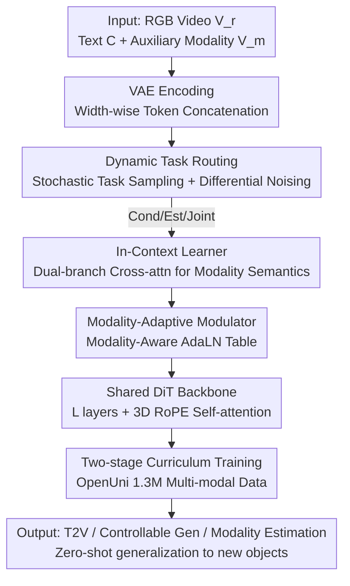

# UnityVideo: Unified Multi-Modal Multi-Task Learning for Enhancing World-Aware Video Generation

**Conference**: CVPR 2026  
**Paper**: [CVF Open Access](https://openaccess.thecvf.com/content/CVPR2026/html/Huang_UnityVideo_Unified_Multi-Modal_Multi-Task_Learning_for_Enhancing_World-Aware_Video_Generation_CVPR_2026_paper.html)  
**Code**: https://github.com/JIA-Lab-research/UnityVideo (Project Page https://jackailab.github.io/Projects/UnityVideo)  
**Area**: Video Generation  
**Keywords**: Unified Multi-Modal, Multi-Task Joint Training, Video Generation, World Awareness, Diffusion Transformer

## TL;DR
UnityVideo integrates three types of tasks (text-to-video, controllable generation, modality estimation) and five auxiliary modalities (depth, optical flow, DensePose, skeleton, segmentation) into a single 10B Diffusion Transformer. By unifying tasks via dynamic noise scheduling and modalities via a Modality-Aware AdaLN table and In-Context Learner, the model achieves faster convergence and significant zero-shot generalization after joint training on 1.3M multi-modal samples, matching or surpassing specialized SOTA models across multiple tasks.

## Background & Motivation

**Background**: Large Language Models (LLMs) have achieved strong generalization and emergent reasoning by incorporating various "textual sub-modalities" (natural language, code, mathematical formulas) into a unified training paradigm. While video generation is scaling rapidly, most models only scale on RGB videos, missing out on "visual sub-modalities" like depth, optical flow, and segmentation that naturally describe the physical world.

**Limitations of Prior Work**: Existing research has shown that adding auxiliary signals (depth maps, optical flow, skeletons, segmentation masks) helps video generation, but most interactions are **unidirectional**: either using auxiliary modalities as conditions for RGB generation (controllable synthesis) or estimating auxiliary modalities from RGB (inverse estimation). The few bidirectional frameworks often couple only one or two modalities or are tied to specific architectures, failing to truly integrate multi-modality and multi-tasking.

**Key Challenge**: Single-modality or single-task training forces models to **fit distributions rather than reasoning about physical laws**. Different modalities are inherently complementary—instance segmentation distinguishes categories, DensePose distinguishes body parts, and skeletons encode fine-grained motion. The problem is: using shared parameters to handle heterogeneous modalities and multiple training objectives simultaneously often leads to slow convergence and task interference, as models struggle to distinguish which distribution to generate or identify the modality of specific tokens.

**Goal**: To support three training paradigms (conditional generation, modality estimation, joint generation) and five modalities within a **single architecture**, ensuring they mutually enhance each other, accelerate convergence, and exhibit emergent zero-shot generalization without interference.

**Key Insight**: The authors draw an analogy to the unification of textual sub-modalities in LLMs. If unified text enables emergent reasoning, unified visual sub-modalities should strengthen a model's world perception. The key is designing explicit differentiation mechanisms for "tasks" and "modalities" to inform shared parameters of the current operation.

**Core Idea**: Use **dynamic noise scheduling to unify tasks** and **modality-adaptive modulation (AdaLN Table + In-Context Learner) to unify modalities** for joint optimization in a single DiT, enabling knowledge transfer across tasks and modalities.

## Method

### Overall Architecture
The inputs to UnityVideo are RGB video $V_r$, text condition $C$, and auxiliary modality video $V_m$ (one of depth/flow/DensePose/skeleton/segmentation). All are encoded into tokens by a VAE, concatenated along the width dimension, and passed into a shared DiT backbone $u(\cdot)$ for self-attention interaction. The design addresses two "unification" problems:

- **Mechanism for Unifying Tasks**: During training, a task is **randomly sampled** at each step. Different noise strategies (dynamic noise) are applied to RGB and modality tokens, covering conditional generation, modality estimation, and joint generation in a single optimization process.
- **Mechanism for Unifying Modalities**: Inside each DiT block, a "Modality-Aware AdaLN Table" generates specific modulation parameters for each modality. An "In-Context Learner" uses text prompts to distinguish modality types at the semantic level, supported by a two-stage curriculum training that gradually introduces the five modalities.

### Key Designs

**1. Dynamic Task Routing: Integrating Three Training Paradigms via Noise Scheduling**

UnityVideo extends flow matching to accommodate three paradigms: generating RGB from auxiliary modalities ($u(V_r|V_m,C)$), estimating modalities from RGB ($u(V_m|V_r)$), and joint generation from noise ($u(V_r,V_m|C)$). The unification trick is to **apply different noise timesteps to RGB and modality tokens**: for conditional generation, RGB tokens are denoised ($t\sim[0,1]$) while modality tokens remain clean ($t=0$); for estimation, the reverse applies; for joint generation, both are independently noised. The losses for these modes are:

$$L_{cond}=\mathbb{E}\,\|u_\theta(r_t,[m_0,c_{txt}],t)-v_r\|^2,\quad L_{est}=\mathbb{E}\,\|u_\theta(m_t,r_0,t)-v_m\|^2,\quad L_{joint}=\mathbb{E}\,\|u_\theta([r_t,m_t],c_{txt},t)-[v_r,v_m]\|^2$$

where $r_t=(1-t)r_0+tr_1$ and $m_t=(1-t)m_0+tm_1$ are interpolated latents, and $v_r, v_m$ are target velocities. Tasks are sampled with probabilities $p_{cond}, p_{est}, p_{joint}$ **inversely proportional to their difficulty** ($p_{cond}<p_{est}<p_{joint}$), allowing more training for harder tasks.

**2. In-Context Learner: Compositional Zero-Shot Generalization via Modality Prompts**

To distinguish modalities and generalize to unseen objects, the authors inject **modality type prompts** $C_m$ (e.g., "depth map", "human skeleton"). This is different from the content caption $C_r$. A **dual-branch cross-attention** mechanism is used: $V'_r=\text{CrossAttn}(V_r,C_r)$ for RGB and $V'_m=\text{CrossAttn}(V_m,C_m)$ for modality features. This enables the model to learn "modality-level semantics," allowing a model trained on human data to generalize to general objects (e.g., from "two persons" to "two objects").

**3. Modality-Aware Modulator: Architecture-Level Differentiation via AdaLN Table**

The authors introduce a learnable modality embedding table $L_m=\{L_1,\dots,L_k\}$. Modulation parameters are made modality-specific: $\gamma_m,\beta_m,\alpha_m=\text{MLP}(L_m+t_{emb})$. This allows **plug-and-play modality switching** during inference by changing $L_m$. Additionally, modality-specific expert layers for input/output serve as independent encoding/decoding heads, complementing the In-Context Learner by handling architectural weights.

**4. Two-stage Curriculum + OpenUni Dataset: Gradual Modality Integration**

Training five modalities simultaneously from scratch is inefficient. Modalities are grouped by **spatial alignment**: **Stage 1** focuses on pixel-aligned modalities (flow, depth, DensePose) using curated single-person data. **Stage 2** includes all modalities and diverse scenes. The OpenUni dataset comprises 1.3M clips (370K single-person, 97K two-person, 489K Koala36M, 343K OpenS2V).

### Loss & Training
The objective is the dynamic switching of three flow matching losses ($L_{cond}/L_{est}/L_{joint}$). The backbone is a 10B DiT with 3D RoPE. Stage 1 involves 16K steps on 500K samples; Stage 2 involves 40K steps on 1.3M samples. Hyperparameters: batch size 32, learning rate $5\times10^{-5}$, 50-step DDIM inference, CFG scale 7.5.

## Key Experimental Results

### Main Results
Evaluated on VBench and the new UniBench (200 UE-rendered high-quality samples + 200 real-world samples). UnityVideo is compared against specialized SOTAs:

| Task / Metric | Prev. SOTA | UnityVideo | Description |
|------|------|------|------|
| T2V Aesthetic Quality (Aesthetic↑) | 63.66 (Wan2.1) | **64.12** | Depth-RGB joint generation results, best overall |
| T2V Overall Consistency (Overall↑) | 22.61 (Hunyuan) | **23.57** | Enhanced world awareness from joint training |
| Segmentation mIoU↑ | 65.52 (SeC) | **68.82** | Exceeds specialized segmentation models |
| Depth Abs Rel↓ | 0.025 (Aether) | **0.022** | Exceeds specialized depth estimation models |

UnityVideo outperforms or matches specialized SOTAs across generation, control, and estimation tasks, validating the benefit of unified training for perception.

### Ablation Study

**Modality Dimension (Table 2, Baseline: RGB Finetuning)**:
- **Ours-Flow Gain**: +4.37 in Imaging Quality, +0.57 in Overall Consistency.
- **Ours-Depth Gain**: +4.19 in Imaging Quality, +0.58 in Overall Consistency.
- Different modalities contribute uniquely: depth aids quality, while flow aids motion consistency.

**Task Dimension (Table 3)**: Training only ControlGen features lower performance than the baseline (Consistency 96.06→95.58), but unified multi-task training **recovers and surpasses** the baseline (Ours-JointGen Subject Consistency +1.43).

**Architecture Dimension (Table 4)**: Combining the In-Context Learner and Modality Switcher achieves the best results (Subject Consistency 98.31), proving semantic and architectural differentiation are complementary.

### Key Findings
- **Unified training accelerates convergence and reduces final loss** compared to single-modality or RGB-only baselines.
- **In-Context Learner is the key to zero-shot generalization**, enabling the transfer of segmentation tasks from humans to general objects.
- **World Perception User Study**: UnityVideo's physical quality is rated higher (38.50%) than Kling1.6, Hunyuan, and Wan2.1.

## Highlights & Insights
- **Analogy to LLM Unification**: Transferring the success of LLM text unification to visual sub-modalities provides a strong first-principle motivation for enhancing world perception.
- **Elegant Dynamic Noise Scheduling**: Unifies three paradigms without architectural changes, simply by varying noise on specific tokens. This is transferable to any multi-task diffusion model.
- **Dual-Level Differentiation**: Combining cheap semantic hints (ICL) with structural modulation (AdaLN Table) effectively solves the modality confusion problem.
- **Curriculum Learning Strategy**: Grouping by spatial alignment ensures a stable learning foundation before introducing non-aligned modalities.

## Limitations & Future Work
- **Ours** acknowledges occasional VAE artifacts which could be mitigated by better autoencoders.
- **No Direct Unified Baseline**: Comparisons are mostly against task-specific SOTAs, making it difficult to isolate the exact gain from the "unification" vs. model scaling.
- **Reliance on Teacher Models**: Modality labels are extracted from pre-trained models (RAFT, SAM, etc.), meaning the estimation task's performance is capped by these "teachers."
- **Computational Cost**: The trade-offs for 10B DiT training/inference and memory overhead for switching modalities are not fully detailed.

## Related Work & Insights
- **Contrast with Unidirectional Methods**: UnityVideo's bidirectional capability allows it to understand control signals better than "control-only" models like VACE.
- **Contrast with Dual-Coupled Frameworks**: Unlike models coupling only two modalities (e.g., Aether), UnityVideo systematizes five modalities and achieves superior zero-shot generalization.
- **Insight**: The combination of dynamic noise scheduling and modality-aware modulation is a valuable template for building unified "Perception-Generation" world models.

## Rating
- **Novelty**: ⭐⭐⭐⭐ Unified dynamic noise is an elegant implementation of multi-tasking.
- **Experimental Thoroughness**: ⭐⭐⭐⭐ Comprehensive across four task types, though missing a unified baseline comparison.
- **Writing Quality**: ⭐⭐⭐⭐ Clear motivation and well-organized methodology.
- **Value**: ⭐⭐⭐⭐ Open-sourcing 1.3M data and the UniBench represents a significant contribution to world models.

<!-- RELATED:START -->

## Related Papers

- [\[CVPR 2026\] CineBrain: A Large-Scale Multi-Modal Audiovisual Brain Dataset for Brain-Conditioned Video Generation](cinebrain_a_large-scale_multi-modal_audiovisual_brain_dataset_for_brain-conditio.md)
- [\[CVPR 2026\] UniAVGen: Unified Audio and Video Generation with Asymmetric Cross-Modal Interactions](uniavgen_unified_audio_and_video_generation_with_asymmetric_cross-modal_interact.md)
- [\[CVPR 2026\] VGA-Bench: A Unified Benchmark and Multi-Model Framework for Video Aesthetics and Generation Quality Evaluation](vga-bench_a_unified_benchmark_and_multi-model_framework_for_video_aesthetics_and.md)
- [\[CVPR 2026\] Rethinking Position Embedding as a Context Controller for Multi-Reference and Multi-Shot Video Generation](rethinking_position_embedding_as_a_context_controller_for_multi-reference_and_mu.md)
- [\[CVPR 2026\] Open-world Hand-Object Interaction Video Generation Based on Structure and Contact-aware Representation](open-world_hand-object_interaction_video_generation_based_on_structure_and_conta.md)

<!-- RELATED:END -->
