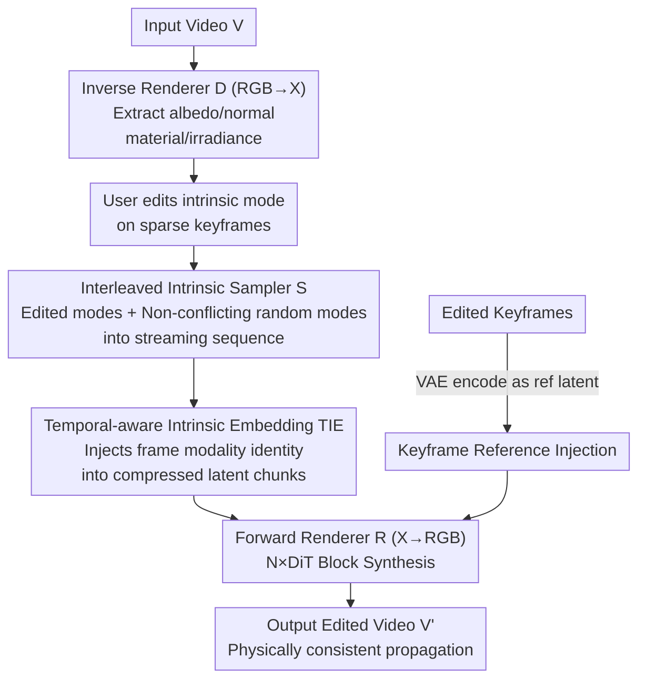

# V-RGBX: Video Editing with Accurate Controls over Intrinsic Properties

**Conference**: CVPR 2026  
**Paper**: [CVF Open Access](https://openaccess.thecvf.com/content/CVPR2026/html/Fang_V-RGBX_Video_Editing_with_Accurate_Controls_over_Intrinsic_Properties_CVPR_2026_paper.html)  
**Code**: Project Page https://aleafy.github.io/vrgbx/ (Code not yet available)  
**Area**: Video Generation / Video Editing / Diffusion Models  
**Keywords**: Intrinsic Property Editing, Inverse Rendering, Video Diffusion, Keyframe Propagation, Relighting

## TL;DR
V-RGBX first inverse-renders a video into intrinsic channels such as albedo, normal, material, and irradiance. It then utilizes a video DiT with interleaved conditional injection to re-synthesize these into RGB. This allows users to modify a single intrinsic property (e.g., changing material or relighting) on sparse keyframes, which the model then stably propagates as a physically consistent edit throughout the entire video.

## Background & Motivation
**Background**: With the maturation of text-to-video and image-to-video diffusion models, users can edit object appearance, scene layout, and motion using language or reference images. However, these edits remain at the RGB pixel level, controlling "how it looks" rather than "what it is physically."

**Limitations of Prior Work**: There is a lack of direct, decoupled control over intrinsic properties that determine physical realism, such as albedo, irradiance, material, and normal. Controllable video editing methods like GenProp, VACE, DaS, and AnyV2V typically perform appearance or style transfers or use implicit latent conditions that entangle lighting and material. By injecting condition signals (appearance, depth, optical flow, semantics) directly into pixel space without decoupling in the intrinsic domain, edited properties tend to "drift" in subsequent frames, failing to maintain cross-frame consistency.

**Key Challenge**: Video editing requires "modifying only the target property while keeping others unchanged." Current methods trained in the RGB domain suffer from the inherent entanglement of lighting, texture, and geometry—modifying one often inadvertently alters others. Furthermore, these methods mostly rely on global conditions (a single prompt or reference frame), failing to meet realistic needs for localized edits across different time segments and intrinsic modalities.

**Goal**: To construct a closed-loop framework capable of three functions: inverse-rendering video into intrinsic channels (RGB→X), forward-synthesizing realistic video from intrinsic channels (X→RGB), and performing keyframe-level video editing and propagation based on intrinsic channels.

**Key Insight**: Rather than using implicit conditions in the RGB domain, an explicit **intrinsic condition representation space** should be established. By allowing users to modify a specific modality within this space while keeping others intact, physical decoupling is naturally achieved.

**Core Idea**: First, decompose interpreted intrinsic channels via RGB→X. Allow users to edit any modality on sparse keyframes, then use a DiT with "interleaved conditional injection" for X→RGB to propagate keyframe edits throughout the sequence with physical consistency.

## Method

### Overall Architecture
Given an input video $V=\{v_1,\dots,v_T\}$, users select several keyframes and modify their appearance (e.g., changing albedo color or adjusting lighting) using tools like Photoshop or text-to-image systems. V-RGBX consists of a three-part closed-loop pipeline:

1. **Inverse Renderer $D(\cdot)$ (RGB→X)**: Decomposes each RGB frame into intrinsic channels $D(V)=\{V_A,V_N,V_M,V_I\}\in\mathbb{R}^{T\times3\times H\times W}$, representing albedo, normal, material, and irradiance (where material includes surface properties like roughness, metallic, and ambient occlusion).
2. **Intrinsic Condition Sampler $S$**: After keyframe editing, unedited intrinsic modalities in adjacent frames may conflict with the edited results and cannot be used directly as conditions. $S$ interleaves the edited modalities from keyframes with "non-conflicting" random modalities from other frames to form a unified streaming condition sequence $V'_X=\text{Sample}(D(V))$.
3. **Forward Renderer $R(\cdot)$ (X→RGB)**: Conditioned on the interleaved intrinsic sequence $V'_X$ and the edited keyframes, it synthesizes the output video $V'=R(\{v'_{i_1},\dots,v'_{i_k}\},V'_X)$, propagating keyframe edits while preserving untouched intrinsic properties.

Both the inverse and forward renderers are based on the WAN 2.1 T2V-1.3B DiT backbone. The pipeline enables both decomposition (RGB→X) and synthesis (X→RGB), forming a closed loop for cycle-consistency checks.

### Key Designs

**1. Inverse Renderer RGB→X: Decomposing Video into Editable Physical Channels**

To enable editing in the intrinsic domain, the domain must be established first. The inverse renderer $D(\cdot)$ reuses the WAN DiT backbone, conditioning the denoising process on $h_t=[x^z_t\,\Vert\,E(V)]$, where $x^z_t$ is the initial noise latent, $E(\cdot)$ is the frozen Wan-VAE encoder, and $\Vert$ denotes channel-wise concatenation. It predicts one target modality at a time, using the modality name ("albedo", "normal", "material", or "irradiance") as a text prompt encoded by CLIP to switch between decomposition paths. Training utilizes the velocity-prediction (v-prediction) objective for stability. Finally, the frozen Wan-VAE decoder reconstructs the latents into three-channel maps. Compared to frame-independent image methods, running directly on a video DiT ensures superior temporal consistency. Unlike DiffusionRenderer, it also extracts irradiance, facilitating future relighting edits.

**2. Interleaved Intrinsic Condition Sampling: Bypassing Conflict and Memory Explosion via Temporal Multiplexing**

Once a keyframe is edited, the "original content" in neighboring frames becomes a source of pollution; using them directly as conditions would conflict with the edits. Standard practices in GenProp or VACE involve padding missing frames with empty tokens. However, in this setting involving four intrinsic channels, empty tokens would lead to massive memory overhead and limit scalability. The authors propose **temporal multiplexing**: interleaving decomposed intrinsic channels into a single condition sequence:

$$V'_X=\text{Sample}(\{V_A,V_N,V_M,V_I\})=\{v^x_1,v^x_2,\dots,v^x_T\}$$

The sampling rule is: if frame $t$ is an edited keyframe, a modality is randomly sampled from the set of modified modalities $M_t$. Otherwise, a modality is sampled from the "non-conflicting" modalities of that frame:

$$v^x_t=\begin{cases}\text{RandomSample}(M_t), & t\in\{v'_{i_1},\dots,v'_{i_k}\}\\ \text{RandomSample}(\{A,N,M,I\}\setminus K_t), & \text{otherwise}\end{cases}$$

Here, a conflict ($K_t$) refers to a modality that was edited by the user on any keyframe; using its original content as a condition elsewhere would introduce inconsistency. By occupying only one modality slot per frame (instead of four), this mechanism saves memory, encourages cross-modal propagation, and adapts to arbitrary attribute combinations.

**3. Temporal-aware Intrinsic Embedding (TIE): Preserving Modality Identity in Compressed Latents**

Interleaved sampling poses a problem: Wan-VAE compresses four consecutive frames into a single latent chunk, which may contain frames from different intrinsic modalities, leading to identity confusion. TIE packages frame-level modality identities into the chunk dimension, preserving both temporal order and modality identity. Each frame $i$ is assigned a modality index $m_i$ with an embedding $e_i=W\varphi(m_i)$, where $\varphi(\cdot)$ is a one-hot indicator and $W$ is a learnable type encoding matrix. These are then packed via a temporal adapter:

$$\tilde e_k=\begin{cases}[e_1\Vert e_1\Vert e_1\Vert e_1], & k=1\\ [e_{4k-3}\Vert e_{4k-2}\Vert e_{4k-1}\Vert e_{4k}], & k>1\end{cases}$$

After patchifying, each latent chunk $z^k_t$ is modulated by its packed embedding: $\tilde z^k_t=z^k_t+\gamma\,\tilde e^*_k$, where $\tilde e^*_k$ is the spatial broadcast of the modality embedding and $\gamma=1$. This allows the model to distinguish which intrinsic attribute is being processed at each timestep.

**4. Keyframe Reference Injection: Complementing Encoded Visual Information**

Intrinsic channels do not represent a complete RGB reconstruction (e.g., texture details or overall style may not be fully covered). Edited keyframes themselves serve as excellent visual guides. Edited keyframes are padded with empty tokens to match the video length ($\Sigma$), encoded by Wan-VAE as reference latents, and concatenated with noise latents and intrinsic conditions:

$$z_t=[x^z_t\,\Vert\,E_{\text{VAE}}(V'_X)\,\Vert\,E_{\text{VAE}}(\Sigma)]$$

By injecting keyframes as reference signals with intrinsic conditions, the model captures global visual content and missing intrinsic information. During training, reference frames are randomly dropped with $p_{\text{drop}}=0.3$. During inference, classifier-free guidance is applied to balance fidelity and consistency. Ablations show that adding reference frames improves PSNR from 21.48 to 22.42 and reduces FVD from 401.62 to 367.89.

### Loss & Training
Both inverse and forward rendering use the v-prediction objective. Text conditions are omitted during the forward rendering stage for simplicity. Both networks are initialized from Wan 2.1 T2V-1.3B DiT and trained for 27K and 12K iterations, respectively, with a learning rate of $2\times10^{-4}$. The type encoding $W$ is trained from scratch. Training was performed at 832×480 resolution using 32 A100 (80GB) GPUs.

## Key Experimental Results

### Main Results
Training data consists of an internal synthetic dataset rendered from 127 Evermotion indoor scenes (171K frames) with paired RGB and intrinsic channel supervision. Evaluations were conducted on 85 unseen Evermotion scenes (synthetic) and 85 RealEstate10K videos (real), using only the first frame as a keyframe by default. Metrics include PSNR/SSIM/LPIPS for rendering accuracy, FVD for generation quality, and VBench smoothness for temporal consistency.

RGB→X Inverse Rendering (PSNR↑ / LPIPS↓, selected modalities):

| Method | Albedo PSNR | Albedo LPIPS | Normal PSNR | Irradiance PSNR |
|------|------|------|------|------|
| RGBX (Frame-wise) | 14.04 | 0.2872 | 19.44 | 11.92 |
| DiffusionRenderer | 17.40 | 0.3002 | 21.04 | N/A |
| **V-RGBX (Ours)** | **17.73** | **0.2406** | **21.59** | **19.94** |

X→RGB Intrinsic-Aware Synthesis (Synthetic Set):

| Method | PSNR↑ | SSIM↑ | LPIPS↓ | FVD↓ | Smoothness↑ |
|------|------|------|------|------|------|
| RGBX | 16.53 | 0.7154 | 0.2417 | 1037.15 | 0.9469 |
| DiffusionRenderer* | 12.66 | 0.6475 | 0.3376 | 1015.09 | 0.9883 |
| V-RGBX (w/o ref) | 21.48 | 0.7908 | 0.2064 | 401.62 | 0.9814 |
| **V-RGBX (Ours)** | **22.42** | **0.7952** | **0.1930** | **367.89** | 0.9805 |

Note: The high smoothness for DiffusionRenderer is "inflated"—qualitatively, its output is significantly washed out with unrealistic reflections. FVD better represents actual quality.

RGB→X→RGB Cycle Consistency (End-to-end vs. Original):

| Dataset | Method | PSNR↑ | SSIM↑ | FVD↓ |
|------|------|------|------|------|
| Evermotion | RGBX | 15.29 | 0.7539 | 1099.04 |
| Evermotion | **V-RGBX** | **22.57** | **0.7985** | **367.61** |
| RealEstate10K | RGBX | 14.40 | 0.6411 | 2082.81 |
| RealEstate10K | **V-RGBX** | **17.88** | **0.7533** | **633.76** |

### Ablation Study
| Configuration | Key Metric | Description |
|------|---------|------|
| V-RGBX (Ours) | PSNR 22.42 / FVD 367.89 | Full model with keyframe reference |
| w/o Keyframe Ref | PSNR 21.48 / FVD 401.62 | Removed reference, PSNR -0.94, FVD +34 |
| Drop albedo channel (w/o ref) | PSNR 17.18 / FVD 907.63 | No albedo condition provided for all frames |
| Drop albedo + 1st-frame guidance (Ours) | PSNR 21.65 / FVD 427.56 | Albedo only in first frame; effectively propagated |
| Drop irradiance channel (w/o ref) | PSNR 17.43 / FVD 702.16 | No irradiance condition provided for all frames |
| Drop irradiance + 1st-frame guidance (Ours) | PSNR 21.82 / FVD 396.40 | Irradiance only in first frame; nearly matches full supply |

### Key Findings
- **Keyframe reference is a primary quality driver**: Adding reference frames improves PSNR by 0.94 and drops FVD by 34, indicating that intrinsic channels alone do not fully capture visual style and detail.
- **First-frame guidance enables cross-frame propagation**: Even if a modality is missing across the sequence, providing it in the first frame (1st-Frame X-Guided) restores PSNR and reduces FVD. This quantifies the effectiveness of the interleaved mechanism for sparse editing.
- **Baselines suffer from property drifting**: Qualitative comparisons show AnyV2V exhibits geometry/appearance drift, while VACE fails to decouple lighting, causing unintended changes. V-RGBX is significantly more stable.
- **Interpret smoothness with caution**: High smoothness in DiffusionRenderer coincides with faded outputs, suggesting the metric should be evaluated alongside FVD/PSNR.

## Highlights & Insights
- **Shifting the editing domain**: Instead of struggling to decouple in the entangled RGB domain, the work establishes an explicit intrinsic domain where edits are naturally decoupled.
- **Interleaved sampling solves dual problems**: Temporal multiplexing avoids conflicts between edited keyframes and original content while preventing memory explosion from multiple condition channels.
- **Transferable sparse-to-dense design**: Using sparse frame conditions combined with model-based temporal propagation is a strategy applicable to other tasks like video segmentation or depth completion.
- **TIE ensures latent consistency**: Addressing the "identity loss" in compressed VAE chunks with one-hot modality embeddings is a simple but critical detail for interleaved sampling to function.

## Limitations & Future Work
- **Indoor synthetic training bias**: Performance on out-of-distribution scenes (e.g., outdoors) is uncertain, and cycle-consistency on real data (RealEstate10K PSNR 17.88) is notably lower than on synthetic data.
- **Single-modality sampling per frame**: Currently, each frame samples only one modality, limiting the ability to perform complex, multi-attribute edits on the same keyframe.
- **Backbone dependence**: Reliance on the WAN backbone imposes constraints on video length and real-time performance.
- **Dependence on external inverse rendering for edit identification**: The pipeline requires external tools to identify which intrinsic modalities were edited in a keyframe, making it susceptible to upstream errors.

## Related Work & Insights
- **vs. RGB↔X / IntrinsicEdit**: These perform image-level intrinsic editing but lack temporal consistency when extended to video. V-RGBX operates directly on video DiT for decomposition and synthesis.
- **vs. DiffusionRenderer**: While it handles video decomposition, it does not estimate irradiance or support pixel-wise edit propagation. V-RGBX achieves much lower cycle-consistency FVD (367 vs. 1073).
- **vs. X2Video**: Requires a full sequence of edited intrinsic maps to render, whereas V-RGBX enables propagation from sparse keyframe edits.
- **vs. GenProp / VACE / AnyV2V**: These inject conditions into pixel space and lack intrinsic decoupling, leading to property drift. V-RGBX provides cleaner modal-level control.

## Rating
- Novelty: ⭐⭐⭐⭐⭐ First end-to-end intrinsic-aware video editing framework; the path from "intrinsic domain editing" to "interleaved propagation" is well-executed.
- Experimental Thoroughness: ⭐⭐⭐⭐ Comprehensive evaluation of RGB→X, X→RGB, and control strategies, although real-world evidence and outdoor generalization are limited.
- Writing Quality: ⭐⭐⭐⭐ Clear structure and detailed sampling rules, with minor notation jumps.
- Value: ⭐⭐⭐⭐ Highly applicable for relighting, material replacement, and geometry-aware insertion; provides a solid foundation for physically consistent video editing.

<!-- RELATED:START -->

## Related Papers

- [\[CVPR 2026\] LightMover: Generative Light Movement with Color and Intensity Controls](lightmover_generative_light_movement_with_color_and_intensity_controls.md)
- [\[CVPR 2026\] SwitchCraft: Training-Free Multi-Event Video Generation with Attention Controls](switchcraft_training-free_multi-event_video_generation_with_attention_controls.md)
- [\[CVPR 2026\] Generative Video Motion Editing with 3D Point Tracks](generative_video_motion_editing_with_3d_point_tracks.md)
- [\[CVPR 2026\] VideoCoF: Unified Video Editing with Temporal Reasoner](videocof_unified_video_editing_with_temporal_reasoner.md)
- [\[ICLR 2026\] MotionStream: Real-Time Video Generation with Interactive Motion Controls](../../ICLR2026/video_generation/motionstream_real-time_video_generation_with_interactive_motion_controls.md)

<!-- RELATED:END -->
