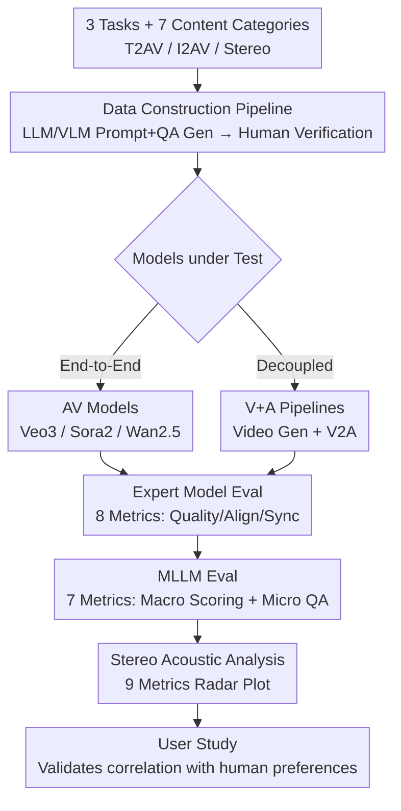

# VABench: A Comprehensive Benchmark for Audio-Video Generation

**Conference**: CVPR 2026  
**Paper**: [CVF Open Access](https://openaccess.thecvf.com/content/CVPR2026/html/Hua_VABench_A_Comprehensive_Benchmark_for_Audio-Video_Generation_CVPR_2026_paper.html)  
**Code**: TBD  
**Area**: Video Generation / Audio-Video Generation / Evaluation Benchmark  
**Keywords**: Audio-Video Generation, Synchronous Evaluation, Multimodal Benchmark, Stereo Evaluation, MLLM Judging  

## TL;DR
VABench is a comprehensive benchmark for "synchronized audio-video generation," covering three tasks: Text-to-Audio-Video (T2AV), Image-to-Audio-Video (I2AV), and Stereo Generation across seven content categories. It employs a dual-track evaluation system involving 15 fine-grained metrics from "Expert Models + Multimodal Large Language Models (MLLMs)" — plus 9 stereo acoustic metrics — to perform reference-free evaluation on end-to-end models like Veo3 / Sora2 / Wan2.5 and decoupled "Video Generator + V2A" pipelines. User studies verify a high correlation between these scores and human preferences.

## Background & Motivation
**Background**: Video generation has progressed from pure visual synthesis to unified generation with "synchronized audio." Models like Veo3, Sora2, and Wan2.5 can generate audio aligned with actions simultaneously with the frames. However, existing evaluation systems (e.g., VBench, VBench2.0, Evaluation Agent) focus almost exclusively on visual quality, temporal consistency, and physical plausibility, leaving the "audio" component largely unaddressed.

**Limitations of Prior Work**: A few exploratory joint audio-video benchmarks (e.g., JavisBench) have limited evaluation dimensions and restricted scenarios. Crucially, they **ignore the unique multimodal coupling phenomena** in joint generation—such as the Doppler effect from motion, coordinated emotional expression across visual/auditory modalities, and the matching of background music to visual rhythm. Furthermore, while most current models output stereo audio, no benchmark exists to evaluate spatial acoustic properties (left/right channels, soundstage width).

**Key Challenge**: Tasks like T2AV **lack ground-truth audio-video for reference**. Traditional V2A evaluation paradigms that rely on reference-based scoring against ground-truth audio tracks are inapplicable. Switching to reference-free evaluation requires simultaneously characterizing the "text-video-audio" triangular consistency, temporal synchronization, physical credibility, and emotional expressiveness—multiple intertwined dimensions that a single metric cannot capture.

**Goal**: To establish a reference-free, automated, multi-dimensional evaluation framework for synchronized audio-video generation that aligns with human perception and distinguishes the performance gap between end-to-end models and decoupled pipelines.

**Key Insight**: Decompose evaluation into two tracks: "Objective dimensions quantifiable by specialized models" and "High-level semantic dimensions requiring human-like understanding." These are scored using small expert models and MLLMs, respectively, supplemented by specialized stereo acoustic analysis.

**Core Idea**: Utilizing a "Expert Model + MLLM" dual-track system with 15 metrics, a taxonomy of seven content categories, and stereo acoustic evaluation to decompose synchronized audio-video quality into computable, interpretable scores aligned with human preferences.

## Method

### Overall Architecture
VABench is not a generative model but a complete "test dataset + evaluation protocol." It constructs test sets across seven content categories (Animals, Speech, Music, Ambient, Sync Physics, Complex, Virtual) with separate pipelines for T2AV (text-conditioned) and I2AV (image-conditioned). LLMs/VLMs are used to generate structured prompts and QA pairs, followed by human verification. Generated outputs from models (end-to-end AV or "Video+Audio" combinations) undergo dual-track evaluation: one track uses 8 expert model metrics to quantify single-modality quality, cross-modal alignment, and temporal sync; the other uses 7 MLLM metrics at macro (1–5 scale) and micro (QA accuracy) levels to simulate human judgment. Stereo tasks undergo a separate 9-metric acoustic radar analysis. Finally, a user study validates the Pearson correlation between benchmark scores and human preferences.

### Key Designs

**1. 3 Tasks + 7 Content Category Taxonomy: Structuring "What to Evaluate"**
VABench segments generation into three tasks: T2AV (hard due to high-fidelity motion consistency), I2AV (hard due to action plausibility and visual-audio alignment), and Stereo Generation (116 prompts testing channel separation with spatial cues). The content taxonomy is **rooted in human auditory perception**: Animals, Speech (linguistic/non-linguistic), Music, Ambient (nature/urban/indoor), Sync Physics, Complex Scenarios, and Virtual Worlds. This classification covers acoustic categories from Kling-Foley-Eval and physical plausibility from VBench 2.0, progressing from "basic sources → physical interaction → complex semantics → non-realistic content." Complex Scenarios specifically test five high-level dimensions (complex soundscapes, subjective feelings, world knowledge, symbolic association, invisible sources). The Virtual World category tests internal logic and style consistency rather than physical laws and **appears only in the T2AV task**.

**2. Dual-Track Data Construction: Creating Evaluable Samples without Ground-Truth**
Since T2AV/I2AV lack ground-truth, samples must include inherent "evaluation anchors." VABench uses a dual-path strategy (T2AV text path + I2AV image path) to create 778 T2AV and 521 I2AV samples. For T2AV, expert templates and LLMs generate raw prompts, which are then used to produce Visual QA (VQA) and Audio QA (AQA). LLMs also **structurally decouple** prompts into visual and auditory sub-prompts. For I2AV, high-quality images are collected and classified, then MLLMs generate unified descriptions (objective visuals + inferred audio) to construct QA pairs. The "LLM/VLM generation + Human filtering" combo ensures QA pairs serve as micro-evaluation targets and decoupled prompts allow for independent alignment calculation.

**3. Expert Model + MLLM Dual-Track Evaluation: Balancing Objective Quantification and Human Judgment**
The engine uses 15 metrics across two tracks. **Expert Model Track (8 metrics)**: Quantitative metrics including single-modality quality (SpeechClarity via DNSMOS, SpeechQual&Nat via NISQAv2, AudioAesthetic via Audiobox), cross-modal alignment (Text-Video via ViCLIP, Text-Audio via CLAP, Audio-Video via ImageBind), and temporal synchronization (Desync via Synchformer and Lip-Sync via LatentSync for speaking heads). The Audio Aesthetic score is aggregated as $S_{audioaesthetic}=\frac{CE+CU+PQ-PC}{4}$. **MLLM Track (7 metrics)**: Uses full-modality models to simulate human judgment at a macro level (1–5 scale for Alignment, Artistry, Expressiveness, Audio Realism, Visual Realism) and a micro level (accuracy of 3–7 detailed QA pairs per sample). For $N$ samples, where the $i$-th sample has $K_i$ questions and $C_i$ questions are satisfied, the fine-grained score is:

$$S = \frac{1}{N}\sum_{i=1}^{N}\frac{C_i}{K_i}$$

**4. 9-Dimensional Stereo Acoustic Evaluation: Filling the Spatial Audio Gap**
VABench introduces stereo analysis based on nine acoustic metrics across two dimensions. **Spatial Imaging Quality**: Soundstage width (Mid/Side energy ratio), imaging stability (ITD fluctuation), level stability (ILD fluctuation), and inter-channel temporal consistency. **Signal Integrity**: Phase coherence across low/mid/high frequencies and mono downmix fidelity (Mono Compat = 1 − normalized mono loss). Metrics are visualized via radar plots to quantify whether models truly achieve spatial separation.

## Key Experimental Results

Tests included end-to-end models (Veo3-fast, Wan2.5 Preview, Sora2) and decoupled V+A pipelines (Seedance/Wan2.2/Kling2.5 × ThinkSound/MMAudio). Video was standardized to 720P with 48kHz stereo audio.

### Main Results: T2AV Evaluation (Selected Metrics)

| Model | Audio Aes | T-V Align | T-A Align | A-V Align | Lip-Sync | Desync↓ | Alignment | Visual Realism |
|------|-----------|-----------|-----------|-----------|----------|---------|-----------|----------------|
| Sora2 (AV) | 2.867 | 0.2256 | 0.3465 | 0.2376 | 2.655 | 0.7167 | 4.546 | 4.805 |
| Veo3 (AV) | 3.543 | 0.2304 | 0.3582 | 0.3164 | 3.294 | 0.5184 | 4.553 | 4.773 |
| Wan2.5 (AV) | 3.061 | 0.2275 | 0.3033 | 0.2099 | 3.671 | 0.4622 | 4.465 | 4.674 |
| Kling+MMAudio (V+A) | 2.954 | 0.2304 | 0.2929 | — | 1.740 | 0.5617 | 4.440 | 4.720* |

(*Visual Realism is determined by the video generator. Desync: lower is better.)

- **Key Finding**: Among AV models, Veo3 is the strongest overall (audio quality, alignment). Sora2 excels in realism but lags in audio aesthetics. Wan2.5 shows best synchronization (Lip-Sync) but lower semantic alignment, highlighting the trade-off between sync, semantics, and realism.
- The Kling+MMAudio pipeline was the strongest decoupled solution, suggesting higher quality video generation positively influences audio generation results.

### Key Findings
- **End-to-End > Decoupled**: Integrated AV models generally outperform V+A pipelines, suggesting that E2E joint training better captures cross-modal synergies. On fine-grained QA, the weakest AV model often beats the strongest V+A pipeline.
- **Category Difficulty**: Models perform well on music and animals (weakly correlated audio) but struggle with human speech. Virtual worlds score highest, while Complex Scenarios score lowest due to multi-source dynamic interactions.
- **Stereo Failure**: Current models fail to generate reliable stereo separation from text. Wan2.5 is nearly mono but faithful to the signal, while Sora2 achieves width through unstable phase shifts.
- **Alignment with Humans**: User studies show VABench scores correlate strongly (Pearson correlation) with human win rates across semantics, sync, and realism.

## Highlights & Insights
- **Pragmatic Dual-Track Division**: Handing objective quantification (sync, clarity) to expert models and subjective attributes (artistry) to MLLMs avoids the noisiness of pure MLLM judging and the narrowness of expert models.
- **Stereo Evaluation is the Unique Differentiator**: It is the first to introduce nine acoustic metrics into AV generation benchmarks, revealing that current models cannot reliably achieve spatial separation.
- **QA Anchor Portability**: The strategy of generating evaluation anchors (QA pairs) alongside test prompts can be migrated to any generative evaluation task lacking ground-truth.
- **"Strong Video Drives Audio"**: In decoupled setups, a superior video generator improves the performance of the paired audio model, suggesting bottlenecks often reside on the visual side.

## Limitations & Future Work
- **MLLM Dependency**: The 7 MLLM metrics are influenced by the model's own biases; macro 1–5 scores still contain subjectivity.
- **Sample Scale**: 778 T2AV and 521 I2AV samples are relatively small given the category-model matrix.
- **User Study Size**: Only 6 expert evaluators were used in the pilot study; larger scale verification is needed.
- **Cross-Task Comparison**: T2AV and I2AV have different baseline difficulties; scores should not be compared directly across different task types.

## Related Work & Insights
- **vs VBench/VBench2.0**: VBench focuses on pure vision; VABench fills the gap of cross-modal consistency and the audio dimension.
- **vs JavisBench**: VABench provides more comprehensive automated metrics (15 total) and physical/emotional coupling analysis.
- **vs Reference-based V2A**: VABench solves the ground-truth dependency issue by using a "Text-Video-Audio" triangle consistency and QA-based approach.

## Rating
- Novelty: ⭐⭐⭐⭐ First systemic AV benchmark with unique stereo evaluation.
- Experimental Thoroughness: ⭐⭐⭐⭐ Coverage of 9 systems and two major tasks, though sample size is moderate.
- Writing Quality: ⭐⭐⭐⭐ Clear hierarchy of tasks and metrics.
- Value: ⭐⭐⭐⭐ Provides a standardized, interpretable tool for the trending field of audio-video generation.

<!-- RELATED:START -->

## Related Papers

- [\[CVPR 2026\] ActivityForensics: A Comprehensive Benchmark for Localizing Manipulated Activity in Videos](activityforensics_a_comprehensive_benchmark_for_localizing_manipulated_activity_.md)
- [\[ICLR 2026\] DrivingGen: A Comprehensive Benchmark for Generative Video World Models in Autonomous Driving](../../ICLR2026/video_generation/drivinggen_a_comprehensive_benchmark_for_generative_video_world_models_in_autono.md)
- [\[ACL 2025\] VidCapBench: A Comprehensive Benchmark of Video Captioning for Controllable Text-to-Video Generation](../../ACL2025/video_generation/vidcapbench_a_comprehensive_benchmark_of_video_captioning_for_controllable_text-.md)
- [\[CVPR 2026\] Harmony: Harmonizing Audio and Video Generation through Cross-Task Synergy](harmony_harmonizing_audio_and_video_generation_through_cross-task_synergy.md)
- [\[CVPR 2026\] UniAVGen: Unified Audio and Video Generation with Asymmetric Cross-Modal Interactions](uniavgen_unified_audio_and_video_generation_with_asymmetric_cross-modal_interact.md)

<!-- RELATED:END -->
