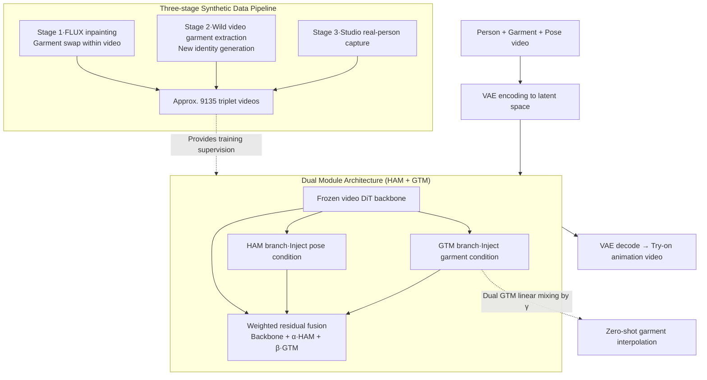

# Vanast: Virtual Try-On with Human Image Animation via Synthetic Triplet Supervision

**Conference**: CVPR 2026  
**arXiv**: [2604.04934](https://arxiv.org/abs/2604.04934)  
**Code**: [https://hyunsoocha.github.io/vanast/](https://hyunsoocha.github.io/vanast/)  
**Area**: Video Generation  
**Keywords**: Virtual Try-On, Human Animation, Synthetic Triplet, Dual Module, Video Diffusion

## TL;DR

Vanast proposes a unified framework that simultaneously performs garment transfer and human animation generation within a single stage. Utilizing a Dual Module architecture (HAM + GTM) and a three-stage synthetic data construction pipeline, it achieves a PSNR of 17.95dB (+5.5dB vs. the best two-stage solution) and an LPIPS of 0.237 on Internet datasets.

## Background & Motivation

1. **Background**: Virtual Try-On (VTON) and human animation are core requirements for e-commerce and social media. Existing solutions handle these in two stages—first using CatVTON/OmniTry for garment transfer to generate a static image, then using StableAnimator for animation.
2. **Limitations of Prior Work**: Two-stage methods suffer from severe error accumulation: (1) Identity drift—losing identity information from the try-on stage during animation; (2) Garment distortion—deformed clothing details during the animation process; (3) Inconsistency—fragmented garment appearance between front and back views.
3. **Key Challenge**: A unified single-stage model needs to learn two distinct types of transformations ("try-on" and "animation") simultaneously, but lacks paired triplet training data (person + garment + motion sequence).
4. **Goal**: Construct a large-scale triplet dataset and train a unified single-stage model.
5. **Key Insight**: Compensate for the scarcity of real triplet data using synthetic data—constructing data through diffusion inpainting, video garment extraction, and studio photography strategies.
6. **Core Idea**: Parallelly add a Human Animation Module (HAM) and a Garment Transfer Module (GTM) onto a frozen video DiT backbone, achieving unified generation via weighted residual connections.

## Method

### Overall Architecture

Vanast aims to integrate "try-on" and "animation" into a single forward pass: given a person image, a target garment image, and a pose guidance video, it directly outputs a video of the person wearing the new clothes and moving according to the guidance, rather than first transferring to a static image and then driving it separately. The three inputs are first encoded into latent space by a VAE. The backbone is a **completely frozen** video DiT. Try-on and animation conditions do not modify the backbone but are instead handled by two parallel lightweight modules—HAM for poses and GTM for garments. Each module calculates its own residual, which is then weighted and added back to the backbone feature flow:

$$h_{l+1} = B^{T2V}_l(h_l) + \alpha \cdot B^{HAM}_l(h_l) + \beta \cdot B^{GTM}_l(h_l)$$

By default, $\alpha=\beta=0.5$. The fused latent variables are processed layer-by-layer by the DiT and finally decoded into video by the VAE. The design rests on two pillars: the construction of triplet training data and the decoupling of conditions via the Dual Module.

### Key Designs

**1. Three-stage Synthetic Data Pipeline: Bridging the gap in triplet supervision**

Training such a unified model requires paired videos of "the same person, wearing different clothes, performing the same set of actions," which hardly exists in natural settings. Vanast synthesizes the data entirely through three complementary paths: Stage 1 uses FLUX for diffusion inpainting to replace garments in existing videos; Stage 2 extracts garments from wild videos and generates new identities wearing them to cover diverse garment sources; Stage 3 involves studio recordings of real people wearing multiple outfits for the same actions to compensate for noise in the first two stages. Aggregating these paths yields approximately 9135 videos (3–10 seconds), providing the necessary supervision signals for the single-stage model.

**2. Dual Module Architecture (HAM + GTM): Decoupling disparate conditions**

Try-on is a matter of "texture mapping and silhouette alignment" (appearance), while animation is about "pose tracking and temporal coherence" (motion). These different properties can interfere if forced into the same parameters. Vanast freezes the pre-trained DiT backbone and attaches two lightweight adapter modules: HAM processes pose guidance and GTM processes the garment image. Their independent residuals are added back to the backbone. This preserves video priors, as the model only learns "how to inject these conditions" rather than re-learning generation. Ablations demonstrate the value of decoupling—merging conditions into a Single Module results in an FID of 108.84, while the Dual Module reduces it to 91.05. Conversely, fine-tuning the backbone (Backbone-LoRA) performs worse (FID 120.97), indicating that modifying the backbone damages pre-trained video priors.

**3. Zero-shot Garment Interpolation: Leveraging modularity for training-free mixing**

Since garment conditions are encapsulated within the GTM, transitioning between two garments $G_A$ and $G_B$ does not require re-training. One can run two GTM branches and linearly mix their residuals using a coefficient $\gamma$:

$$h_{l+1} = B^{T2V}_l(h_l) + \alpha \cdot B^{HAM}_l(h_l) + \gamma \cdot B^{GTM}_l(h_l; G_A) + (1-\gamma) \cdot B^{GTM}_l(h_l; G_B)$$

Where $\gamma \in [0,1]$ controls the mixing ratio. This capability is a byproduct of the decoupled Dual Module design: since conditions are additive independent branches, multi-condition weighting becomes a natural linear combination at zero extra cost.

### Loss & Training

The training objective follows the standard diffusion denoising loss (v-prediction). Crucially, **only the parameters of HAM and GTM are optimized, while the DiT backbone remains frozen throughout**, preserving pre-trained video priors and reducing training overhead. The model is trained on 9135 videos and evaluated on 80 Internet samples and 50 ViViD samples.

## Key Experimental Results

### Main Results

| Method | L1↓ | PSNR↑ | SSIM↑ | LPIPS↓ | FID↓ |
|------|-----|-------|-------|--------|------|
| CatVTON+StableAnimator | 0.1242 | 14.56 | 0.765 | 0.327 | 132.09 |
| OmniTry+StableAnimator | 0.1227 | 14.53 | 0.767 | 0.318 | 121.04 |
| VACE (1-stage) | 0.1453 | 13.09 | 0.689 | 0.405 | 115.40 |
| **Ours** | **0.0719** | **17.95** | **0.755** | **0.237** | **91.05** |

### Ablation Study

| Configuration | L1↓ | PSNR↑ | FID↓ | VFID↓ | Description |
|------|-----|-------|------|-------|------|
| Single Module | 0.1162 | 14.28 | 108.84 | 39.64 | Poor performance |
| Backbone-LoRA | 0.1359 | 13.17 | 120.97 | 42.47 | Damage to backbone |
| w/o SynthHuman | 0.1163 | 14.62 | 110.76 | 38.89 | Data is critical |
| **Full model** | **0.1069** | **14.74** | **104.59** | **35.60** | Complete model |

### Key Findings

- **Dual Module vs. Single Module**: FID dropped from 108.84 to 91.05, validating the necessity of condition decoupling.
- **Frozen Backbone vs. LoRA Fine-tuning**: Freezing is superior (FID 91.05 vs. 120.97), likely because LoRA disrupts pre-trained video priors.
- **SynthHuman data** contributed a 6-point improvement in FID, proving the effectiveness of the synthetic data strategy.
- **Temporal consistency**: VFID_ResNeXt is only 0.39 (vs. 1.69-5.86 for baselines), showing a significant lead.

## Highlights & Insights

- **Engineering Elegance of Single-stage**: Eliminates error accumulation from two-stage pipelines, achieving one-step try-on animation video generation.
- **Synthetic Data Strategy**: The three-stage data construction is transferable to other video generation tasks lacking paired data.
- **Zero-shot Interpolation**: The modular design naturally gains the ability for zero-shot garment mixing, which holds high commercial value.

## Limitations & Future Work

- Training data is limited to 9135 videos, with constrained garment type coverage.
- Performance may degrade for uncommon garment types (e.g., jumpsuits, kimonos).
- Synthetic data quality is bottlenecked by the capabilities of FLUX inpainting and VLMs.
- Future work could extend to multi-person scenarios and unified transfer of accessories (hats, bags, etc.).

## Related Work & Insights

- **vs. CatVTON/OmniTry+StableAnimator**: Two-stage schemes yield FID 121-132, while Vanast achieves 91.05. The gap primarily stems from error accumulation.
- **vs. VACE**: Although VACE is also single-stage, its VFID_ResNeXt is 5.86, much higher than Vanast's 0.39, indicating a large gap in temporal consistency.

## Rating

- Novelty: ⭐⭐⭐⭐ The Dual Module and synthetic triplet strategy are innovative.
- Experimental Thoroughness: ⭐⭐⭐⭐ Two datasets + multiple baselines + ablations, though the test scale is relatively small.
- Writing Quality: ⭐⭐⭐⭐ Methods are clearly described.
- Value: ⭐⭐⭐⭐ High direct application value for e-commerce virtual try-on.

<!-- RELATED:START -->

## Related Papers

- [\[CVPR 2026\] The Devil is in the Details: Enhancing Video Virtual Try-On via Keyframe-Driven Details Injection](the_devil_is_in_the_details_enhancing_video_virtual_try-on_via_keyframe-driven_d.md)
- [\[ICML 2026\] iTryOn: Mastering Interactive Video Virtual Try-On with Spatial-Semantic Guidance](../../ICML2026/video_generation/itryon_mastering_interactive_video_virtual_try-on_with_spatial-semantic_guidance.md)
- [\[CVPR 2026\] One-to-All Animation: Alignment-Free Character Animation and Image Pose Transfer](one-to-all_animation_alignment-free_character_animation_and_image_pose_transfer.md)
- [\[CVPR 2026\] PersonaLive! Expressive Portrait Image Animation for Live Streaming](personalive_expressive_portrait_image_animation_for_live_streaming.md)
- [\[CVPR 2026\] MultiAnimate: Pose-Guided Image Animation Made Extensible](multianimate_pose-guided_image_animation_made_extensible.md)

<!-- RELATED:END -->
