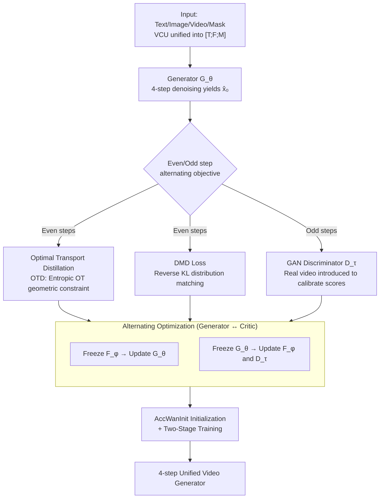

# VDOT: Efficient Unified Video Creation via Optimal Transport Distillation

**Conference**: CVPR 2026  
**Paper**: [CVF Open Access](https://openaccess.thecvf.com/content/CVPR2026/html/Wang_VDOT_Efficient_Unified_Video_Creation_via_Optimal_Transport_Distillation_CVPR_2026_paper.html)  
**Code**: https://vdot-page.github.io (Project Page)  
**Area**: Video Generation / Diffusion Model Distillation  
**Keywords**: Unified Video Creation, Distribution Matching Distillation (DMD), Optimal Transport, Few-step Generation, Adversarial Discriminator

## TL;DR
VDOT distills a 14B unified video creation model (VACE-Wan2.1) into a few-step generator requiring only 4 denoising steps. The key lies in **introducing the entropic optimal transport (OT) distance for the first time** as a geometric constraint within Distribution Matching Distillation (DMD). This relieves the zero-forcing and gradient explosion/collapse issues of KL-divergence-based distillation in few-step regimes. Combining this with an adversarial discriminator that leverages real videos, VDOT achieves 4-step generation qualities that match or even exceed the 100-step performance of the teacher.

## Background & Motivation

**Background**: Unified video creation aims to support various conditional generations with a single model—such as text, reference images, depth/pose/optical flow, and mask editing. Representative works like VACE unify all conditions into a "frame + mask" representation, while UNIC encodes all inputs into three categories of tokens. Both achieve impressive visual fidelity.

**Limitations of Prior Work**: To accommodate multiple conditions simultaneously, these unified models employ complex architectures and massive parameter sizes (VACE is based on Wan-14B). During inference, they require 50 to 100 denoising steps, making the generation of a many-frame video take anywhere from dozens of seconds to several minutes, which **makes them extremely difficult to deploy in real-world applications**.

**Key Challenge**: Can we preserve the multi-task capabilities of the unified model while compressing the inference steps to single digits? Existing diffusion distillation schemes struggle when applied directly to videos. For instance, Self-Forcing applies the DMD paradigm to videos, but in extreme few-step scenarios like 4 steps, **relying solely on reverse KL divergence** for distribution matching causes issues. Since reverse KL is mode-seeking, and because the gap between real and fake distributions is massive with no directional guidance in the early stages, training suffers from zero-forcing (where the student distribution fails to cover regions where the teacher has probability but the student's probability approaches zero) or gradient collapse/explosion (where gradients explode to $+\infty$ in regions where the student has probability but the teacher's probability approaches zero). This leads to training instability and a loss of diversity.

**Goal**: (1) Provide a more stable distribution matching objective than KL divergence for few-step distillation; (2) Introduce real video data to correct score estimation errors and the "bad habits" of the teacher model; (3) Fill the gap in unified video creation by providing large-scale training data and evaluation benchmarks.

**Key Insight**: The main drawback of reverse KL is its **lack of geometric structure**—it only evaluates point-wise probability ratios, neglecting "how to transport probability mass from one location to another." Optimal Transport (OT) inherently incorporates geometric constraints: it explicitly establishes a transport plan between two distributions, indicating how each sample should be aligned with the target, which provides optimal directional guidance to prevent the optimizer from losing direction during early few-step distillation.

**Core Idea**: For distribution matching in DMD, replace or supplement the reverse KL divergence with the entropic OT distance (solvable via Sinkhorn), and superimpose an adversarial discriminator that introduces real videos. The three losses (OTD + DMD + GAN) are optimized alternately to distill the 14B teacher into a 4-step student.

## Method

### Overall Architecture

VDOT takes four types of inputs—text, images, videos, and masks—and outputs a video that meets the requirements of the task, requiring only 4 denoising steps during inference. It uses the pre-trained **VACE-Wan2.1-14B** as the teacher and the generator framework. VACE uses a **Video Condition Unit (VCU)** $V=[T;F;M]$ to unify heterogeneous conditions into a "text + context frame $F$ + alignment mask $M$" triplet. By adjusting the values of the frames and masks, it can represent all tasks such as T2V / R2V / V2V / MV2V (e.g., for T2V, frames are set to all 0s, and masks to all 1s).

The training follows the DMD paradigm but employs three collaborative score/discriminator networks: a **frozen real score network $F_\psi$** (the teacher, estimating the score of the real distribution), a **learnable fake score network $F_\phi$** (the student, estimating the score of the current generated distribution), and a **discriminator $D_\tau$**. The generator $G_\theta$'s training objective consists of three parts: the OTD loss (OT geometric constraints), the DMD loss (original KL distribution matching), and the GAN loss (adversarial regularizer via real data). An **alternating optimization strategy** is adopted: within each step, $F_\phi$ is frozen first to train $G_\theta$, and then $G_\theta$ is frozen to train $F_\phi$ and $D_\tau$; **across steps**, it alternates between the "distribution matching objective" and the "adversarial objective" (using OTD+DMD / denoising at even steps, and GAN at odd steps).

### Key Designs

**1. Optimal Transport Distillation (OTD): Equipping Distribution Matching with Geometric Constraints**

This is the core innovation of the paper, specifically designed to address the zero-forcing and gradient collapse/explosion of reverse KL in few-step distillation. Reverse KL $D_{KL}(p_{fake}\|p_{real})$ compares probability density ratios point-by-point, lacking directional information of "where to move the mass." In regions where $p_{fake} \to 0$ and $p_{real} > 0$, the integral approaches 0, and the student simply stops updating in these regions (zero-forcing, resulting in incomplete coverage). In regions where $p_{fake} > 0$ and $p_{real} \to 0$, the integral approaches $+\infty$, and the gradient explodes (causing unstable training). The OTD approach treats the two score distributions as two sets of samples $p_{fake}=[a_i]\in\mathbb{R}^{I\times D}$ and $p_{real}=[b_j]\in\mathbb{R}^{J\times D}$ (where $I, J$ are flattened spatial dimensions, i.e., latent height $\times$ width), and computes the **entropic optimal transport (EOT) distance** between them:

$$W_2^{\epsilon}(p_{fake},p_{real})=\min_{T\in\Pi(u,\mu)}\langle D,T\rangle+\epsilon\langle T,\log T\rangle$$

Where $D$ is the squared Euclidean distance matrix between samples, and the second term is the entropic regularization ($\epsilon$ controls the intensity), allowing the problem to be solved efficiently via the **Sinkhorn algorithm** with a complexity of $O(IJ)$. The optimal transport plan $T^*$ acts as a "frame"-level spatial alignment. According to the envelope theorem, the derivative of the objective with respect to the distance matrix is $T^*$ itself, so the gradient with respect to sample $a_i$ is $\nabla_{a_i}W_2^\epsilon=\sum_j T^*_{ij}(a_i-b_j)$. By the chain rule, this gives the gradient with respect to the noisy sample $x_t$ as $\nabla_{OT}(x_t,t)$ (implemented directly via `torch.autograd`). Finally, the OTD loss is isomorphic to the DMD loss:

$$L_{OTD}(\theta)=\mathbb{E}_{z,t,x_t}\left[\|\hat{x}_0-\text{sg}(\hat{x}_0-\nabla_{OT}(x_t,t))\|_2^2\right]$$

Why it works: The OT plan $T^*$ explicitly defines "which real sample each fake sample should be transported to," placing a geometric guardrail on the optimization direction to prevent the student distribution from wandering wildly or collapsing into local high-probability areas. Compared to approaches like ADP that "use adversarial pre-training to alleviate mode-seeking" (which requires collecting large numbers of teacher ODE trajectories offline and interpolating noisy samples, being costly and labor-intensive), OTD imposes constraints directly on the distribution matching objective, which is much more lightweight. The authors state that this is the **first time OT has been applied to DMD**.

**2. Adversarial Discriminator: Correcting Score Errors by Introducing Real Videos**

VDOT adopts Self-Forcing instead of Teacher-Forcing—it avoids using real video frames as denoising conditions, and instead uses previously denoised frames to denoise the current frame to maintain train/test consistency. However, the price is that **no real data is seen during training**. Pure distribution matching will cause approximation errors in the real-score network $F_\psi$ to manifest as artifacts in video texture/details, and the generation quality is capped by the teacher model's performance while inheriting its bad habits. To address this, VDOT adds a discriminator $D_\tau$ to introduce real videos. It selects the **23rd, 31st, and 39th blocks** from the denoising blocks of the fake score network $F_\phi$, and introduces three learnable registration tokens to interact with these blocks via cross-attention. The output is concatenated along the channel dimension and passed through a linear classifier to output real/fake logits. Given the real video corresponding to the input prompt, it is first encoded into the same latent space as $x_{real}$ using a pre-trained VAE, and then noise is added to $x_{real}$ and $\hat{x}_0$ according to the scheduler's random timestep $t$ to obtain $x_t^{real}, x_t^{fake}$. The relative GAN loss is then used to calibrate the scores:

$$L_{GAN}(\theta)=\mathbb{E}_{z,t}\left[-(D_\tau(x_t^{fake},t)-D_\tau(x_t^{real},t))\right]$$

The discriminator objective $L_{GAN}(\tau)$ goes in the opposite direction. This branch allows the generator to "see" real-world video statistics, breaking the teacher's performance ceiling and suppressing artifacts.

**3. AccWanInit + Two-Stage Training: Providing a Strong Initialization for Few-step Generators**

Since few-step generators converge slowly and inefficiently when trained from scratch or initialized directly with the teacher's weights, VDOT employs a two-stage training scheme and introduces the **AccWanInit** initialization. In Phase 1, the Self-Forcing pipeline is used to distill Wan2.1-T2V-14B into a few-step generator (1500 steps, Artgrid captions). In Phase 2, the generator is initialized from VACE-Wan2.1-14B **combined with Phase 1 weights** (i.e., using a pre-distilled few-step Wan to initialize the Wan blocks in VACE, which is called AccWanInit), and then trained on multi-task data (8 single-condition + 10 compound tasks) for another 1200 steps. Ablations show that AccWanInit provides a much stronger initialization, significantly accelerating training efficiency (evident in the quality-vs-steps curve in Figure 5).

### Loss & Training

The generator's objective is $L_\theta=L_{OTD}(\theta)+\lambda L_{DMD}(\theta)$ on even steps, and $L_{GAN}(\theta)$ on odd steps. The critic's objective is the diffusion denoising loss $L_{Denoising}(\phi)$ on even steps to train the fake model, and $L_{GAN}(\tau)$ on odd steps to train the discriminator. The real score network $F_\psi$ remains frozen throughout. In terms of implementation, VDOT's generator is initialized with Wan2.1-VACE-14B. It uses the Adam optimizer, with a critic learning rate of $4\times10^{-7}$ and a TTUR ratio of 5. The generator's learning rate is $2\times10^{-6}$ in Phase 1 and $1\times10^{-6}$ in Phase 2. Training runs on 4 H200 GPUs with a batch size of 1 per GPU and gradient checkpointing (size 4) to save VRAM.

## Key Experimental Results

Evaluations are conducted on the self-built **UVCBench** (18 tasks: 8 single-condition + 10 compound tasks, with 20 videos per task). It uses the six-dimensional metrics of VBench (Aesthetic Quality, Background Consistency, Motion Motion, Imaging Quality, Motion Smoothness, Subject Consistency) to compute the Normalized Average, in addition to a 20-person user study (Prompt Following / Temporal Consistency / Video Quality, scored on a 1–5 Likert scale).

### Main Results

The following table excerpts the Normalized Average and NFE (denoising steps) across several tasks, comparing with the teacher VACE-Wan-14B (100 steps):

| Task | Method | Steps (NFE) | Objective Norm. Avg | User Study Avg |
|------|------|---------|---------------|----------------|
| Depth | VACE (Wan-14B) | 100 | 77.34% | 4.46 |
| Depth | **VDOT** | **4** | **78.50%** | 4.46 |
| Pose | VACE (Wan-14B) | 100 | 79.56% | 4.43 |
| Pose | **VDOT** | **4** | **80.54%** | **4.47** |
| Flow | VACE (Wan-14B) | 100 | 80.35% | 4.45 |
| Flow | **VDOT** | **4** | 80.18% | **4.51** |
| Extension | VACE (Wan-14B) | 100 | 77.10% | 4.52 |
| Extension | **VDOT** | **4** | **80.53%** | 4.36 |
| R2V | VACE (Wan-14B) | 100 | 82.54% | 4.66 |
| R2V | **VDOT** | **4** | 81.32% | 4.64 |

Core Conclusion: VDOT **matches or beats a 100-step teacher** on most tasks **with only 4 steps** on objective metrics, securing the best or second-best scores on Imaging Quality. The average user study preference is on par with or higher than that of the teacher. Compared to SD-1.5-based task-specific methods (such as Control-A-Video, ControlVideo, Follow-Your-Pose, etc., which typically require 50–100 steps and yield significantly lower scores), VDOT's advantage is prominent. Although its performance on R2V falls slightly short of the online commercial system Keling-1.6 (83.50%), it outperforms Vidu-2.0.

### Ablation Study

The following table shows the Normalized Average (for selected tasks) based on VACE-Wan2.1-14B. All configurations except row (1) were trained for 1200 steps:

| Configuration | DMD | OTD | GAN | AccWanInit | Depth | Pose | R2V |
|------|-----|-----|-----|-----------|-------|------|-----|
| (2) Self-Forcing (DMD only) | ✓ | | | | 76.89% | 78.34% | 76.45% |
| (3) w/o GAN | ✓ | ✓ | | ✓ | 78.24% | 80.14% | 77.66% |
| (4) w/o OTD | ✓ | | ✓ | ✓ | 78.05% | 80.79% | 78.40% |
| (5) w/o AccWanInit | ✓ | ✓ | ✓ | | 77.15% | 79.83% | 77.00% |
| **VDOT (Full)** | ✓ | ✓ | ✓ | ✓ | **78.50%** | **80.54%** | **81.32%** |

### Key Findings
- **Using DMD only (row 2, equivalent to Self-Forcing) yields the worst performance across all configurations**, validating the motivation that pure KL distillation is unstable in few-step scenarios. Performance across tasks recovers significantly with the addition of OTD, GAN, and AccWanInit.
- **Removing either OTD (row 4) or GAN (row 3) consistently degrades performance**, indicating that geometric constraints and real-data calibration are both irreplaceable. OTD provides particularly pronounced gains for tasks with high semantic/structural demands like R2V (77.66% $\rightarrow$ 81.32%).
- **AccWanInit (row 5 $\rightarrow$ Full) primarily contributes to training efficiency**: it provides a stronger initialization for the few-step generator. The quality-vs-training-steps curve in Figure 5 shows that training with OTD + AccWanInit converges dramatically faster.

## Highlights & Insights
- **Introducing OT into DMD is a clean "metric-switching" innovation**: it leaves the loss formulation of DMD untouched ($L_{OTD}$ is isomorphic to $L_{DMD}$) while swapping the "point-wise KL gradient" for the "OT-plan gradient." This seamlessly equips few-step distillation with geometric guardrails and is widely transferable to any image or video distillation method based on DMD.
- **Entropic regularization combined with Sinkhorn makes OT computationally feasible on high-dimensional latents** ($O(IJ)$). This is a critical engineering milestone that translates the theoretically superior yet previously computationally prohibitive Wasserstein constraint into practice.
- **Attaching the discriminator to internal blocks of the fake score network** (specifically the 23rd, 31st, and 39th blocks + registration tokens + cross-attention) reuses existing features rather than constructing a standalone, heavy discriminator. This saves parameters while successfully introducing real data statistics, serving as a reusable, lightweight discriminator design.
- **Jointly advancing both data and evaluation benchmarks**: The fully automated data pipeline (250k 4K videos + InternVL/Qwen3 captioning and task-aware filtering) along with UVCBench (18 tasks including 10 compound tasks) fills the gap in unified video creation evaluation, offering substantial infrastructural value to the research community.

## Limitations & Future Work
- **R2V and other highly challenging tasks still lag behind commercial systems** (Keling-1.6 83.50% vs. VDOT 81.32%). Few-step distillation still has a performance gap in retaining complex semantics.
- **Heavy dependency on the teacher VACE-Wan-14B**: The approach boils down to "compressing this specific teacher." Although the GAN loss can partially break through the teacher's cap, the model's overall upper-bound capability is still constrained by the teacher. Changing the teacher model requires retraining from scratch.
- **Compound task results are primarily delegated to the appendix**: The main text tables focus primarily on single-condition tasks. Thus, the robustness analysis of compound tasks (which constitute the majority among the 10 tasks) is not sufficiently disclosed in the main body.
- **Ablation or sensitivity analysis on key hyperparameters such as $\lambda$ and $\epsilon$ (entropic regularization strength) is missing**. The impact of different proportions of OTD vs. DMD remains unexplored in the main text.

## Related Work & Insights
- **vs. Self-Forcing (DMD Video Distillation)**: Self-Forcing uses only DMD and denoising loss to distill few-step video generators. VDOT highlights its zero-forcing and collapse issues in few-step regimes, augmenting it with OTD geometric constraints and real video data via GAN. In the ablation study, Self-Forcing (row 2) indeed yields the worst performance.
- **vs. VACE / UNIC (Unified Video Creation)**: These methods strive for multi-task unification and high fidelity but suffer from bulky architectures and require dozens or hundreds of steps. VDOT does not redesign a unified architecture; instead, it directly distills VACE into a 4-step generator, leveraging its VCU unified representation.
- **vs. ADP (Adversarial Mitigation of Mode-Seeking)**: ADP relies on adversarial pre-training and collecting offline teacher ODE trajectories to alleviate the mode-seeking behavior of KL divergence, which is highly expensive. VDOT addresses this online using OT geometric constraints, eliminating the need for offline ODE pairs.
- **vs. WGAN / Wasserstein Autoencoder (Classical Applications of OT in Generation)**: While classical approaches apply OT to the alignment between data and model distributions, VDOT innovatively applies OT to matching the **teacher-student score distributions** (within the DMD framework), serving a fundamentally different objective.

## Rating
- Novelty: ⭐⭐⭐⭐ It introduces entropic OT to DMD distribution matching for the first time with clear motivation and clean execution. However, it represents an assembly-style innovation (swapping a metric + incorporating a discriminator on a mature paradigm).
- Experimental Thoroughness: ⭐⭐⭐⭐ Features a large 18-task benchmark with dual objective/subjective testing and complete ablation studies. The comparison of few-step generation against the teacher is convincing. However, R2V lags behind commercial systems, compound tasks are mostly relegated to the appendix, and critical hyperparameter sensitivity analyses are missing.
- Writing Quality: ⭐⭐⭐⭐ The mathematical derivations for OT/DMD are complete, pseudocode of the algorithm is clear, and the alternating architecture and loss strategy are thoroughly explained.
- Value: ⭐⭐⭐⭐ Successfully compressing a 14B unified video model down to 4 steps without quality degradation holds high practical utility. The automated data pipeline and UVCBench introduced also offer structural significance to the community.

<!-- RELATED:START -->

## Related Papers

- [\[CVPR 2026\] Reward Forcing: Efficient Streaming Video Generation with Rewarded Distribution Matching Distillation](reward_forcing_efficient_streaming_video_generation_with_rewarded_distribution_m.md)
- [\[CVPR 2026\] Transition Matching Distillation for Fast Video Generation](transition_matching_distillation_for_fast_video_generation.md)
- [\[CVPR 2026\] EffectMaker: Unifying Reasoning and Generation for Customized Visual Effect Creation](effectmaker_unifying_reasoning_and_generation_for_customized_visual_effect_creat.md)
- [\[ICCV 2025\] V.I.P.: Iterative Online Preference Distillation for Efficient Video Diffusion Models](../../ICCV2025/video_generation/vip_iterative_online_preference_distillation_for_efficient_video_diffusion_model.md)
- [\[ICCV 2025\] Adversarial Distribution Matching for Diffusion Distillation Towards Efficient Image and Video Synthesis](../../ICCV2025/video_generation/adversarial_distribution_matching_for_diffusion_distillation_towards_efficient_i.md)

<!-- RELATED:END -->
