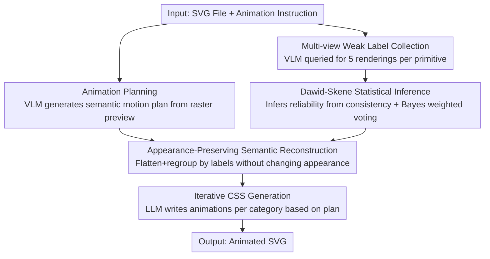

# Vector Prism: Animating Vector Graphics by Stratifying Semantic Structure

**Conference**: CVPR 2026  
**Paper**: [CVF Open Access](https://openaccess.thecvf.com/content/CVPR2026/html/Yun_Vector_Prism_Animating_Vector_Graphics_by_Stratifying_Semantic_Structure_CVPR_2026_paper.html)  
**Area**: Video Generation / Vector Graphics Animation / VLM Applications  
**Keywords**: SVG Animation, Semantic Structure Recovery, Dawid-Skene, Multi-view Inference, VLM

## TL;DR
Addressing the issue where VLMs often produce "chaotic" motion when directly animating SVGs, Vector Prism first employs multiple rendering views to obtain weak labels for each primitive from a VLM. It then utilizes Dawid-Skene statistical inference to aggregate these noisy labels into reliable semantic groupings and reconstructs an "animatable" SVG hierarchy. This allows the VLM to generate animations at a meaningful part granularity, outperforming AniClipart, GPT-5, and even commercial video generation models like Sora 2 in terms of instruction alignment and visual quality.

## Background & Motivation
**Background**: SVG (Scalable Vector Graphics) is a core asset for the modern web due to its lossless scaling and small file size. As web content becomes increasingly dynamic, the demand for SVG animation has surged. An intuitive idea is to directly feed SVG files into a VLM, letting it "understand the image, plan the motion, and write animation code"—since modern VLMs can perform both motion planning and coding, this seems straightforward.

**Limitations of Prior Work**: In practice, VLM-generated SVG animations almost always suffer from "visual collapse." The problem lies not in planning or coding abilities, but in the **organization of SVGs**: SVGs are designed for rendering efficiency rather than semantic clarity. Visually coherent parts (e.g., a rabbit's ears or nose) are often decomposed into a set of low-level geometric primitives (`<path>`, `<rect>`, etc.) or grouped by "paint order" rather than "semantics." VLMs fail to recognize "which primitives should move together," resulting in the entire image shaking rigidly or parts that should be connected flying apart randomly.

**Key Challenge**: Animation planning occurs at the **semantic level** (VLM understands "the sun should rise, the sky should brighten"), while animation execution occurs at the **syntactic level** (a collection of primitives in SVG code without semantic labels). A bridge is missing between these two layers—the VLM cannot ground its semantic plan into the correct syntactic hierarchy. Native SVG hierarchies rarely provide such structure.

**Goal**: Restore the "semantic part structure required for animation" in SVGs, enabling VLMs to reference meaningful parts and attach motion to the correct semantic units. The difficulty lies in the fact that VLM semantic judgments are inherently unreliable when looking at isolated primitives (the same primitive may yield different answers under different rendering styles).

**Key Insight**: Rather than pursuing a single "correct" query, it is better to acknowledge that VLM judgments are **弱 labels** and then use statistical methods to infer the true semantics from a collection of noisy weak labels. Each primitive is rendered in multiple "focused views" (highlight, isolation, zoom-in, outline, bounding box). The VLM is queried for each view to obtain a set of weak labels, which are then fused into a reliable decision using the classic Dawid-Skene crowdsourcing inference model.

**Core Idea**: Similar to how a prism stratifies light, the method statistically stratifies "noisy multi-view weak predictions" into coherent semantic groups. By using the Dawid-Skene model + Bayesian decision-making, it recovers true semantic labels for each primitive from noise and reconstructs the SVG into an "animatable" hierarchy without fine-tuning the VLM.

## Method

### Overall Architecture
Vector Prism is a three-stage pipeline that takes "an SVG file + an animation instruction" as input and outputs "an animated SVG file." These stages operate across semantic and syntactic layers, bridged by "semantic reconstruction":

1.  **Animation Planning (Semantic Level)**: Rasterize the SVG into an image for the VLM, allowing it to produce a high-level plan of "which semantic parts should move and how" based on the user instruction.
2.  **Semantic Stratification / Vector Prism (Core Contribution)**: Reconstruct the SVG into a "semantically meaningful and animatable" form. This involves multi-view weak labeling for each primitive followed by statistical inference to aggregate noisy labels.
3.  **Animation Generation (Syntactic Level)**: An LLM writes CSS animation code for the reconstructed SVG based on the animation plan.

The core contribution is within the second stage: it "injects semantics" into the SVG, linking visual reasoning with code-level representations via interpretable labels.

### Key Designs

**1. Animation Planning: Semantic Brainstorming**

Directly reading SVG code is difficult for VLMs, so the SVG is first rasterized. The visual signals from the image are much stronger than raw SVG code. The VLM then identifies which semantic parts should move and their relationships (e.g., for "make the sun rise," it identifies the yellow circle as the sun and the blue background as the sky). This stage only produces a **semantic plan**. Since the VLM does not fully grasp SVG syntax here, it cannot ground the plan—this bridge is provided by the subsequent reconstruction. This stage also fixes the set of semantic categories $Y = \{1, \dots, k\}$.

**2. Multi-view Weak Label Collection: Diverse Observations**

To judge the semantics of a primitive $x$, it must be rendered, but "how" it is rendered is crucial. VLMs often struggle with isolated small primitives. The authors use $M$ different rendering styles (highlight, bounding box, zoom-in, isolation, outline), each providing a complementary perspective. Rendering primitive $x$ with method $i$ yields a VLM label $s_i(x) \in Y$.

The key assumption is that each rendering method follows the Dawid-Skene model: method $i$ has an accuracy $p_i$, providing the true label $y$ when correct and making uniform errors across the remaining $k-1$ labels when incorrect:

$$\Pr[s_i = \ell] = \begin{cases} p_i, & \ell = y \\ \dfrac{1-p_i}{k-1}, & \ell \neq y \end{cases}$$

**3. Dawid-Skene Statistical Inference: Inferring Reliability from Consistency**

The challenge is that neither the true labels $y$ nor the reliability $p_i$ of each view are known. Vector Prism **bypasses true labels by deriving reliability from the frequency of agreement between two views**.

The probability that views $i$ and $j$ agree is:

$$A_{ij} = \Pr[s_i = s_j] = p_i p_j + \frac{(1-p_i)(1-p_j)}{k-1}$$

Defining $\delta_i = p_i - \tfrac{1}{k}$ (the "skill" beyond random guessing), this simplifies to $A_{ij} = \tfrac{1}{k} + \tfrac{k}{k-1}\,\delta_i \delta_j$. By subtracting the random baseline, we construct a centralized consistency matrix $B$ ($B_{ij} = A_{ij} - \tfrac{1}{k}$), whose expectation is a **rank-one outer product**:

$$\mathbb{E}[B] = \frac{k}{k-1}\,\boldsymbol{\delta}\boldsymbol{\delta}^\top$$

By extracting the leading eigenvalue $\lambda$ and eigenvector $v$ of $B$, we recover $\boldsymbol{\delta} = \sqrt{\tfrac{\lambda(k-1)}{k}}\,v$ and thus $p_i = \tfrac{1}{k} + \delta_i$. Reliability $\hat p_i$ is estimated entirely without ground truth. The final label is determined via a **weighted vote**, where each view $i$ is weighted by its log-likelihood ratio:

$$w_i = \log\frac{(k-1)\hat p_i}{1 - \hat p_i}, \qquad \hat y = \arg\max_y \sum_{i: s_i = y} w_i$$

**4. Appearance-Preserving SVG Semantic Reconstruction + Iterative CSS Generation**

The algorithm attaches labels as `class` attributes and **flattens the hierarchy**—applying all visual attributes directly to primitives to ensure the appearance remains unchanged. Primitives are then **regrouped by labels** while maintaining the original paint order to prevent rendering artifacts. Finally, the LLM writes CSS animations iteratively by semantic category to stay within token limits and avoid conflicting effects.

## Key Experimental Results

### Main Results

| Method | CLIP-T2V | GPT-T2V | DOVER | Vector Output |
| :--- | :--- | :--- | :--- | :--- |
| AniClipart (SDS Optimization) | 15.66 | 23.96 | 3.35 | ✓ |
| GPT-5 (Same Planning+Gen Pipeline) | 20.67 | 40.92 | 4.92 | ✓ |
| Wan 2.2 14B (Video Gen) | 21.14 | 65.21 | 3.72 | ✗ |
| Sora 2 (Commercial Video Gen) | 20.29 | 69.08 | 4.19 | ✗ |
| **Ours (Vector Prism)** | **21.55** | **76.14** | **4.97** | ✓ |

Vector Prism outperforms all baselines across three metrics. Notably, it surpasses Sora 2 and Wan 2.2 in instruction alignment without any video-specific training, proving that the weakness of vector formats was actually a lack of semantic understanding.

### Ablation Study

| Analysis Dimension | Configuration | Key Metric | Note |
| :--- | :--- | :--- | :--- |
| Semantic Grouping Quality (DBI↓) | Original SVG Grouping | 33.8 | Logic based on efficiency; semantic chaos |
| | Majority Vote + Multi-view | 12.6 | Multi-view helps but remains noisy |
| | **Vector Prism** | **0.82** | Near-perfect semantic clustering |
| Coding Efficiency (Compression↑) | Sora 2 720p / Wan 2.2 480p | 1.0× / 4.9× | Per-pixel generation; large size |
| | **Ours** | **54.8×** | Compact CSS; size scales with SVG complexity |
| Human Preference (760 comparisons) | Ours vs Sora 2 | 63.3% : 31.5% | Significant lead over video models |

### Key Findings
- **Semantic recovery is the unlock**: DBI drop from 33.8 to 0.82 shows that while multi-view helps, Dawid-Skene inference is what achieves near-perfect clustering.
- **Weighted vs. Majority Voting**: Bayes weighting suppresses noisy views (e.g., a $p=0.1$ view's weight drops to $\log\tfrac{1}{9}$), preventing them from overturning reliable predictions.
- **Vector Advantages**: Files are ~54× smaller than Sora 2 as size is independent of resolution or frame rate.
- **Failure Cases**: The method treats primitives as atomic. If a lightning bolt is a single `<path>` and the instruction requires it to "shatter," the method cannot subdivide the primitive.

## Highlights & Insights
- **Modeling VLM unreliability**: Instead of forcing a VLM to be correct once, it treats VLM outputs as weak labels and uses statistical inference (Dawid-Skene) to transform noise into reliable decisions—a beautiful paradigm shift from engineering to mathematics.
- **Elegant rank-one trick**: The ability to infer accuracy solely from the "frequency of agreement" without ground truth is elegant and transferable to any multi-annotator scenario (data labeling, model ensembling).
- **Identifying the "Semantic-Syntactic Gap"**: The insight that "SVG is for rendering efficiency, not semantic clarity" formalizes the reconstruction task, applicable to 3D assets and scene graphs as well.

## Limitations & Future Work
- **Input Granularity**: Limited by the atoms of the input SVG. Future work could explore automatic subdivision of coarse primitives.
- **Model Dependencies**: Reliant on proprietary APIs (GPT-5). Robustness with open-source VLMs/LLMs remains to be fully explored.
- **Fixed Category Set**: If the planning stage misses a part, the inference stage cannot recover it.
- **Dawid-Skene Assumptions**: The uniform error assumption may not hold if a VLM has systematic biases toward confusing specific parts.

## Related Work & Insights
- **vs. AniClipart**: AniClipart uses SDS gradients on raster renderings, which resist large part rearrangements and often lead to jitter. This work recovers element-level semantics for robust motion planning.
- **vs. GPT-5 (Direct)**: Even the strongest LLMs struggle with raw SVG code. Providing the "semantic bridge" through reconstruction is what enables meaningful motion.
- **vs. Video Models**: Video models have richer motion but often fail to follow "starting frame" constraints or instructions precisely, and their output is not suitable for lightweight web use. Vector Prism beats them in alignment while being much smaller.

## Rating
- Novelty: ⭐⭐⭐⭐⭐ 
- Experimental Thoroughness: ⭐⭐⭐⭐ 
- Writing Quality: ⭐⭐⭐⭐⭐ 
- Value: ⭐⭐⭐⭐

<!-- RELATED:START -->

<!-- RELATED:END -->

## Related Papers

- [\[ICML 2026\] VAnim: Rendering-Aware Sparse State Modeling for Structure-Preserving Vector Animation](../../ICML2026/video_generation/vanim_rendering-aware_sparse_state_modeling_for_structure-preserving_vector_anim.md)
- [\[CVPR 2026\] LottieGPT: Tokenizing Vector Animation for Autoregressive Generation](lottiegpt_vector_animation_generation.md)
- [\[CVPR 2026\] OmniLottie: Generating Vector Animations via Parameterized Lottie Tokens](omnilottie_generating_vector_animations_via_parameterized_lottie_tokens.md)
- [\[CVPR 2026\] SynMotion: Semantic-Visual Adaptation for Motion Customized Video Generation](synmotion_semantic-visual_adaptation_for_motion_customized_video_generation.md)
- [\[CVPR 2026\] Open-world Hand-Object Interaction Video Generation Based on Structure and Contact-aware Representation](open-world_hand-object_interaction_video_generation_based_on_structure_and_conta.md)

<!-- RELATED:END -->
