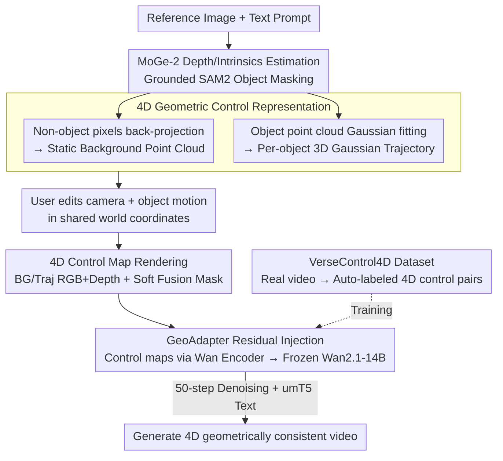

# VerseCrafter: Dynamic Realistic Video World Model with 4D Geometric Control

**Conference**: CVPR 2026  
**arXiv**: [2601.05138](https://arxiv.org/abs/2601.05138)  
**Code**: [https://sixiaozheng.github.io/VerseCrafter_page/](https://sixiaozheng.github.io/VerseCrafter_page/)  
**Area**: Video Generation
**Keywords**: Video World Model, 4D Geometric Control, 3D Gaussian Trajectory, Camera and Object Motion, Video Diffusion Model

## TL;DR
This paper proposes VerseCrafter, a video world model based on a 4D geometric control representation (static background point cloud + per-object 3D Gaussian trajectories). By injecting 4D control signals into a frozen Wan2.1-14B video diffusion model via a lightweight GeoAdapter, it achieves precise and decoupled control over camera and multi-object motions. Additionally, a large-scale real-world dataset, VerseControl4D, containing 35K samples, is constructed.

## Background & Motivation

1. **Background**: Video world models aim to simulate dynamic real-world environments. Recent methods regulate video generation through text, actions, or camera trajectories. For camera control, works like CameraCtrl and MotionCtrl achieve viewpoint control through Plücker coordinates or 3D prior injection. Object motion control primarily relies on 2D cues (trajectory points, optical flow, masks, 2D bboxes).

2. **Limitations of Prior Work**: (a) 2D control signals are not robust under large viewpoint changes and lack 3D awareness; (b) advanced 3D signals like 3D bboxes are too rigid, SMPL-X is limited to humans, and sparse 3D trajectories are often noisy and incomplete; (c) existing control spaces are fragmented, where camera and object motions are not in a unified coordinate system, preventing coordinated control.

3. **Key Challenge**: An ideal world model should simulate the complete 4D spatiotemporal space, but videos only capture 2D projections. A compact, editable, and category-agnostic 4D geometric state representation is required to unify camera and multi-object motion control.

4. **Goal**: (a) Design a unified 4D geometric control representation; (b) achieve decoupled control of camera and multi-object motion within a shared world coordinate system; (c) construct large-scale training data.

5. **Key Insight**: Use 3D Gaussian distributions to describe the probabilistic 3D occupancy of objects—where the mean defines the motion path and the covariance captures spatial extent and orientation, naturally supporting soft, flexible, and category-agnostic object modeling.

6. **Core Idea**: Combine a static background point cloud and per-object 3D Gaussian trajectories to form a unified 4D geometric state in a shared world coordinate system. After rendering into multi-channel control maps, these drive a frozen video diffusion model via a GeoAdapter.

## Method

### Overall Architecture
VerseCrafter aims to allow users to direct "how the camera moves" and "how each object moves" simultaneously and independently within a unified 3D world coordinate system to generate geometrically self-consistent realistic videos. The pipeline "inflates" a static reference image into an editable 4D geometric state and renders this state into control maps understandable by the diffusion model.

Specifically, given a reference image and a text prompt, the system first estimates depth and camera intrinsics using MoGe-2 and segments object masks using Grounded SAM2. Pixels in non-object regions are back-projected into a static **background point cloud**, while each object is fitted into a **3D Gaussian trajectory** evolving over time. Users specify camera and object movements in the shared world coordinate system, and the system renders the 4D state frame-by-frame into multi-channel **control maps** (background RGB/depth, trajectory RGB/depth, soft fusion mask). These maps are encoded by the Wan Encoder and fed into the GeoAdapter, which modulates a frozen Wan2.1-14B DiT backbone via residual connections, combined with umT5 text embeddings for denoising.

### Key Designs

**1. 4D Geometric Control Representation: Describing object occupancy with probabilistic Gaussians instead of rigid bodies**

To simulate 4D spacetime from 2D projections, a compact and category-agnostic geometric state is needed. The scene is split into two parts in a world coordinate system: the static background is represented by a point cloud $P^{\text{bg}}$, back-projected from non-object pixels in the input image; each dynamic object is represented by a 3D Gaussian trajectory $\{\mathcal{G}_o^t\}_{t=1}^T$. Each Gaussian at time $t$ is defined by a mean $\boldsymbol{\mu}_o^t$ (position) and a covariance $\mathbf{\Sigma}_o^t$ (spatial extent and orientation), initialized via full-covariance Gaussian fitting on object point clouds. 3D Gaussians are chosen over bboxes (too rigid), SMPL-X (human-specific), or sparse points (no shape) because they provide a "soft" probabilistic description of object occupancy that is category-agnostic and easy to edit.

**2. 4D Control Map Rendering: Decoupling camera and object motion into independent channels**

The 4D geometric state is translated into frame-by-frame signals for the diffusion model. Three types of maps are rendered per frame: background RGB/depth (projecting $P^{\text{bg}}$ from the target camera viewpoint), trajectory RGB/depth (projecting object Gaussians as soft elliptical footprints), and a soft fusion mask (telling the model which regions to synthesize). Crucially, background and trajectory paths use **decoupled channels**. The background map only changes with the camera, while trajectory maps only change with object motion, preventing signal contamination and allowing the model to learn these motion modes independently.

**3. GeoAdapter: Injecting control signals via zero-initialized side branches**

To preserve the powerful video prior of Wan2.1, the backbone is frozen, and a lightweight side branch is added. Four sets of RGB/depth control maps are encoded by the frozen Wan Encoder, and the soft fusion mask is reshaped to latent resolution. These are concatenated into a spatiotemporal geometric tensor. The GeoAdapter is a DiT branch with the same hidden dimension as Wan-DiT but fewer layers. Every $k=5$ DiT blocks, a GeoAdapter block is added, and its output is added back to the corresponding DiT block as a residual via a zero-initialized linear projection.

**4. VerseControl4D Dataset: An automated pipeline for labeling 4D control pairs**

As 4D control data is scarce, an automated pipeline extracts it from real videos. 81-frame segments are taken from Sekai-Real-HQ and SpatialVID-HQ. Objects are filtered via Grounded SAM2, and quality is ensured via aesthetic/brightness scores. Descriptions are generated by Qwen2.5-VL-72B, while depth and camera trajectories are estimated via MoGe-2, UniDepth V2, and MegaSAM to reconstruct 3D point clouds and fit Gaussian trajectories. The resulting 35K training and 1K validation samples form the basis for large-scale training.

### Loss & Training
- Optimizer: Adam, learning rate 2e-5, constant with 100-step warmup.
- Staged training: 2,500 steps at 480P, followed by 2,500 steps at 720P.
- Classifier-free guidance (CFG): Text conditions randomly dropped with a 0.1 probability.
- Inference: 50-step denoising with a CFG scale of 5.0.
- Hardware: 16x 96GB GPUs, total training time ~380 hours.

## Key Experimental Results

### Main Results (Joint Camera + Object Motion Control)

| Method | Overall Score↑ | Imaging Quality↑ | RotErr↓ | TransErr↓ | ObjMC↓ |
|------|---------------|-----------------|---------|-----------|--------|
| Perception-as-Control | 83.66 | 66.81 | 5.006 | 8.767 | 6.556 |
| Yume | 85.47 | 71.16 | 7.560 | 8.735 | 7.959 |
| Uni3C | 83.55 | 68.06 | 1.361 | 7.731 | 5.883 |
| **Ours (VerseCrafter)** | **88.10** | **72.70** | **0.890** | **3.103** | **2.507** |

### Ablation Study (3D Representation and Control Design)

| Configuration | Overall Score | RotErr | TransErr | ObjMC |
|------|-------------|--------|----------|-------|
| Full (3D Gaussian) | **88.10** | **0.890** | **3.103** | **2.507** |
| 3D Bounding Box | 85.45 | 1.350 | 3.805 | 4.520 |
| 3D Point Trajectory | 85.57 | 1.298 | 3.281 | 6.896 |
| w/o depth | 85.64 | 1.177 | 3.900 | 4.929 |
| BG & FG Merged | 85.72 | 1.080 | 3.803 | 3.726 |

### Key Findings
- **3D Gaussian trajectories outperform 3D bboxes and point trajectories**: ObjMC dropped significantly to 2.507 because Gaussians provide shape and orientation. Point trajectories performed worst (6.896) as they cannot encode object size.
- **Depth information is critical**: Removing depth leads to foreground/background ordering errors, increasing TransErr from 3.103 to 3.900.
- **Decoupled control is superior to merged control**: Merging background and foreground control degrades object motion accuracy (ObjMC rose from 2.507 to 3.726).
- **Static scene camera control**: VerseCrafter's RotErr (0.650) and TransErr (2.587) are significantly lower than FlashWorld and ViewCrafter, demonstrating the precision of 4D geometric control.

## Highlights & Insights
- **3D Gaussian Trajectory as a General Motion Representation**: Replacing rigid geometry with probabilistic distributions balances shape encoding and flexibility, naturally handling arbitrary object categories.
- **Ingenious Decoupled Rendering**: Separating camera motion (background) and object motion (foreground) into independent channels allows the model to learn distinct motion patterns without confusion.
- **Zero-init + Weight Inheritance Strategy**: Initializing the GeoAdapter from backbone weights and using zero-initialized output layers ensures stability and rapid adaptation.

## Limitations & Future Work
- **High Inference Cost**: Generating an 81-frame 720P video requires 8x 96GB GPUs for ~1152 seconds.
- **Dependency on Single-view Depth**: Background reconstruction from a single image results in missing occluded areas during large viewpoint changes.
- **Dataset Bias**: VerseControl4D primarily covers outdoor/urban scenes; indoor complexity may be underrepresented.
- **Physical Interactions**: Collisions and occlusions between multiple objects are not explicitly modeled, potentially leading to unrealistic intersections.

## Related Work & Insights
- **vs Yume**: Yume uses text/action tokens for 4D generation but lacks precise control (RotErr=7.560 vs. Ours=0.890). VerseCrafter replaces implicit control with explicit geometric states.
- **vs Uni3C**: Uni3C is limited to human SMPL-X models. VerseCrafter is category-agnostic and supports multiple objects.
- **vs ControlNet**: GeoAdapter inherits the adapter injection concept but extends it to 4D spacetime with decoupled multi-channel maps.

## Rating
- Novelty: ⭐⭐⭐⭐⭐ 4D geometric control and 3D Gaussian trajectories are highly innovative.
- Experimental Thoroughness: ⭐⭐⭐⭐⭐ Comprehensive joint/camera/ablation studies.
- Writing Quality: ⭐⭐⭐⭐ Clear methodology, though formula-heavy.
- Value: ⭐⭐⭐⭐⭐ Provides a unified 4D control interface and reusable dataset for world modeling.

<!-- RELATED:START -->

## Related Papers

- [\[CVPR 2026\] ProPhy: Progressive Physical Alignment for Dynamic World Simulation](prophy_progressive_physical_alignment_for_dynamic_world_simulation.md)
- [\[CVPR 2026\] SeeU: Seeing the Unseen World via 4D Dynamics-aware Generation](seeu_seeing_the_unseen_world_via_4d_dynamics-aware_generation.md)
- [\[AAAI 2026\] 3D4D: An Interactive Editable 4D World Model via 3D Video Generation](../../AAAI2026/video_generation/3d4d_an_interactive_editable_4d_world_model_via_3d_video_generation.md)
- [\[CVPR 2026\] Physical Object Understanding with a Physically Controllable World Model](physical_object_understanding_with_a_physically_controllable_world_model.md)
- [\[CVPR 2026\] Yume1.5: A Text-Controlled Interactive World Generation Model](yume15_a_text-controlled_interactive_world_generation_model.md)

<!-- RELATED:END -->
