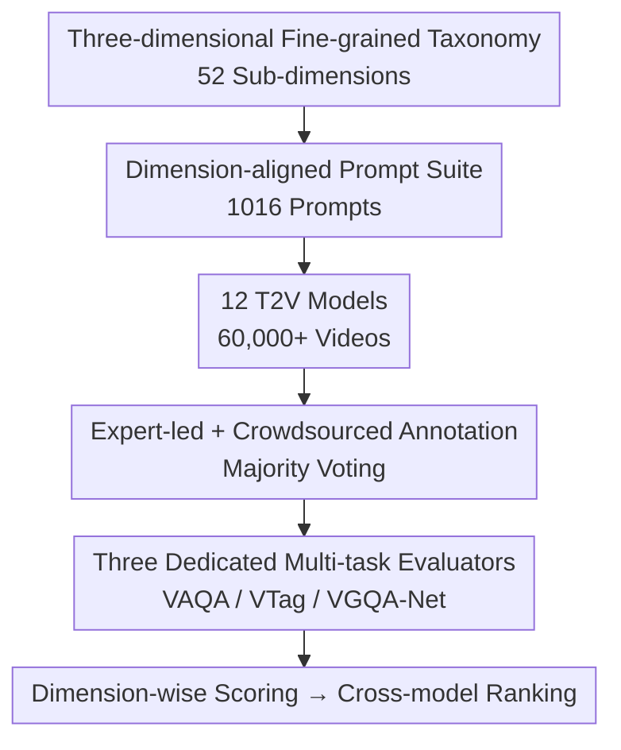

# VGA-Bench: A Unified Benchmark and Multi-Model Framework for Video Aesthetics and Generation Quality Evaluation

**Conference**: CVPR 2026  
**Paper**: [CVF Open Access](https://openaccess.thecvf.com/content/CVPR2026/html/Jiang_VGA-Bench_A_Unified_Benchmark_and_Multi-Model_Framework_for_Video_Aesthetics_CVPR_2026_paper.html)  
**Code**: TBD (Paper promises release of benchmark, evaluation model APIs, and all generated videos)  
**Area**: Video Generation / AIGC Evaluation / Video Aesthetics  
**Keywords**: Video Generation Evaluation, Video Aesthetics, AIGC benchmark, Multi-task Evaluation Network, T2V

## TL;DR
VGA-Bench expands text-to-video (T2V) evaluation from "realism" to "aesthetics." It utilizes a three-dimensional framework (Aesthetic Quality / Aesthetic Tag / Generation Quality) consisting of 52 fine-grained sub-dimensions, 1016 dimension-aligned prompts, and 60,000 videos generated by 12 models. By training three dedicated networks—VAQA-Net, VTag-Net, and VGQA-Net—for end-to-end automatic scoring, it eliminates dependency on external models and provides cross-model evaluations aligned with human judgment.

## Background & Motivation
**Background**: Diffusion models and DiT architectures (post-Sora) have enabled T2V to generate videos with temporal coherence and exquisite image quality, expanding applications from digital art to film production. Consequently, the community requires a reliable and interpretable evaluation framework to measure the quality of these models.

**Limitations of Prior Work**: Traditional metrics (FVD, CLIP Score, and their variants) focus solely on "technical fidelity"—temporal consistency, text alignment, and distortion levels—failing to capture higher-level perceptual quality, particularly "aesthetic expression" which significantly impacts viewing experience. Even the pioneering V-Bench collapses "video aesthetics" into a single score and relies heavily on external scoring models (MUSIQ, DINO), resulting in insufficient granularity, significant bias, and poor controllability.

**Key Challenge**: User expectations have evolved beyond the baseline of "no artifacts and reasonable motion" toward artistic demands such as "pleasing composition, sophisticated lighting, harmonious color, and accurate expressions." However, existing benchmarks lack fine-grained modeling for composition, color, and lighting, and struggle to align with real human perception due to indirect inference via general pre-trained models.

**Goal**: To build a unified, fine-grained benchmark capable of evaluating generation quality, aesthetic quality, and visual formal elements (tags) alongside a scalable, automated evaluator.

**Key Insight**: The authors argue that "beauty" is decomposable, annotatable, and quantifiable. By systematizing the professional aesthetic language of photography and filmmaking (composition, light source, depth of field, color temperature, etc.) into a dimensional system, evaluation can move from "does it look good" to "where and why is it beautiful."

**Core Idea**: Replace a single aesthetic score with a three-dimensional fine-grained taxonomy and train dedicated multi-task evaluation networks specifically for AIGC videos to replace external general scoring models, achieving end-to-end, consistent, and scalable automated evaluation.

## Method

### Overall Architecture
VGA-Bench follows a complete pipeline: "define scales -> create data -> train evaluators." First, a three-layer taxonomy (Aesthetic Quality / Aesthetic Tag / Generation Quality, totaling 52 sub-dimensions) is established. Based on this, 1016 "dimension-aligned" prompts are designed to generate over 60,000 videos using 12 mainstream T2V models, forming a comprehensive evaluation base. A subset undergoes "expert-led + crowdsourced" manual annotation. Finally, these annotations are used to train three dedicated networks—VAQA-Net (aesthetic scoring), VTag-Net (aesthetic tag classification), and VGQA-Net (generation quality scoring)—to achieve automated ranking across all dimensions without external model calls.

### Key Designs

**1. Three-dimensional Fine-grained Taxonomy: Quantifying "Beauty" into 52 Sub-dimensions**

To address the collapse of aesthetics into a single score, the authors decompose the evaluation into 52 sub-dimensions across three layers. **Aesthetic Quality (10 dimensions)** is adapted from the VADB dataset, including Overall, Composition (Com), Shot Size (SS), Lighting (Lig), Visual Tone (VT), Color (Col), Depth of Field (DoF), Expression (Exp), Costume (Cos), and Makeup (Mak). It specifically discusses "pathological behaviors" in generated videos (e.g., "floating composition," "non-physical light sources," or "mechanical expressions"). **Aesthetic Tags (11 dimensions, expanded to 21 categories)** structure photography theory into discrete labels such as composition type (rule of thirds, symmetry, etc.), light source position, and light quality. **Generation Quality (31 dimensions)** refines V-Bench into three categories: video-text consistency, physical plausibility (e.g., fluid motion, rigid body collision), and basic quality (e.g., clarity, noise).

**2. Dimension-aligned Prompt Suite: Explicit Specification of Evaluation Dimensions**

The core design principle is: **the aesthetic or generation quality dimension to be evaluated must be explicitly stated in the prompt**. This ensures the model perceives and responds to that attribute, making the evaluation meaningful. For example, a video is only used for composition evaluation if the prompt explicitly includes "rule of thirds composition." This avoids subjective bias from guessing unmentioned attributes. The final suite comprises 1016 prompts, with each dimension having at least 50 prompts to ensure statistical validity.

**3. Expert-led + Crowdsourced Annotation Protocol: Ensuring Consistency for 60,000+ Samples**

To train the evaluators, the authors use a "expert demonstration → crowdsourced following → expert batch auditing" paradigm. Professionals from the film industry provide demonstration annotations based on predefined rubrics. The crowdsourced team completes the remaining data, followed by expert audits. Any errors result in the rejection and re-annotation of the entire batch. Annotators only score dimensions explicitly mentioned in the prompt. For tags, a "majority voting" system (at least 2 out of 3) is employed to ensure consensus.

**4. Three Dedicated Multi-task Evaluation Networks: End-to-End Automatic Evaluation**

The framework utilizes three specialized evaluators. **VAQA-Net (Aesthetic Quality)** and **VTag-Net (Aesthetic Tag)** are initialized with video encoders pre-trained on real-world professional data (VADB), inheriting "aesthetic understanding" from deliberate artistic decisions in filmmaking. These encoders are frozen and then fine-tuned on 1,300 AIGC videos. **VGQA-Net (Generation Quality)** focuses entirely on generated videos and includes an additional CLIP branch. To verify generalization, the training and testing sets use non-overlapping sets of video generation models.

## Key Experimental Results

### Main Results: Evaluation of 12 T2V Models
The models were ranked using normalized average scores across the sub-dimensions (Table 5).

| Model | Aes. Score | Tag Class. | Gen. Grade |
|------|------|------|------|
| SVD | 0.20 | 0.32 | 0.55 |
| AnimateDiff | 0.36 | 0.30 | 0.49 |
| CogVideoX | 0.41 | 0.39 | 0.55 |
| Hunyuan | 0.45 | 0.36 | 0.55 |
| Wan2.1 | 0.46 | 0.38 | 0.53 |
| **Sora2** | **0.50** | 0.18 | 0.54 |

### Benchmark Scale Comparison (Table 1)

| Benchmark | Total Dim. | Aes. Dim. | Evaluated Models | Prompts |
|------|------|------|------|------|
| V-Bench | 16 | 1 | 4 | ~1600 |
| V-Bench2.0 | 18 | 2 | 4 | ~1600 |
| **VGA-Bench (Ours)** | **52** | **21** | 12 | 1016 |

### Key Findings
- **Sora2's Aesthetic Dominance vs. Tag Anomaly**: Sora2 achieved the highest aesthetic score (0.50) but an unusually low tag classification score (0.18), suggesting its stylized output may not align with standard photography labels or that the evaluator struggles to generalize to its distribution.
- **Independence of "Realism" and "Beauty"**: Models like Mochi scored well in generation grade (0.54) but poorly in aesthetics (0.21), validating the necessity of decoupling aesthetics from fidelity.
- **Alignment with Human Ranking**: While Top-1 alignment for aesthetics is low (Recall@1 = 0.10), the Recall@3/5 reaches 0.70/0.80, indicating that automated ranking is reliable for coarse-grained ordering.

## Highlights & Insights
- **Engineering Aesthetics**: Systematizing professional filmmaking language into 52 quantifiable dimensions allows aesthetics to be used as a supervised signal for model optimization.
- **Explicit Dimension-Prompt Alignment**: Evaluating only what is prompted eliminates annotation noise from "subjective filling" of unmentioned attributes.
- **Transfer from Real to AIGC**: Freezing encoders pre-trained on professional video data effectively transfers aesthetic knowledge to the AIGC domain, addressing the scarcity of high-quality aesthetic annotations for generated content.

## Limitations & Future Work
- **Variable Evaluator Accuracy**: VTag-Net shows lower accuracy for global semantic tags like composition (45%), affecting the credibility of cross-model rankings in those specific areas.
- **Sora2 Anomaly**: The paper does not fully explain why Sora2 scores so low in tag classification despite high aesthetic scores.
- **User Study Scale**: The study relied on 40 non-expert participants; a larger-scale study with experts could provide deeper insights into aesthetic alignment.

## Related Work & Insights
- **Comparison with V-Bench**: While V-Bench pioneered sub-task evaluation, it relies on external models and lacks aesthetic granularity. VGA-Bench provides 21 aesthetic dimensions and uses specialized internal networks.
- **Fidelity vs. Perception**: Unlike traditional metrics ($FVD$, CLIP Score) that measure technical distance, VGA-Bench focuses on the "perceptual gap" in artistic quality.

## Rating
- Novelty: ⭐⭐⭐⭐ The first unified benchmark to refine video aesthetics into 21 dimensions with dedicated evaluators.
- Experimental Thoroughness: ⭐⭐⭐⭐ Extensive 12-model evaluation, though the user study is relatively small.
- Writing Quality: ⭐⭐⭐⭐ Taxonomy and protocols are well-defined.
- Value: ⭐⭐⭐⭐ Provides essential infrastructure for the evaluation and optimization of AIGC video aesthetics.

<!-- RELATED:START -->

## Related Papers

- [\[ICML 2026\] V2V-Bench: A Comprehensive Benchmark for Video-to-Video Generation Evaluation](../../ICML2026/video_generation/v2v-bench_a_comprehensive_benchmark_for_video-to-video_generation_evaluation.md)
- [\[CVPR 2026\] DreamStyle: A Unified Framework for Video Stylization](dreamstyle_a_unified_framework_for_video_stylization.md)
- [\[CVPR 2026\] TV2TV: A Unified Framework for Interleaved Language and Video Generation](tv2tv_a_unified_framework_for_interleaved_language_and_video_generation.md)
- [\[CVPR 2026\] EasyV2V: A High-quality Instruction-based Video Editing Framework](easyv2v_a_high-quality_instruction-based_video_editing_framework.md)
- [\[CVPR 2026\] MultiShotMaster: A Controllable Multi-Shot Video Generation Framework](multishotmaster_a_controllable_multi-shot_video_generation_framework.md)

<!-- RELATED:END -->
