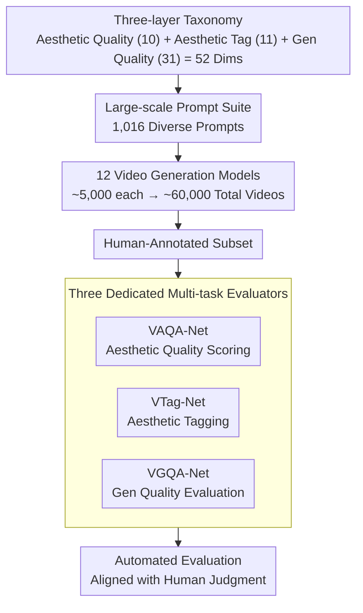

# VGA-Bench: A Unified Benchmark for Video Aesthetics and Generation Quality Evaluation

**Conference**: CVPR 2026  
**arXiv**: [2604.10127](https://arxiv.org/abs/2604.10127)  
**Code**: Yes  
**Area**: Video Generation  
**Keywords**: Video Quality Assessment, Aesthetic Assessment, AIGC Evaluation, Multi-task Evaluator, Video Generation

## TL;DR

VGA-Bench introduces a unified evaluation benchmark for AIGC videos, featuring a three-layer taxonomy (Aesthetic Quality, Aesthetic Tagging, and Generation Quality), 1,016 prompts, 60,000 videos, and three dedicated evaluation models to achieve automated assessment aligned with human judgment.

## Background & Motivation

**Background**: Technologies for AI-generated content (AIGC) video generation are evolving rapidly (e.g., Diffusion Models, Transformers). However, existing evaluation frameworks primarily focus on technical fidelity (FVD, CLIP Score) and neglect high-level perceptual qualities such as aesthetic appeal.

**Limitations of Prior Work**: Benchmarks like V-Bench simplify "video aesthetics" into a single score and rely heavily on external scoring models (MUSIQ/DINO), resulting in insufficient granularity, significant bias, and poor controllability.

**Key Challenge**: While video generation models are becoming increasingly powerful, there is a lack of a comprehensive, fine-grained, and interpretable evaluation system to simultaneously measure both technical and aesthetic quality.

**Goal**: Establish a three-dimensional unified evaluation system encompassing generation quality, aesthetic quality, and visual formal elements.

**Key Insight**: Design a hierarchical taxonomy that decomposes attributes into fine-grained sub-dimensions (composition, color harmony, lighting, motion aesthetics, etc.) and train dedicated evaluation models.

**Core Idea**: Replace the patchwork of external scoring models with three dedicated neural evaluators to achieve end-to-end, consistent, and scalable automated evaluation.

## Method

### Overall Architecture

The core of VGA-Bench is a **three-layer orthogonal taxonomy**, which serves as the foundation for data construction and evaluator training:

- **Aesthetic Quality**: Overall beauty and 10 fine-grained dimensions including composition, camera shot, lighting, shadow, color, depth of field, expression, clothing, and makeup (adapted from the VADB dataset);
- **Aesthetic Tagging**: 11 categories of quantifiable photographic elements such as composition type, light source number/position/texture/color, camera shot, depth of field, saturation, brightness, color temperature, and contrast, answering "what the visual language of the video looks like";
- **Generation Quality**: Refined based on V-Bench into three categories with 31 sub-dimensions: video-text consistency, realism/rationality, and basic quality.

The three layers comprise 52 dimensions (21 related to aesthetics). The construction process follows a serial pipeline: Taxonomy → 1,016 diverse prompts → ~60,000 videos generated by 12 models → human-annotated subset → training of VAQA-Net, VTag-Net, and VGQA-Net → automated evaluation.

### Key Designs

**1. Three-layer Classification System: Decomposing Video Quality into Three Non-substitutable Dimensions**

Previous benchmarks (e.g., V-Bench) compressed "aesthetics" into a single score, merging independent factors like composition, color, and lighting. VGA-Bench orthogonally splits evaluation into three layers. **Aesthetic Quality** measures overall beauty and 10 fine-grained dimensions. **Aesthetic Tagging** automatically identifies 11 types of quantifiable photographic elements to describe visual language. **Generation Quality** focuses on technical fidelity across 31 sub-dimensions. Compared to V-Bench's 16 dimensions (only 1 for aesthetics), VGA-Bench's 52 dimensions (21 for aesthetics) allow for precise issue localization.

**2. Large-scale Diverse Prompt Suite and Dataset: Fair and Challenging Cross-model Comparison**

To fairly compare generation models, test inputs must be diverse and large-scale. VGA-Bench designs 1,016 prompts covering various scenes, actions, styles, and challenging scenarios. Using 12 SOTA video generation models to produce ~60,000 videos creates the largest integrated testing platform to date, ensuring statistically significant results.

**3. Three Dedicated Multi-task Evaluation Models: Specialized AIGC Evaluators over External Models**

Older benchmarks often borrow external models like MUSIQ or DINO, which are not designed for AIGC videos, leading to systematic biases due to distribution shifts. VGA-Bench trains three dedicated evaluators: VAQA-Net for aesthetic scores, VTag-Net for tagging, and VGQA-Net for generation/basic quality. Trained on professional human annotations within a multi-task framework, these models align directly with human judgment rather than relying on disparate external benchmarks.

### Loss & Training

The three evaluation models are trained individually using human-annotated data. Within a multi-task learning framework, each model processes multiple sub-attributes under its respective dimension.

## Key Experimental Results

### Main Results

| Evaluator | Human Alignment | Dimension Coverage |
|-----------|-----------------|--------------------|
| VAQA-Net  | High Alignment  | Multiple Aesthetic Dims |
| VTag-Net  | High Accuracy   | Aesthetic Tagging Automation |
| VGQA-Net  | High Alignment  | Multiple Gen Quality Dims |

### Comparison with Existing Benchmarks (Table 1)

| Dimension | V-Bench | VGA-Bench |
|-----------|---------|-----------|
| Total Dimensions | 16 | 52 |
| Aesthetic Dimensions | 1 | 21 |
| Evaluation Models | 4 | 12 |
| Prompt Count | ~1600 | 1016 (Curated) |

### Key Findings

- Dedicated evaluation models significantly outperform general external models in alignment with human judgment.
- Different video generation models exhibit distinct strengths and weaknesses between aesthetic and technical quality.
- Aesthetic quality and generation quality are not always positively correlated—some models show high technical fidelity but poor aesthetic performance.

## Highlights & Insights

- **Expansion from Technical Fidelity to Aesthetic Intelligence**: VGA-Bench elevates AIGC evaluation from "is it realistic" to "is it beautiful."
- **Value of Evaluation Infrastructure**: The combination of 60,000 videos, human annotations, and three evaluation models forms a complete evaluation ecosystem.
- **Open Source Commitment**: Includes taxonomy, prompt templates, annotation data, APIs, and video datasets.

## Limitations & Future Work

- Aesthetic evaluation is inherently subjective, and human annotation may contain biases.
- Although curated, the 1016 prompts still have limited coverage.
- Evaluation models may require continuous updates as video generation technology evolves.

## Related Work & Insights

- **vs V-Bench**: V-Bench was the first systematic attempt, but its aesthetic dimension was oversimplified (1 score); VGA-Bench significantly expands this.
- **vs FVD/CLIP Score**: Traditional metrics only measure technical fidelity, whereas VGA-Bench covers both aesthetic and generation quality.

## Rating

- Novelty: ⭐⭐⭐⭐ Fine-grained aesthetic taxonomy and dedicated evaluators.
- Experimental Thoroughness: ⭐⭐⭐⭐⭐ 12 models × 60,000 videos × human annotation.
- Writing Quality: ⭐⭐⭐⭐ Comprehensive system.
- Value: ⭐⭐⭐⭐ Significant contribution to AIGC evaluation infrastructure.

<!-- RELATED:START -->

## Related Papers

- [\[CVPR 2026\] VGA-Bench: A Unified Benchmark and Multi-Model Framework for Video Aesthetics and Generation Quality Evaluation](vga-bench_a_unified_benchmark_and_multi-model_framework_for_video_aesthetics_and.md)
- [\[CVPR 2026\] SLVMEval: Synthetic Meta Evaluation Benchmark for Text-to-Long Video Generation](slvmeval_synthetic_meta_evaluation_benchmark_for_text-to-long_video_generation.md)
- [\[CVPR 2026\] VideoRealBench: A Chain-of-Thought Realism Evaluation Benchmark for Generated Human-Centric Videos](videorealbench_a_chain-of-thought_realism_evaluation_benchmark_for_generated_hum.md)
- [\[CVPR 2026\] VABench: A Comprehensive Benchmark for Audio-Video Generation](vabench_a_comprehensive_benchmark_for_audio-video_generation.md)
- [\[CVPR 2026\] THEval: Evaluation Framework for Talking Head Video Generation](theval_evaluation_framework_for_talking_head_video_generation.md)

<!-- RELATED:END -->
