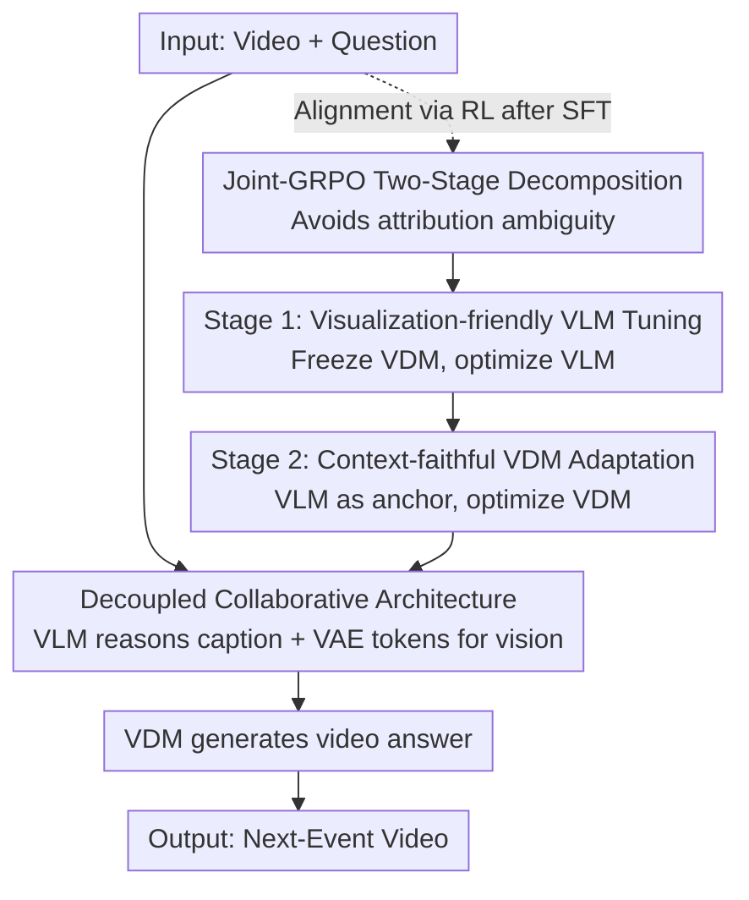

# Video-as-Answer: Predict and Generate Next Video Event with Joint-GRPO

**Conference**: CVPR 2026  
**Paper**: [CVF Open Access](https://openaccess.thecvf.com/content/CVPR2026/html/Cheng_Video-as-Answer_Predict_and_Generate_Next_Video_Event_with_Joint-GRPO_CVPR_2026_paper.html)  
**Code**: https://github.com/KlingTeam/VANS  
**Area**: Video Generation / Multimodal Reasoning / RL Alignment  
**Keywords**: Video Next-Event Prediction, Video Generation, GRPO, VLM-VDM Alignment, Multi-model Collaboration

## TL;DR
This work upgrades "Next-Event Prediction" from text to video: a VLM first reasons what should happen next, followed by a video diffusion model (VDM) to visualize it. It proposes **Joint-GRPO**, a two-stage reinforcement learning framework that synthesizes independent reasoning and generation models using a shared reward, achieving SOTA results in both text prediction and video generation on procedural and predictive benchmarks.

## Background & Motivation
**Background**: Next-Event Prediction (NEP) requires a model to observe a video snippet and a question (e.g., "What to do next?" or "What will happen next?") to infer the subsequent event. Existing works (VLEP, MVP, TEMPURA, etc.) exclusively provide answers in **textual** form—predicting a sentence description.

**Limitations of Prior Work**: Much information in the physical world is difficult to explain solely through text. Teaching someone to tie a Windsor knot or knead dough with text is neither intuitive nor adaptable to the user's specific state (e.g., tie color, tightness, progress). "Showing" is significantly more effective than "telling."

**Key Challenge**: Transitioning answers to video (named Video-Next-Event Prediction, VNEP) faces two major hurdles:
- **Cascaded Approach**: VLM reasons text $\rightarrow$ VDM generates video. VLM's text might be linguistically correct but visually unrealistic or difficult for the VDM to render, leading to semantic-to-visual misalignment.
- **Unified Model Approach**: A single model manages both understanding and generation, but often suffers from a performance trade-off where one capability weakens the other.

**Goal**: To solve the collaboration issue between VLM (expert in semantic reasoning) and VDM (expert in visual synthesis) without sacrificing their individual strengths, enabling them to serve VNEP as a cohesive unit.

**Key Insight**: Rather than sacrificing expertise for a unified model, it is better to **retain specialized agents and align them via RL post-training**. This teaches the VLM to "output descriptions the VDM can render" and the VDM to "faithfully render the VLM's description while maintaining visual consistency."

**Core Idea**: Propose **Joint-GRPO**—a two-stage collaborative optimization for VLM and VDM using a shared cross-model reward, bridging the semantic-visual gap in the cascaded pipeline during the RL phase.

## Method

### Overall Architecture
VANS consists of two specialized models: Input video is encoded by ViT for high-level visual features, and the problem is encoded by a tokenizer. These are fed into the **VLM**, which performs instruction-aligned reasoning (reason-then-answer template) to output a caption describing the "next event." This caption, along with low-level VAE tokens extracted from $n$ input frames, is fed as conditioning to the **VDM** to generate a new video that is semantically consistent with the caption and visually continuous with the input.

To address the isolation of VLM and VDM during Supervised Fine-Tuning (SFT), Joint-GRPO is used for alignment. The authors constructed **VANS-Data-100K** (30K procedural + 70K predictive triplets), selecting 1K high-quality samples for the RL phase.

### Key Designs

**1. Decoupled Architecture: VLM Reasoning + VDM Generation**

VANS retains specialized experts to avoid the trade-offs of unified models and the misalignment of simple cascades. VLM (Qwen2.5-VL-3B) focuses on "video+question $\rightarrow$ next event inference," while VDM (Wan-2.1-1.3B) focuses on rendering. The VDM consumes **dual conditions**: the caption (determining "what to draw") and low-level VAE tokens from the input video (determining "identity, background, and appearance"), ensuring fine-grained visual correspondence.

**2. Two-Stage Joint-GRPO: Resolving Attribution Ambiguity**

Standard GRPO optimizes one model at a time. Jointly training both in one stage leads to **attribution challenges**: if the generated video is poor, it is unclear whether the VLM's caption was flawed or the VDM's rendering failed. VANS decomposes collaboration into two sequential stages. Advantages are calculated by normalizing within a group of $G$ trajectories:

$$\tilde{A}_i = \frac{r_i - \bar{r}}{\sigma_r}, \quad \bar{r} = \frac{1}{G}\sum_{j=1}^{G} r_j$$

**3. Stage 1 — Visualization-friendly VLM Tuning**

VDM is frozen while VLM strategy $\pi_{\text{VLM}}$ is optimized. For an input video $v_{in}$ and question $Q$, $G$ captions $\{s_i\}$ are sampled. The frozen VDM generates videos $v^i_{out}$ for each, scored by a **joint reward**:

$$r_1(s_i, v^i_{out}) = \lambda_f\, r_f(s_i) + \lambda_{t1}\, r_{t1}(s_i, s_{gt}) + \lambda_{v1}\, r_{v1}(v^i_{out}, v_{gt})$$

This includes format reward $r_f$, text fidelity $r_{t1}$ (ROUGE-L), and video fidelity $r_{v1}$ (CLIP similarity). This forces the VLM to internalize the VDM's constraints—reasoning in a way that is both correct and executable by the VDM.

**4. Stage 2 — Context-faithful VDM Adaptation**

The tuned VLM serves as a **frozen anchor** to optimize VDM strategy $\pi_{\text{VDM}}$. Using an anchor caption $s_{anchor}$, $G$ videos are sampled from the VDM with the reward:

$$r_2(v^i_{out}, s_{anchor}) = \lambda_{v2}\, r_{v2}(v^i_{out}, v_{gt}) + \lambda_{c2}\, r_{c2}(v^i_{out}, s_{anchor})$$

$r_{v2}$ ensures visual continuity, while $r_{c2}$ (CLIPScore) ensures semantic alignment with the caption. This prevents "reward hacking" where the VDM might ignore the caption and merely reconstruct static frames from the input.

### Loss & Training
SFT provides the foundation for both models, followed by two-stage Joint-GRPO. VLM is initialized as Qwen2.5-VL-3B, and VDM as Wan-2.1-1.3B. RL utilizes 1K high-quality samples. Optimization follows the GRPO objective with group-relative advantage, clipping, and KL regularization.

## Key Experimental Results

### Main Results
Evaluation used 800 samples (400 procedural, 400 predictive) with zero overlap with the training set.

**Procedural Benchmark**:

| Model | ROUGE-L↑ | FVD↓ | CLIP-V↑ | CLIP-T↑ |
|------|---------|------|---------|---------|
| Omni-Video (Unified) | 0.1075 | 236.38 | 0.6293 | 0.2323 |
| Gemini-FilmWeaver (Cascade) | 0.2802 | 110.54 | 0.7102 | 0.2773 |
| VANS (SFT) | 0.2812 | 85.34 | 0.7655 | 0.3202 |
| **VANS (Joint-GRPO)** | **0.3631** | **78.32** | **0.8021** | **0.3824** |

**Predictive Benchmark**:

| Model | ROUGE-L↑ | FVD↓ | CLIP-V↑ | CLIP-T↑ |
|------|---------|------|---------|---------|
| Gemini-FilmWeaver (Cascade) | 0.2298 | 118.27 | 0.6874 | 0.2663 |
| VANS (SFT) | 0.2435 | 94.12 | 0.7512 | 0.3038 |
| **VANS (Joint-GRPO)** | **0.3058** | **86.85** | **0.7872** | **0.3759** |

Joint-GRPO significantly improves over SFT, raising ROUGE-L from 0.2812 to 0.3631 and CLIP-V from 0.7655 to 0.8021 on the procedural benchmark, validating that RL alignment effectively bridges the semantic-visual gap.

### Ablation Study

| Config | ROUGE-L↑ | FVD↓ | CLIP-V↑ | CLIP-T↑ | Note |
|------|---------|------|---------|---------|------|
| SFT | 0.2812 | 85.34 | 0.7655 | 0.3202 | Baseline |
| GRPO (VLM only) | 0.3190 | 83.88 | 0.7798 | 0.3224 | Standard GRPO on VLM |
| GRPO (VDM only) | 0.2812 | 84.76 | 0.7671 | 0.3013 | Minimal Gain |
| Joint-GRPO (all-in-one) | 0.3012 | — | — | — | Unstable optimization |
| **Joint-GRPO (Full)** | **0.3631** | **78.32** | **0.8021** | **0.3824** | Two-stage complete |

### Key Findings
- **Collaboration > Isolation**: Optimizing VLM or VDM individually is inferior to Joint-GRPO. The performance bottleneck lies primarily in whether the VLM's reasoning is "visualization-friendly."
- **Decomposition is Essential**: All-in-one joint training suffers from attribution ambiguity, while the two-stage approach ensures stable convergence.
- **Reward Efficacy**: Excluding $r_{t1}$ harms caption accuracy; excluding $r_{v1}$ harms visual consistency. In Stage 2, excluding $r_{c2}$ leads to reward hacking (static frames).

## Highlights & Insights
- **Reframing Answer Modality**: Transitioning from text to video (VNEP) provides high value for procedural and physical knowledge.
- **Joint-GRPO Paradigm**: The use of shared rewards and staged freezing offers a transferable framework for any "Reasoning + Generation" cascaded system (e.g., Text-to-Image agents).
- **Internalizing Constraints**: High-level models must internalize the capabilities and constraints of low-level execution models to produce effective plans.

## Limitations & Future Work
- **Reliance on CLIP Rewards**: Metrics like CLIPScore are insensitive to fine-grained physical correctness and temporal causal consistency.
- **Model Scale**: Experiments used small-scale models (3B/1.3B); scalability to larger models remains unverified.
- **RL Sample Size**: RL utilized only 1K samples. The quality depends heavily on the automated filtering process.

## Related Work & Insights
- **vs. Textual NEP**: Moves beyond text descriptions (telling) to dynamic video (showing).
- **vs. Video Extension**: Unlike Video-GPT which predicts pixels based on patterns, VANS performs event-level causal reasoning.
- **vs. Unified Models**: Avoids the performance trade-offs of unified architectures by aligning specialized experts.

## Rating
- Novelty: ⭐⭐⭐⭐⭐ (New VNEP task + Joint-GRPO paradigm)
- Experimental Thoroughness: ⭐⭐⭐⭐ (Solid ablations, though lacks large-scale external benchmarks)
- Writing Quality: ⭐⭐⭐⭐⭐ (Clear motivation and logical derivation)
- Value: ⭐⭐⭐⭐⭐ (Significant contributions in task definition, datasets, and RL methodology)

<!-- RELATED:START -->

## Related Papers

- [\[CVPR 2026\] TempoMaster: Efficient Long Video Generation via Next-Frame-Rate Prediction](tempomaster_efficient_long_video_generation_via_next-frame-rate_prediction.md)
- [\[CVPR 2026\] Chain of Event-Centric Causal Thought for Physically Plausible Video Generation](chain_of_event-centric_causal_thought_for_physically_plausible_video_generation.md)
- [\[CVPR 2026\] SwitchCraft: Training-Free Multi-Event Video Generation with Attention Controls](switchcraft_training-free_multi-event_video_generation_with_attention_controls.md)
- [\[CVPR 2026\] SymphoMotion: Joint Control of Camera Motion and Object Dynamics for Coherent Video Generation](symphomotion_joint_control_of_camera_motion_and_object_dynamics_for_coherent_vid.md)
- [\[CVPR 2026\] Phantom: Physics-Infused Video Generation via Joint Modeling of Visual and Latent Physical Dynamics](phantom_physics-infused_video_generation_via_joint_modeling_of_visual_and_latent.md)

<!-- RELATED:END -->
