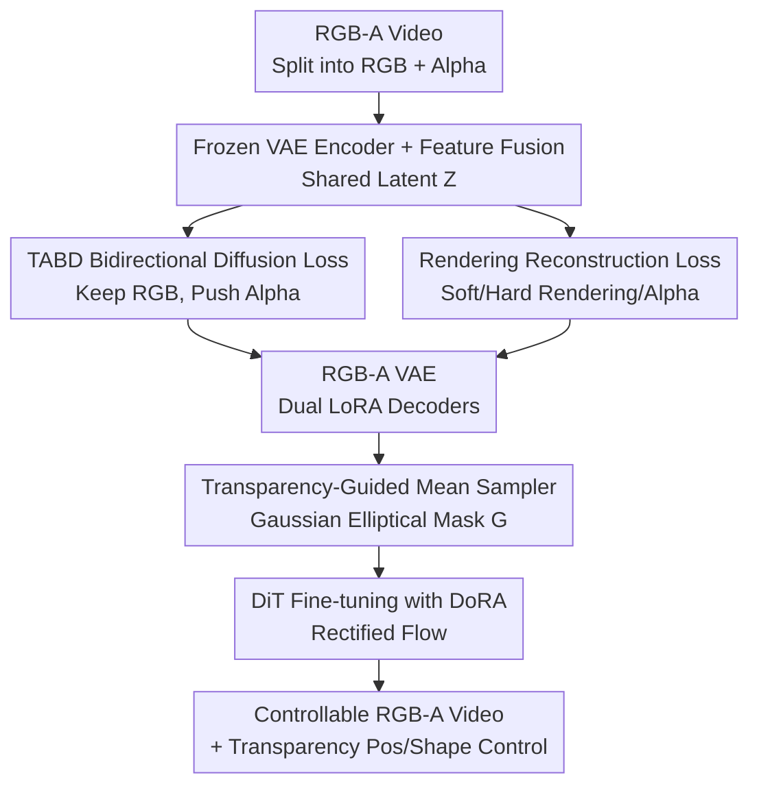

# Video Generation with Stable Transparency via Shiftable RGB-A Distribution Learner

**Conference**: CVPR 2026  
**Paper**: [CVF Open Access](https://openaccess.thecvf.com/content/CVPR2026/html/Dong_Video_Generation_with_Stable_Transparency_via_Shiftable_RGB-A_Distribution_Learner_CVPR_2026_paper.html)  
**Code**: https://donghaotian123.github.io/Wan-Alpha/ (Project page, promised open source)  
**Area**: Video Generation / Transparent Video / Diffusion Models  
**Keywords**: RGB-A Video Generation, Transparency, Distribution Shift, VAE, Rectified Flow

## TL;DR
Addressing the issues of poor quality and unstable transparency caused by the entanglement of RGB and alpha distributions in transparent video (RGB-A) generation, this paper proposes the "Shiftable RGB-A Distribution Learner." It uses a transparency-aware bidirectional diffusion loss in the latent space to push the alpha distribution away while preserving the RGB distribution and employs a Gaussian elliptical mask in the noise space to shift the noise mean for transparency guidance and controllability. Combined with a self-constructed high-quality dataset, it leads in visual quality, transparency rendering, and inference speed (15x faster than SOTA).

## Background & Motivation

**Background**: RGB-A video (which includes an alpha transparency channel in addition to RGB) is highly demanded in games, film/TV, and UI design, but research on automatic generation is scarce. Early approaches directly applied image-domain RGB-A solutions (such as LayerDiffuse's 2D RGB-A VAE) to video frameworks like AnimateDiff. The current SOTA is TransPixeler, which introduces alpha tokens, duplicates the backbone, and uses cross-RGB-A attention to exchange information between RGB and alpha.

**Limitations of Prior Work**: Directly porting image VAEs to video leads to poor temporal modeling and entanglement of RGB and alpha in the latent space, requiring massive data for adaptation and resulting in inaccurate transparency and restricted motion. TransPixeler's duplicated backbone doubles inference overhead (taking 32 minutes to generate 49 frames), and it is trained primarily on matting data dominated by opaque portraits, failing to generalize to semi-transparent objects like veils or smoke. Furthermore, relying solely on attention fails to truly learn the RGB–alpha relationship, causing unstable visual quality and transparency.

**Key Challenge**: The fundamental difficulty of RGB-A generation is **how to effectively learn and separate the two distributions of RGB and alpha**. Previous methods do not process these distributions, allowing them to mix in the latent space. Simply "explicitly increasing the distance" between RGB and alpha can destroy training stability—statistically separating them in the latent space does not mean the DiT can better distinguish them during generation and may even harm generative capability.

**Goal**: To achieve stable and controllable alpha generation without sacrificing RGB quality, while reusing the capabilities of pre-trained RGB video models as much as possible.

**Key Insight**: The diffusion process has two endpoints: the starting noise space and the ending latent space. The authors advocate for guiding a "shiftable distribution" in both spaces simultaneously throughout the generation process. The "shift" is achieved not by explicit distance maximization but through a smarter, more learnable implicit strategy.

**Core Idea**: Preserve the RGB distribution and only "push out" the alpha distribution. In the latent space, leverage the likelihood of a frozen DiT to implicitly shift the distribution. In the noise space, shift the noise mean using an alpha-based Gaussian elliptical mask to clearly separate opaque and transparent regions while providing users with control over transparency shape and position.

## Method

### Overall Architecture

The method follows **two-stage training**: first training a VAE capable of distinguishing RGB-A, then training a DiT for video generation on its latent space. In the first stage, RGB-A video is split into RGB and alpha videos and fed into a frozen VAE encoder. A feature fusion block merges the features into a shared latent $Z$, and two decoders with RGB LoRA and alpha LoRA reconstruct RGB and alpha respectively. Training utilizes the Transparency-Aware Bidirectional Diffusion loss (TABD) using a frozen DiT to implicitly shift the alpha distribution, combined with a set of rendering reconstruction losses. In the second stage, the DiT is fine-tuned on this VAE's latent space using DoRA, and a transparency-guided mean-shift sampler (Gaussian elliptical mask) is injected into the Rectified Flow noise sampling. These stages correspond to "shifting distribution in latent space" and "shifting distribution in noise space," respectively. The framework maintains the base model's inference architecture, as LoRA/DoRA can be fully merged, allowing the reuse of acceleration tools.

### Key Designs

**1. Transparency-Aware Bidirectional Diffusion Loss (TABD): Making Latents "Separable" for DiT, Not Just Statistically Distant**

Statistically separating RGB and alpha latents does not guarantee the DiT will distinguish them during generation and may degrade quality. This paper's solution is to **incorporate a frozen DiT into VAE training**: from the DiT's perspective, "preserving RGB distribution and pushing alpha distribution" is equivalent to "increasing RGB likelihood and decreasing alpha likelihood." An alpha-based mask is used to flip the sign of the diffusion loss. Specifically, define mask:

$$M(p) = \begin{cases} 1, & p \in O \\ -1, & p \in S \cup T \end{cases}$$

where $O, S, T$ are opaque, semi-transparent, and transparent regions. With the Rectified Flow objective $Z_t = t\epsilon + (1-t)Z$, $v_t = \epsilon - Z$, and $L_{RF} = \|\hat v_t - v_t\|^2$, the bidirectional loss is $L_{bidiff} = M \cdot L_{RF}$. Thus, the opaque region minimizes standard diffusion loss (increasing likelihood) while the transparent region does the opposite, forcing the VAE to learn RGB-A latents that are more separable for the DiT. Without TABD, "holes" appear in opaque areas because the VAE entangles RGB and alpha.

**2. Rendering Reconstruction Loss and VAE Architecture: Decoupling "Background Color" and "Transparency" via Multi-color Rendering**

To prevent the VAE from mistaking "RGB background color" for "transparency," the RGB video is first hard-rendered with a random color $\bar c$ (from a set of 8 colors) as $\bar V_{rgb} = R_h(V_{rgb}, V_\alpha, \bar c)$ before encoding. Soft and hard rendering are defined as $R_s(V_{rgb}, V_\alpha, c) = V_{rgb}\cdot V_\alpha + c\cdot(1 - V_\alpha)$ and $R_h(V_{rgb}, V_\alpha, c) = V_{rgb}\cdot\mathbb 1_{V_\alpha>0} + c\cdot(1 - \mathbb 1_{V_\alpha>0})$. Reconstruction involves a composite loss on three modalities (alpha $\hat V_\alpha$, soft-render $\hat V^s_{rgb}$, and hard-render $\hat V^h_{rgb}$), where each $L_{recon}(\hat V, V) = \|\hat V - V\| + L_\Phi + L_s$ includes pixel, VGG perceptual $\Phi(\cdot)$, and Sobel edge $S(\cdot)$ terms. The total VAE loss is $L_{vae} = L_\alpha + L^s_{rgb} + L^h_{rgb} + L_{bidiff}$. This differential supervision forces the model to distinguish background color from transparency.

**3. Transparency-Guided Mean Sampler: Shifting Noise Mean in Noise Space for Stability and Controllability**

While reusing RGB models improves quality, it retains unwanted backgrounds. TABD makes opaque latents easy for the DiT to learn but makes transparent ones harder, causing the DiT to generate fewer transparent regions. This is corrected by shifting the Rectified Flow noise mean based on alpha: $\tilde\epsilon \sim N(\mu(Z), I)$, $Z_t = t\tilde\epsilon + (1-t)Z$, and $\tilde v_t = Z_t - \tilde\epsilon$, with the objective $L_{RF} = \|\hat v_t - \tilde v_t\|^2$. The mean function $\mu(\cdot)$ is a **Gaussian elliptical mask fitted from the alpha frame**: alpha is binarized to get point set $P$, then mean $\mu$ and covariance $\Sigma$ are calculated. Eigendecomposition of $\Sigma$ provides axes $(a,b)$ and orientation $\theta$, constructing a geometrically aligned mask:

$$G(x, y) = \exp\!\left(-\frac{1}{2}\left[\left(\frac{x'}{a/2}\right)^2 + \left(\frac{y'}{b/2}\right)^2\right]\right)$$

Then $\tilde\epsilon \sim N(G\cdot\mu, I)$. This ellipse conveys rough shape and position, leaving fine details to the model. Users can customize $G$ to control transparency, and the model automatically adjusts object orientation to maintain composition.

**4. High-Quality RGB-A Video Dataset: Filling the Scarcity Gap**

The authors collected data from 10 image matting and 3 video matting datasets. For VAE training, images were converted to static videos with random sliding windows, resulting in 77,237 training videos. DiT training used a curated set of 429 samples focusing on semi-transparency and motion, captioned by Qwen2.5-VL-72B.

### Loss & Training
Total VAE loss: $L_{vae} = L_\alpha + L^s_{rgb} + L^h_{rgb} + L_{bidiff}$. DiT uses modified Rectified Flow: $L_{RF} = \|\hat v_t - \tilde v_t\|^2$. Base model: Wan2.1-T2V-14B. DoRA (rank 32) is used for DiT fine-tuning. VAE trained for 75k steps; DiT for 1,750 steps. Inference is accelerated using LightX2V (4-step sampling, no CFG).

## Key Experimental Results

### Main Results

Evaluated using VBench (Aesthetics, Motion, Temporal) and GPT-4o (Alignment, Naturalness). A user study was conducted for transparency accuracy and overall quality.

| Method | Text Align.↑ | Aesthetics↑ | Nat.↑ | Motion Sm.↑ | Temp. Flick.↑ |
|------|----------|----------|--------|----------|----------|
| LayerFlow (Single) | 2.67 | 0.535 | 2.35 | 0.9837 | 0.9788 |
| LayerDiffuse + AnimateDiff | 3.15 | 0.617 | 3.03 | 0.9893 | 0.9853 |
| TransPixeler (Open) | 3.16 | 0.570 | 2.97 | 0.9821 | 0.9872 |
| TransPixeler (Close) | 3.45 | 0.573 | 3.07 | 0.9907 | 0.9822 |
| **Ours** | **4.00** | **0.649** | **3.19** | **0.9949** | **0.9941** |

| Method | Transparency Rank↓ | Overall Rank↓ |
|------|------------|----------|
| LayerFlow (Single) | 4.29 | 3.57 |
| LayerDiffuse + AnimateDiff | 3.40 | 4.23 |
| TransPixeler (Open) | 2.51 | 2.71 |
| TransPixeler (Close) | 2.57 | 3.37 |
| **Ours** | **1.23** | **1.11** |

Ours achieves the highest scores across all objective metrics and leads significantly in user rankings. Qualitatively, it handles hair edges, semi-transparent smoke, and glass correctly where others fail.

### Ablation Study

| Configuration | PSNR(RGB/α)↑ | SSIM(RGB/α)↑ | LPIPS(RGB/α)↓ | Description |
|------|-------------|-------------|--------------|------|
| w/o Rendering w/o TABD | 40.12 / 39.98 | 0.97 / 0.97 | 0.043 / 0.025 | Naive RGB-A VAE |
| Rendering only | 40.88 / 41.22 | 0.97 / 0.98 | 0.040 / 0.023 | Add rendering & recon loss |
| Rendering + TABD (Full) | **41.47 / 42.22** | 0.97 / 0.98 | **0.037 / 0.022** | Full VAE design |

### Key Findings
- **TABD is crucial**: It prevents "holes" in opaque regions by ensuring the VAE learns separable RGB-A latents for the DiT.
- **Mean Sampler (MS) provides control**: Without MS, the DiT fails to generate clean transparent backgrounds.
- **Efficiency**: Ours is **15x faster** than TransPixeler (128s for 81 frames vs 32 mins for 49 frames).

## Highlights & Insights
- **Asymmetric Distribution Shift**: Prioritizing the preservation of the RGB distribution (which the DiT already knows) while shifting the difficult alpha distribution is more stable than symmetric separation.
- **Bridging Latent and Downstream Task**: Using a frozen DiT's likelihood to define "separability" in the VAE latent space aligns the VAE training objective directly with the generation task.
- **Geometric Control**: Fitting a Gaussian ellipse provides a lightweight yet effective interface for controlling transparency without Over-constraining detail.

## Limitations & Future Work
- **Lack of automated metrics**: Transparency evaluation relies on user studies as no objective metrics exist for alpha channels.
- **Single-ellipse constraint**: Control capabilities for multiple objects or complex non-elliptical shapes are limited.
- **Color coupling**: High mean-shift values ($\mu$) can introduce a minor red tint.

## Related Work & Insights
- **vs TransPixeler**: TransPixeler is slow (doubled backbone) and generalizes poorly to semi-transparency. Ours is 15x faster and produces higher quality using distribution shifts.
- **vs LayerDiffuse**: Ours solves the temporal instability and entanglement issues inherent in porting image VAEs to video.

## Rating
- Novelty: ⭐⭐⭐⭐⭐ 
- Experimental Thoroughness: ⭐⭐⭐⭐ 
- Writing Quality: ⭐⭐⭐⭐⭐ 
- Value: ⭐⭐⭐⭐⭐

<!-- RELATED:START -->

1. **LayerDiffuse**: Generating Layered Images from Diffusion Models, CVPR 2024.
2. **TransPixeler**: Video Matting and Generation with Transformer-based Architectures, 2024.
3. **Wan2.1**: Edge-of-the-art Open Video Generation Models, 2025.

<!-- RELATED:END -->

## Related Papers

- [\[CVPR 2026\] Reward Forcing: Efficient Streaming Video Generation with Rewarded Distribution Matching Distillation](reward_forcing_efficient_streaming_video_generation_with_rewarded_distribution_m.md)
- [\[CVPR 2026\] Reasoning Diffusion for Unpaired Test Time Out-of-distribution Text-Image to Video Generation](reasoning_diffusion_for_unpaired_test_time_out-of-distribution_text-image_to_vid.md)
- [\[CVPR 2025\] TransPixeler: Advancing Text-to-Video Generation with Transparency](../../CVPR2025/video_generation/transpixeler_advancing_text-to-video_generation_with_transparency.md)
- [\[NeurIPS 2025\] Stable Cinemetrics: Structured Taxonomy and Evaluation for Professional Video Generation](../../NeurIPS2025/video_generation/stable_cinemetrics_structured_taxonomy_and_evaluation_for_professional_video_gen.md)
- [\[ICML 2026\] Rays as Pixels: Learning A Joint Distribution of Videos and Camera Trajectories](../../ICML2026/video_generation/rays_as_pixels_learning_a_joint_distribution_of_videos_and_camera_trajectories.md)

<!-- RELATED:END -->
