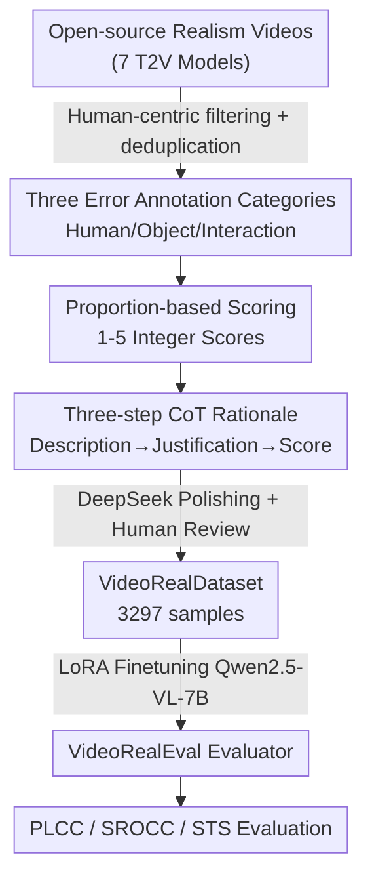

# VideoRealBench: A Chain-of-Thought Realism Evaluation Benchmark for Generated Human-Centric Videos

**Conference**: CVPR 2026  
**Paper**: [CVF Open Access](https://openaccess.thecvf.com/content/CVPR2026/html/Yang_VideoRealBench_A_Chain-of-Thought_Realism_Evaluation_Benchmark_for_Generated_Human-Centric_Videos_CVPR_2026_paper.html)  
**Code**: https://github.com/MCGNJU/VideoRealBench (Available)  
**Area**: Video Generation / Evaluation Benchmark  
**Keywords**: Video realism evaluation, human-centric videos, chain-of-thought evaluation, MLLM evaluator, human preference alignment

## TL;DR
Addressing the issue where existing evaluators fail to reliably score "realism" in generated videos, the authors manually re-annotated a dataset of 3,297 human-centric generated videos, VideoRealDataset (including three-step chain-of-thought rationales). This dataset was used to LoRA-finetune an evaluator, VideoRealEval, which significantly outperforms general large models like Gemini-2.5-pro and InternVL3.5-241B, as well as prior specialized evaluators, in correlation with human preferences (PLCC $57.07\%$ / SROCC $56.78\%$).

## Background & Motivation
**Background**: Text-to-video models such as Sora, Gen-3, and CogVideoX can already produce human-centric videos with high visual quality and semantic consistency. However, these models lack a deep understanding of "video realism" (whether the generated video adheres to physical laws, biomechanical constraints, and causal logic), often generating unrealistic content—especially regarding human movements, poses, and person-object interactions that violate common sense.

**Limitations of Prior Work**: Most existing video evaluators focus on "semantic alignment with text prompts," lacking systematic evaluation of realism. A few benchmarks addressing realism (e.g., VideoPhy-2, VMBench) suffer from three flaws: ① **Low annotation quality**: Videos are often low-quality generated results without careful filtering, and text comments are primarily generated by LLMs with only minimal human verification. ② **Vague definitions and scoring standards**: Error descriptions involve overlapping, non-independent dimensions, leading to unclear scoring boundaries and misalignment with human preference. ③ **Opaque scores without explanations**: While general MLLMs have the potential to understand videos, they are not specialized for realism evaluation and fail to provide accurate, comprehensive assessments.

**Key Challenge**: To align automated evaluator scores with human preferences, high-quality, clearly defined annotations with reasoning processes are required. Existing data either sacrifices quality through cheap LLM labeling or relies on annotators' subjective memory of complex multi-dimensional definitions, leading to significant subjective drift.

**Goal**: To construct a human-centric realism evaluation benchmark for generated videos with high annotation quality, clear scoring standards, and interpretable chain-of-thought (CoT) rationales, and to train an automated evaluator based on this.

**Key Insight**: The authors observe that instead of asking annotators to memorize complex definitions for "intuitive scores," it is more effective to have them **first describe the observed errors in natural language** and then **quantify these errors** based on their spatial and temporal proportions in the video into strictly defined 1–5 integer scores. This provides objective anchors for scoring and improves inter-annotator consistency.

**Core Idea**: The "realism evaluation" is decomposed into a three-step CoT: describing errors (Problem Description) $\rightarrow$ providing scoring justification based on standards (Standard Adherence) $\rightarrow$ assigning an integer score (Answer). An MLLM is LoRA-finetuned on human-curated CoT data so it "truly understands errors and maps them to clear standards" rather than just fitting a score distribution.

## Method

### Overall Architecture
VideoRealBench consists of three components: a re-annotated dataset **VideoRealDataset**, a set of **evaluation metrics**, and a finetuned evaluator **VideoRealEval**. The workflow starts by filtering human-centric videos from open-source realism datasets $\rightarrow$ annotators describe problems across three error categories (Human State / Object State / Interaction), quantify scores 1–5 by proportion, and write three-step CoT reasons $\rightarrow$ CoTs are polished by DeepSeek and human-verified $\rightarrow$ Qwen2.5-VL-7B is LoRA-finetuned on this data to produce VideoRealEval. During inference, the model sequentially outputs Problem Description, Standard Adherence, and Answer. Performance is measured by PLCC/SROCC for score correlation and Semantic Textual Similarity (STS) for rationale quality.

### Key Designs

**1. Three-category Error Framework: Grounding Vague "Realism" into Describable Errors**
To solve the issue of overlapping definitions, annotators are not required to memorize abstract dimensions. Instead, they describe errors in natural language and categorize them into three mutually exclusive types: **Human State** (naturalness of movement, structural integrity, physical laws, e.g., "head rotating $>180^\circ$"), **Object State** (reasonableness of object attributes, e.g., "deforming basketball"), and **Person-Object Interaction** (visual interpenetration, causal logic, e.g., "arm passing through a book"). Typical examples (Table 1) are provided to reduce subjective drift.

**2. Proportion-based 5-point Scale: Objective Anchors Over Intuition**
Addressing vague standards, the authors define 1–5 scores strictly based on the **spatial proportion of error content** and the **temporal proportion of erroneous frames** (Table 2): 1 (Bad) = intolerable errors in $>40\%$ area or $>80\%$ duration; 3 (Normal) = obvious errors in $>10\%$ area or $>20\%$ duration; 5 (Excellent) = no detectable issues. This provides a quantitative yardstick for subjective judgment.

**3. Three-step CoT Annotation and Multi-annotator Aggregation**
For interpretability, the process follows: `<Problem Description>` $\rightarrow$ `<Standard Adherence>` $\rightarrow$ `<Answer>`. Each video is independently labeled by **3 annotators**. The final score is determined by majority vote; if all three scores differ, the average is rounded, and the rationale from the annotator whose score was closest to the final average is selected. Rationales are further polished using **DeepSeek** and manually verified.

**4. VideoRealEval: Transforming General MLLMs via LoRA**
General MLLMs can detect "realism anomalies" but cannot map them to quantifiable scores aligned with human preference. **Qwen2.5-VL-7B** is used as the base and finetuned via **LoRA** (learning rate 1e-4, 10 epochs). During inference, the model strictly follows the three-segment output to ensure it "understands" the realism issues before scoring.

### Evaluation Metrics
- **SROCC (Spearman Rank Correlation)**: Measures the ability to rank samples correctly.
- **PLCC (Pearson Linear Correlation)**: Measures linear alignment with human intuition.
- **STS (Semantic Textual Similarity)**: Uses Sentence-BERT embeddings to measure the semantic distance of rationales, avoiding the limitations of literal word-matching metrics like BLEU.

## Key Experimental Results

### Main Results: Correlation with Human Preferences on VideoRealDataset

| Model | PLCC(%) | SROCC(%) | STS(%) |
|------|---------|----------|--------|
| Qwen2.5-VL-7B (Base) | 18.93 | 18.59 | 47.22 |
| InternVL3.5-241B-A28B | 21.32 | 22.99 | 49.68 |
| VideoScore-v1.1 | 23.47 | 22.64 | - |
| VideoCon-Physics | 33.72 | 33.25 | - |
| Gemini-2.5-pro | 33.79 | 33.93 | 47.81 |
| UnifiedReward-Think | 34.99 | 33.44 | 49.29 |
| VideoPhy-2-AutoEval | 38.31 | 38.56 | - |
| VideoPhy-2-AutoEval* (Retrained on Ours) | 50.89 | 50.69 | - |
| **VideoRealEval (Ours)** | **57.07** | **56.78** | **56.17** |

VideoRealEval leads significantly, outperforming Gemini-2.5-pro by approximately $23$ percentage points in PLCC. Note that retraining the competitor VideoPhy-2-AutoEval on our dataset (*) improved its PLCC from $38.31\%$ to $50.89\%$, proving the high quality of the proposed data.

### Ablation Study

| Ablation | Configuration | PLCC(%) | SROCC(%) |
|------|------|---------|----------|
| Scoring Format | Integer (1–5) | 57.07 | 56.78 |
| Scoring Format | Verbal (Bad…Excellent) | 56.89 | 56.56 |
| CoT | No Description / No Adherence | 53.89 | 54.07 |
| CoT | Problem Description only | 55.99 | 55.97 |
| CoT | Description + Adherence (Full) | 57.07 | 56.78 |

## Key Findings
- **Chain-of-Thought is Effective**: Results improve step-by-step from "no rationale" to "full CoT" ($53.89 \rightarrow 55.99 \rightarrow 57.07$), indicating that forcing the model to identify errors first leads to more objective scores.
- **Integer Scoring Slightly Better**: Numerical scores perform better than verbal descriptors, suggesting that pure numbers are more reliable for quantifying severity.
- **Bottleneck is Mapping, Not Recognition**: Most MLLMs see the problems but fail to map them to human-aligned scores; LoRA finetuning bridges this specific gap.

## Highlights & Insights
- **The "Describe-then-Quantify" Paradigm**: Decoupling "what to evaluate" (three categories) from "how to score" (proportional anchors) makes subjective evaluation reproducible.
- **Retraining as Proof of Quality**: The jump in performance for VideoPhy-2 when using our data demonstrates that annotation quality is more critical than model size (241B InternVL reached only 21 PLCC without it).
- **Validation of Interpretability**: Rationales are shown to be functional, not just decorative, and the use of STS provides a fair assessment of semantic alignment.

## Limitations & Future Work
- **Data Source Limitation**: Videos are derived from a single open-source realism dataset; generalization to errors from future T2V models remains to be verified.
- **Absolute Correlation Gap**: A PLCC of $\sim57\%$ shows that automated realism evaluation is still far from solved.
- **Focus on Human-Centricity**: Pure scenery or complex non-human physical simulations are not covered.
- **Compute and Model Scale**: The study is limited to 7B models; larger backbones were not explored.

## Related Work & Insights
- **Comparison with VideoPhy-2 / PhyGenBench**: Prior works lack CoT reasons and rely on LLM-generated descriptions which may hallucinate. This work introduces manual CoT and strict quantitative standards.
- **Comparison with General MLLMs**: General models fail to map recognized anomalies to scores; this work shows that task-specific alignment is more effective than scaling parameters.

## Rating
- **Novelty**: ⭐⭐⭐⭐ Combines description, quantification, and CoT into a reproducible paradigm.
- **Experimental Thoroughness**: ⭐⭐⭐⭐ Extensive comparisons and ablations, though cross-dataset generalization is limited.
- **Writing Quality**: ⭐⭐⭐⭐ Clear motivation and well-documented annotation processes.
- **Value**: ⭐⭐⭐⭐ Highly practical for the iteration of human-centric generative models.

<!-- RELATED:START -->

## Related Papers

- [\[CVPR 2026\] Chain of Event-Centric Causal Thought for Physically Plausible Video Generation](chain_of_event-centric_causal_thought_for_physically_plausible_video_generation.md)
- [\[CVPR 2026\] ActivityForensics: A Comprehensive Benchmark for Localizing Manipulated Activity in Videos](activityforensics_a_comprehensive_benchmark_for_localizing_manipulated_activity_.md)
- [\[CVPR 2026\] Ego-InBetween: Generating Object State Transitions in Ego-Centric Videos](ego-inbetween_generating_object_state_transitions_in_ego-centric_videos.md)
- [\[CVPR 2026\] SLVMEval: Synthetic Meta Evaluation Benchmark for Text-to-Long Video Generation](slvmeval_synthetic_meta_evaluation_benchmark_for_text-to-long_video_generation.md)
- [\[CVPR 2026\] VGA-Bench: A Unified Benchmark and Multi-Model Framework for Video Aesthetics and Generation Quality Evaluation](vga-bench_a_unified_benchmark_and_multi-model_framework_for_video_aesthetics_and.md)

<!-- RELATED:END -->
