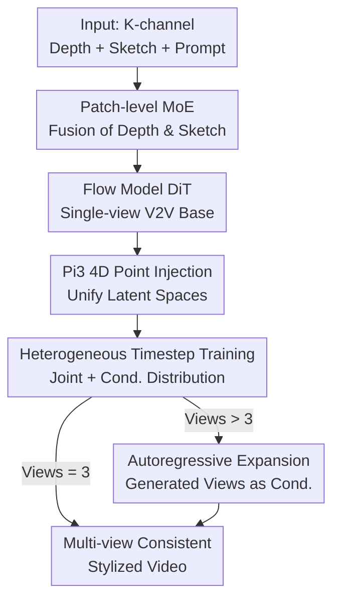

# VideoWeaver: Multimodal Multi-View Video-to-Video Transfer for Embodied Agents

**Conference**: CVPR 2026  
**Paper**: [CVF Open Access](https://openaccess.thecvf.com/content/CVPR2026/html/Eskandar_VideoWeaver_Multimodal_Multi-View_Video-to-Video_Transfer_for_Embodied_Agents_CVPR_2026_paper.html)  
**Area**: Video Generation / Embodied AI / Video-to-Video Transfer  
**Keywords**: Multi-view V2V, Flow Models, 4D Point Clouds, Heterogeneous Timesteps, Domain Randomization

## TL;DR
VideoWeaver extends single-view video-to-video (V2V) style transfer to multiple synchronized cameras. By injecting 4D point cloud coordinates predicted by Pi3 into the latent space of a flow model, it unifies the appearance across views. Coupled with "heterogeneous timestep" training, the model learns both joint and conditional distributions, enabling consistent batch re-rendering of multi-view embodied demonstration videos while preserving the robot's action trajectories.

## Background & Motivation
**Background**: Training embodied agents (robot policies) requires massive amounts of real demonstration data, which is expensive to collect. A more practical alternative to direct video generation is V2V transfer—given structural control signals like depth maps or sketches, "re-rendering" simulated or historical real demonstrations into new styles while maintaining underlying robot action trajectories, a process known in policy training as "domain randomization."

**Limitations of Prior Work**: Existing V2V methods (VACE, Cosmos-Transfer-1, ControlVideo, etc.) can only process a **single view** at a time. However, modern robot platforms (robot arms, humanoids) typically use **multiple synchronized cameras**—left wrist, right wrist, head, first-person in-hand, etc. Applying single-view models independently to each camera leads to inconsistent appearances (colors, textures) and fractured 3D structures, making the data useless for multi-view augmentation.

**Key Challenge**: To maintain cross-view consistency, a direct approach is adding cross-view attention. However, standard Transformer cross-view attention has **quadratic complexity relative to the number of views**, becoming computationally prohibitive beyond 3-4 cameras. Furthermore, robot cameras are often **heterogeneous and wide-baseline**—dynamic in-hand cameras vs. static head-mounted or third-person views often have minimal overlap, causing traditional epipolar or correspondence assumptions to fail. The authors found that merely adding view-attention layers and camera ray embeddings (plug-and-play modifications) is insufficient for maintaining style consistency across views (see Tab. 2).

**Key Insight & Core Idea**: The authors' key observation is that rather than struggling to maintain consistency in **2D image space**, it is better to **preserve the shared underlying 3D world**, from which spatio-temporal consistency naturally emerges. Specifically, a feed-forward spatial foundation model (Pi3) reconstructs all frames from all views into a unified 4D (space + view + time) coordinate system. These global 4D coordinates are then injected into the flow model's latent space, forcing all views to share the same geometric representation. Combined with "heterogeneous timestep training," the model can autoregressively extend new views based on already generated ones, breaking the limit of a fixed camera count.

## Method

### Overall Architecture
VideoWeaver is a **Rectified Flow-based DiT** trained progressively in three stages. First, a text-to-video foundation model is fine-tuned into a **single-view V2V model**: in the 3D VAE latent space, a patch-level MoE module adaptively fuses depth and sketch controls into the noisy latents to guide generation. It is then extended to **multi-view**: factorized 4D attention (intra-view joint attention + cross-view attention) is implemented in each DiT block, and 4D point cloud coordinates reconstructed by Pi3 are injected into the latent space to align latent features with a unified geometry. Finally, **heterogeneous timestep training** is used—allowing different views to exist at different diffusion timesteps—enabling the model to learn both the joint distribution of all views and the conditional distribution of "remaining views given generated ones." This allows autoregressive extension from 3 views to more during inference. The input is a (sketch, depth) sequence per camera + a text prompt; the output is a set of cross-view geometrically consistent RGB videos.

The generation is built on rectified flow: the sample state $x_\tau = (1-\tau)x_0 + \tau x_1$ linearly interpolates from Gaussian noise $x_0$ to the target video $x_1$ over timesteps $\tau \in [0,1]$. The model learns a velocity field $v_\theta$ to align with the displacement direction, with the loss $L(\theta)=\mathbb{E}_{x,y,\tau}\lVert v_\theta(x_\tau,y,\tau)-(x-x_0)\rVert^2$. The key designs are integrated into different parts of this framework.

### Key Designs

**1. Patch-level MoE for Depth and Sketch Fusion: Letting each spatio-temporal block choose its trusted control**

The single-view stage consumes both depth and sketch controls, but these signals are **complementary and asymmetric at the patch level**: depth provides reliable geometric structure but fails on small/thin objects; sketches provide stable outlines but are ambiguous when edges overlap or foreground/background appearances are similar. Previous methods (VideoComposer, Cosmos-Transfer-1) simply add or concatenate them, forcing the model to treat both equally. VideoWeaver uses a patch-wise MoE: two lightweight convolutional experts $E_s(\cdot), E_d(\cdot)$ process sketch and depth latent features, followed by frame-level multi-head cross-attention to exchange information. A gating network conditioned on the current latent state $x_\tau$, features $f_d, f_s$, and timestep $\tau$ predicts the patch-level mixing weight $\alpha_\tau$:

$$c_\tau = \alpha_\tau \cdot E_s(f_s) + (1-\alpha_\tau)\cdot E_d(f_d).$$

$c_\tau$ is added to the noisy latent $x_\tau$ before being fed into the DiT. This allows the model to dynamically decide which signal to trust at each location and timestep. Experiments show this is key for alignment in cluttered lab environments (high depth ambiguity), and because training occasionally drops a modality, the model **maintains performance even when one modality is removed** during inference.

**2. Pi3 4D Point Cloud Injection: Replacing 2D cross-view attention with shared geometry**

For multi-view extension, the authors initially followed CameraCtrl by adding camera ray embeddings and inserting cross-view attention layers after joint attention. However, this standard setup was found to be **insufficient**: wide baselines often lead to incorrect cross-view matching for small or partially visible objects. Ray embeddings only provide coarse geometric cues, leaving latent features weakly coupled, often resulting in the same object having different colors across views.

The solution is injecting a **strong 4D prior**. A feed-forward foundation model Pi3 (which, unlike VGGT, is permutation-invariant and reconstructs all observations in a single global coordinate system) is used to regress camera intrinsics, poses, and **per-pixel dense point clouds** $\hat P_{k,t}$: $F_{\text{Pi3}}(x_{k,t}) \rightarrow (\hat K_k, \hat T_{k,t}, \hat p_{k,t})$. Since the point clouds align per-pixel with video frames, the authors divide each frame into $8\times 8$ patches matching the VAE downsampling factor. Each patch retains only the **point closest to the camera** (depth-aware pooling to preserve foreground and contact zones). Points are sampled every 8 frames to align with latent strides, producing a low-resolution 4D grid that is **additively injected** into the noisy latents after a lightweight MLP. This provides a shared "coordinate map" for all views, allowing geometric consistency to emerge from the 3D world rather than 2D guesswork—improving Met3R on Droid by ~10%.

**3. Heterogeneous Timestep Training: One set of weights for joint and conditional distributions**

By default, models generate 3 views and estimate only the joint distribution $p_\theta(x_1,x_2,x_3\mid y,c_1,c_2,c_3)$, missing the **conditional distribution** $p_\theta(x_3\mid y,c_3,x_1,x_2)$ required for adding views to existing ones. The authors re-interpret multi-view training as a multi-task problem in noise-timestep space. While standard training follows the path $\tau:(0,0,0)\to(1,1,1)$ (synchronous denoising), they **occasionally freeze one or more views at timestep 1** (clean, acting as conditions) while denoising the rest, introducing paths like $\tau:(1,0,0)\to(1,1,1)$. Specifically: (1) Randomly select view indices as "given" and set their $\tau=1$; (2) Sample a common timestep for remaining views and add noise; (3) **Mask the loss** for views at $\tau=1$, preventing gradients from flowing from noisy to clean features. During inference for $K>3$, the model first generates 3 standard views, then autoregressively completes more views using subsets of generated views as conditions.

**4. Wavelet Consistency Loss + Uniform Timestep Sampling: Strengthening early-stage global structure**

Flow models often oversample middle timesteps, leaving **early timesteps (critical for scene layout) under-exposed**, causing unstable multi-view generation. The authors apply two remedies: first, they use **uniform timestep sampling**, which stabilizes multi-view generation as early-stage denoising is easier with spatial controls; second, they add a **wavelet consistency loss**. This applies a 3D wavelet transform to both the predicted latent $\hat x_1 = x_0 + v_\theta(x_\tau,y,c_\tau,\tau)$ and the ground truth video, minimizing the distance between coefficients to reinforce high-frequency/geometric alignment in early timesteps.

### Loss & Training
The base is an 11B parameter text-to-video model (MMDiT). Training progresses through three stages: (i) single-view V2V fine-tuning; (ii) multi-view joint fine-tuning; (iii) heterogeneous multi-view training. It uses full-parameter fine-tuning with AdamW, learning rate 1e-4, on 8 Ascend 910B (64GB) GPUs for approximately one week. Inference uses a linear flow scheduler with a discrete Euler solver (30 steps); generating 3 synchronized 81-frame (480×640) videos takes ~10 minutes.

## Key Experimental Results

Datasets include Droid (140K, 3 views, moving in-hand), Agibot (75K, 3 views, 2 moving), Bridgev2 (22K, single-view only), and 5K internal data. Evaluation metrics: Alignment (Edge-F1↑, Depth-siRMSE↓), Quality (VBench↑, Dover↑), Realism (JEDi↓). Multi-view consistency is quantified using Met3R↑.

### Main Results (Tab. 1, Comparison with Single-view SOTA V2V)

| Dataset | Metric | Cosmos-Transfer1 | VACE | Ours (Single-view) | Ours (Multi-view) |
|---------|--------|------------------|------|--------------------|-------------------|
| Droid | Edge-F1↑ / Depth↓ | 0.277 / 0.460 | 0.121 / 0.511 | 0.359 / 0.362 | **0.376 / 0.347** |
| Droid | JEDi↓ | 0.640 | 1.29 | 0.384 | 0.509 |
| Agibot | Edge-F1↑ / Depth↓ | 0.323 / 0.364 | 0.122 / 0.389 | 0.373 / 0.468 | **0.378 / 0.394** |
| Bridge | Edge-F1↑ / Depth↓ | 0.345 / 0.223 | 0.135 / 0.258 | **0.393 / 0.158** | N/A |
| Bridge | JEDi↓ | 2.51 | 4.39 | **1.67** | N/A |

VideoWeaver leads in **alignment and realism** (Edge-F1, Depth, JEDi), even against VACE (14B) and Cosmos-Transfer-1 (trained on larger Physical-AI data). Notably, on Droid/Agibot, the **multi-view variant outperforms the single-view one**, indicating that cross-view consistency learning provides positive gains. A drawback is slightly lower Dover/VBench aesthetic scores, attributed to blurriness from VAE $8\times$ temporal downsampling.

### Ablation Study (Tab. 2, Met3R↑)

| Configuration | Agibot Met3R↑ | Droid Met3R↑ |
|---------------|---------------|--------------|
| Multi-view Baseline (Ray Emb. + View Attn) | 0.597 | 0.481 |
| + 4D Point Injection | 0.612 | 0.533 |
| Cond. Multi-view + 4D Point (1 view as cond.) | **0.624** | **0.578** |

### Key Findings
- **Geometric Prior > 2D Attention**: Replacing 2D attention with 4D point cloud unified latent space improved Met3R by ~10% on Droid. Qualitatively, objects no longer change color across views.
- **Heterogeneous Training Enables Conditional Consistency**: Using one view as a condition to generate others further improved Met3R (Droid 0.533→0.578), proving the model learned the conditional distribution for view expansion.
- **MoE enables Modality Dropping**: During inference, dropping depth barely affects performance (Depth-F1 0.393→0.393), while dropping sketches causes significant degradation—validating that while sketches dominate robot data, the model is flexible.

## Highlights & Insights
- **The "Preserve 3D World" perspective is highly transferable**: The key insight is that cross-view consistency should emerge from shared geometry rather than being forced in pixel space. Injecting a feed-forward 4D reconstruction model (Pi3) as a universal conditioning backbone can be transferred to any task benefiting from multi-view reasoning.
- **Using timesteps as "Conditioning Switches" is elegant**: Encoding "view is already generated" as "timestep=1" allows joint and conditional distributions to share weights and architecture without extra conditional branches.
- **Patch-level MoE + Random Drop training** enables plug-and-play modalities during inference, which is highly practical for real-world deployment.

## Limitations & Future Work
- **Inconsistency for small objects**: Point clouds must be downsampled to latent resolution, limiting the consistency precision for tiny objects.
- **Fixed frame count, no long rollout**: While it can autoregressively expand views, it lacks a native **temporal** autoregressive mechanism for generating arbitrarily long sequences.
- **Dependency on Pi3**: Consistency depends on Pi3's reconstruction quality under wide baselines and motion blur; if Pi3 fails, consistency degrades.

## Related Work & Insights
- **vs. Single-view V2V**: Standard models like VACE or Cosmos-Transfer-1 applied independently to views break consistency. VideoWeaver is the first **multi-view** V2V and outperforms these larger models on single-view alignment.
- **vs. Multi-view Generation (CameraCtrl)**: These focus on synthesizing unseen views from observations. VideoWeaver instead **jointly transfers a set of existing views**, using Pi3 coordinates directly instead of 3D-to-2D projection.
- **vs. 4D Editing (4DGS)**: 4DGS requires dense scenes (>15 cameras) and lengthy per-scene optimization. VideoWeaver is a streaming V2V model generating 81 frames in minutes.

## Rating
- Novelty: ⭐⭐⭐⭐⭐ (First multimodal multi-view V2V with original 4D latent unification.)
- Experimental Thoroughness: ⭐⭐⭐⭐ (Solid evaluation across three embodied benchmarks, though sensitive to Pi3 quality.)
- Writing Quality: ⭐⭐⭐⭐ (Clear motivation and intuitive explanation of timestep paths.)
- Value: ⭐⭐⭐⭐⭐ (Directly addresses multi-view data augmentation needs for embodied policy training.)

<!-- RELATED:START -->

## Related Papers

- [\[CVPR 2026\] Let Your Image Move with Your Motion! – Implicit Multi-Object Multi-Motion Transfer](let_your_image_move_with_your_motion_--_implicit_multi-object_multi-motion_trans.md)
- [\[CVPR 2026\] MoVieDrive: Urban Scene Synthesis with Multi-Modal Multi-View Video Diffusion Transformer](moviedrive_urban_scene_synthesis_with_multi-modal_multi-view_video_diffusion_tra.md)
- [\[CVPR 2026\] M4V: Multimodal Mamba for Efficient Text-to-Video Generation](m4v_multimodal_mamba_for_efficient_text-to-video_generation.md)
- [\[CVPR 2026\] Thinking with Video: Video Generation as a Promising Multimodal Reasoning Paradigm](thinking_with_video_video_generation_as_a_promising_multimodal_reasoning_paradig.md)
- [\[CVPR 2026\] ConsID-Gen: View-Consistent and Identity-Preserving Image-to-Video Generation](consid-gen_view-consistent_and_identity-preserving_image-to-video_generation.md)

<!-- RELATED:END -->
