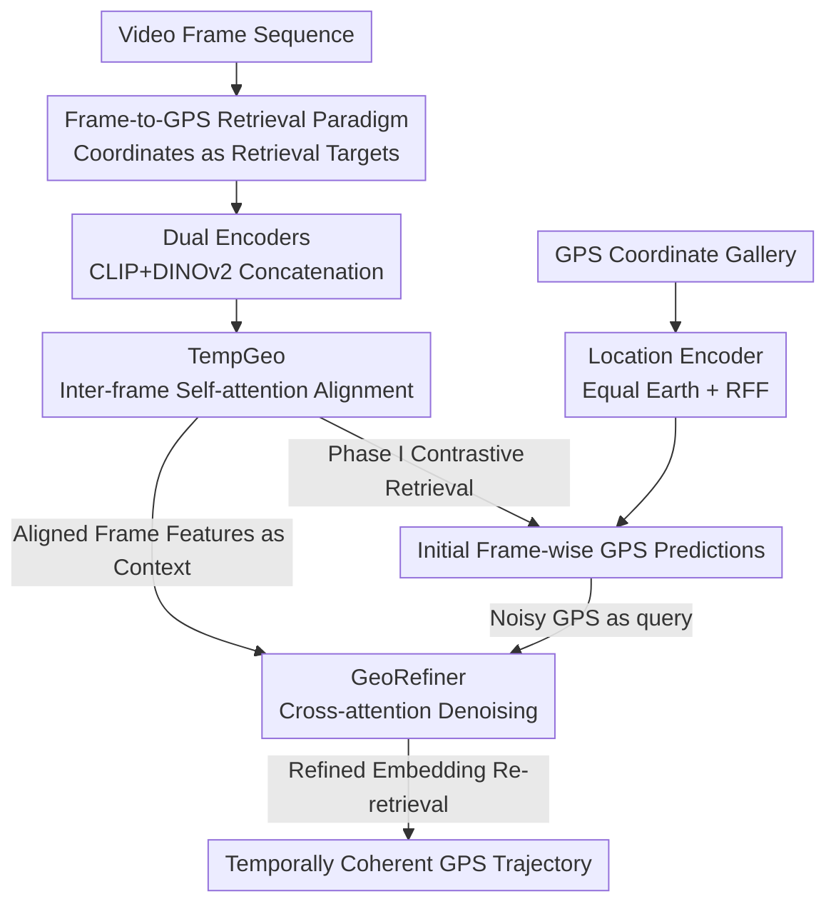

# VidTAG: Temporally Aligned Video to GPS Geolocalization with Denoising Sequence Prediction at a Global Scale

**Conference**: CVPR 2026  
**Paper**: [CVF Open Access](https://openaccess.thecvf.com/content/CVPR2026/html/Kulkarni_VidTAG_Temporally_Aligned_Video_to_GPS_Geolocalization_with_Denoising_Sequence_CVPR_2026_paper.html)  
**Keywords**: Video Geolocalization, Frame-to-GPS Retrieval, Temporal Consistency, Trajectory Denoising, Cross-modal Contrastive Learning

## TL;DR
VidTAG reformulates "video geolocalization" as a **frame-to-GPS coordinate retrieval** problem. By utilizing dual encoders (CLIP+DINOv2) for frame features, TempGeo for inter-frame temporal alignment, and GeoRefiner for trajectory denoising, it generates temporally coherent GPS trajectories on a global scale, achieving an approximate 20% improvement over GeoCLIP at the 1km threshold.

## Background & Motivation
**Background**: Determining the geographic location of an image or video is valuable for forensics, social media tagging, and exploration. Existing image geolocalization follows two paths: **Retrieval-based** (fine-grained), which matches a query against a georeferenced database—highly accurate but requires massive reference sets, high compute, and is sensitive to domain shifts; and **Classification-based** (worldwide), which partitions the Earth into regions and predicts region labels—efficient for global results but lacks precision, as increasing granularity leads to category explosion and confusion. GeoCLIP serves as a compromise: it embeds images and GPS coordinates into a shared space, treating coordinates themselves as retrieval targets, as a GPS coordinate database is far cheaper to build than an image gallery.

**Limitations of Prior Work**: Video geolocalization remains largely unexplored. Directly applying image-based methods frame-by-frame results in **jittering trajectories**, where predictions for adjacent frames jump erratically, potentially even across continents. CityGuessr, the only predecessor for worldwide video localization, only predicts a single city for an entire video, ignoring frame-level consistency and failing to provide precise, coherent trajectories.

**Key Challenge**: Independent frame-wise prediction fails to leverage the temporal structure of video and exposes outlier predictions from "difficult or ambiguous frames" as trajectory jumps. Conversely, whole-video aggregation loses frame-level granularity. A solution is needed that **preserves frame-level granularity while enforcing temporal coherence**.

**Goal**: To predict GPS coordinates for every frame in a video on a global scale while ensuring the resulting sequence forms a coherent trajectory.

**Core Idea**: Following the "retrievable coordinates" logic of GeoCLIP, video localization is formulated as **frame-to-GPS retrieval**. Two specialized modules are introduced: TempGeo performs temporal alignment on frame features before retrieval, and GeoRefiner treats the retrieved GPS sequence as a noisy signal for denoising, suppressing "per-frame jitter" into a "coherent trajectory."

## Method

### Overall Architecture
Given a video, the goal is to predict GPS coordinates per frame to derive a trajectory. VidTAG treats this as frame-to-GPS retrieval: each frame passes through CLIP and DINOv2 to produce concatenated features, which are then aligned temporally via TempGeo. On the GPS side, a Location Encoder (adopted from GeoCLIP) produces GPS embeddings. The aligned frame features and GPS embeddings are trained via contrastive learning in Phase I for initial predictions. Subsequently, GeoRefiner (an encoder-decoder Transformer) uses aligned frame features as context and noisy GPS embeddings as queries to perform cross-attention denoising, outputting refined GPS embeddings. Finally, these refined embeddings are used for a GPS-to-GPS retrieval within the coordinate gallery to obtain final coordinates.

Training is divided into two stages: **Phase I** contrastively trains the dual encoders + TempGeo with the Location Encoder; **Phase II** freezes the former and trains the GeoRefiner as a denoiser (using synthetic noise applied to ground truth coordinates to simulate Phase I failure modes).

### Key Designs

**1. Frame-to-GPS Retrieval Paradigm: Avoiding the Image Gallery vs. Classification Dilemma**

Retrieval-based localization requires massive image galleries, which is impractical globally; classification is limited to city-level precision. VidTAG breaks this dilemma by following GeoCLIP’s insight: once images and GPS coordinates are aligned in a shared space, the retrieval targets can be **coordinates themselves** rather than images. Constructing a GPS gallery of a uniform grid is extremely low-cost, turning per-frame prediction into a nearest-neighbor search. To ensure fairness and prevent leakage, the gallery is a uniform grid constructed solely from training set coordinates, with the model performing **blind retrieval** on the validation set. This foundation allows temporal alignment and denoising to operate directly in the embedding space.

**2. Dual Encoders: CLIP for Semantics, DINOv2 for Appearance**

A single visual encoder often lacks either semantics or robust appearance. CLIP, pre-trained on large-scale text-image pairs, provides language-aligned semantics useful for identifying landmarks and signs. DINOv2 captures global appearance and is less sensitive to domain shifts. VidTAG extracts class token descriptors $f_{clip}$ and $f_{dino}$ from both ViTs for each frame, concatenating them into a fused representation $z_t=[f_{clip}\,\Vert\,f_{dino}]\in\mathbb{R}^{d_{clip}+d_{dino}}$, followed by unit normalization. Ablations replacing DINOv2 with SigLIP showed a significant performance drop (1km accuracy fell from 40.1% to 27.8%), proving that the **complementarity** between CLIP and DINOv2 is more critical than simply using stronger CLIP-like encoders.

**3. TempGeo: Global Self-Attention to Anchor Outlier Frames**

Independent frame predictions drift and produce outliers that disrupt the trajectory. TempGeo is a lightweight Transformer encoder that adds temporal position encoding $\hat z_t=z_t+p_t$ to unit-normalized frame embeddings. Multi-head self-attention allows **every frame to attend to all other frames** in the sequence. This permits ambiguous frames to leverage context from distant frames (e.g., recurring landmarks or lighting changes), pulling isolated outliers toward a consensus in the feature space. Crucially, alignment occurs **before retrieval**: Phase I directly uses the aligned $z^{\omega}_t$ for the similarity matrix in the contrastive loss, ensuring cross-frame context shapes the learning signal rather than being an afterthought.

**4. GeoRefiner: GPS Denoising via Visual Context Cross-Attention**

Even with aligned frame features, the mapping between visual and GPS embeddings can be noisy. GeoRefiner adopts an encoder-decoder Transformer structure: the decoder takes GPS embeddings as queries while the encoder processes aligned TempGeo features as context. **Cross-attention** in the decoder aligns the GPS sequence to visual tokens without a causal mask, allowing each GPS token to attend to the entire sequence. The denoiser is trained by **injecting synthetic noise** into ground truth coordinates rather than using raw Phase I predictions. This simulates three observed failure modes—shift, collapse, and jitter. The decoder learns to "undo" this noise using visual context from the encoder. During inference, Phase I predictions are used as queries to obtain refined embeddings $g^{\rightarrow}_t$, followed by a GPS-to-GPS retrieval. This shallow architecture adds minimal latency while significantly improving trajectory quality.

### Loss & Training
**Phase I (Contrastive)**: TempGeo output frame embeddings $V$ and corresponding GPS embeddings $G$ are stacked. The similarity matrix $VG^{\top}$ is trained against the identity matrix using cross-entropy:

$$\mathcal{L}_{contr}(V,G)=\mathrm{CE}(VG^{\top},I)$$

**Phase II (Alignment & Denoising)**: Uses a weighted Hinge loss. Let $G^{\rightarrow}$ be refined embeddings and $G$ be ground truth embeddings. MSE is used to construct loss matrices at the frame level $M_f=\mathrm{MSE}(G^{\rightarrow}G^{\top},I)$ and video level $M_v=\mathrm{MSE}(G^{\rightarrow}_{seq}G^{\top}_{seq},I)$. Summation is performed with weights $\omega$ for off-diagonal (negative pairs) and $\varepsilon$ for diagonal (positive pairs):

$$\mathcal{L}_f=\omega\big(\mathrm{trU}(M_f)+\mathrm{trL}(M_f)\big)+\varepsilon\cdot\mathrm{dia}(M_f)$$

The total loss $\mathcal{L}_{wtHinge}=\mathcal{L}_f+\mathcal{L}_v$ encourages alignment at both frame and video granularities.

## Key Experimental Results

### Main Results
Evaluations were conducted on Mapillary (MSLS), GAMa, and CityGuessr68k. Metrics include accuracy at 0.5/1/5/25km thresholds, Median Error, and trajectory quality metrics: Discrete Fréchet Distance (DFD) and Mean Range Difference (MRD) (lower is better for distances/errors).

| Dataset | Metric | Ours (VidTAG) | Prev. SOTA | Gain |
|--------|------|------|----------|------|
| MSLS | Frame 1km Acc | 41.0% | GeoCLIP-FT 22.5% | +18.5pt (~20%↑) |
| MSLS | Median Error (km) | 1.35 | GeoCLIP-FT 2.97 | Error Halved |
| MSLS | DFD / MRD | 3.87 / 1.07 | DINOv2-cls 4.28 / 1.60 | Smoother Traces |
| GAMa | Frame 1km Acc | 53.1% | GeoCLIP-FT 28.3% | ~25%↑ |
| GAMa | DFD / MRD | 0.39 / 0.17 | GeoCLIP-FT 6.50 / 0.50 | Massive Lead |
| CityGuessr68k | City Acc | 94.9% | CityGuessr 69.6% | ~25pt↑ |

VidTAG outperformed MLLMs (Qwen2.5-VL), CLIP-based models (GeoCLIP), and video classification models (VideoMAE) across all scales on CityGuessr68k. Its advantage is most prominent in fine-grained intervals (0.5/1km).

### Ablation Study

| Configuration (Backbone / TempGeo / GeoRefiner) | MSLS Frame 1km | DFD | Description |
|------|---------|------|------|
| CLIP only (=GeoCLIP-FT Baseline) | 22.5 | 22.52 | Starting point |
| DINOv2 only | 26.4 | 9.15 | DINOv2 improves smoothness |
| DINOv2 + TempGeo | 30.2 | 3.01 | TempGeo reduces DFD/MRD |
| CLIP+DINOv2 + TempGeo | 40.1 | 7.63 | CLIP adds semantics; Acc +10pt |
| Full (+GeoRefiner) | 41.0 | 3.87 | GeoRefiner restores smoothness |

| Dual Encoder Selection | 1km | Med. Err (km) | Description |
|------|------|------|------|
| CLIP + SigLIP | 27.8 | 2.15 | Two CLIP-like; poor complementarity |
| CLIP + DINOv2 | 40.1 | 1.38 | SSL + Semantics; significantly better |

### Key Findings
- **Division of Labor**: CLIP+DINOv2 complementarity primarily boosts **precision** (+10pt at 1km) at a slight cost to smoothness. TempGeo and GeoRefiner focus on **temporal consistency**, reducing DFD from 7.63 to 3.87.
- **Complementarity > Backbone Strength**: Replacing DINOv2 with the superior SigLIP dropped 1km accuracy to 27.8%, proving gains stem from "Self-Superised vs. Semantic" heterogeneity rather than parameter scaling.
- **Minimal Throughput Drop**: Compared to GeoCLIP, VidTAG achieves massive accuracy gains with only a slight decrease in FPS, indicating TempGeo/GeoRefiner are lightweight.
- **Diminishing Returns on Grid Resolution**: On MSLS, a 0.1km grid is superior to 0.5km/1km, but gains diminish as gallery size grows quadratically.

## Highlights & Insights
- **Formulating "video localization" as "frame-to-GPS retrieval" is the decisive move**: It bypasses retrieval bottlenecks, avoids classification granularity limits, and unifies temporal processing in the embedding space.
- **Using "synthetic noise" for GeoRefiner is ingenious**: By explicitly parameterizing "trajectory pathologies" (shift/collapse/jitter), the model receives cleaner supervision than using noisy Phase I predictions directly. This is transferable to any sequence error-correction task.
- **Early Alignment**: Placing TempGeo before the contrastive loss allows cross-frame context to shape the learning signal rather than being used only for post-processing.

## Limitations & Future Work
- **Dependency on Grid Resolution**: Precision is capped by grid resolution; 0.1km is a compromise, and finer grids cause coordinate explosion.
- **Coverage Dependency**: The grid is built from training data. For remote areas not covered in the training set, blind retrieval likely fails to find valid neighbors.
- **Distribution Gap**: GeoRefiner's efficacy relies on the assumption that failures follow the three modeled noise types. Discrepancies between synthetic and real Phase I noise may limit performance.
- Implementation details such as RFF $\sigma$ and weighted loss parameters are primarily housed in the supplementary material.

## Related Work & Insights
- **vs. GeoCLIP**: VidTAG adopts the "retrievable coordinate" foundation but adds TempGeo and GeoRefiner to resolve frame-wise jitter, improving 1km accuracy by ~20%.
- **vs. CityGuessr**: Whereas CityGuessr predicts only at the city level, VidTAG achieves frame-level GPS accuracy and superior city-level performance (+25pt).
- **vs. Classification (PlaNet/ISNs)**: Retrieval avoids the fixed category limitations of classification, particularly in the sub-5km range.
- **vs. MLLMs (Qwen2.5-VL)**: MLLMs struggle with video temporal dynamics and lag behind VidTAG in geolocalization benchmarks.

## Rating
- Novelty: ⭐⭐⭐⭐⭐ First to formulate global video localization as frame-to-GPS retrieval with systematic temporal consistency.
- Experimental Thoroughness: ⭐⭐⭐⭐ Comprehensive testing across three datasets and multiple metrics, though many hyperparameters are relegated to the supplement.
- Writing Quality: ⭐⭐⭐⭐ Clear motivation and well-defined modules.
- Value: ⭐⭐⭐⭐ Highly practical for forensics and social media; "early alignment + synthetic denoising" are transferable concepts.

<!-- RELATED:START -->

## Related Papers

- [\[CVPR 2026\] Causality in Video Diffusers is Separable from Denoising](causality_in_video_diffusers_is_separable_from_denoising.md)
- [\[CVPR 2026\] EditCtrl: Disentangled Local and Global Control for Real-Time Generative Video Editing](editctrl_disentangled_local_and_global_control_for_real-time_generative_video_ed.md)
- [\[CVPR 2026\] Flowception: Temporally Expansive Flow Matching for Video Generation](flowception_temporally_expansive_flow_matching_for_video_generation.md)
- [\[CVPR 2026\] Captain Safari: A World Engine with Pose-Aligned 3D Memory](captain_safari_a_world_engine_with_pose-aligned_3d_memory.md)
- [\[CVPR 2026\] FlashPortrait: 6× Faster Infinite Portrait Animation with Adaptive Latent Prediction](flashportrait_6x_faster_infinite_portrait_animation_with_adaptive_latent_predict.md)

<!-- RELATED:END -->
