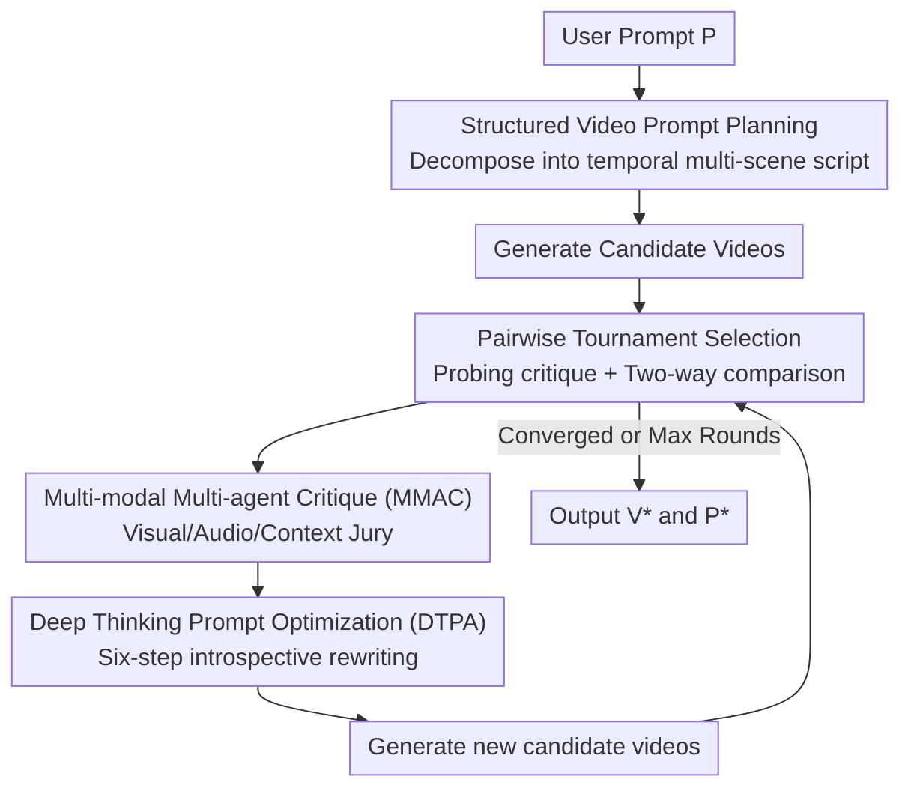

# VISTA: A Test-Time Self-Improving Video Generation Agent

**Conference**: CVPR 2026  
**Paper**: [CVF Open Access](https://openaccess.thecvf.com/content/CVPR2026/html/Long_VISTA_A_Test-Time_Self-Improving_Video_Generation_Agent_CVPR_2026_paper.html)  
**Area**: Video Generation / Agent  
**Keywords**: Text-to-Video, Test-time optimization, Multi-agent, Prompt optimization, Self-improvement

## TL;DR
VISTA is a multi-agent system that iteratively improves text-to-video quality at test time through a "refine-critique" loop without updating model weights. It decomposes user intent into structured temporal scripts, selects the best video via a pairwise tournament, identifies deficiencies using a "jury" of visual/audio/context agents, and rewrites prompts using a reasoning agent. It achieves up to 60% pairwise win rate against SOTA models like Veo 3, with a 66.4% human preference.

## Background & Motivation

**Background**: Current text-to-video (T2V) models such as Veo 3 and Sora 2 can generate high-quality, coherent videos with audio. However, they are extremely sensitive to prompt phrasing—the same idea can yield significantly different output quality depending on its description. Users are thus forced into a manual trial-and-error cycle of "rephrase → generate → filter → rephrase."

**Limitations of Prior Work**: While test-time optimization (TTO) has successfully enhanced generation quality and preference alignment in text and image domains, it largely fails in the video domain. Video is not a single-modality or single-dimensional object; it spans multiple scenes and modalities (visual + audio) while carrying high-level semantics and common sense, which drastically increases the complexity of evaluation and optimization. Existing works focus on narrow aspects: some handle object consistency, others optimize purely for helpfulness/harmlessness, or follow visual rewards only. No existing framework jointly optimizes the three dimensions critical to user satisfaction: visual, audio, and context.

**Key Challenge**: Self-improving video generation at test time requires solving two entangled problems. First is "how to evaluate": without ground truth, simple MLLM scoring is subjective and unreliable. When facing strong models like Veo 3, judges often provide shallow praise rather than identifying deep flaws. Second is "how to modify": directly asking an MLLM to rewrite prompts based on feedback often leads to over-complexity or a superficial understanding of critiques. Inaccurate evaluation or improper modification leads to stagnant or regressive iterations.

**Goal**: To build a black-box (no model weights/fine-tuning required), configurable system capable of continuous test-time self-improvement by jointly optimizing visual, audio, and context dimensions.

**Key Insight**: The system mimics the human video optimization process. Humans decompose an idea into a temporal storyboard, compare multiple versions to select the best one, identify flaws from different perspectives, and then rethink the root cause to rewrite the prompt. VISTA translates this "human-in-the-loop" process into multi-agent collaboration.

**Core Idea**: An iterative closed loop consisting of "Structured Temporal Planning + Pairwise Tournament Selection + Multi-dimensional Multi-agent Jury Critique + Deep Thinking Prompt Rewriting." At test time, only the prompt is modified while the model remains frozen, transforming single-dimensional video evaluation into a failure-focused multi-dimensional joint optimization.

## Method

### Overall Architecture
VISTA receives a user prompt $P$ and outputs an optimized video $V^{*}$ along with its refined prompt $P^{*}$. The process iterates through two phases: an **Initialization Phase** and a **Self-Improvement Phase**.

The Initialization Phase performs two tasks: it parses $P$ into candidate prompts for multiple temporal scenes and generates candidate videos (Step 1: Structured Planning), then uses a pairwise tournament to select the current best "video-prompt" pair $(V^{*}, P^{*})$ from the candidates (Step 2: Tournament Selection). The Self-Improvement Phase is a loop: it performs multi-dimensional multi-agent critique on the current champion video to get feedback $F$ (Step 3), uses a reasoning agent to rewrite the prompt based on $F$ and samples new candidates (Step 4), and reruns the tournament to select a new champion (Back to Step 2). The loop continues until the maximum iterations $T$ are reached or the champion remains unchanged for $m$ rounds (early stopping). The default configuration includes 1 initialization round + 4 self-improvement rounds (5 total).

### Key Designs

**1. Structured Video Prompt Planning: Decomposing Ideas into Temporal Multi-scene Scripts**

To address the issue where sparse user prompts force the model to "guess," VISTA uses a multimodal LLM (MLLM) to parse $P$ into $m$ temporal scene sequences, where each candidate is $P_i := [S_{i,1}, S_{i,2}, \dots]$. Each scene $S_{i,j}$ is characterized by nine attributes across visual, audio, and context dimensions: duration, scene type, entities, actions, dialogue, visual environment, cinematography, sound, and mood. The MLLM infers missing attributes and follows three mandatory constraints: realism (unless specified otherwise), relevance (inclusion of only relevant elements), and creativity (encouraging environmental sounds/transitions where beneficial).

Compared to prior work, it introduces two innovations: **temporal scene-level decomposition**, which allows reasoning over complex content, and **fine-grained multimodal video prompting**, providing a structured representation that enables the critique agents to pinpoint specific issues (e.g., "camera focus is off in scene 2").

**2. Pairwise Tournament Selection + Probing Critiques: Selecting Best Videos via Relative Comparison**

To solve the unreliability of absolute scoring without ground truth, VISTA employs the MLLM as a judge for **pairwise comparisons**, which aligns better with human preference. It uses a Binary Tournament (Alg. 2) for round-by-round elimination. Each pair undergoes **two-way comparison** (swapping input order of $V_i, V_j$ to mitigate token position bias); a winner is declared only if both results are consistent.

To reduce the cognitive burden on the judge, **two-step decomposition** is introduced: "probing critiques" ($Q$) are generated for each video individually before the comparison. The judgment follows multiple criteria $M^{S}_{\text{user}}$ (Visual Fidelity, Physics, Text-Video Alignment, etc.). The final score for candidate $V_i$ is:

$$s_i = \frac{1}{k}\sum_{C \in M^{S}_{\text{user}}}\left[\omega(C, V_i, V_j) - \epsilon\,\mathbb{1}(C, V_i)\right]$$

where $\omega(C, V_i, V_j) \in \{0, 0.5, 1\}$ represents the win/tie/loss of $V_i$ against $V_j$ on criterion $C$, $\mathbb{1}(C, V)$ indicates whether $V$ violates the criterion, and $\epsilon$ is a penalty for failures (e.g., violating physics), ensuring "broken" videos are eliminated.

**3. Multi-modal Multi-agent Critique (MMAC): A Jury System for SOTA Video Diagnostics**

To address the difficulty of critiquing high-quality outputs from models like Veo 3, VISTA splits evaluation into three dimensions $D = \{$Visual, Audio, Context$\}$. Each dimension has an independent system following refined criteria $M^{C}_{\text{user}}$.

Following a **jury decision process**, each dimension $D$ uses a three-way court: an **Ordinary Judge** $J^{+}_D$ (provides balanced critiques/scores), an **Adversarial Judge** $J^{-}_D$ (provides doubts and counter-arguments), and a **Meta Judge** $J^{*}_D$ who delivers the final verdict:

$$\{C^{*}_D, S^{*}_D\} \leftarrow J^{*}_D\left(P, C^{+}_D, S^{+}_D, C^{-}_D, S^{-}_D\right)$$

The final feedback $F := \{C^{*}_D, S^{*}_D \mid D \in D\}$ uses a 1-10 scale. This adversarial structure forces the system to move from "finding obvious failures" to "diagnosing hidden, complex defects."

**4. Deep Thinking Prompt Optimization Agent (DTPA): Six-step Introspection for Precise Rewriting**

To prevent superficial prompt modifications, DTPA performs six-step reasoning within a Chain-of-Thought: (1) Locate issues via low meta-scores ($\leq 8$); (2) Clarify expected outcomes; (3) Assess prompt context sufficiency; (4) Determine if the failure stems from the model or the prompt; (5) Detect internal conflicts/ambiguities; and (6) Refine a set of modification actions $M$.

Identifying whether the "blame" lies with the model or the prompt is crucial—it prevents the system from fruitlessly trying to modify something the model is fundamentally incapable of, focusing the optimization budget on leverages that the prompt can actually influence.

## Key Experimental Results

### Main Results
Evaluation was conducted on two scenarios: single-scene (100 random prompts from MovieGenVideo) and multi-scene (161 internal prompts with at least two scenes). The MLLM used was Gemini 2.5 Flash, and the generator was Veo 3. Baselines included Direct Prompting (DP), VSR++, Rewrite, and VPO. Results show the win rate and $\Delta$ (Win - Loss) relative to DP at round 5:

| Scenario | Method | Win(%) | Loss(%) | Δ(%) |
|----------|--------|--------|---------|------|
| Single-scene | VSR++† | 33.3 | 13.3 | 20.0 |
| Single-scene | VPO† | 36.0 | 8.0 | 28.0 |
| Single-scene | **VISTA** | **45.9** | **13.9** | **32.0** |
| Multi-scene | VPO† | 27.0 | 12.4 | 14.6 |
| Multi-scene | **VISTA** | **46.3** | **11.2** | **35.1** |

VISTA achieved a 27.8–60.0% win rate against baselines in single-scene and 18.5–53.2% in multi-scene. Human evaluation showed a **66.4% win rate** for VISTA against the strongest baseline.

### Ablation Study
Win rate relative to DP (Single-scene):

| Configuration | Init(%) | Round 5(%) | Note |
|---------------|---------|------------|------|
| VISTA (Full) | 35.5 | 45.9 | Full system |
| w/o Planning (Step 1) | 25.2 | 35.1 | Weak initialization |
| w/o Tournament (Step 2) | 24.5 | 33.3 | Unstable progress |
| w/ Ordinary Judge Only | 35.0 | 17.2 | Rapid collapse by Round 5 |
| w/o DTPA (Step 4) | 35.0 | 37.8 | Smoother but lower improvement |

### Key Findings
- **Every module is essential**: Removing any step degrades performance. Removing the Adversarial Judge leads to stagnation in complex scenes, while removing the Ordinary Judge causes rapid collapse.
- **Stable Scaling with Test-time Compute**: Unlike baselines that plateau or become noisy when scaled, VISTA shows steady improvement up to 20 rounds.
- **Cross-model Transferability**: VISTA improves performance on Veo 2 and Wan2.2-T2V-A14B, though gains are smaller as weaker models struggle to utilize fine-grained prompt details.

## Highlights & Insights
- **Adversarial Judging for SOTA Models**: When evaluation targets are already strong, standard critiques fail. The adversarial agent provides the necessary pressure to transition from "general praise" to "deep diagnostics."
- **Failure Attribution (Model vs. Prompt)**: DTPA's ability to distinguish if a failure is the "model's fault" prevents wasting compute on unreachable goals, which is a valuable insight for any prompt engineering framework.
- **Black-box Versatility**: By operating purely in the prompt space, VISTA is immediately applicable to any closed-source API service.

## Limitations & Future Work
- **High Cost**: Each round consumes ~0.7M tokens and generates ~28 videos, primarily due to dense frame inputs for the MLLM judge.
- **Dependency on Judge Quality**: The entire refinement loop relies on the MLLM (Gemini 2.5 Flash). Biases or blind spots in the judge directly translate into the optimization direction.
- **T2V Model Modifiability**: The gains depend on the underlying model's sensitivity. On weaker models, VISTA's detailed prompts may not be fully utilized, limiting its practical value for open-source "weak" models.

## Related Work & Insights
- **vs VPO**: VPO optimizes general principles (helpfulness, etc.) but not at test time. VISTA extends this to a black-box, test-time self-improvement framework.
- **vs Video-T1**: Video-T1 searches denoising trajectories (white-box); VISTA optimizes the prompt space (black-box).
- **vs FilmAgent**: FilmAgent handles cinematic workflows; VISTA provides orthogonal capability for automated quality enhancement.

## Rating
- Novelty: ⭐⭐⭐⭐⭐ (First black-box, multi-dimensional test-time joint optimization for video).
- Experimental Thoroughness: ⭐⭐⭐⭐ (Solid ablation and cross-model results, though internal multi-scene data limits replicability).
- Writing Quality: ⭐⭐⭐⭐ (Clear motivation and structure).
- Value: ⭐⭐⭐⭐⭐ (High practical utility for maximizing API-based T2V model performance).

<!-- RELATED:START -->

## Related Papers

- [\[CVPR 2026\] Reasoning Diffusion for Unpaired Test Time Out-of-distribution Text-Image to Video Generation](reasoning_diffusion_for_unpaired_test_time_out-of-distribution_text-image_to_vid.md)
- [\[ICLR 2026\] TTOM: Test-Time Optimization and Memorization for Compositional Video Generation](../../ICLR2026/video_generation/ttom_test-time_optimization_and_memorization_for_compositional_video_generation.md)
- [\[CVPR 2026\] Lighting-grounded Video Generation with Renderer-based Agent Reasoning](lighting-grounded_video_generation_with_renderer-based_agent_reasoning.md)
- [\[CVPR 2025\] One-Minute Video Generation with Test-Time Training](../../CVPR2025/video_generation/one-minute_video_generation_with_test-time_training.md)
- [\[CVPR 2026\] Improving Motion in Image-to-Video Models via Adaptive Low-Pass Guidance](improving_motion_in_image-to-video_models_via_adaptive_low-pass_guidance.md)

<!-- RELATED:END -->
