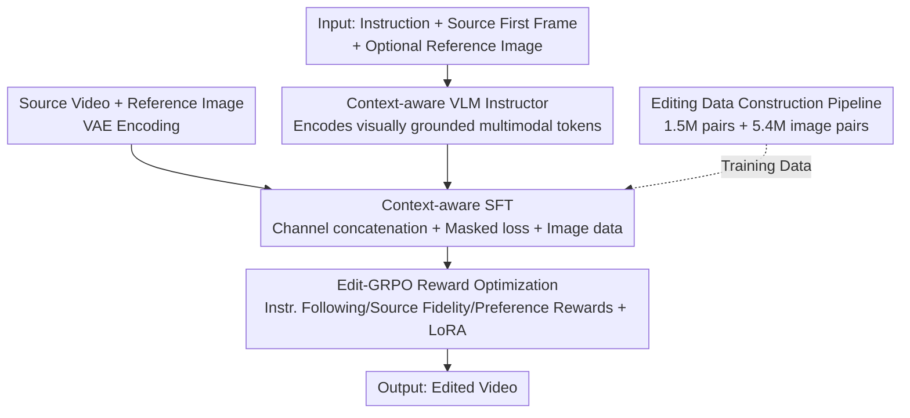

# VIVA: VLM-Guided Instruction-Based Video Editing with Reward Optimization

**Conference**: CVPR 2026  
**Paper**: [CVF Open Access](https://openaccess.thecvf.com/content/CVPR2026/html/Cong_VIVA_VLM-Guided_Instruction-Based_Video_Editing_with_Reward_Optimization_CVPR_2026_paper.html)  
**Code**: Project Page https://vivapaper.github.io/ (Code TBD)  
**Area**: Video Generation / Instruction-Based Video Editing / Diffusion Models / Reinforcement Learning  
**Keywords**: Instruction-Based Video Editing, VLM Conditional Encoding, GRPO, Reward Optimization, Data Synthesis

## TL;DR
VIVA utilizes a VLM "instructor" to encode instructions, initial frames, and optional reference images into visually grounded multimodal conditions for a video DiT. It employs "Edit-GRPO" post-training (featuring triple rewards for instruction following, source fidelity, and human preference) for alignment. Combined with a self-constructed dataset of 1.5 million synthetic pairs, VIVA outperforms open-source SOTA and approaches commercial models like Runway Gen-4 Aleph on VIE-Bench in terms of instruction following and editing quality.

## Background & Motivation
**Background**: Instruction-based video editing aims to modify input videos based on natural language instructions while maintaining temporal consistency and keeping non-target regions unchanged. The dominant paradigm treats this as a supervised translation problem ("source video + instruction → edited video") trained on "source-target-instruction" triplets.

**Limitations of Prior Work**: Existing synthetic pipelines only produce simplified editing pairs, such as single-object addition/deletion or replacement within predefined masks. These models fail to generalize to complex instructions like "multi-task combinations," "out-of-mask replacements," or "global environment changes (weather, seasons)." Furthermore, editing models typically use text-only encoders (e.g., T5), where instructions exhibit sparse semantics. This lack of grounding makes it difficult for models to identify what and where to edit, leading to over-editing (e.g., removing a hand while intending to remove a cigarette).

**Key Challenge**: Video editing is highly context-dependent, requiring complex relationships between text, source video, and reference images. Language-only encoders lack sufficient spatial and semantic grounding, while supervised data only covers simple operations. The bottleneck stems from the combination of "insufficient condition clarity" and "limited data diversity."

**Goal**: To enable models to perform complex editing tasks even when trained on limited, simple paired data. This is decomposed into two objectives: (1) making instruction representation more visually grounded and unambiguous; (2) shifting the optimization target from "pixel-level reconstruction" to "semantic-level editing success."

**Key Insight**: Modern Large Vision-Language Models (VLMs) excel at aligning visual content with fine-grained language. VIVA employs a VLM as a multimodal instruction encoder by including the first frame for grounding and borrows the success of Group Relative Policy Optimization (GRPO) from LLMs to improve instruction following.

**Core Idea**: Use a "VLM Instructor for visually grounded conditional encoding" combined with "Edit-GRPO for post-training using editing-specific relative rewards" to extract stronger editing capabilities from limited paired data.

## Method

### Overall Architecture
VIVA consists of two branches: a generation branch using a pretrained Diffusion Transformer (DiT, specifically HunyuanVideo-T2V-13B) and an understanding branch using a VLM instructor (LLaVA-LLaMA-3-8B). The data flow for an editing task is as follows: the VLM instructor processes a system prompt, text instruction, the first frame of the source video, and an optional reference image to output visually grounded multimodal tokens. A trainable Token Refiner aligns these tokens with the DiT latent space. Simultaneously, the source video (and optional reference) is encoded by a VAE and concatenated with noisy latents in the channel dimension to form "context-aware noise tokens." Finally, the DiT performs denoising under VLM guidance to produce the edited video.

The training involves three stages: Supervised Fine-Tuning (SFT) on 1.5 million synthetic pairs (including masked loss and image-editing data), followed by Edit-GRPO post-training alignment (triple rewards + LoRA), all supported by a specialized data construction pipeline.

### Key Designs

**1. Context-aware VLM Instructor: Grounding Sparse Instructions with Visual Context**

**Design Motivation**: To address the semantic sparsity of T5-based encoders, VIVA replaces the language-only encoder with a VLM. Beyond the text instruction $t_{ins}$, the input includes the source frame $I_{src}$ and the optional reference $I_{ref}$. The hidden states from the VLM's last layer serve as conditional tokens:

$$x_{vlm} = \mathrm{VLM}(t_{ins}, I_{src}, I_{ref}).$$

**Function**: Including the first frame provides grounded, fine-grained semantic bias. The VLM implicitly distinguishes the "region to edit" from the "editing target," resolving ambiguities in instruction-only designs. The reference image extends control from "what transformation to perform" to "how the result should look." Efficiently, the authors chose HunyuanVideo-T2V-13B because its space is already aligned with LLaVA-LLaMA-3-8B, avoiding heavy cross-modal alignment pre-training.

**2. Context-aware SFT: Channel Concatenation, Masked Loss, and Multi-modal Mixing**

**Mechanism**: To ensure the model "edits based on the source," $z_{src}$ and noise latents $z_{noise}$ are concatenated along the channel dimension, patchified, and aggregated via a projector $P$:

$$x_{video} = P(\mathrm{Concat}(P(z_{src}), P(z_{noise}))_c).$$

**Novelty**: This provides a spatial-temporally aligned inductive bias. During SFT, the VLM is frozen to preserve its reasoning ability. To focus on editing regions, the Rectified Flow loss is modified with mask weighting:

$$L_{mask} = (1 + w_m M) L_{FM},$$

where $M$ is the edit region mask. This encourages precise modifications and faster convergence. Additionally, image editing data is mixed in, treating images as single-frame videos, which allows the model to inherit global stylization capabilities often absent in video-only datasets.

**3. Edit-GRPO: Triple Relative Rewards for Video Editing Alignment**

**Mechanism**: SFT focuses on pixel reconstruction, but editing success is a semantic judgment. VIVA adopts GRPO for post-training: for each input, it samples multiple candidates, scores them using editing-specific rewards, and updates the policy based on relative group scores.

*   *Instruction Following* $R_{IF}$: $R_{IF} = C(V_{edit}, t_{edit}) - C(V_{edit}, t_{src})$, where $C$ is CLIP similarity.
*   *Source Fidelity* $R_{SP} = C(V_{src}, V_{edit})$, ensuring non-edited areas remain consistent.
*   *Human Preference* $R_{PS} = \mathrm{Pickscore}(V_{edit}, t_{edit})$, evaluating overall quality and alignment.

The total reward is $R = w_{IF}R_{IF} + w_{SP}R_{SP} + w_{PS}R_{PS}$. This online optimization is more efficient than offline Rejection Sampling (RWR) for extracting supervision from limited samples.

**4. Editing Data Construction Pipeline: High-Fidelity Synthesis via VLM Quality Control**

**Mechanism**: To solve the data scarcity issue, VIVA generated 1.5 million pairs. For *Object Replacement*, it uses Grounding-DINO and SAM 2 for tracking and inpainting. For *Addition/Deletion*, it uses random masks and modified captions. For *Global Editing*, it uses dense scribbles for structural guidance. A two-stage VLM quality control (using Gemini 2.5 Pro) rewrites instructions and filters out artifacts, ensuring only high-quality samples are used for training.

### Loss & Training
During the SFT stage, weighted Rectified Flow / Flow Matching loss is used. The patchify module, projectors, and DiT are trained while the VLM remains frozen. In the Edit-GRPO stage, a weighted triple-reward system is applied to train a LoRA module. Training used 12,000 steps with a learning rate of $2\times10^{-5}$ and a batch size of 128, mixing video and image data at a ratio of 0.4:0.6.

## Key Experimental Results

### Main Results
VIVA was evaluated on VIE-Bench (140 high-quality instances) against SOTAs like ICVE, Lucy-Edit-Dev, and commercial Runway Gen-4 Aleph. Evaluation used Gemini-2.5-pro as a judge for Instruction Following, Source Fidelity, and Edit Quality (0–10 scale).

| Task | Metric(Avg) | VIVA(Ours) | Best Open Baseline | Runway(Commercial) |
|------|-----------|-----------|--------------|--------------|
| Add | VLM Avg | **8.86** | 7.22 (ICVE) | 8.44 |
| Replace | VLM Avg | **8.86** | 7.02 (ICVE) | 9.04 |
| Remove | VLM Avg | **9.44** | 7.04 (ICVE) | 9.79 |
| Hybrid | VLM Avg | **5.88** | 4.92 (ICVE) | 7.85 |

In reference-based editing, VIVA (8.96) matched or exceeded Runway (8.95) in Add tasks. VIVA outperformed all open-source baselines and reached parity with commercial solutions.

### Ablation Study
Ablations on components (V=VLM, M=Masked Loss, I=Image Data, E=Edit-GRPO) show the impact on VLM Avg scores:

| Configuration | Add | Replace | Remove | Description |
|------|-----|---------|--------|------|
| Vanilla | 4.57 | 4.02 | 2.62 | Text-only condition baseline |
| + V | 6.86 | 6.50 | 7.65 | Massive gain in instruction following |
| + V + M | 8.14 | 6.51 | 8.26 | Improved precision and convergence |
| + V + M + I | 7.91 | 8.82 | 9.17 | Emergence of complex/global edit capability |
| + V + M + I + E | **8.86** | **8.86** | **9.44** | Full model with GRPO enhancement |

### Key Findings
- **VLM Instructor is critical**: Replacing the sparse text encoder with a VLM increased scores significantly (e.g., Remove task score nearly tripled), proving visual grounding is essential.
- **Image data enables "emergence"**: Mixing image data significantly boosted performance in Replace and Global Style tasks that were underrepresented in video-only datasets.
- **Edit-GRPO provides the final polish**: Relative rewards shifted the model toward human preference and better semantic alignment.
- **Hybrid editing remains a challenge**: While VIVA (5.88) leads open-source models, it lags behind Runway (7.85), indicating that multi-task combination remains difficult.

## Highlights & Insights
- **Strategic Backbone Selection**: Choosing a DiT (HunyuanVideo) already aligned with the VLM (LLaVA) space avoids the high cost of cross-modal pre-training.
- **Image-to-Video Transfer**: Treating images as single-frame videos allows models to learn global stylization from massive image datasets, bypassing video data scarcity.
- **GRPO for Video Editing**: This is the first adaptation of GRPO to video editing. The reward formulation cleverly uses CLIP similarity in a group-relative manner to isolate instruction following.
- **Quality-Centric Synthesis**: The data pipeline's use of "Inpainting-to-Target" and VLM quality control focuses on generating artifact-free targets, which is more effective than simple filtering.

## Limitations & Future Work
- **Hybrid Complexity**: Performance on combined instructions is still lackluster compared to commercial models.
- **Heavy Dependencies**: The pipeline relies on numerous heavy models (13B DiT, LLaVA, SAM 2, Gemini), making reproduction computationally expensive.
- **Reward Proxy Limitations**: CLIP-based rewards are imperfect proxies for fine-grained editing success. Developing unified video editing reward models is a future direction.
- **Evaluation Bias**: Heavy reliance on VLM judges may introduce bias, although user studies mitigate this.

## Related Work & Insights
- **Vs. InsV2V**: VIVA offers significantly better data quality and backbone capacity, leading 8.86 vs 4.89 in Add tasks.
- **Vs. Ditto**: VIVA focuses on visual grounding via VLM and RL alignment, whereas Ditto focuses on training context blocks within the DiT.
- **Vs. Runway**: VIVA approaches commercial quality while avoiding Runway's occasional over-editing issues, though still trailing in combination edits.

## Rating
- Novelty: ⭐⭐⭐⭐ Adaptation of GRPO and VLM grounding is a significant step for video editing.
- Experimental Thoroughness: ⭐⭐⭐⭐ Comprehensive benchmarking and ablation, though Hybrid task analysis could be deeper.
- Writing Quality: ⭐⭐⭐⭐ Logic is clear, with well-defined pipelines and formulas.
- Value: ⭐⭐⭐⭐ Strong open-source alternative to commercial tools with reusable data/training strategies.

<!-- RELATED:START -->

## Related Papers

- [\[CVPR 2026\] EasyV2V: A High-quality Instruction-based Video Editing Framework](easyv2v_a_high-quality_instruction-based_video_editing_framework.md)
- [\[CVPR 2026\] Scaling Instruction-Based Video Editing with a High-Quality Synthetic Dataset](scaling_instruction-based_video_editing_with_a_high-quality_synthetic_dataset.md)
- [\[CVPR 2026\] Diverse Video Generation with Determinantal Point Process-Guided Policy Optimization](diverse_video_generation_with_determinantal_point_process-guided_policy_optimiza.md)
- [\[CVPR 2026\] CoT-Edit: Let CoT Guide Instruction Video Editing](cot-edit_let_cot_guide_instruction_video_editing.md)
- [\[ICLR 2026\] IVEBench: Modern Benchmark Suite for Instruction-Guided Video Editing Assessment](../../ICLR2026/video_generation/ivebench_modern_benchmark_suite_for_instruction-guided_video_editing_assessment.md)

<!-- RELATED:END -->
