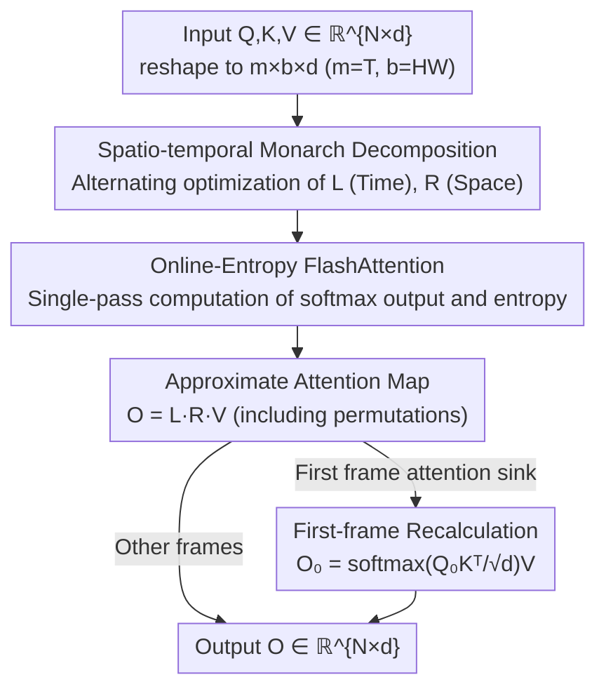

# VMonarch: Efficient Video Diffusion Transformers with Structured Attention

**Conference**: CVPR 2026  
**Paper**: [CVF Open Access](https://openaccess.thecvf.com/content/CVPR2026/html/Liang_VMonarch_Efficient_Video_Diffusion_Transformers_with_Structured_Attention_CVPR_2026_paper.html)  
**Code**: To be confirmed  
**Area**: Video Generation / Diffusion Models / Efficient Attention  
**Keywords**: Video Diffusion Transformer, Monarch Matrix, Structured Sparse Attention, FlashAttention, Long Video

## TL;DR
VMonarch identifies that attention maps in Video DiTs naturally exhibit a high-rank, block-diagonal sparse structure, which can be approximated using Monarch structured matrices. By aligning the spatio-temporal dimensions with Monarch factors to achieve sub-quadratic complexity and incorporating first-frame recalculation alongside a fused Online-Entropy FlashAttention kernel, it reduces attention FLOPs by 17.5× and achieves over 5× speedup for long videos on VBench with virtually no performance drop.

## Background & Motivation
**Background**: Video Diffusion Transformers (Video DiTs) are the current mainstream backbone for generating long videos, but their computational cost is almost entirely dominated by attention—accounting for 95% of total computation when sequence lengths reach one million tokens according to Wan-2.1 statistics. The $O(N^2)$ complexity of attention relative to sequence length $N$ imposes a strict ceiling on video duration and resolution.

**Limitations of Prior Work**: The industry primarily follows two paths to reduce complexity, both with significant drawbacks. **Sparse Attention** (VSA, VMoBA, etc.) allows each query to attend to only a subset of tokens, reducing complexity to $O(\tau N^2)$. However, fixed patterns lack flexibility, and dynamic patterns suffer from irregular memory access due to non-structuring, leading to actual speedups far below theoretical values and quality degradation at aggressive sparsity levels. **Linear Attention** uses kernel methods to compress complexity to $O(N)$, but its low-rank approximation limits expressiveness, creating a noticeable performance gap compared to standard attention.

**Key Challenge**: Attention matrices in Video DiTs are actually **high-rank and sparse**. Due to the inherent spatio-temporal locality of video, strong interactions occur within the same frame and between adjacent pixels, forming a robust block-diagonal structure. This implies that low-rank linear attention is fundamentally suboptimal, while naive sparse attention fails to capture this structure and is difficult to compute efficiently on hardware.

**Key Insight**: The authors noted that Monarch matrices satisfy the requirements of being "sparse, highly expressive, and hardware-friendly." Parameterized as a product of block-diagonal matrices and permutations, they can represent a wide class of transforms (Convolution, Toeplitz, Butterfly, etc.), with complexity flexibly adjustable between $O(N\log N)$ and $O(N^{3/2})$. Prior work, MonarchAttention, proved that approximating attention maps as Monarch matrices via alternating minimization is feasible, reaching $O(N\sqrt{N})$ complexity.

**Core Idea**: This is the first work to represent the sparse attention maps of Video DiT using Monarch matrices. It specifically designs a **spatio-temporal block structure** to align Monarch factors with the "frame × intra-frame space" layout of the video. Combined with first-frame recalculation and a customized GPU kernel, it successfully integrates MonarchAttention into long video generation.

## Method

### Overall Architecture
VMonarch aims to replace the $N\times N$ full attention ($N=THW$, where $T$ is frames and $H\times W$ is spatial tokens per frame) in Video DiT with a sub-quadratic structured approximation. The core approach is to avoid direct calculation of $\mathrm{softmax}(QK^\top)$ and instead use two small Monarch factors $L$ and $R$, obtained via alternating optimization, to approximate the attention map, outputting $O=LRV$.

The forward pass involves three collaborative components: (a) **Spatio-temporal Monarch Decomposition**—reshaping $Q,K,V$ from $\mathbb{R}^{N\times d}$ to $\mathbb{R}^{m\times b\times d}$ (where $m=T, b=HW$), letting $L$ capture inter-frame (temporal) dependencies and $R$ capture intra-frame (spatial) dependencies, with iterative closed-form updates for $t=2$ steps; (b) **First-frame Recalculation**—addressing the "attention sink" in the first frame of Video DiTs, which causes the Monarch temperature term $c_R$ to grow excessively and over-smooth the first frame, by separately recomputing the first frame with full attention; (c) **Online-Entropy FlashAttention**—the entropy term $c_L$ is a computational bottleneck when updating $R$ (dominated by $b^2$ when $b\gg m$), so a single-pass kernel mimicking online softmax is used to compute both softmax output and entropy simultaneously, eliminating redundant HBM↔SRAM transfers.

### Key Designs

**1. Spatio-temporal Monarch Decomposition: Aligning Structured Matrices with Video Layout**

Simply applying MonarchAttention would set Monarch factor sizes to $\sqrt{N}$ for optimal complexity, but this partitioning clashes with the intrinsic spatio-temporal structure of video, destroying block-diagonal priors. VMonarch's key step is anchoring the two dimensions of Monarch directly to video semantics: $m=T$ (frames) and $b=H\times W$ (spatial tokens per frame).

A Monarch matrix is defined as $M=P_{(b,N)}\,L\,P_{(b,N)}^\top R$, where $L=\mathrm{diag}(L_0,\dots,L_{b-1})$ and $R=\mathrm{diag}(R_0,\dots,R_{m-1})$ are two block-diagonal factors, and $P$ is a permutation. Attention is reformulated as an optimization problem with entropy regularization $\mathrm{softmax}(QK^\top)=\arg\max_{A}\langle A,QK^\top\rangle+H(A)$. When $A$ is restricted to be a Monarch matrix, the objective is concave with respect to one factor when the other is fixed, allowing for alternating closed-form solutions:

$$R=\mathrm{softmax}_l\Big(\sum_v \alpha_{R,kiv}K_{klv}/c_{R,ki}\Big),\quad L=\mathrm{softmax}_j\Big(\sum_v \alpha_{L,ikv}Q_{ijv}-c_{L,ik}\Big)$$

After $t$ iterations, the output is $O=L^{(t)}R^{(t)}V$. In the video setting, $L\in\mathbb{R}^{m^2\times b}$ handles cross-frame temporal dependencies and $R\in\mathbb{R}^{b^2\times m}$ handles intra-frame spatial dependencies, effectively decomposing the attention map into "spatial-only" and "temporal-only" segments. Complexity drops from $O(N^2d)$ to $O(tN(T+HW)d)$. Since $T\ll HW$, the theoretical speedup is approximately $\frac{THW}{t(T+HW)}\approx \frac{T}{t}$. This "block structure = video structure" alignment preserves global spatio-temporal priors—making it more stable than VSA/VMoBA at high sparsity—while allowing for dense, hardware-friendly computation.

**2. First-frame Recalculation: Fixing the Attention Sink Vulnerability**

Video DiTs exhibit the "attention sink" phenomenon: the first frame acts as a contextual anchor for the entire sequence, drawing excessive attention from subsequent frames. This creates issues for Monarch optimization—the high attention scores accumulated by first-frame tokens cause the temperature adjustment term $c_R$ to become abnormally large, over-smoothing the softmax distribution and losing fine-grained details in the first frame.

The solution is direct: isolate the first frame and recalculate it using full attention:

$$O_0=\mathrm{softmax}\Big(\frac{Q_0K^\top}{\sqrt{d}}\Big)V$$

Using the query $Q_0$ of the first frame with all $K,V$ restores fidelity. The overhead is only $O(bNd)$, roughly $\frac{b}{t(m+b)}$ of VMonarch's total cost, which is negligible. Ablations show that removing this step leads to significant drops in PSNR/SSIM and VBench metrics; specifically, first-frame PSNR drops from 12.43 to 10.42, indicating this "patch" addresses the most vulnerable point of the Monarch approximation.

**3. Online-Entropy FlashAttention: Fusing Entropy to Resolve the $b^2$ Bottleneck**

Profiling revealed that updating the $R$ matrix and its entropy term $c_L$ is the true computational bottleneck, with a complexity of $O(mb^2d)$. In video, the spatial dimension is much larger than time ($b\gg m$), making the $b^2$ term dominant and naive implementations inefficient.

Following FlashAttention's online softmax, VMonarch designs an online-entropy algorithm: while tiling through $K,V$, it maintains the running maximum $m_i$ and normalization term $\ell_i$, while **synchronously** accumulating the entropy term $h_i$. In a single pass, it outputs attention $O_i$, log-sum $L_i$, and entropy $H_i=\log(\ell_i)-h_i/\ell_i$. Crucially, entropy (which usually requires an extra pass) is fused into the same SRAM computation, greatly reducing HBM↔SRAM traffic. This kernel provides an ~8× speedup over naive implementations.

## Key Experimental Results

### Main Results
Comparisons against FullAttention(FA2), VSA, and VMoBA were conducted on Wan2.1-1.3B / Wan2.1-14B / Wan2.2-5B backbones at various resolutions. VBench metrics (AQ/BC/DD/IQ/SC), Sparsity, TFLOPs, and Inference Time were measured.

| Model / Resolution | Method | AQ↑ | SC↑ | TFLOPs↓ | Time(s)↓ |
|--------|------|------|------|---------|---------|
| Wan2.1-1.3B / 61×448×832 | FullAttn | 66.07% | 94.15% | 159.7 | 63.4 |
| | VSA | 64.46% | 92.99% | 69.5 | 49.9 |
| | VMoBA | 65.58% | 93.00% | 75.8 | 71.7 |
| | **VMonarch** | 65.58% | 93.23% | 75.4 | **47.7** |
| Wan2.1-14B / 93×704×1280 | FullAttn | 67.49% | 95.23% | 7903.8 | 2222.2 |
| | VSA | 66.40% | 94.05% | 2642.7 | 970.9 |
| | **VMonarch** | 65.91% | **95.68%** | 2670.5 | 969.2 |

After 1500 fine-tuning steps, VMonarch reduces TFLOPs by 53% and inference time by 25% on 61×448×832 while matching full attention quality. When extrapolated to 141×448×832, it achieves a 2.1× speedup (faster than VSA). Kernel tests show >2× speedup at 34k tokens and >5× at 62k tokens, surpassing 90% sparse VSA/VMoBA.

### Ablation Study
Training-free settings (VM-Tn-Fk: T=iterations, F=frames covered by Monarch factor, †=removing first-frame recalculation):

| Configuration | PSNR↑ | DD | SC | Description |
|------|-------|------|------|------|
| Softmax (Full Attn) | - | 69.44 | 91.77 | Upper bound reference |
| VM-T1-F1 | 11.18 | 16.67 | 93.17 | Single iteration; DD collapse |
| VM-T2-F1† | 11.65 | 29.17 | 88.46 | No first-frame recalc; PSNR/SC drop |
| VM-T2-F1 | **12.59** | 54.17 | 92.43 | Default configuration |
| VM-T3-F1 | 12.21 | 50.00 | 93.55 | Diminishing returns from iterations |
| VM-T1-F2 | 11.21 | 20.83 | 93.09 | b=2HW; Temporal inconsistency artifacts |

### Key Findings
- **First-frame recalculation is critical**: VM-T2-F1† vs VM-T2-F1 shows PSNR dropping from 12.59 to 11.65 and SC from 92.43 to 88.46. Individual first-frame PSNR drops from 12.43 to 10.42, proving the sink must be handled.
- **Iteration count $t=2$ is the sweet spot**: With $t=1$, Dynamic Degree collapses to 16.67. Increasing $t$ to 3~7 slightly lowers validation loss but actually decreases DD and increases cost.
- **Block structure must align with video**: Setting $b=2HW$ (spanning two frames) improves some metrics slightly in training-free mode but causes temporal artifacts every two frames that fine-tuning cannot resolve.
- **Robust at high sparsity**: Other sparse methods drop significantly at 90% sparsity (e.g., VSA AQ at 42.86% training-free), while VMonarch maintains 63.65% AQ due to preserved global structure.

## Highlights & Insights
- **Translating "Video Structure" to "Matrix Structure"**: The $m=T, b=HW$ alignment is the most elegant step—it allows Monarch factors to carry physical meaning (Time $L$ + Space $R$), preserving global priors while gaining sub-quadratic efficiency.
- **Surgical Fixes**: First-frame recalculation uses negligible overhead to fix the most critical failure point of Monarch approximation (the attention sink).
- **Entropy "Flash-ification"**: The online-entropy algorithm fuses calculations that previously required extra data passes into the FlashAttention pass. This trick is transferable to any method requiring entropy regularization in attention.
- **High-Rank + Sparse Hypothesis**: The paper categorizes sparse vs. linear attention as "utilizing sparsity vs. low-rank." It argues that Video DiT should follow the sparsity route, providing a helpful analytical framework.

## Limitations & Future Work
- **Fine-tuning Requirement**: In training-free settings, the Monarch approximation significantly reduces Dynamic Degree. Approximately 1500 fine-tuning steps are needed to recover or exceed full attention performance.
- **Dependence on Spatio-temporal Separability**: The method assumes video attention is block-diagonal and spatio-temporally separable. In scenes with extreme motion or strong long-range global interactions, these benefits may diminish.
- **Hyperparameter Sensitivity**: Requires clamping $c_R$ to 0.1 for stability and fixing $t=2$ iterations. Whether these remain optimal for larger models or even longer sequences needs further validation.
- **Comparability of Sparsity**: Sparsity definitions vary (VSA uses fixed top-k 90%, VMoBA uses top-p ~90%, VMonarch estimates 87.5%~94.4% via $1-t\frac{T+HW}{THW}$), so FLOP comparisons should be viewed with caution.

## Related Work & Insights
- **vs MonarchAttention**: Prior work introduced Monarch approximation via alternating minimization for general Transformers. VMonarch's innovations are spatio-temporal alignment + first-frame recalc + online-entropy kernels, tailored for Video DiT.
- **vs VSA / VMoBA (Sparse Attention)**: These use dynamic blockwise sparsity and suffer quality drops or inconsistency at 90% sparsity. VMonarch uses structured matrices for dense calculation of sparse maps, preserving global priors.
- **vs SANA-Video (Linear Attention)**: Linear attention targets $O(N)$ via low-rank kernels but lacks expressiveness. VMonarch pursues the "high-rank sparse" route, which better captures the essential structure of video attention.

## Rating
- Novelty: ⭐⭐⭐⭐⭐ First to introduce Monarch structured matrices to Video DiT with spatio-temporal alignment.
- Experimental Thoroughness: ⭐⭐⭐⭐ Covers three backbones, multi-resolution, and temporal extrapolation; strong ablations; slightly weaker in purely training-free scenarios.
- Writing Quality: ⭐⭐⭐⭐ Clear logic (Motivation-Bottleneck-Countermeasure) and good alignment between formulas and figures.
- Value: ⭐⭐⭐⭐⭐ Reducing attention cost (95% of DiT) with 17.5× FLOP reduction and 5× speedup is highly impactful for long video generation.

<!-- RELATED:START -->

## Related Papers

- [\[CVPR 2026\] ReHyAt: Recurrent Hybrid Attention for Video Diffusion Transformers](rehyat_recurrent_hybrid_attention_for_video_diffusion_transformers.md)
- [\[CVPR 2026\] Attention Surgery: An Efficient Recipe to Linearize Your Video Diffusion Transformer](attention_surgery_an_efficient_recipe_to_linearize_your_video_diffusion_transfor.md)
- [\[CVPR 2026\] RAPID: Reusing Attention Sparsity with Inter-step Adaptation for Efficient Video Diffusion](rapid_reusing_attention_sparsity_with_inter-step_adaptation_for_efficient_video_.md)
- [\[CVPR 2026\] Towards Holistic Modeling for Video Frame Interpolation with Auto-regressive Diffusion Transformers](towards_holistic_modeling_for_video_frame_interpolation_with_auto-regressive_dif.md)
- [\[CVPR 2026\] LinVideo: A Post-Training Framework towards O(n) Attention in Efficient Video Generation](linvideo_a_post-training_framework_towards_on_attention_in_efficient_video_gener.md)

<!-- RELATED:END -->
