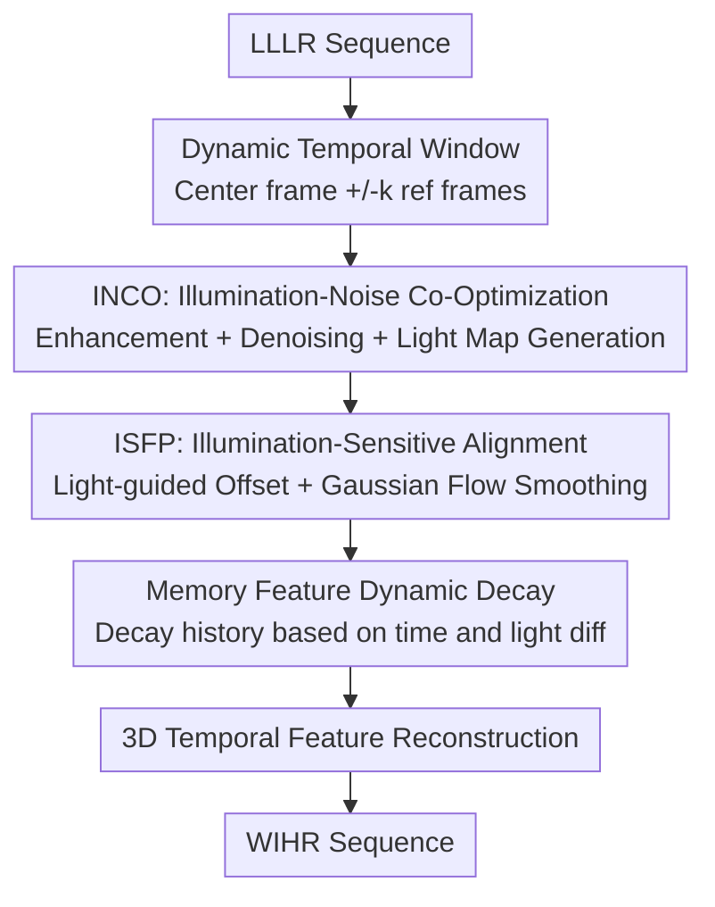

# VSRELL: A Simple Baseline for Video Super-Resolution and Enhancement in Low-Light Environment

**Conference**: CVPR 2026  
**Paper**: [CVF Open Access](https://openaccess.thecvf.com/content/CVPR2026/html/Hui_VSRELL_A_Simple_Baseline_for_Video_Super-Resolution_and_Enhancement_in_CVPR_2026_paper.html)  
**Code**: https://github.com/373hdj/VSRELL  
**Area**: Video Restoration / Low-light Enhancement / Video Super-Resolution  
**Keywords**: Low-light Video Super-Resolution, Illumination-Noise Co-optimization, Deformable Alignment, Feature Propagation, Synchronous Decoupling  

## TL;DR
VSRELL jointly solves "Low-Light Enhancement (LLE)" and "Video Super-Resolution (VSR)" tasks, which are traditionally decoupled, using a **synchronous decoupling** approach within a single CNN framework. It simultaneously models illumination and noise within a temporal window using an INCO module and injects illumination priors into deformable alignment while applying dynamic decay to memory features via an ISFP module. Ultimately, with only 6.3M parameters, it improves the average PSNR on REDS4 from ~20.6 dB (achieved by cascaded/all-in-one methods) to 25.94 dB.

## Background & Motivation
**Background**: Restoring a normal-light, high-resolution (WIHR) sequence from a low-resolution, low-light (LLLR) video requires addressing four entangled degradations: **noise contamination, color distortion, temporal flickering, and motion blur**. Existing approaches fall into two categories: **cascaded** (LLE→VSR or VSR→LLE), where enhancement and super-resolution are performed sequentially; or **all-in-one** general restoration networks that handle multiple degradations with a single model.

**Limitations of Prior Work**: In cascaded schemes, the two sub-networks are trained independently, making the second stage's performance entirely dependent on the first. Residual noise or color bias from the enhancement stage is often amplified during super-resolution, leading to parameter redundancy, slow inference, and accumulated errors. While all-in-one methods are compact, they typically encounter **single degradations** during training (either low-light or low-resolution only) and fail to model the coupled "low-light + downsampling" degradation prevalent in real-world night scenes.

**Key Challenge**: Low-light conditions break the core assumptions required for VSR to function. The paper identifies four difficulties: ① Noise variance across RGB channels **diverges exponentially** as brightness decreases, leading to strong noise-color coupling; ② Low Signal-to-Noise Ratio (SNR) causes neighboring frame textures to be submerged in noise, rendering **inter-frame complementary information** (the core of VSR) ineffective; ③ Low contrast and sparse textures lead to frequent **optical flow** drift and misalignment; ④ Traditional recurrent/cascaded propagation mechanisms **continuously amplify** noise that was not fully separated from initial features, causing error accumulation and temporal flickering.

**Goal**: Solve brightness correction, noise suppression, motion alignment, and temporal stability simultaneously within an end-to-end framework rather than stacking them sequentially.

**Key Insight**: Low-light enhancement and noise suppression are inherently **coupled** problems (noise in dark regions distorts color phase) and should be optimized jointly. Simultaneously, illumination information should be **explicitly injected into the alignment process**, allowing different alignment strategies for dark and bright regions.

**Core Idea**: A "synchronous decoupling" paradigm is proposed. Instead of simple cascading or all-in-one structures, it **simultaneously** models illumination and noise (INCO) within a temporal window, then applies illumination priors to deformable alignment and cross-frame propagation (ISFP). This is claimed to be the first CNN-based method to jointly solve LLE and VSR.

## Method

### Overall Architecture
The input to VSRELL is an LLLR sequence, and the output is a WIHR sequence, connected by two core modules. First, **INCO (Illumination-Noise Co-Optimization)** uses the center frame as an anchor to construct a temporal symmetric window, performing enhancement, denoising, and motion compensation **simultaneously** to generate a light map and calculate illumination/noise statistics. Second, **ISFP (Illumination-Sensitive Feature Propagation)** uses this light map to **calibrate alignment**—injecting illumination information into deformable convolution offset prediction, applying Gaussian smoothing to low-light flow, and using a memory unit with dynamic decay for cross-frame propagation to suppress error accumulation. Finally, high-quality frames are reconstructed via 3D temporal features. The pipeline emphasizes decoupling illumination and noise within the window first, then making alignment and propagation illumination-aware.

### Key Designs

**1. INCO: Jointly solving enhancement and denoising as a coupled problem in a temporal window**

To address the coupling of noise and color, INCO replaces sequential processing with a **light-sensitive branch** and a **noise estimation branch** that share encoder features. These are fused via cross-modulation during decoding to avoid serial error propagation. It constructs a symmetric window $W = \{\mathrm{Warp}(I^{n-i}_{ref}, F_{n-i})\} \cup \{I^{n-i}_{curr}\}$ around center frame $I^{n-i}_{curr}$ and aligns neighbors using optical flow. Within the window, it performs **joint global-local encoding** $F_{mod} = M(E_{local}(\cdot), E_{global}(S(W)))$, where global features (from statistics $S(W)$ like variance/mean) ensure consistent enhancement, while local features preserve detail. $M$ dynamically allocates their ratio. The brightness gain is adaptive:

$$I_{bright} = I_{curr}\cdot \mathrm{Clamp}\big(g\cdot(1.5-\alpha),\,1,\,g_{max}\big),\quad \alpha = \mathrm{Clamp}(2\mu_{global},\,0.5,\,1.0)$$

$$I_{denoise} = \mathrm{Clamp}\big(I_{bright} - O_{denoise}\cdot M_{noise},\,0,\,1\big)$$

Here $g$ is the base gain, $\mu_{global}$ is the global brightness coefficient used to balance enhancement and overexposure, $O_{denoise}$ is the denoising offset, and $M_{noise}$ is the pixel-wise noise map. Brightness adapts to the scene, and noise is suppressed per-pixel.

**2. ISFP: Injecting illumination priors into deformable alignment for regional processing**

Standard deformable alignment uses a uniform strategy, resulting in over-alignment in bright areas and under-alignment in dark areas. ISFP introduces a normalized light map into offset prediction. It calculates illumination attention $A_{illu} = \sigma(\mathrm{BN}(\mathrm{Conv2d}(M_{low})))$, applies **Gaussian smoothing** to optical flow in dark regions, and preserves detail in bright regions:

$$F^{smooth}_k = F_k\cdot(1-A_{illu}) + \mathrm{Blur}(F_k, K_{Gauss})\cdot A_{illu}$$

$$\Delta O^{fusion}_k = \Delta O^{mod}_k + (F^{smooth}_k \circ A_{illu})\cdot(1+A_{illu}),\qquad X_{align} = \mathrm{DeformConv2d}(X, \Delta O^{fusion}, W, M_{sam}$$

Directly put: dark regions have higher illumination attention, larger offset adjustments, and more smoothing (as noise is unreliable), while bright regions keep sharp flow. This is the Light Guided Offset Modulation (LGOM), which prevents errors caused by low-light noise.

**3. Memory Feature Dynamic Decay: Dual-factor decay based on time and illumination difference**

To prevent long-range propagation from magnifying initial noise, ISFP utilizes a dynamic decay unit for history frames $I^{n-i}_{curr}$ at time $t$:

$$\omega^{(t)}_i = \lambda^{\Delta t}_{decay}\cdot \exp\!\big(-\alpha\,\lVert M^t_{illu} - M^i_{illu}\rVert_2^2\big),\qquad F^{(t)}_{prop} = F_t + \sum_{i=1}^{t-1}\omega^{(t)}_i\cdot A(F^i_{mem}, F^{i\to t}_{flow})$$

The first term $\lambda^{\Delta t}_{decay}$ is **temporal decay** (older frames have less weight). The second is **illumination consistency decay**: larger differences in illumination between frames reduce weight. This cuts the malicious cycle where unreliable dark features are warped and accumulated with new noise.

### Loss & Training
Trained on REDS (testing on REDS4) using low-light synthesis; Adam optimizer ($\beta_1=0.9, \beta_2=0.99$), initial learning rate $1\times10^{-4}$ with Cosine Annealing Restart (600k iterations, lower bound $1\times10^{-7}$), EMA decay 0.999; LR patch $64\times64$, batch size 1, SPyNet for optical flow; dynamic window size 3, 7 residual blocks per branch, 64 feature channels.

## Key Experimental Results

### Main Results
On REDS4 (×4, average PSNR/SSIM), VSRELL achieves the highest metrics with the fewest parameters:

| Category | Method | #Params(M) | Runtime(s) | PSNR↑ / SSIM↑ |
|---------|---------|---------|----------|---------------|
| SISR+LLE | HAT + KinD | 20.80+8.54 | ~1.6 | 20.29 / 0.7762 |
| LLE+SISR | Zero-DCE + SwinIR | 0.07+11.90 | ~1.8 | 20.64 / 0.7649 |
| VSR+LLE | IART + KinD | 13.40+8.54 | ~0.68 | 20.53 / 0.7084 |
| All-in-One | AdaIR* | 29.09 | 0.364 | 19.30 / 0.6375 |
| All-in-One | MoCE-IR* | 24.26 | 0.156 | 19.13 / 0.6413 |
| **Ours** | **VSRELL** | **6.29** | **0.069** | **25.94 / 0.7813** |

Generalization across datasets (Vid4 / UDM10, unseen test sets):

| Method | Vid4 (BI) PSNR/SSIM | UDM10 (BI) PSNR/SSIM |
|------|---------------------|----------------------|
| IART + SCI | 19.96 / 0.8063 | 20.69 / 0.8934 |
| Zero-DCE + HAT | 18.80 / 0.7748 | 20.83 / 0.8591 |
| AdaIR* | 17.06 / 0.5178 | 20.20 / 0.7472 |
| **VSRELL** | **21.42 / 0.8081** | **23.54 / 0.8969** |

### Ablation Study
Incremental module addition (evaluated at 180×320, ×4):

| Config | #Params(M) | MACs(G) | Runtime(s) | PSNR↑ | SSIM↑ | Note |
|------|---------|---------|----------|-------|-------|------|
| Baseline | 5.283 | 279.9 | 0.048 | 23.15 | 0.761 | Without INCO/ISFP |
| +INCO | 5.557 | 295.7 | 0.064 | 24.91 | 0.769 | Illumination-Noise Co-opt only |
| +ISFP | 5.294 | 280.5 | 0.057 | 25.07 | 0.765 | Illumination-Sensitive Prop only |
| Max (Full) | 6.287 | 337.9 | 0.069 | 25.94 | 0.781 | Full VSRELL |

### Key Findings
- **Both modules are essential**: Removing either component results in a PSNR drop > 0.8 dB. Individually, INCO contributes ~+7.60% PSNR and ISFP ~+8.29% PSNR. INCO recovers brightness while ISFP preserves details during propagation.
- **Window size follows a "bell curve"**: WS=1→3→5→7 produces ~24.64 / 25.43 / 25.37 / 23.92 dB. WS=3 is optimal; larger windows introduce redundant information and lose high-frequency detail.
- **Superior temporal consistency**: Temporal profiles show that cascaded methods produce artifacts and uneven brightness under extreme darkness, whereas VSRELL demonstrates smooth transitions and better blur suppression at motion edges.

## Highlights & Insights
- **Heuristic Paradigm Choice**: The "synchronous decoupling" avoids both the error accumulation of cascading and the lack of coupling modeling in pure all-in-one approaches. This can be extended to other multi-degradation restoration tasks.
- **Multi-purpose Light Map**: A single light map drives adaptive gain in INCO, offset modulation and flow smoothing in ISFP, and consistency decay. This single physical prior ensures parameter efficiency and self-consistency.
- **Dual-Factor Memory Decay**: Combining "temporal distance" and "illumination difference" to weight history frames effectively lets the network ignore unreliable features, which is highly relevant for any recursive feature propagation.
- **High Efficiency**: 6.29M parameters at 0.069s/frame is an order of magnitude faster than cascaded BasicVSR++ (31M+ Params), verifying the "simple baseline" claim.

## Limitations & Future Work
- **Author-Acknowledge Limitations**: Flexibility in extreme multi-degradation scenarios is unexplored, and mobile/real-time deployment is yet to be verified.
- **Synthetic Training Data**: Low-light data is synthesized from REDS. Real-world sensor response and ISP noise under extreme darkness may differ, potentially affecting robustness.
- **Batch Size Constraint**: Training with a batch size of 1 over 600k iterations may introduce sensitivity to randomness; variance across multiple runs was not reported.
- **Limited Metrics**: Focuses on fidelity (PSNR/SSIM) without quantitative perceptual (LPIPS) or temporal consistency metrics (warping error).

## Related Work & Insights
- **vs. Cascaded (e.g., IART+KinD)**: Sequential stacking amplifies errors. VSRELL is end-to-end and synchronous, performing ~5 dB better with only 6.3M parameters.
- **vs. All-in-One (e.g., PromptIR/AdaIR)**: These fail to model the "low-light + low-resolution" coupling. Even when retrained, they struggle to reach 19 dB on REDS4. 
- **vs. Standard Deformable Alignment VSR (EDVR/BasicVSR++)**: These use a uniform strategy regardless of illumination, leading to poor alignment in dark regions. ISFP differentiates regions to stabilize alignment.

## Rating
- Novelty: ⭐⭐⭐⭐ First CNN paradigm for joint LLE+VSR; elegant multi-use of the light map and dual-factor decay.
- Experimental Thoroughness: ⭐⭐⭐⭐ Comparisons cover cascaded and all-in-one methods; however, it lacks perceptual metrics and real-world data validation.
- Writing Quality: ⭐⭐⭐ Clear motivation and difficulty analysis, though some notation is complex and some terms are slightly inconsistent.
- Value: ⭐⭐⭐⭐ A lightweight, high-performance baseline (6.3M/0.069s) practical for night surveillance and mobile restoration applications.

<!-- RELATED:START -->

## Related Papers

- [\[ICLR 2026\] SimpleGVR: A Simple Baseline for Latent-Cascaded Generative Video Super-Resolution](../../ICLR2026/video_generation/simplegvr_a_simple_baseline_for_latent-cascaded_generative_video_super-resolutio.md)
- [\[CVPR 2026\] Compressed-Domain-Aware Online Video Super-Resolution](compressed-domain-aware_online_video_super-resolution.md)
- [\[CVPR 2026\] Thermal Diffusion Matters: Infrared Spatial-Temporal Video Super-Resolution through Heat Conduction Priors](thermal_diffusion_matters_infrared_spatial-temporal_video_super-resolution_throu.md)
- [\[CVPR 2026\] Generating Humanless Environment Walkthroughs from Egocentric Walking Tour Videos](generating_humanless_environment_walkthroughs_from_egocentric_walking_tour_video.md)
- [\[CVPR 2026\] Improving Motion in Image-to-Video Models via Adaptive Low-Pass Guidance](improving_motion_in_image-to-video_models_via_adaptive_low-pass_guidance.md)

<!-- RELATED:END -->
