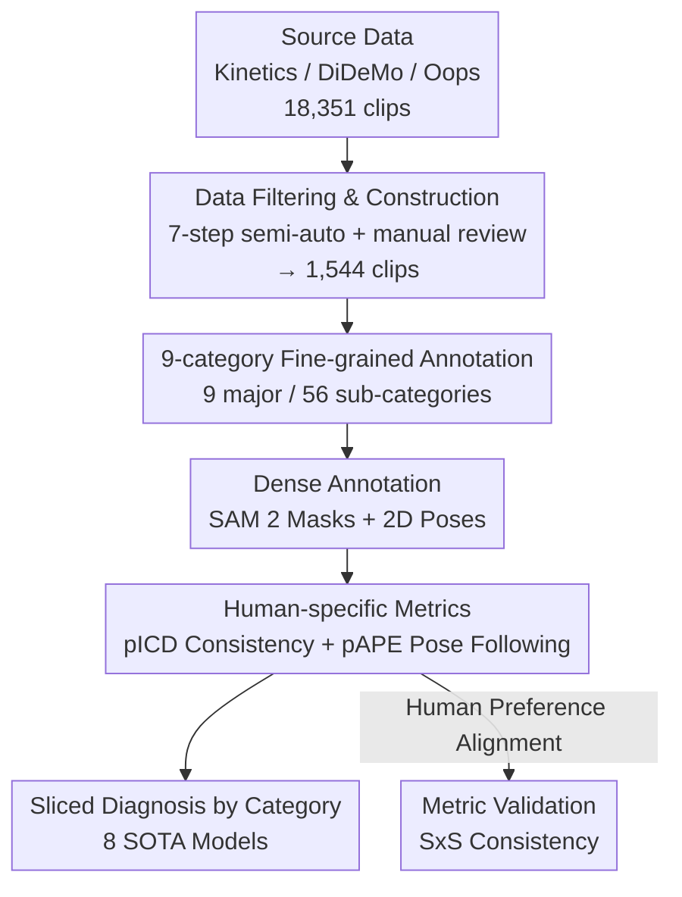

# What Are You Doing? A Closer Look at Controllable Human Video Generation

**Conference**: CVPR 2026  
**Paper**: [CVF Open Access](https://openaccess.thecvf.com/content/CVPR2026/html/Bugliarello_What_Are_You_Doing_A_Closer_Look_at_Controllable_Human_CVPR_2026_paper.html)  
**Code**: https://github.com/google-deepmind/wyd-benchmark  
**Area**: Video Generation  
**Keywords**: Controllable Human Video Generation, Evaluation Benchmark, Fine-grained Annotation, Human Consistency, Pose Following

## TL;DR
The authors observe that existing benchmarks for controllable human video generation (TikTok, TED-Talks, HumanVid) are overly small and narrow. They construct the WYD benchmark consisting of 1,544 meticulously annotated clips (across 9 major and 56 sub-categories) and introduce two human-centric metrics, pICD and pAPE. Systematic evaluation of 8 SOTA open-source models quantitatively exposes systematic performance gaps in multi-person scenarios, human-object interactions, complex environments, and intense motions.

## Background & Motivation
**Background**: Controllable human video generation (generating motion from a reference frame and driving signals like pose/depth/edges) has progressed rapidly. However, community evaluation relies almost exclusively on TikTok (16 clips) and TED-Talks (128 clips).

**Limitations of Prior Work**: These datasets are not only extremely small but also restricted in scope—primarily featuring single individuals dancing or speaking in stationary shots. They fail to reflect the diversity of real-world human actions, interactions, and camera movements, nor can they expose model failures on challenging samples. While HumanVid is more diverse, its validation set contains only 71 clips, lacking statistical significance.

**Key Challenge**: The advancement of model capabilities has outpaced the scope of existing evaluations. While models achieve high, indistinguishable scores on simple distributions like single-person close-ups, their performance on multi-person interactions, human-animal interactions, and high-intensity real-world videos remains unknown—dimensions that existing benchmarks lack samples to measure.

**Goal**: (1) Construct a large, diverse benchmark covering real-world human activities for controllable generation; (2) design metrics that truly assess human consistency and pose adherence; (3) systematically map the capability boundaries of existing models.

**Key Insight**: Human perception is naturally adept at identifying biological motion and appearance, making human generation a critical capability. Since text often fails to describe human motion precisely, the authors focus on **pose-controlled** image-to-video settings (where the subject is clear in the first frame) and emphasize **fine-grained classification**. Segmenting videos into distinct categories allows for pinpointing specifically where models fail.

**Core Idea**: Instead of pursuing a single aggregate score, the authors propose a diverse benchmark sliced across 9 dimensions combined with human-specific metrics, upgrading evaluation from a "single number" to a "diagnostic report."

## Method
As a **benchmark and analysis** paper, no new generative model is proposed; the "method" refers to the **research design**: sourcing high-quality, diverse human videos, organizing them via 9-category annotations, adapting human-specific metrics aligned with human preference, and diagnosing existing models.

### Overall Architecture
The pipeline follows "Collection → Filtering → Fine-grained Annotation → Dense Annotation → Metrics → Diagnosis." Starting from Kinetics, DiDeMo, and Oops, 1,544 clips are selected via 7 semi-automatic filtering steps. Each is manually labeled across 9 categories. Segmented masks (via SAM 2 + manual refinement) and 2D pose keypoints (for 100 clips) are provided. Four metrics—video-level (FVD, OFE) and human-level (pICD, pAPE)—are defined. Finally, 8 SOTA models are evaluated across 9 dimensions, with human preference used to validate metric reliability. The process involved 2500+ rater hours and 6,000+ A100 GPU hours.

### Key Designs

**1. Data Construction: Semi-automatic filtering from 18,351 to 1,544 high-quality clips**
Existing benchmarks are either too small or designed for unrelated tasks. The authors utilize Kinetics, DiDeMo, and Oops (containing real-world YouTube/Flickr videos with diverse body types, clothing, ages, and backgrounds, including "accidental" movements). A 7-step pipeline is applied: (1) filtering non-human subjects; (2) shot detection to remove cuts; (3) pose estimation to ensure visibility; (4) limiting duration to 1.5–15s; (5) VLM filtering for low video-description similarity; (6) removing low resolution; (7) manual review to remove blur, poor lighting, or insufficient motion. The final 1,544 clips (1,393 unique sequences) are significantly more diverse and an order of magnitude larger than prior benchmarks.

**2. 9-category Fine-grained Annotation: Shifting from aggregate scores to dimensional diagnosis**
WYD differentiates itself by manually labeling 9 major categories and 56 sub-categories for each clip, ensuring each sub-category has $\approx 100$ samples for statistical significance. Dimensions include: person count, area occupied, action type, limb movement, environmental interaction, scene type, and camera following. Optical flow and pose occlusions are also tracked. These categories serve as **diagnostic tools** to pinpoint where models struggle (e.g., multi-person vs. single person, or indoor vs. outdoor).

**3. Human-specific Metrics (pICD + pAPE): Refined measures focusing on the subject**
Standard metrics like FID or FVD measure global frame distributions but fail to assess if the generated person matches the reference or follows the driving pose. Using segmentation masks, the authors adapt two metrics:
- **pICD (person image cosine distance)**: Measures character consistency. For each frame, patches belonging to the person are extracted to calculate the average cosine similarity of DINOv2 features. $\text{pICD} = 1 - \text{avg}(\text{patch\_cos\_sim})$.
- **pAPE (person AP error)**: Measures pose adherence. DWPose detects poses in generated videos, which are mapped back to the **salient person** in the reference (filtering background pedestrians). AP is calculated after Hungarian matching. $\text{pAPE} = 1 - \text{mAP}$.

**4. Evaluation Protocol Validation: Aligning metrics with human preference**
To ensure reliability, metrics were validated against human judgment using two methods: (1) side-by-side (SxS) model comparisons across four templates; (2) verifying model rankings. As shown in Tab. 2, pICD (72.67%) and pAPE (71.95%) outperform global counterparts in aligning with human preference regarding personal consistency and motion.

## Key Experimental Results

### Benchmark Scale Comparison

| Dataset | Clips (Unique) | Duration [s] | Aspect | Persons | Fine-grained | Extra Labels |
|---------|----------------|--------------|--------|---------|--------------|--------------|
| TikTok | 16 (14) | 8.3–23.0 | Port. | 1 | No | dense poses |
| TED-Talks | 128 (40) | 4.3–23.1 | Land. | 1 | No | None |
| HumanVid | 71 (71) | 2.7–87.2 | Both | 1, 2 | No | None |
| **WYD** | **1,544 (1,393)** | 1.5–15.0 | Both | 1, 2, 3–8 | **9 / 56** | Masks + 2D Poses |

### Metric Alignment with Human Preference (SxS, Tab. 2)

| Dimension | Chosen Metric | Consistency [%] | Baseline | Consistency [%] |
|-----------|---------------|-----------------|----------|-----------------|
| Video Quality | FVD | 96.36 | FID | 22.24 |
| Video Motion | OFE | 82.10 | DPT | 67.37 |
| Person Consistency | **pICD** | **72.67** | ICD / RMSE / SSIM | 67.33 / 38.55 / 62.65 |
| Person Motion | **pAPE** | **71.95** | pOFE | 61.45 |

### Key Findings
- **WYD is significantly more difficult**: Under image+pose conditions, error metrics on WYD are 1.8–12.3 times higher than on TikTok/TED-Talks.
- **No model is omnipotent**: VACE generally performs best overall, while MagicPose suffers from higher FVD due to flickering artifacts. 
- **Multimodal complementarity**: For VACE (multi-task), adding both pose and text improves results; pose improves motion adherence while text descriptions enhance character consistency.
- **Systematic weaknesses**: Performance (FVD and pAPE) degrades as person count increases from 1 to 3+. Models like MimicMotion often fail in "human-animal interaction," removing animals entirely. Scene types like gyms or snowy fields show larger performance gaps compared to "home" settings.
- **Robustness**: Rankings remain stable even when upgrading pose detectors or using manual 2D pose annotations, confirming that findings are not artifacts of detection errors.

## Highlights & Insights
- **Redefining Evaluation as Diagnosis**: The 9-category slice approach allows the benchmark to answer "where" a model fails (e.g., multi-person or intense motion), a methodology transferable to other generation tasks.
- **"Humanizing" Metrics via Masks**: Utilizing SAM 2 masks to isolate the subject is a high-impact, low-cost technique that makes DINO consistency and Pose AP resilient to background noise.
- **Benchmarks as Microscopes**: pAPE revealed hidden preprocessing behaviors in MimicMotion/ControlNeXt (forced centering/scaling), exposing biases inherited from simple training data.
- **Commitment to Negative Results**: The study focuses on exposing the systematic failures of 8 SOTA models rather than promoting a new one, providing greater value to the research community.

## Limitations & Future Work
- **Open-source Focus**: To ensure reproducibility, only open-source models were tested. The exclusion of closed-source models limits the scope regarding current industry ceilings.
- **Distribution Shift**: Many models were trained on single-person datasets; low scores on WYD may partly reflect this shift rather than a lack of raw capacity.
- **Dense Annotation Scale**: While masks cover the full set, manual 2D pose labels are limited to 100 clips for validation purposes.
- **Pose-Controllable I2V Bias**: The benchmark primarily addresses image-to-video with pose/depth/edge signals; text-to-video and pure image-to-video evaluations are secondary.

## Related Work & Insights
- **vs. TikTok / TED-Talks**: WYD is an order of magnitude larger and covers complex interactions/camera motions that existing benchmarks cannot measure.
- **vs. HumanVid**: WYD provides significantly more validation samples (1,544 vs. 71), enabling statistically sound diagnostic slicing.
- **vs. General T2V Benchmarks (VBench, etc.)**: Unlike prompt-based sets, WYD provides reference videos and driving signals necessary for controllable generation evaluation.
- **vs. Pixel-level Metrics**: Unlike global FID/FVD, this work demonstrates that controllable human generation requires fine-grained, person-centric metrics (pICD/pAPE), which align better with human judgment.

## Rating
- Novelty: ⭐⭐⭐⭐ While not a new model, the "fine-grained diagnostic slicing + masked human metrics" provides essential infrastructure for the field.
- Experimental Thoroughness: ⭐⭐⭐⭐⭐ Comprehensive testing of 8 models x 9 dimensions, human preference validation, and robustness checks.
- Writing Quality: ⭐⭐⭐⭐ Clear motivation and diagnostic structure, though some central arguments rely heavily on the appendix.
- Value: ⭐⭐⭐⭐⭐ Open-sourced data and code address a long-standing gap in high-quality, challenging benchmarks for controllable human generation.

<!-- RELATED:START -->

## Related Papers

- [\[CVPR 2026\] SemVideo: Reconstructs What You Watch from Brain Activity via Hierarchical Semantic Guidance](semvideo_reconstructs_what_you_watch_from_brain_activity_via_hierarchical_semant.md)
- [\[AAAI 2026\] MotionCharacter: Fine-Grained Motion Controllable Human Video Generation](../../AAAI2026/video_generation/motioncharacter_fine-grained_motion_controllable_human_video_generation.md)
- [\[CVPR 2026\] IP-Adapter Is All You Need: Towards Fine-Tuning-Free Diffusion-Based Talking Face Generation](ip-adapter_is_all_you_need_towards_fine-tuning-free_diffusion-based_talking_face.md)
- [\[CVPR 2026\] YOSE: You Only Select Essential Tokens for Efficient DiT-based Video Object Removal](yose_you_only_select_essential_tokens_for_efficient_dit-based_video_object_remov.md)
- [\[CVPR 2026\] Archon: A Unified Multimodal Model for Holistic Digital Human Generation](archon_a_unified_multimodal_model_for_holistic_digital_human_generation.md)

<!-- RELATED:END -->
