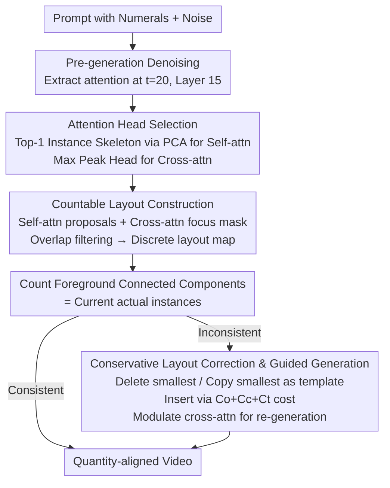

# When Numbers Speak: Aligning Textual Numerals and Visual Instances in Text-to-Video Diffusion Models

**Conference**: CVPR 2026  
**arXiv**: [2604.08546](https://arxiv.org/abs/2604.08546)  
**Code**: [https://github.com/H-EmbodVis/NUMINA](https://github.com/H-EmbodVis/NUMINA)  
**Area**: Video Generation  
**Keywords**: Quantity Alignment, Text-to-Video, Training-free, Attention Head Selection, Layout-guided Generation

## TL;DR

The core idea of NUMINA is to avoid retraining video diffusion models by extracting a "countable instance layout" from DiT attention during inference. It detects inconsistencies between the numeral prompt and the current layout, applies conservative layout modifications (additions or deletions), and uses the corrected layout to guide re-generation, significantly improving the adherence of text-to-video models to numerical constraints like "two apples" or "eight ducks."

## Background & Motivation

Current text-to-video models demonstrate strength in image quality, temporal consistency, and motion, but numerical control remains a weakness. Models often understand attributes like "red," "running," or "seaside" but fail to consistently generate the exact number of objects specified in the prompt. While a discrepancy of one or two objects might be tolerable in entertainment scenarios, it directly impacts usability in instructional videos, simulations, or content requiring strict procedural counts.

Why are numerals so challenging? The authors identify two specific root causes. First is **numeral semantic weakness**: activations of numeral tokens in cross-attention are more diffuse and less focused compared to nouns, adjectives, and verbs, indicating that models do not truly ground tokens like "three" into a spatial layout. Second is **instance ambiguity**: DiT operates on highly downsampled spatio-temporal latents where multiple instances easily merge, making it difficult for the model to distinguish "two objects" from "one large region."

While retraining might solve this, the cost is high and requires video datasets with precise numerical annotations. Thus, the authors choose a more practical path: rather than reshaping the model from scratch, they apply lightweight intervention during inference by leveraging the latent instance structures already exposed in the attention maps.

This necessitates two conditions for the method:
- It must be strong enough to transform implicit attention into explicit layouts and correct numerical errors.
- It must be conservative enough to avoid disrupting the overall layout, style, or temporal consistency while adding or removing objects.

The identify-then-guide paradigm of NUMINA is designed precisely around these two goals.

## Method

### Overall Architecture

NUMINA aims to ensure generated results faithfully follow numerals in the prompt without retraining the diffusion model. It decomposes the task into "identify" and "guide" stages, forming a pipeline: pre-generation → correction → re-generation. In the first stage, a standard denoising pass is performed. In early steps, the "countable instance layout" implied by the video is extracted from DiT attention to count the actual objects being drawn. In the second stage, if this count mismatches the target numeral, minimal layout modifications are made. This corrected layout is then used to modulate cross-attention, guiding the model during a second generation pass.

The key to this process is that intervention occurs neither on final pixels nor via external frame-by-frame detectors, but during the mid-early latent stages—where generation is still plastic, yet instance prototypes are visible in attention.

### Key Designs

**1. Attention Head Selection: Isolating heads that can "count"**

A naive approach would average all attention heads to form a layout, but analysis shows that instance-separation information exists sparsely in only a few heads; averaging dilutes this with noise. NUMINA selects heads separately: for self-attention, attention maps of each head are projected via PCA and scored based on foreground-background separation, structural richness, and edge clarity ($S(SA^h)$), selecting the Top-1 head as the instance skeleton. For each target noun token, the cross-attention head with the highest peak is selected, as higher peaks correlate with objects being focused in concentrated regions. Ablations confirm that Top-1 slightly outperforms Top-2/Top-3, as additional heads introduce noise into the sparse signal.

**2. Countable Layout Construction: Self-attention for instances, Cross-attention for semantics**

After selecting heads, the blurred attention distributions must be converted into "countable instance regions." NUMINA first performs regional clustering on the selected self-attention map to obtain spatial proposals (responsible for splitting adjacent instances). It then creates a focus mask from the cross-attention map using thresholding and density clustering (responsible for labeling regions corresponding to the noun). Only proposals with sufficient overlap with the focus mask are retained. Combining these yields a discrete layout map where the number of foreground connected components represents the actual instance count. This division of labor ensures the layout separates instances while pointing to the correct prompt semantics.

**3. Conservative Layout Correction & Guided Generation: Local instance-level modification**

Common control methods often fail by being too aggressive, where adding one object ruins the composition, style, or temporal consistency. NUMINA restricts modifications to the instance level: deletions prioritize the smallest area to minimize visual disturbance; additions prioritize copying the smallest existing instance as a template (defaulting to a circular template only if none exist). The insertion point is determined by a three-part cost function—overlap penalty $C_o$, distance to existing instance centers $C_c$, and temporal smoothness $C_t$:

$$C = C_o + C_c + C_t$$

During re-generation, the pre-softmax scores (or bias) of the cross-attention are adjusted: increased for new regions to encourage growth and suppressed for deleted regions. The $C_t$ term ensures the same added object remains in similar positions across adjacent frames.

### Loss & Training

Ours is a training-free method with no additional training loss. It only requires setting reference timestep $t^*=20$ and intermediate layer $l^*=15$ for attention extraction during inference, followed by local guidance during the 50-step sampling process. This allows the method to be "plug-and-play" with existing models like the Wan series without extra labeled data or layout predictors.

## Key Experimental Results

### Main Results

The authors constructed CountBench (210 prompts, 1-8 instances, 1-3 object categories) to evaluate counting accuracy.

| Model | Setting | CountAcc (%) | TC (%) | CLIP Score |
|---|---|---:|---:|---:|
| Wan2.1-1.3B | baseline | 42.3 | 81.2 | 33.9 |
| Wan2.1-1.3B | + seed search | 45.5 | 82.3 | 34.6 |
| Wan2.1-1.3B | + prompt enhancement | 47.2 | 82.1 | 33.7 |
| Wan2.1-1.3B | **+ NUMINA** | **49.7** | **83.4** | **35.6** |
| Wan2.2-5B | baseline | 47.8 | 85.0 | 34.3 |
| Wan2.2-5B | **+ NUMINA** | **52.7** | **85.0** | **34.7** |
| Wan2.1-14B | baseline | 53.6 | 83.3 | 34.2 |
| Wan2.1-14B | **+ NUMINA** | **59.1** | **84.0** | **34.4** |

The results show that NUMINA enables a 1.3B model to achieve 49.7% CountAcc, surpassing the 5B baseline (47.8%), addressing the core bottleneck of numerical control.

### Ablation Study

Analyses were conducted on layout sources, cost components, and head selection.

| Configuration | CountAcc (%) | TC (%) |
|---|---:|---:|
| baseline | 42.3 | 81.2 |
| GroundingDINO layout | 47.5 | 82.8 |
| **Attention layout (ours)** | **49.7** | **83.4** |
| Cost: `C_o` only | 45.1 | 82.1 |
| Cost: `C_o + C_c` | 46.9 | 82.3 |
| Cost: `C_o + C_t` | 48.9 | 83.1 |
| **Cost: `C_o + C_c + C_t`** | **49.7** | **83.4** |
| Heads: All-average | 43.0 | 82.4 |
| Heads: Top-3 | 48.2 | 82.5 |
| **Heads: Top-1** | **49.7** | **83.4** |

### Key Findings

- Self-constructed attention layouts outperform GroundingDINO, suggesting internal attention is closer to the latent structure for "unformed" instances.
- Temporal cost $C_t$ provides higher gains than center cost $C_c$, highlighting the importance of cross-frame stability in videos.
- Top-1 head selection is superior to Top-2/Top-3, confirming that instance-separation signals are sparse.
- Reference time $t^*=20$ is the optimal accuracy-efficiency trade-off point.
- Gains are higher for large counts; for 8 objects, accuracy improved from 11.3% (baseline) to 20.7%.

## Highlights & Insights

- NUMINA identifies the ideal intervention layer—the layout level, which is stronger than prompt modification but more stable than pixel editing.
- It separates the duties of "splitting instances" and "associating semantics" between self and cross-attention.
- The training-free approach is a closed-loop system where head selection informs layout quality, which informs correction, which then feedbacks into generation.
- CountBench provides a much-needed benchmark for faithfulness to numerals in video generation.

## Limitations & Future Work

- Currently focused on 1-8 objects; high-density crowds (hundreds of instances) may require revised cost functions.
- Assumes clear numeral-noun pairing; complex multi-clause prompts may struggle with binding.
- Requires one pre-generation pass, increasing inference time, though EasyCache could mitigate this.
- Layout correction is currently heuristic; future work could explore continuous, optimizable layout editing.

## Related Work & Insights

- **vs seed search**: Seed search is high-cost random sampling; NUMINA provides deterministic correction.
- **vs prompt enhancement**: Prompting doesn't solve the latent-level overlapping of instances; NUMINA addresses this physically in the attention map.
- **vs CountGen**: Unlike CountGen (T2I) which requires a layout completion network, NUMINA is training-free and optimized for temporal stability.
- **Insight**: Many generation errors can be fixed without retraining by identifying and leveraging implicit intermediate structures already present in the model.

## Rating

- Novelty: ⭐⭐⭐⭐ 
- Experimental Thoroughness: ⭐⭐⭐⭐⭐ 
- Writing Quality: ⭐⭐⭐⭐ 
- Value: ⭐⭐⭐⭐⭐ 

<!-- RELATED:START -->

## Related Papers

- [\[CVPR 2026\] TempoControl: Temporal Attention Guidance for Text-to-Video Models](tempocontrol_temporal_attention_guidance_for_text-to-video_models.md)
- [\[ICCV 2025\] VPO: Aligning Text-to-Video Generation Models with Prompt Optimization](../../ICCV2025/video_generation/vpo_aligning_text-to-video_generation_models_with_prompt_optimization.md)
- [\[CVPR 2026\] TEAR: Temporal-aware Automated Red-teaming for Text-to-Video Models](tear_temporal-aware_automated_red-teaming_for_text-to-video_models.md)
- [\[CVPR 2026\] M4V: Multimodal Mamba for Efficient Text-to-Video Generation](m4v_multimodal_mamba_for_efficient_text-to-video_generation.md)
- [\[CVPR 2026\] Ref4D-VideoBench: Four-Dimensional Reference-Based Evaluation of Text-to-Video Generative Models](ref4d-videobench_four-dimensional_reference-based_evaluation_of_text-to-video_ge.md)

<!-- RELATED:END -->
