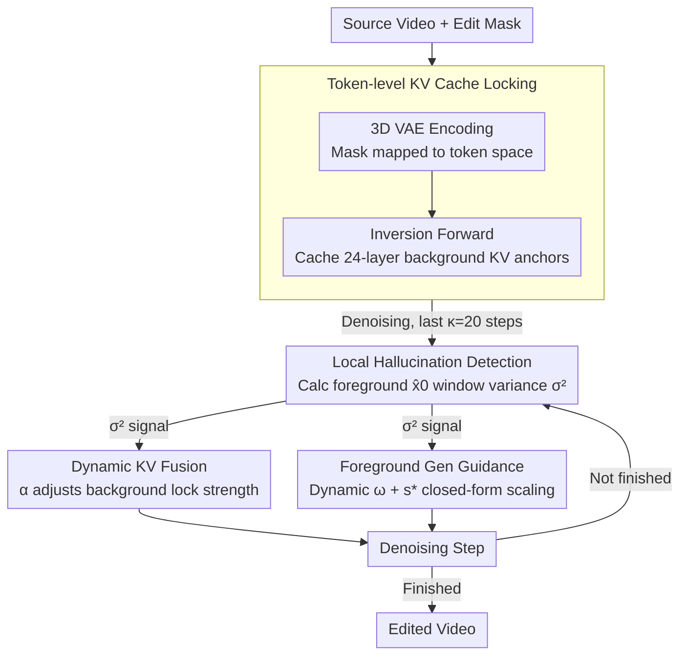

# When to Lock Attention: Training-Free KV Control in Video Diffusion

## Basic Information

- **Conference**: CVPR2026
- **arXiv**: [2603.09657](https://arxiv.org/abs/2603.09657)
- **Code**: Not released
- **Area**: Image Generation / Video Editing
- **Keywords**: Training-Free Video Editing, KV Cache, Classifier-Free Guidance, Diffusion Hallucination Detection, DiT

## TL;DR

KV-Lock is proposed as a training-free framework that dynamically schedules background KV cache fusion ratios and CFG guidance strength based on diffusion hallucination detection. It simultaneously ensures background consistency and foreground generation quality in video editing.

## Background & Motivation

The core challenge of video editing lies in maintaining high fidelity of background scenes while editing foreground objects. Existing methods face two extremes:

**Global Information Injection** (e.g., cross-attention manipulation, latent space interpolation): Editing effects easily leak into background areas, causing background artifacts and local hallucinations in attributes like color or pose.

**Rigid Background Locking** (fixed KV cache weights): Over-constrains the model's expressiveness, leading to degraded foreground generation quality.

Recent works (ProEdit, Follow-Your-Shape) utilize KV caches in DiT architectures for background preservation but employ fixed fusion weights or simple heuristic scheduling, failing to adaptively balance foreground quality and background consistency. This raises a core problem: **When should attention be locked to the cached KV, and when should the model be allowed to recompute attention patterns?**

The Key Insight of KV-Lock: Hallucination detection metrics in diffusion models ($\hat{x}_0$ trajectory variance) naturally correspond to the diversity regulation function of CFG guidance scales. The variance can serve as a unified scheduling signal to transform heuristic tuning into principled decision-making.

## Method

### Overall Architecture

KV-Lock is a plug-and-play training-free framework applicable to any pre-trained DiT model. The workflow consists of three stages:

1.  **Encoding Phase**: A 3D VAE encodes the source video into latent representations while mapping the edit mask to the token space.
2.  **Inversion Phase**: Forward diffusion is performed on the source video to cache source KV pairs at each timestep and Transformer layer.
3.  **Denoising Phase**: A hallucination-aware scheduler dynamically fuses new KV pairs with cached KV pairs (to preserve background) and adjusts CFG guidance strength (to optimize foreground).

The denoising phase acts as a feedback loop: in each step, the hallucination detection calculates a variance signal, which drives two "knobs": the background lock intensity and the foreground guidance strength.

### Key Designs

**1. Token-level KV Cache Locking: Precise background token identification**

To preserve the background, the model must identify which tokens belong to it. KV-Lock aligns the edit mask to the DiT token granularity. The source video $\mathcal{V}_{\text{src}} \in \mathbb{R}^{3 \times F \times H \times W}$ is encoded by a 3D VAE (compression ratio $s = (4, 8, 8)$). The edit mask $\mathcal{M}$ is max-pooled along the temporal dimension to align with the VAE:

$$m_0^{\text{latent},t} = \begin{cases} \max(\mathcal{M}_0), & t=0 \\ \max(\mathcal{M}_{[1+(t-1)s_t : 1+ts_t]}), & t \geq 1 \end{cases}$$

Max-pooling is used to ensure that if any frame in a time window requires editing, the corresponding latent position is marked as foreground. Then, the DiT patchifies the latent into $N$ tokens, and the mask is projected into the token space via 3D MaxPool:

$$m_{\text{token}} = \text{Flatten}(\text{MaxPool3D}(m_0^{\text{latent}}, \text{kernel}=p, \text{stride}=p)) \in \{0,1\}^N$$

Any token capturing edited pixels in its receptive field is considered foreground. With this token mask, background "content anchors" are cached: at each denoising step $t_k$, the source latent constructs a noisy input $z_{t_k}^{\text{src}}$, and the KV pairs $\mathcal{K}_k^\ell, \mathcal{V}_k^\ell$ for all $L=24$ layers are stored during a forward pass. Replacing background token KVs with cached source KVs pins the attention output to the source content manifold.

**2. Local Hallucination Detection: Unified variance signal**

KV-Lock uses the fluctuations of $\hat{x}_0$ in the foreground region as a proxy for hallucinations. Predicted $\hat{x}_0$ is flattened and averaged within the mask area:

$$\hat{x}_0^{\text{masked},(k)} = \frac{1}{B} \sum_{b=1}^{B} \text{Flatten}(\hat{x}_0^{(k,b)} \odot m_0^{\text{latent}})$$

Variance is then calculated within a sliding window:

$$\sigma_{\hat{x}_0^{(k)}}^2 = \frac{1}{W-1} \sum_{i=t_k-W+1}^{t_k} (\hat{x}_0^{\text{masked},(i)} - \bar{\hat{x}}_0^{\text{masked}})^2$$

A variance exceeding $\tau = 0.01$ indicates hallucination risk. In-support samples converge to consistent representations (low variance), while hallucinated samples oscillate between modes (high variance). Focusing only on the mask area prevents the signal from being diluted by stable background pixels.

**3. Hallucination-aware Dynamic KV Fusion: Adaptive locking**

Rather than locking the background rigidly, KV-Lock introduces an adjustable fusion rate $\alpha_k \in [0,1]$ that follows the denoising variance:

$$\alpha_k = \text{clamp}\left(\frac{\sigma_{\hat{x}_0^{(k)}}^2}{\tau}, 0, 1\right)$$

During the final $\kappa = 20$ sampling steps, weighted interpolation is applied to background tokens:

$$K_k^{\text{mix}} = m_{\text{token}} \odot K_k^{\text{new}} + (1 - m_{\text{token}}) \odot (\alpha_k \cdot \tilde{\mathcal{K}}_k^\ell + (1 - \alpha_k) \cdot K_k^{\text{new}})$$

$$V_k^{\text{mix}} = m_{\text{token}} \odot V_k^{\text{new}} + (1 - m_{\text{token}}) \odot (\alpha_k \cdot \tilde{\mathcal{V}}_k^\ell + (1 - \alpha_k) \cdot V_k^{\text{new}})$$

Foreground tokens remain free to utilize new KVs. High variance triggers tighter locking to prevent hallucinations from spreading into the background.

**4. Foreground Generation Guidance: Enhancing foreground quality**

To improve foreground generation while the background is locked, KV-Lock modifies CFG in two ways. First, it adds an optimizable scaling factor $s$ to the unconditional branch to compensate for noise estimation bias:

$$\tilde{\epsilon}_\theta(x_t, t | y) = (1 - \omega) \cdot s \cdot \epsilon_\theta(x_t, t | \emptyset) + \omega \cdot \epsilon_\theta(x_t, t | y)$$

A closed-form solution $s^*$ is derived by minimizing the error upper bound:

$$s^* = \frac{\langle \epsilon_\theta(x_t, t | y), \epsilon_\theta(x_t, t | \emptyset) \rangle}{\|\epsilon_\theta(x_t, t | \emptyset)\|2^2 + \varepsilon}$$

Geometrically, $s^*$ is the orthogonal projection of the conditional noise prediction onto the unconditional direction. Second, the guidance strength $\omega$ is dynamically adjusted based on variance:

$$\omega = \omega_0 \cdot \text{clamp}\left(\frac{\sigma_{\hat{x}_0^{(k)}}^2}{\tau}, 0, b\right)$$

Higher variance (hallucination risk) increases $\omega$, suppressing diversity to enforce alignment with the conditions.

## Key Experimental Results

### Main Results

| Method | SC↑ | BC↑ | AQ↑ | IQ↑ | Ave.↑ | SSIM↑ | PSNR↑ | User↑ | Time(s)↓ |
|:---|:---:|:---:|:---:|:---:|:---:|:---:|:---:|:---:|:---:|
| FateZero | 87.17 | 92.89 | 53.84 | 57.53 | 77.23 | 0.715 | 17.57 | 1.74 | 3.98 |
| FLATTEN | 92.90 | 95.54 | 53.24 | 59.41 | 79.71 | 0.772 | 19.30 | 2.60 | **1.14** |
| TokenFlow | 93.64 | 96.17 | 57.22 | 69.67 | 83.03 | 0.805 | 20.07 | 2.51 | 11.92 |
| CFG-Zero* | 93.80 | 95.99 | 61.22 | 71.04 | 84.16 | 0.911 | 26.65 | 4.01 | 5.58 |
| APG | 93.39 | 96.25 | 60.09 | 71.53 | 84.02 | 0.921 | 26.04 | 3.95 | 5.80 |
| ProEdit | 93.96 | 96.23 | 61.62 | **72.23** | 84.52 | 0.912 | 27.57 | 4.06 | 7.20 |
| VACE | 93.82 | 95.85 | 61.25 | 71.01 | 84.13 | 0.922 | **31.20** | 4.10 | 5.25 |
| **KV-Lock** | **94.56** | **96.92** | **62.15** | 72.18 | **84.87** | **0.931** | 31.04 | **4.21** | 7.39 |

### Ablation Study

| Configuration | SC↑ | BC↑ | MS↑ | Ave.↑ | SSIM↑ | PSNR↑ |
|:---|:---:|:---:|:---:|:---:|:---:|:---:|
| Var. KV Scheduling only | 93.01 | 95.89 | 98.10 | 83.69 | 0.913 | 31.01 |
| CFG ω Scheduling only | 93.32 | 93.89 | 97.72 | 83.46 | 0.922 | 29.84 |
| CFG s* Scheduling only | 91.76 | 92.18 | 96.92 | 82.24 | 0.914 | 29.59 |
| CFG s* + ω Scheduling | 93.28 | 95.71 | **98.63** | 84.05 | 0.913 | 30.55 |
| Fixed Fusion α=0.5 | 90.33 | 93.97 | 97.51 | 82.58 | 0.918 | 30.90 |
| Global Hallucination Detection | 93.14 | 95.85 | 98.28 | 84.05 | 0.925 | 30.96 |
| **Full Model** | **94.56** | **96.92** | 98.57 | **84.87** | **0.931** | **31.04** |

### Key Findings

1.  **Synergy of Modules**: Optimized performance requires the combination of KV scheduling, CFG $\omega$ scheduling, and CFG $s^*$ optimization.
2.  **Dynamic vs. Fixed Strategy**: Dynamic scheduling significantly outperforms fixed $\alpha=0.5$, validating the value of adaptive control.
3.  **Local vs. Global Detection**: Local detection prevents signal dilution, improving SSIM from 0.925 to 0.931.
4.  **Comparison with Training-based VACE**: Ours outperforms VACE in VBench Ave. (84.87 vs 84.13) and user preferences.
5.  **Inference Overhead**: 7.39s/iter, mainly due to KV caching and sliding window calculations, with ~10GB additional VRAM.

## Highlights & Insights

- **Theory-driven Unified Scheduling**: Correlating variance with hallucination risk to drive both KV fusion and CFG intensity is an elegant design.
- **Closed-form CFG Scaling $s^*$**: Derives an analytical solution via orthogonal projection to eliminate unobservable noise without iterative optimization.
- **Plug-and-play**: Training-free and seamlessly integrates into pre-trained DiT models.
- **Comprehensive Evaluation**: Extensive testing across VBench, background metrics, and user studies with detailed ablations.

## Limitations & Future Work

- Slower inference speed (7.39s/iter) due to the required source video pre-run.
- Additional GPU memory overhead (~10GB).
- Dependency on external masks for foreground/background separation.
- Hallucination detection via variance might miss non-variance-type hallucinations.
- Baseline discrepancies (some models use SD 2.1 vs. Wan 2.1).

## Rating

⭐⭐⭐⭐ (4/5)

- **Novelty** ⭐⭐⭐⭐: The idea of driving dynamic scheduling via hallucination detection is novel and theoretically grounded.
- **Experiments** ⭐⭐⭐⭐: Comprehensive metrics and ablations, though sample size is somewhat small.
- **Writing** ⭐⭐⭐⭐: Mathematically rigorous with clear logic and frameworks.
- **Value** ⭐⭐⭐: Training-free and plug-and-play are major advantages, though inference speed and mask dependency are limiting factors.

<!-- RELATED:START -->

## Related Papers

- [\[ICCV 2025\] LeanVAE: An Ultra-Efficient Reconstruction VAE for Video Diffusion Models](../../ICCV2025/video_generation/leanvae_an_ultra-efficient_reconstruction_vae_for_video_diffusion_models.md)
- [\[ICCV 2025\] V.I.P.: Iterative Online Preference Distillation for Efficient Video Diffusion Models](../../ICCV2025/video_generation/vip_iterative_online_preference_distillation_for_efficient_video_diffusion_model.md)
- [\[ICCV 2025\] Prompt-A-Video: Prompt Your Video Diffusion Model via Preference-Aligned LLM](../../ICCV2025/video_generation/prompt-a-video_prompt_your_video_diffusion_model_via_preference-aligned_llm.md)
- [\[ICCV 2025\] EfficientMT: Efficient Temporal Adaptation for Motion Transfer in Text-to-Video Diffusion Models](../../ICCV2025/video_generation/efficientmt_efficient_temporal_adaptation_for_motion_transfer_in_text-to-video_d.md)
- [\[CVPR 2025\] DynamicScaler: Seamless and Scalable Video Generation for Panoramic Scenes](../../CVPR2025/video_generation/dynamicscaler_seamless_and_scalable_video_generation_for_panoramic_scenes.md)

<!-- RELATED:END -->
