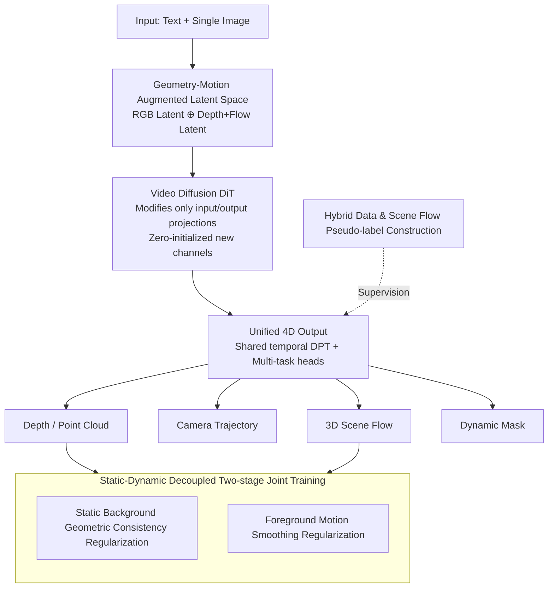

# WorldReel: 4D Video Generation with Consistent Geometry and Motion Modeling

**Conference**: CVPR 2026  
**Paper**: [CVF Open Access](https://openaccess.thecvf.com/content/CVPR2026/html/Fang_WorldReel_4D_Video_Generation_with_Consistent_Geometry_and_Motion_Modeling_CVPR_2026_paper.html)  
**Code**: None (project page only: https://bshfang.github.io/worldreel/ )  
**Area**: Video Generation / 4D Generation / World Models  
**Keywords**: 4D Video Generation, Geometry-Motion Latent Space, Scene Flow, Video Diffusion, DPT Multi-task

## TL;DR
WorldReel augments the latent space of video diffusion models with "depth + optical flow." This allows the model to directly generate per-frame point clouds, camera trajectories, 3D scene flow, and dynamic masks concurrently with RGB output. Utilizing precise 4D labels from synthetic data along with specific regularization terms, it decouples the supervision of static geometry and dynamic motion. Consequently, it produces spatio-temporally consistent videos even under large camera and non-rigid movements, reducing the depth log-RMSE from 0.353 to 0.287.

## Background & Motivation
**Background**: Current mainstream video generators (such as CogVideoX and Sora-style DiTs) achieve stunning image quality and temporal smoothness, generating realistic videos under highly diverse prompts.

**Limitations of Prior Work**: These models do not maintain a "single stable 3D scene that consistently evolves over time." This manifests as view-time drift, geometric flicker, and the entanglement of camera and object motion. These deficiencies are heavily amplified when extrapolating viewpoints or editing scene contents (common world model scenarios).

**Key Challenge**: To achieve 4D generation, neither of the existing major pathways is viable: ① Optimization-based methods (SDS distillation of explicit 4D representations) are computationally extremely heavy and generally restricted to processing a single dynamic object; ② Post-processing-based methods (generating controllable 2D videos first and then lifting them post-hoc to 3D) fundamentally inherit the geometric inconsistencies of 2D video generation priors and struggle to generalize to in-the-wild dynamics. **No existing method natively embeds true 4D spatial structures into generative priors**.

**The other side of the key challenge is data**: Precise 4D labels (depth, camera parameters, and scene flow) are almost exclusively obtainable from synthetic data. However, synthetic data operates on a small scale and exhibits an appearance distribution vastly different from the real world. Real-world videos offer rich diversity but lack clean 4D ground-truth labels. Balancing the utilization of precise synthetic supervision while maintaining realism is a major trade-off.

**Goal**: Train a natively spatio-temporally consistent 4D video generator that outputs a complete explicit 4D scene representation (point clouds, camera trajectories, and dense flow) concurrently with video generation, using this explicit representation to enforce "a single underlying scene spanning time and viewpoints."

**Key Insight**: The authors observe that depth maps and optical flows are naturally aligned with RGB frames as dense, image-like modalities, and can directly reuse a pretrained 3D VAE encoder. Moreover, since they are "3D-focused and filter out appearance textures," they shrink the domain gap between synthetic and real-world data distributions. Hence, they can be treated as additional channels in the latent space to inject 4D inductive biases.

**Core Idea**: Feed an "appearance-agnostic, geometry-motion augmented latent space" to the video DiT, then map this latent space to a unified 4D output using a shared temporal DPT decoding head with explicit supervision. This allows geometry and motion gradients to backpropagate into the latent space, forcing the model to learn a 3D-consistent internal scene representation.

## Method

### Overall Architecture
WorldReel is built upon a pretrained video latent diffusion model (CogVideoX-5B-I2V). The pipeline is split on both sides: the **input side** concatenates the RGB latents and the geometry-motion latents encoded from "depth + optical flow" along the channel dimension, sending this augmented latent space to the DiT; the **output side** utilizes a shared temporal DPT decoder to predict a unified 4D representation (per-frame point clouds/depth, calibrated camera, 3D scene flow, and dynamic masks) from the latent variables, applying explicit supervision and regularization to these outputs. Training utilizes "synthetic (precise labels) + real-world (pseudo labels)" hybrid data in two stages: first, training the DiT and DPT head separately, followed by end-to-end joint training with added static/dynamic decoupling regularization terms. During inference, only a text prompt + single image are required, without needing extra inputs.

### Key Designs

**1. Geometry-Motion Augmented Latent Space: Injecting 4D Priors into the Video Latent Space**

Video DiTs originally only model within the RGB latent space, which lacks 3D geometric and motion inductive biases, leading to 3D drift in generated videos. WorldReel's approach is: take per-frame depth $D_i \in \mathbb{R}^{H\times W\times 1}$ and forward 2D optical flow $F^{2d}_i \in \mathbb{R}^{H\times W\times 2}$, normalize them to the same range as RGB via $\tilde D_i = 2\cdot\frac{D_i - d_{\min}}{d_{\max}-d_{\min}} - 1$ and $\tilde F^{2d}_i = \frac{F^{2d}_i}{|F^{2d}|_{\max}}$, encode them into geometry-motion latents $z^{gm}_0 = E([\tilde D; \tilde F^{2d}])$ using a **pretrained 3D VAE**, and finally concatenate them with the original video latents along the channel dimension $z_0 = [z^{rgb}_0; z^{gm}_0]$ to feed into the DiT.

Choosing depth + optical flow instead of other representations is because they are dense, image-like modalities just like RGB, allowing them to be encoded/decoded directly by existing 3D VAEs and scale with foundation models. Furthermore, being "3D-focused", they filter out appearance textures and narrow the synthetic-to-real distribution gap—this is precisely the prerequisite for safely utilizing the precise labels from synthetic data.

**2. Adapting Pretrained DiT with Minimal Modifications + Zero Initialization: Preserving Generative Capabilities**

After doubling the latent channels, drastic architectural changes would discard the pretrained weights. The authors only modify the **input/output projection layers** of the DiT to accommodate the doubled channels, keeping all intermediate blocks untouched. They apply **zero-initialization** to the input projection layer: the weights matching the original video latents $z^{rgb}$ are loaded from the pretrained model, while the newly expanded parameters corresponding to the geometry-motion latents $z^{gm}$ are initialized to 0. Consequently, the model's behavior at the onset of training is identical to the original video diffusion model, allowing the geometry-motion signals to "grow gradually," avoiding training instability and significantly boosting robustness.

**3. Unified 4D Output Representation + Shared DPT Multi-task Head: Enabling Geometric Gradient Backpropagation**

Leveraging only input-side depth/optical flow (2.5D) is insufficient to restore 3D structures, especially since camera and object motions are entangled in 2.5D and impossible to decouple. Therefore, on the output side, WorldReel directly predicts fine-grained 4D representations $(D_i, P_i, C_i, F^{3d}_i, M_i)$: camera intrinsics/extrinsics $C_i\in\mathbb{R}^9$, point clouds $P_i$, 3D scene flow $F^{3d}_i$, and dynamic masks $M_i$. Here, camera, point clouds, and scene flow are all represented in the **canonical coordinate system of the first frame**, ensuring the same scene is described across frames.

In practice, a **customized temporal DPT decoder** is utilized: multi-scale dense features are extracted from the latents and aggregated through a DPT fusion backbone with temporal transformers. **Only the final layer** splits into multiple lightweight task heads to predict each task. This shared backbone reduces parameters and serves as a strong regularizer—forcing the model to learn a unified, geometrically consistent representation for all tasks. Explicit supervision on these 4D outputs backpropagates geometry-related gradients into the latent space, thereby helping decouple camera motion from object motion and compressing 3D dynamics into a better latent space. Among these, the 3D scene flow $F^{3d}$ directly encodes 3D dynamics, cleaner than 2D optical flow/keypoint tracking in separating camera and object motion, operating in a physically meaningful evolving 3D coordinate system.

**4. Decoupled Static-Dynamic Two-Stage Joint Training and Regularization: Balancing Static Invariance and Dynamic Smoothness**

Training is divided into two stages.
**In the first stage**, components are trained separately: first, the geometry-motion augmented DiT is finetuned (using the standard diffusion loss $\mathcal{L}_{diff} = \mathcal{L}^{rgb}_{diff} + \mathcal{L}^{gm}_{diff}$), and then the temporal DPT head is trained from scratch using the multi-task loss:
$$\mathcal{L}_{dpt} = \mathcal{L}_{depth} + \mathcal{L}_{pc} + \mathcal{L}_{cam} + \mathcal{L}_{mask} + \lambda_{flow}\mathcal{L}_{flow}$$
(L1 loss with valid masks for depth/point clouds, Huber loss for camera, BCE for masks, and flow is pixel-wise reweighted by the dynamic mask to focus on foreground motion).
**In the second stage**, end-to-end joint training is performed, adding split regularization for background and foreground masks: for the **static background**, a depth consistency regularization $\mathcal{L}^{depth}_{reg} = \sum_i\sum_j \|\hat M^{bg}_i \odot (D_j - \text{Proj}(D_i, T_{i\to j}))\|_2$ is enforced (projecting the first-frame depth at frame $i$ into frame $j$ via camera relative pose $T_{i\to j}$, requiring consistency with $D_j$); for the **dynamic foreground**, a spatial gradient smoothing regularization for the scene flow is applied: $\mathcal{L}^{flow}_{reg} = \sum_i (\|\hat M^{fg}_i \odot \nabla_x F^{3d}_i\|_2 + \|\hat M^{fg}_i \odot \nabla_y F^{3d}_i\|_2)$. The joint target is $\mathcal{L} = \mathcal{L}_{diff} + \lambda_{dpt}\mathcal{L}_{dpt} + \lambda_{reg}\mathcal{L}_{reg}$.

This divide-and-conquer approach of "preserving geometric consistency for static parts and motion smoothness for dynamic parts" is crucial: experiments show that compared to regularization focusing purely on static geometry (like GeoVideo), models tend to collapse into generating static content to maintain consistency at the cost of dynamics. WorldReel bypasses this trade-off by explicitly supervising the static and dynamic components separately.

**5. Hybrid Data and Scene Flow Pseudo-label Construction: Enriching Diversity with Real-world Data and 自造 3D Scene Flow**

Precise 4D labels are almost exclusively available in synthetic datasets (e.g., PointOdyssey, BEDLAM, Dynamic Replica, Omniworld-Game), but synthetic data lacks scale and scene complexity. The authors supplement this with high-quality real-world videos filtered from Panda-70M via SpatialVid, re-annotating them with SOTA foundation models: depth is obtained using GeometryCrafter for temporally smooth sequences, camera/depth/foreground masks via ViPE, and point clouds are obtained by back-projecting depth (aligned to the canonical frame of the first frame).

The most challenging component is the scene flow—for which ground truth is virtually unavailable. Drawing inspiration from zero-MSF, the authors construct dense 3D scene flow pseudo-labels from optical flow and geometric labels: using SEA-RAFT to calculate forward/backward optical flow and pixel-level uncertainties, they define a forward mapping $\mathbf{q}(\mathbf{u}) = \mathbf{u} + F^{2d}_{i\to i+1}(\mathbf{u})$ for pixel $\mathbf{u}$ in frame $i$, yielding:
$$\hat F^{3d}_i(\mathbf{u}) = \begin{cases} P_{i+1}(\mathbf{q}(\mathbf{u})) - P_i(\mathbf{u}), & \text{if } \hat M_i(\mathbf{u}) = 1 \\ \mathbf{0}, & \text{otherwise} \end{cases}$$
This calculates 3D displacement by establishing correspondence between neighboring point clouds via optical flow. Since such labels contain high noise, a validity mask $M^{flow}_i$ is superimposed, preserving only pixels that pass foreground/instance, uncertainty, and forward-backward consistency checks, which is then used in training the $\mathcal{L}_{flow}$ and $\mathcal{L}^{flow}_{reg}$ losses.

### Loss & Training
Base model: CogVideoX-5B-I2V, generating $480 \times 720$, 49-frame videos. The 4D representations are downsampled to 13 frames at the same resolution. Two phases: first finetuning the geometry-motion augmented DiT for 20K steps, independently training the DPT head for 100K steps; then joint end-to-end training for 10K steps. Config: 8×H200, batch step 8, AdamW, learning rate 2e-5; $\lambda_{flow}=5.0$, $\lambda_{dpt}=0.1$, $\lambda_{reg}=0.5$.

## Key Experimental Results

### Main Results
Evaluation is conducted on two benchmarks built on the SpatialVid validation set: general motion (500 random videos) and complex motion (500 videos with the largest 3D camera/object motion). Metrics used include 5 dimensions from VBench (dynamic degree d.d., motion smoothness m.s., i2v-subject/background, subject consistency) + FVD/FID.

| Dataset | Metric | WorldReel | GeoVideo | 4DNeX | Description |
|--------|------|-----------|----------|-------|------|
| General | d.d. ↑ | **0.73** | 0.54 | 0.03 | Dynamic degree far exceeds baselines |
| General | FVD ↓ | **336.1** | 371.3 | 712.5 | -9.5% relative to GeoVideo trained on the same data |
| General | FID ↓ | **36.58** | 46.78 | 44.97 | Best visual quality |
| Complex | d.d. ↑ | **1.00** | 0.79 | 0.19 | Perfect dynamic degree score on complex set |
| Complex | FVD ↓ | **394.2** | 409.9 | 632.8 | -3.8% FVD reduction |

While 4DNeX achieves high subject consistency (0.983), its dynamic degree is only 0.03 and FVD is 712.5, indicating it collapses into near-static videos—consistency is achieved by "not moving."

4D scene geometry quality (Table 2, using ViPE pseudo-ground-truth, log-RMSE/δ for depth, ATE/RTE/RRE for camera):

| Metric | WorldReel | GeoVideo | 4DNeX |
|------|-----------|----------|-------|
| Depth log-rmse ↓ | **0.287** | 0.353 | 0.479 |
| Depth δ1.25 ↑ | **71.1** | 63.4 | 39.9 |
| ATE ↓ | **0.005** | 0.011 | 0.006 |
| RTE ↓ | **0.007** | 0.012 | 0.017 |
| RRE ↓ | **0.317** | 0.443 | 0.378 |

WorldReel achieves overall optimal performance in depth and camera pose metrics; although 4DNeX shows a low ATE, its trajectory length and rotation are near zero, implying the camera barely moves.

### Ablation Study

| Configuration | General FVD ↓ | Complex FVD ↓ | Complex d.d. ↑ | Description |
|------|--------------|---------------|----------------|------|
| base finetuned | 383.4 | 437.0 | 0.98 | Finetuning the base model only |
| w/o g.m. | 359.2 | 452.8 | 0.93 | Removing geometry-motion latents causes complex FVD to rebound (452.8, worse than base) |
| w/o joint | 354.5 | 411.8 | 0.96 | Removing joint training/regularization |
| freeze dpt | 336.0 | 382.3 | 0.98 | Freezing the DPT head yields the lowest FVD |
| **full**| 336.1 | 394.2 | **1.00** | Lowest FID, perfect dynamic degree on complex |

Ablation of geometric modules (Table 2): *w/o geomotion* sees depth δ rise to 67.2 but RTE/trajectory deteriorates; *w/o joint* degrades depth log-rmse to 0.399 and increases camera RRE to 0.410, confirming joint training is critical for 4D consistency.

### Key Findings
- **Geometry-motion latents are critical for complex dynamics**: Adding joint training + regularization directly on the RGB-only model (*w/o g.m.*) yields a complex set FVD (452.8) that is even worse than native finetuning (437.0). This indicates that regularization is only meaningful when built upon the geometry-motion latent.
- **Static geometry regularization will backfire on dynamics**: GeoVideo focuses purely on static geometric consistency, which biases the model toward static content. WorldReel explicitly supervises the static and dynamic components separately, lifting the dynamic degree from 0.54 to 0.73 (general) and from 0.79 to 1.0 (complex).
- **Freeze dpt obtains the lowest FVD while full obtains the lowest FID + perfect dynamic degree**: The authors chose *full* as the primary model, highlighting the trade-off between FVD and dynamic degree/visual quality.

## Highlights & Insights
- **Dual approach of "Input Injection + Output Supervision"**: Injecting 2.5D priors (depth + optical flow) on the input side provides inductive biases, while predicting complete 4D scenes on the output side backpropagates geometric gradients into the latent space. Relying solely on input is 2.5D (unable to decouple camera/object motion) and relying solely on output supervision lacks priors; the synergy of both compresses 4D structures into the latent space.
- **Zero-initialized expanded channels**: Setting new channel weights to zero when reusing the pretrained DiT allows the model to transition smoothly from "equivalent to the original model," which is a highly reusable trick for adapting pretrained large models to new modalities.
- **Constructing scene flow pseudo-labels**: Constructing dense 3D scene flow pseudo-labels by building correspondences between neighboring point clouds via optical flow, filtered via multi-consistency checks, sidesteps the lack of ground-truth 3D scene flow data. It can be transferred to any task requiring dynamic 3D supervision.
- **Shared DPT backbone as a regularizer**: Sharing a single decoding backbone across all 4D tasks and only splitting at the final heads reduces parameters and forces the model to learn a unified geometric representation. This is an excellent paradigm for multi-task dense prediction.

## Limitations & Future Work
- Training requires additional 4D supervision (camera, geometry, scene flow), which currently heavily relies on synthetic data. Despite mitigation strategies, the domain gap still limits generalization to rare movements/dynamics.
- The temporal window is limited; the model fails under dramatic topological changes, severe occlusions, and very fast motion.
- Caveat: The 4D labels depend on a cascade of existing foundation models (GeometryCrafter, ViPE, SEA-RAFT). The pseudo-label quality is bounded by these models; moreover, the evaluation "ground-truth" for geometry also comes from ViPE, which is self-consistent but not absolute ground-truth. Cross-method comparisons require cautious interpretation.
- Future Work: Utilizing weakly/self-supervised 4D signals to reduce supervision reliance; using streaming/causal diffusion to extend the temporal context for persistent world state preservation; and adding controllable scene decomposition for long-horizon interactive 4D generation.

## Related Work & Insights
- **vs GeoVideo [3]**: GeoVideo adds explicit geometric regularization to improve static 3D consistency, but focusing purely on static geometry penalizes dynamic content generation. WorldReel models both geometry and motion and supervises them separately, circumventing this trade-off to win on both dynamic degree and visual quality.
- **vs 4DNeX [10]**: 4DNeX jointly models videos and point cloud geometry, but does not explicitly model scene dynamics, resulting in static camera behaviors and general model collapsing. WorldReel explicitly outputs scene flow and camera trajectories, yielding a significantly higher dynamic degree.
- **vs DimensionX [52] etc. lifting 4D**: These lift-based 4D methods generate controlled 2D videos and rely on a separate reconstruction stage to construct 4D representations, inheriting 2D inconsistencies. WorldReel natively integrates 4D structures into the generative prior, requiring no separate reconstruction phase during inference.
- **vs Optimization-based 4D (SDS Distillation) [2,38,43]**: Those optimization-based methods are computationally heavy and generally restricted to single objects. WorldReel is feed-forward and targets complex dynamic scenes.

## Rating
- Novelty: ⭐⭐⭐⭐⭐ First feed-forward framework to natively embed complete 4D structures (point clouds + camera + scene flow) into video generation priors and supervise them with static-dynamic decoupled regularization.
- Experimental Thoroughness: ⭐⭐⭐⭐ Dual motion difficulty datasets + dual-evaluation (video and geometric quality) + comprehensive ablations, though lacks absolute real-world 4D ground truth, relying instead on pseudo-GT.
- Writing Quality: ⭐⭐⭐⭐ Clear motivation and method logic with well-coordinated mathematical formulas and data flow diagrams.
- Value: ⭐⭐⭐⭐⭐ Greatly advances video generation towards renderable, editable, and agent-ready 4D-consistent world modeling; highly valuable direction.

<!-- RELATED:START -->

## Related Papers

- [\[CVPR 2026\] Geometry-as-context: Modulating Explicit 3D in Scene-consistent Video Generation to Geometry Context](geometry-as-context_modulating_explicit_3d_in_scene-consistent_video_generation_.md)
- [\[ICLR 2026\] Geometry Forcing: Marrying Video Diffusion and 3D Representation for Consistent World Modeling](../../ICLR2026/video_generation/geometry_forcing_marrying_video_diffusion_and_3d_representation_for_consistent_w.md)
- [\[ICLR 2026\] Geometry-aware 4D Video Generation for Robot Manipulation](../../ICLR2026/video_generation/geometry-aware_4d_video_generation_for_robot_manipulation.md)
- [\[CVPR 2026\] StereoWorld: Geometry-Aware Monocular-to-Stereo Video Generation](stereoworld_geometry-aware_monocular-to-stereo_video_generation.md)
- [\[ICML 2026\] VideoGPA: Distilling Geometry Priors for 3D-Consistent Video Generation](../../ICML2026/video_generation/videogpa_distilling_geometry_priors_for_3d-consistent_video_generation.md)

<!-- RELATED:END -->
