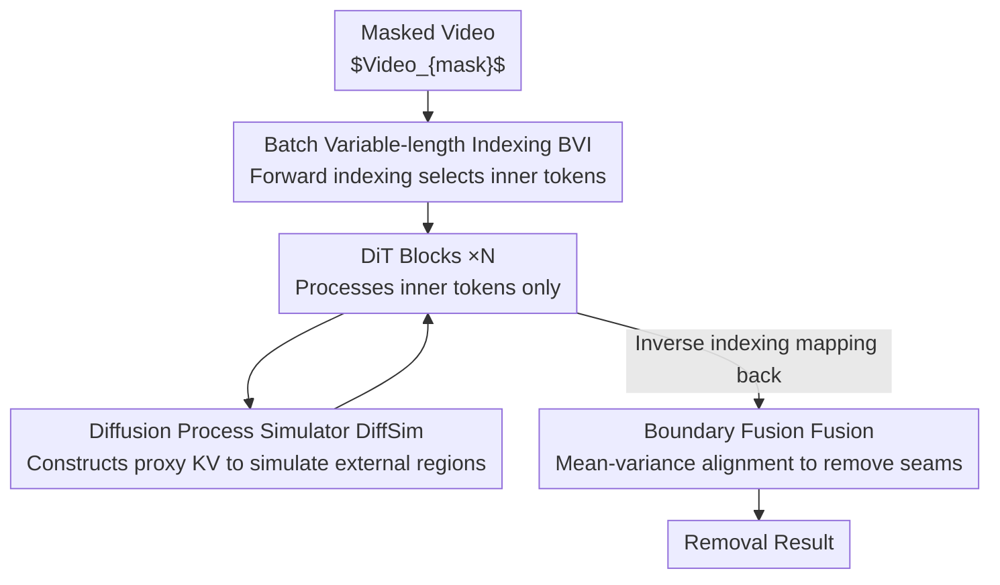

# YOSE: You Only Select Essential Tokens for Efficient DiT-based Video Object Removal

**Conference**: CVPR 2026  
**Paper**: [CVF Open Access](https://openaccess.thecvf.com/content/CVPR2026/html/Wu_YOSE_You_Only_Select_Essential_Tokens_for_Efficient_DiT_based_Video_CVPR_2026_paper.html)  
**Code**: https://github.com/Wucy0519/YOSE-CVPR26 (Available)  
**Area**: Video Generation / Diffusion Models / Video Object Removal / Efficient DiT  
**Keywords**: Diffusion Transformer, Video Object Removal, token sparsification, mask-aware acceleration, fine-tuning framework  

## TL;DR
YOSE is a plug-and-play fine-tuning framework: it transforms DiT-based video object removal (e.g., MiniMax Remover) from "dense computation on all spatio-temporal tokens" to "processing only tokens within masked regions while using a lightweight module to simulate the external influence on self-attention." This allows inference time to decrease approximately linearly with mask area, achieving $2.5\times$ speedup in 70% of real-world scenarios with almost no loss in image quality.

## Background & Motivation
**Background**: With its global modeling capabilities, the Diffusion Transformer (DiT) has achieved spatio-temporal consistency and scalability significantly surpassing UNet-based diffusion models in video generation. Video Object Removal (VOR) benefits from this, with representative methods such as MiniMax Remover, ROSE, and VACE unifying "object erasure + background reconstruction" within the DiT generation framework, reaching SOTA quality.

**Limitations of Prior Work**: These methods suffer from slow inference. MiniMax Remover runs at only about 10 FPS at 480p, primarily because it inherits the "full-token computation" paradigm of DiT—regardless of how small the mask is, denoising and attention must be performed across the **entire spatio-temporal token space**. However, VOR is essentially a **local** generation task: only the masked area requires reconstruction, while unmasked areas should remain unchanged. Statistics on DAVIS and YouTube-VOS show that approximately 70% of samples have masks occupying less than 20% of the area, with very few exceeding 40%.

**Key Challenge**: The computational cost of existing methods is **independent** of (constant relative to) mask size, whereas masks in real tasks are typically small—meaning the vast majority of compute is wasted on background tokens that do not need modification. The smaller the mask, the more severe the waste.

**Goal**: To make the computational load scale **linearly** with the mask area without redesigning the model architecture or sacrificing image quality. This requires solving two sub-problems: (1) how to feed only masked tokens into the DiT while maintaining differentiability and batch training capability; (2) how to ensure the model still "perceives" the external context after calculating only internal tokens to avoid semantic/motion fractures at boundaries.

**Key Insight**: You Only Select Essential Tokens (YOSE)—use a differentiable dynamic indexing operator to extract masked region tokens for the DiT, and use a lightweight module to **simulate** the influence of external tokens on self-attention, thereby preserving global consistency without actually computing external tokens.

## Method

### Overall Architecture
Given a masked video $Video_{mask}$, the YOSE processing pipeline is as follows: first, **BVI (Batch Variable-length Indexing)** dynamically selects "inner" (masked region) token sequences $St_{in}$ based on the mask, discarding redundant external tokens; as this sequence enters each DiT block, the **DiffSim (Diffusion Process Simulator)** does not compute external tokens but instead uses noisy latents and masked video latents to construct proxy Keys/Values that simulate the contribution of external regions to self-attention, allowing internal tokens to still "attend" to global semantics; after DiT processing, the **inverse index** $Ind_B$ from BVI is used to paste the results back to their original spatio-temporal positions; finally, **Fusion (Boundary Fusion)** performs mean-variance alignment on the overlapping zones to eliminate seams. The entire framework only trains three sets of parameters within DiffSim, with all other weights frozen, making it a lightweight fine-tuning plugin "mounted" on MiniMax Remover.

### Key Designs

**1. Batch Variable-length Indexing (BVI): Replacing hard indexing with differentiable sampling to make "mask-only token selection" both back-propagatable and batchable**

The most naive approach is $St_{in} = Video_{mask}[mask]$ to extract tokens and $Video_{mask}[mask] = St_{in}^{out}$ to paste them back. However, this hard indexing has two fatal flaws: first, discrete addressing like `Tensor[mask]` **cuts off gradients**, preventing end-to-end training; second, each sample in a batch has a different number of masked tokens, leading to mismatched tensor lengths that **cannot be processed in parallel batches**. BVI solves this by rewriting "discrete mask-based sampling" as "continuous coordinate mapping"—using `grid_sample` (denoted as $GSample$) for interpolation-based differentiable selection: forward token extraction is written as $St_{in} = GSample(Video_{mask}, Ind_F)$, and reconstruction uses the inverse index $Video_{out} = GSample(St_{in}^{out}, Ind_B)$, allowing gradients to flow back through both video features and sampling coordinates. Regarding the variable-length issue, BVI counts tokens per sample and pads them to the maximum length $L_{max}$ within the batch (Alg. 1 uses `Linspace` to spread normalized coordinates on $[1/2L-1, 1-1/2L]$, collecting mask-hit coordinates for the forward pass and constructing reconstruction coordinates with padding for the backward pass). Thus, the total computational complexity becomes proportional to the **number of masked tokens** rather than the total video tokens, granting YOSE linear complexity relative to mask area while enabling batched training.

**2. Diffusion Process Simulator (DiffSim): Simulating external context in self-attention without computing external tokens**

Processing only internal tokens loses context dependencies between inner and outer regions—critical for VOR (semantic continuity and motion consistency at boundaries). If internal tokens can only attend to each other, the reconstructed area will disconnect from its surroundings. DiffSim's logic: since for full-token DiT, the inputs for external tokens are noisy video latents $Lat_{Nis}$ and the prediction targets are noise (both known during inference), their intermediate states can be **directly approximated** without actually sending them through the DiT. Specifically, inspired by flow-matching loss, DiffSim constructs a residual latent:

$$Res_{Nis} = Lat_{Nis} - Lat_{mask}$$

This captures the direction in which noise evolves toward the target latent state under the learned flow field. Combining $Res_{Nis}$ and the masked video latent $Lat_{mask}$ simulates the intermediate state of external tokens, generating proxy Keys/Values for internal tokens to attend to. The combination is controlled by three sets of learnable parameters in each DiT block: the combination parameter $G$ determines the interpolation ratio between the reconstructed latent and the residual component:

$$KV = G[i] \cdot Lat_{mask} + (1 - G[i]) \cdot Res_{Nis}$$

The scaling parameter $S$ and bias parameter $Bias$ then modulate the distribution of the KV:

$$KV = (1 + S[i]) \cdot KV + Bias[i]$$

The simulated K/Vs mimic the response of external regions, allowing the DiT's internal attention to remain "globally aware" without adding any token-level computation, ensuring consistency across mask boundaries within a unified latent space. Only these three sets of parameters ($G, S, Bias$) are trainable.

**3. Boundary Fusion (Fusion): Eliminating seams with local mean-variance alignment**

Even if internal reconstruction is high-quality, slight inconsistencies may appear at mask boundaries due to lack of shared context statistics. Fusion concludes the process with "local mean-variance alignment": the original $mask$ is dilated into $mask_{dilate}$, and the difference defines the overlap zone $mask_{overlap} = mask_{dilate} - mask$. Within this zone, the predicted part $Pred_{overlap}$ and the original unmasked part $Orig_{overlap}$ are extracted to calculate their respective means and variances $(\mu_{pred}, \sigma_{pred})$ and $(\mu_{orig}, \sigma_{orig})$. The predicted region is normalized and rescaled to match the statistical distribution of the surrounding area:

$$St_{in} = \frac{\sigma_{orig} \cdot (St_{in} - \mu_{pred})}{\sigma_{pred}} + \mu_{orig}$$

Finally, a weighted mask $M_{fus} = (mask + mask_{dilate})/2$ blends the reconstruction with the original video for a smooth transition, eliminating visible seams.

### Loss & Training
YOSE is trained using the flow-matching paradigm, with losses constrained to the masked region—the mask-aware flow matching loss is:

$$L_{FM}^{mask} = \frac{\|mask \odot (out - Noise\text{-}GT)\|_2^2}{\|mask\|_1}$$

where $\odot$ denotes element-wise multiplication. This only penalizes diffusion predictions within the masked area, ensuring precise and efficient erasure consistent with the learned diffusion trajectory. During training, only the $G, S, Bias$ parameters of DiffSim are unfrozen (to preserve original model capabilities). With a total batch size of 32 (8 GPUs), 17 frames, 480×832 resolution, AdamW, a learning rate of 5e-5, and 2K steps on ~70K samples from VPData, training takes roughly 4 hours—an extremely low cost.

## Key Experimental Results

### Main Results
On YouTube-VOS and DAVIS, YOSE was evaluated by being applied to two DiT backbones: MiniMax Remover and VACE. The results show that image quality remains largely comparable or slightly improved, while efficiency increases significantly; notably, when applied to VACE (which has weaker background fidelity), YOSE significantly improves background metrics (as it leaves unmasked regions untouched).

| Dataset | Method | PSNR↑ | SSIM↑ | LPIPS↓ | Aes.Qua.↑ |
|--------|------|-------|-------|--------|-----------|
| YouTube-VOS | MiniMax Remover | 30.33 | 0.9116 | 0.0615 | 0.3920 |
| YouTube-VOS | **Ours (MiniMax)** | 31.01 (+0.68) | 0.9120 | 0.0642 | 0.3927 |
| YouTube-VOS | VACE | 23.72 | 0.8322 | 0.1322 | 0.4127 |
| YouTube-VOS | **Ours (VACE)** | 29.19 (+5.47) | 0.8994 (+0.07) | 0.0746 | 0.3898 |
| DAVIS | MiniMax Remover | 29.37 | 0.8723 | 0.0836 | 0.4404 |
| DAVIS | **Ours (MiniMax)** | 29.59 (+0.22) | 0.8703 | 0.0826 | 0.4432 |
| DAVIS | VACE | 25.09 | 0.8221 | 0.1228 | 0.4481 |
| DAVIS | **Ours (VACE)** | 28.28 (+3.19) | 0.8604 (+0.04) | 0.0896 | 0.4399 |

In terms of efficiency, YOSE's FLOPs satisfy $G(\gamma) = \gamma \times (49 + 12c + 4n + 4hn/c + 9f)\beta\eta + \dots$ (where $\gamma$ is the mask ratio), showing a linear relationship with $\gamma$. Measured latency: at a 5% mask ratio, speedup is $3.3\times$ compared to the full-token DiT baseline; at 20% (most real scenes), speedup remains $2.5\times$; as the mask reaches 80% coverage, performance degrades to match full-token inference—meaning the worst case is no slower than the baseline.

### Ablation Study
Ablations were conducted on DAVIS using MiniMax Remover as the backbone (Tab. 2). Both input components of DiffSim, $Lat_{Nis}$ (Nis.) and $Lat_{mask}$ (Ma.), are indispensable, and the Fusion (Fus.) strategy is responsible for boundary smoothing.

| Config | Dyn.Deg.↑ | Aes.Qua.↑ | PSNR↑ | SSIM↑ | Note |
|------|-----------|-----------|-------|-------|------|
| Nis + Ma + Fus (Full) | 0.5778 | 0.4432 | 29.59 | 0.8703 | Full YOSE |
| Ma only (w/o $Lat_{Nis}$) | 0.5444 | 0.4316 | 27.62 | 0.8559 | Insufficient sim, PSNR drops ~2dB |
| Nis only (w/o $Lat_{mask}$) | 0.5778 | 0.4382 | 27.67 | 0.8559 | Also significant drop |
| Ma + Nis, w/o Fusion | 0.5667 | 0.4320 | 28.42 | 0.8606 | Visible seams appear |

### Key Findings
- **DiffSim's two latent components must be used together**: Using only $Lat_{Nis}$ or $Lat_{mask}$ causes PSNR to drop from 29.59 to ~27.6, indicating that the residual term and the masked latent carry different information for simulating external context. Optimal performance requires fusion via learnable $G/S/Bias$.
- **BVI saves training time as well as inference time**: Thanks to variable-length batching, YOSE trains in ~4 hours with batch=4 on 8 GPUs; traditional single-sample schemes that cannot handle variable-length tokens would take ~11 hours—a nearly $3\times$ training speedup.
- **Smaller masks yield larger gains**: Since complexity scales linearly with the mask, gains are $3.3\times$ for a 5% mask and $2.5\times$ for 20%. Since ~70% of real VOR masks are under 20%, YOSE perfectly fits the high-yield range.
- **YOSE can reverse baseline "mis-edits" of the background**: Because it completely bypasses unmasked tokens, applying YOSE to VACE (which has poor background preservation) boosts background PSNR by 5.47 dB, proving that "not touching what shouldn't be touched" is itself a quality gain.

## Highlights & Insights
- **Rewriting "hard indexing" as "differentiable coordinate sampling" is the core ingenuity**: Using `grid_sample` instead of `Tensor[mask]` simultaneously solves the gradient blockage and variable-length batching problems, allowing "sparse token processing" to be trained end-to-end for the first time—this trick is transferable to any Transformer task requiring mask/region-based token sparsification.
- **"Simulate rather than compute" external context**: Instead of computing external tokens, DiffSim uses known noisy and masked latents to construct proxy KVs, allowing internal tokens to attend to global semantics. This uses an extremely lightweight module (only 3 scalar sets per block) to solve the chronic problem of "sparse computation leading to context loss."
- **Plug-and-play at almost zero cost**: Training only 3 parameter sets for 1 epoch (4 hours) adds mask-aware acceleration to existing SOTA models, with a worst-case scenario no slower than the original model.

## Limitations & Future Work
- **Dependency on fixed mask inputs**: The authors note that methods like ROSE, which do not rely on fixed masks, cannot directly use YOSE. Thus, experiments only validated mask-required backbones (MiniMax and VACE).
- **No acceleration for large mask scenarios**: When the mask ratio rises to ~80%, computation covers nearly all tokens due to VAE block encoding constraints, and YOSE degrades to full-token inference, offering no benefit for large-scale removal or large objects.
- **DiffSim is an approximation**: Simulating the external diffusion process via $Res_{Nis} = Lat_{Nis} - Lat_{mask}$ is a flow-matching-based heuristic approximation. The paper does not provide error bounds between this approximation and real full-token attention, warranting further verification under extreme motion or complex occlusions.
- **Quality is comparable; gain is primarily efficiency**: On the MiniMax backbone, VBench/background metrics fluctuated around ±1e-2. YOSE's value proposition is "quality-preserving speedup" rather than quality improvement.

## Related Work & Insights
- **vs MiniMax Remover**: MiniMax is a two-stage DiT VOR using minimax distillation for 6-step SOTA removal without CFG, but it inherits full-token computation. YOSE serves as a plugin to accelerate MiniMax without altering architecture or losing quality.
- **vs ROSE**: ROSE explicitly models environmental side effects (shadows, reflections, transparency) by synthesizing paired data via 3D rendering for "side-effect-aware" erasure. However, it does not rely on fixed masks, so YOSE is not directly applicable—the two represent orthogonal directions: "clean erasure" vs "fast erasure."
- **vs VACE**: VACE is a ControlNet-style general DiT video editing model. YOSE used it as a second backbone to verify generalization and unexpectedly found that YOSE corrects VACE's background "mis-edits" (background PSNR +5.47 dB), showing that region sparsification provides an "area protection" value for general editing models.

## Rating
- Novelty: ⭐⭐⭐⭐ Combining differentiable grid_sample indexing with external context simulation is a clear and practical solution for "DiT sparse token processing," though built on established components.
- Experimental Thoroughness: ⭐⭐⭐⭐ Two backbones × two datasets + FLOPs/latency curves + component ablations are complete; slightly lacking in-depth analysis of approximation errors or extreme large-mask cases.
- Writing Quality: ⭐⭐⭐⭐ The motivational statistics (70% masks < 20%) are very persuasive; framework diagrams and formulas are clear; some notation ($Res_{Nis}$ approximation) lacks rigorous proof.
- Value: ⭐⭐⭐⭐ Plug-and-play, 4-hour training, $2.5\times$ speedup with no quality loss—very attractive for deploying DiT video object removal.

<!-- RELATED:START -->

## Related Papers

- [\[CVPR 2026\] A Frame is Worth One Token: Efficient Generative World Modeling with Delta Tokens](a_frame_is_worth_one_token_efficient_generative_world_modeling_with_delta_tokens.md)
- [\[CVPR 2026\] OmniLottie: Generating Vector Animations via Parameterized Lottie Tokens](omnilottie_generating_vector_animations_via_parameterized_lottie_tokens.md)
- [\[CVPR 2026\] What Are You Doing? A Closer Look at Controllable Human Video Generation](what_are_you_doing_a_closer_look_at_controllable_human_video_generation.md)
- [\[CVPR 2026\] Open-world Hand-Object Interaction Video Generation Based on Structure and Contact-aware Representation](open-world_hand-object_interaction_video_generation_based_on_structure_and_conta.md)
- [\[CVPR 2026\] SemVideo: Reconstructs What You Watch from Brain Activity via Hierarchical Semantic Guidance](semvideo_reconstructs_what_you_watch_from_brain_activity_via_hierarchical_semant.md)

<!-- RELATED:END -->
