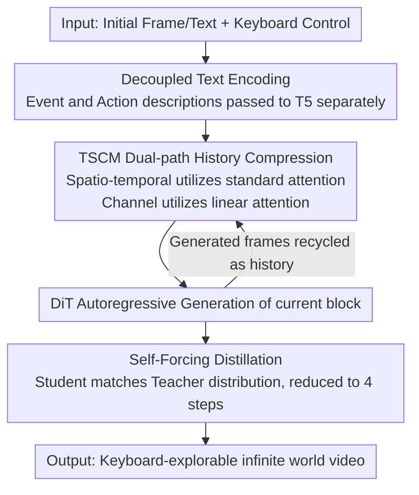

# Yume1.5: A Text-Controlled Interactive World Generation Model

**Conference**: CVPR 2026  
**Paper**: [CVF Open Access](https://openaccess.thecvf.com/content/CVPR2026/html/Mao_Yume1.5_A_Text-Controlled_Interactive_World_Generation_Model_CVPR_2026_paper.html)  
**Code**: https://github.com/stdstu12/YUME  
**Area**: Video Generation / Interactive World Models  
**Keywords**: Interactive World Generation, Long Video Generation, Autoregressive Diffusion, Keyboard Control, Text-Controlled Events

## TL;DR
Yume1.5 transforms a single image or text prompt into an infinite world video that can be freely explored via keyboard. It leverages "Spatio-Temporal and Channel Joint Compression" to save VRAM and "Self-Forcing Distillation" to compress inference to 4 steps (8 seconds). Furthermore, it allows for text-triggered events in the world, improving the Instruction Following score from 0.657 (previous work) to 0.836.

## Background & Motivation

**Background**: Generating virtual worlds that are "interactive, explorable, and continuously extendive" using video diffusion models has become a focal point in recent years. Given an initial frame, the model autoregressively generates subsequent frames while accepting keyboard inputs (WASD for movement, arrow keys for camera control) as conditions, allowing users to navigate the generated world like a first-person game. Representative works include Matrix-Game (game worlds), WorldMem (memory-enhanced consistency), and the predecessor to this work, Yume.

**Limitations of Prior Work**: Existing methods encounter three bottlenecks. First, **poor generalization**—most models are trained on game datasets, resulting in a significant domain gap when applied to real-world urban street scenes. Second, **high latency**—the high number of inference steps in diffusion models caused the original Yume to take 572 seconds to generate one segment, failing to meet the real-time requirements of "infinite exploration." Third, **lack of text control**—most models only support keyboard/mouse inputs and cannot trigger textual events like "starting a heavy rainstorm" or "a UFO flying by."

**Key Challenge**: To support infinite exploration, the historical context grows indefinitely. Sliding windows lose historical information; FramePack/Yume's "light compression for near, heavy for far" strategy still consumes VRAM as time increases and suffers from growing distant history loss. Strategies like WorldMem, which find overlapping frames via camera trajectories, cannot obtain precise trajectories under manual keyboard control. Balancing **context growth vs. inference speed/VRAM** is the fundamental bottleneck for long-video world generation.

**Goal**: Achieve real-time (12 fps@540p), infinitely explorable, and text-event-supported interactive world generation for real-world scenes on a single A100.

**Key Insight**: The authors observe that history frames contain significant redundancy and error-carrying tokens. Rather than selectively retaining frames, it is more effective to **aggressively compress history frames and force the model to rely only on the most robust historical features**. Compression itself acts as a "temporal filter," simultaneously filtering out accumulated errors.

**Core Idea**: Use two parallel paths for "Spatio-Temporal Compression + Channel Compression" (TSCM) to handle history frames, ensuring inference time does not increase with context. Follow this with Self-Forcing autoregressive distillation on TSCM to achieve stable 4-step rapid inference. Finally, decouple captions into "Event Descriptions + Action Descriptions" to unlock text-controlled events.

## Method

### Overall Architecture
Yume1.5 uses the Wan2.2-5B video diffusion model as its backbone for joint T2V/I2V training. Generation is performed autoregressively by "blocks": each step feeds historical frames $z_c$ and the frames to be predicted $z_p$ into the DiT to output a new video block, which is then recycled as history for the next round. Three key innovations manage long context memory, few-step stability, and text-controlled events.

The pipeline is trained in two stages: first, T2V/I2V training is alternated on mixed real, synthetic, and event data to obtain a foundation model. Then, the generator/student/teacher models are initialized to perform Self-Forcing + distillation, resulting in the final 4-step inference model. The inference data flow is shown below:

### Key Designs

**1. TSCM Spatio-Temporal and Channel Joint Modeling: Constant Inference Time relative to Context**

The bottleneck is clear: as the video grows, the number of history frames $f_i$ increases, causing standard attention computation to explode. The proposed solution splits history $z_c$ into **two complementary compression paths**, bypassing the respective computational bottlenecks of standard and linear attention.

The first is **Spatio-Temporal Compression**: History frames are first randomly sub-sampled at 1/32, followed by a variable Patchify strategy where "further frames are compressed more heavily." Sampling rates increase with temporal distance:

$$
\text{Frames } t{-}1 \sim t{-}2:(1,2,2)\quad t{-}3\sim t{-}6:(1,4,4)\quad t{-}7\sim t{-}23:(1,8,8)\ \cdots
$$

where $(1,2,2)$ denotes downsampling by $1\times/2\times/2\times$ in time/height/width. These rates are implemented by **interpolating the weights of the Patchify layer in the DiT**, which also reduces the parameter count compared to the predecessor. The result $\hat z_c$ is concatenated with the prediction frames $\hat z_p$ (processed at standard $(1,2,2)$) and fed into standard attention. Since standard attention is sensitive to the number of tokens, this path effectively reduces the token count.

The second is **Channel Compression**: The same history frames are compressed with a $(8,4,4)$ Patchify and the channels are reduced to 96 to obtain $z_{\text{linear}}$, specifically for the linear attention branch in the DiT block. Since linear attention is sensitive to the channel dimension, this path compresses channels instead of tokens. Inside the block, prediction frames $z_p^l$ pass through an FC layer, are concatenated with $z_{\text{linear}}$, fused via linear attention, and restored via another FC layer. A **residual connection** adds this back to the original $z_p^l$ to prevent information loss. History tokens $z_c^l$ bypass the fusion to reach the end of the block, ensuring uncompressed features are available for high fidelity. Together, they form "Spatio-Temporal and Channel Joint Compression."

Linear attention replaces the exponential kernel $\exp((k^l)^T q^l)$ of standard attention with a ReLU dot-product kernel $\varphi(k^l)^T\varphi(q^l)$:

$$
o^l=\frac{\sum_{i=1}^{N} v_i^l\,\varphi(k_i^l)^T\big(\varphi(q^l)\big)}{\sum_{j=1}^{N}\varphi(k_j^l)^T\big(\varphi(q^l)\big)}
$$

The denominator is computed before ROPE, and Norm is applied to $q, k$ to prevent gradient explosion. Consequently, once the video exceeds 8 blocks, the inference time per step remains constant (see Figure 7).

**2. Self-Forcing + TSCM Acceleration: Combating Error Accumulation in Few-Step Inference**

Reducing diffusion steps causes rapid error accumulation, leading to visual collapse during autoregressive generation. Inspired by Self-Forcing, the model is **forced to use previously generated frames (containing errors) as history during training** instead of ground-truth frames. This allows the model to learn to generate effectively from "dirty history," closing the train-inference gap.

Key differences from standard Self-Forcing: First, **KV cache is replaced by TSCM**, enabling much longer contexts. Second, TSCM acts as a **temporal filter**—aggressive compression naturally discards redundant and error-prone token representations, forcing the generation to rely on the most robust historical features. Acceleration utilizes Distribution Matching Distillation (DMD): the foundation model initializes the generator $G_\theta$, a fake model $G_s$, and a real model $G_t$. Multi-step diffusion is distilled into a few-step generator by minimizing the KL divergence between distributions. Unlike DMD, **model-predicted frames are used as video conditions**, aligning with the Self-Forcing principle to further mitigate error accumulation. This reduces generation time from 572s to 8s for a single segment.

**3. Decoupled Event/Action Text Encoding: Unlocking Text-Controlled Events**

The original Yume only supported keyboard inputs. The authors decouple the caption into two parts, processed by T5 and then concatenated: **Event Description** (specifying scenes/events, e.g., "a ghost appears") and **Action Description** (keyboard controls, e.g., "move forward W, turn camera left ←"). This decoupling saves computation—action descriptions are finite and can be **pre-computed and cached**, while event descriptions are processed only once at the start.

To make text-controlled events effective, a mixed dataset was constructed: Sekai-Real-HQ (relabeled using InternVL3-78B to focus on dynamic events), synthetic data (80k captions from Openvid synthesized by Wan2.1-14B), and a specialized event dataset (4,000 manually screened videos of urban/sci-fi/fantasy/weather events). This "small but precise" dataset enables text-driven event generation with minimal additional data.

### Loss & Training
The foundation model uses Rectified Flow loss, trained for 10,000 steps at 704×1280, 16 FPS, with a batch size of 40 and Adam lr=1e-5. T2V/I2V data are **alternated**. This is followed by Self-Forcing + TSCM training for 600 steps using the same hyperparameters. The distillation target is KL divergence across noise levels, using 4-step inference.

## Key Experimental Results

Evaluation uses Yume-Bench, measuring Instruction Following (IF) and five VBench metrics: Subject Consistency (SC), Background Consistency (BC), Motion Smoothness (MS), Aesthetic Quality (AQ), and Imaging Quality (IQ). Resolution is 544×960 at 16 FPS for 96 frames.

### Main Results (I2V, Table 1)

| Model | Time (s) ↓ | IF ↑ | SC ↑ | BC ↑ | MS ↑ | AQ ↑ | IQ ↑ |
| :--- | :--- | :--- | :--- | :--- | :--- | :--- | :--- |
| Wan-2.1-I2V-14B | 611 | 0.057 | 0.859 | 0.899 | 0.961 | 0.494 | 0.695 |
| Wan-2.2-5B | 107 | 0.243 | 0.889 | 0.915 | 0.958 | 0.502 | 0.659 |
| MatrixGame | 971 | 0.271 | 0.911 | 0.932 | 0.983 | 0.435 | 0.750 |
| Yume (Original) | 572 | 0.657 | 0.932 | 0.941 | 0.986 | 0.518 | 0.739 |
| **Yume1.5** | **8** | **0.836** | 0.932 | **0.945** | 0.985 | 0.506 | 0.728 |

The IF score of 0.836 is an industry lead (vs. 0.657 for Yume and 0.271 for MatrixGame), while inference time is reduced by ~71×. Visual quality metrics remain comparable, with slight AQ/IQ drops being a reasonable trade-off for speed.

### Ablation Study (TSCM, Table 2)

| Configuration | IF ↑ | SC ↑ | BC ↑ | MS ↑ | AQ ↑ | IQ ↑ |
| :--- | :--- | :--- | :--- | :--- | :--- | :--- |
| TSCM (Full) | **0.836** | 0.932 | 0.945 | **0.985** | 0.506 | 0.728 |
| Spatial Compression Only | 0.767 | 0.935 | 0.945 | 0.973 | 0.504 | 0.733 |

Replacing TSCM with pure spatial compression causes IF to drop from 0.836 to 0.767. TSCM reduces interference from inherent motion directions in history frames, leading to more accurate instruction following.

### Key Findings
- **TSCM contributes primarily to IF, not image quality**: Replacing it drops IF by ~0.07 but barely affects consistency or quality metrics. Its value lies in making camera/movement controls more precise.
- **Stability relies on Self-Forcing+TSCM**: For 30-second videos, segment 6 maintains an AQ of 0.523 vs 0.442 without these techniques. Preventing late-stage collapse is a core advantage.
- **Inference time saturates**: Time per step remains constant after 8 video blocks (Figure 7), whereas full-context methods see continuously rising latency.

## Highlights & Insights
- **Compression as Filtering**: While compression is usually a compromise to save memory, this work demonstrates that aggressive compression actively filters out error-prone tokens to improve long-range consistency.
- **Dimension-Specific Compression**: Compressing tokens for standard attention and channels for linear attention is a clean engineering insight that addresses the specific bottlenecks of each mechanism.
- **Decoupled Encoding for Speed**: Separating event and action descriptions not only adds control but also saves T5 overhead via caching, a design transferable to other autoregressive tasks.

## Limitations & Future Work
- **Minor Quality Regression**: 4-step inference achieves a 71× speedup but results in slightly lower AQ/IQ compared to the multi-step original Yume.
- **Heavy Dependency on Large Models for Data**: Relabeling with InternVL3-78B and synthesizing with Wan2.1/2.2 creates a high barrier to entry for reproduction.
- **Weak Event Evaluation**: While text-controlled events are a key feature, the paper lacks quantitative metrics for event trigger accuracy, relying mostly on qualitative figures.
- **Discrete Control Space**: Using keyboard inputs (WASD) is intuitive but lacks the precision of continuous trajectory control systems.

## Related Work & Insights
- **vs. Yume**: The original used "near-light, far-heavy" spatial compression, which still scaled with time and only supported keyboard/mouse. Yume1.5 uses TSCM for constant-time inference, Self-Forcing for 71× speedup, and unlocks text events.
- **vs. Self-Forcing**: Standard versions use KV caches; this work replaces them with TSCM to enable longer contexts while utilizing compression as a temporal filter.
- **vs. WorldMem**: Requires precise camera trajectories to find overlapping frames; Yume1.5 is more robust in keyboard-controlled scenarios where trajectories are hard to estimate.
- **vs. MatrixGame**: Primarily trained on game data with poor real-world generalization (IF 0.271); Yume1.5 generalizes to real urban scenes with higher IF and much lower latency.

## Rating
- Novelty: ⭐⭐⭐⭐ The "compression as filtering" perspective and dimension-specific compression are clever, though the overall work combines existing ideas like Self-Forcing and DMD.
- Experimental Thoroughness: ⭐⭐⭐⭐ Solid main results and ablation studies, though quantitative evaluation for the text-event feature is missing.
- Writing Quality: ⭐⭐⭐⭐ Clear motivation and good correspondence between figures and text.
- Value: ⭐⭐⭐⭐⭐ Real-time (12fps) infinite world generation on a single A100 is highly significant for practical interactive applications.

<!-- RELATED:START -->

## Related Papers

- [\[CVPR 2026\] TGT: Text-Grounded Trajectories for Locally Controlled Video Generation](tgt_text-grounded_trajectories_for_locally_controlled_video_generation.md)
- [\[AAAI 2026\] 3D4D: An Interactive Editable 4D World Model via 3D Video Generation](../../AAAI2026/video_generation/3d4d_an_interactive_editable_4d_world_model_via_3d_video_generation.md)
- [\[CVPR 2026\] Endless World: Real-Time 3D-Aware Long Video Generation](endless_world_real-time_3d-aware_long_video_generation.md)
- [\[CVPR 2026\] Stereo World Model: Camera-Guided Stereo Video Generation](stereo_world_model_camera-guided_stereo_video_generation.md)
- [\[CVPR 2026\] Physical Object Understanding with a Physically Controllable World Model](physical_object_understanding_with_a_physically_controllable_world_model.md)

<!-- RELATED:END -->
