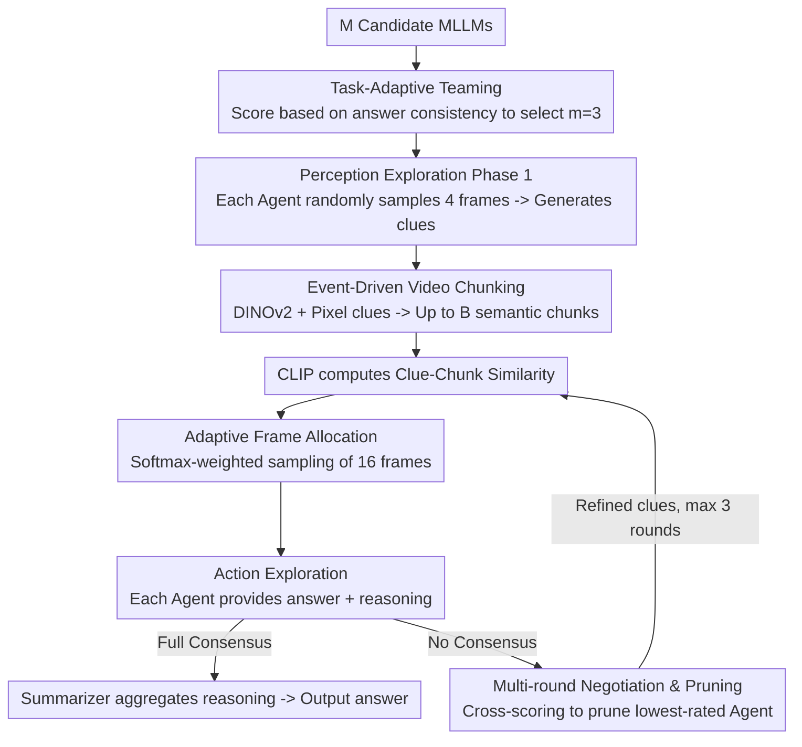

# A Multi-Agent Perception-Action Alliance for Efficient Long Video Reasoning

**Conference**: CVPR2026  
**arXiv**: [2603.14052](https://arxiv.org/abs/2603.14052)  
**Code**: [git-disl/A4VL](https://github.com/git-disl/A4VL)  
**Area**: Video Understanding  
**Keywords**: Long Video Reasoning, Multi-Agent Collaboration, Video Question Answering, Perception-Action Exploration, Training-Free Framework

## TL;DR

Ours proposes A4VL, a training-free multi-agent perception-action alliance framework. Through event-driven video chunking, clue-guided keyframe selection, and a multi-round agent negotiation-pruning mechanism, it consistently outperforms 28 baseline methods across five VideoQA benchmarks with significantly lower inference latency.

## Background & Motivation

**Computational Bottleneck in Long Video Reasoning**: When Multimodal Large Language Models (MLLMs) process long videos, the increase in frame count leads to a quadratic growth in memory and time overhead. GPT-4o takes an average of over 150 seconds per question on Video-MME.

**Noise from Redundant Frames**: Prior studies indicate that simply increasing frame sampling density may harm performance. Redundant frames distract the model's attention, making it difficult to align with truly informative keyframes.

**Slow Existing Agent Methods**: VideoAgent requires over 10 minutes to process a one-hour video. Most methods rely on a single MLLM for decision-making, lacking effective multi-agent collaboration.

**Difficulty in Keyframe Localization**: When a question relates to events covered by only a few frames in a long video, precise localization is extremely challenging; MoReVQA shows a significant drop in accuracy on long video datasets.

**Limitations of Single Models**: Different MLLMs have unique strengths and blind spots. A single model is prone to errors in complex reasoning scenarios and cannot self-correct. A collaboration mechanism can achieve mutual complementarity.

**Lack of Efficient Multi-Agent Coordination**: Existing multi-agent methods either lack iterative refinement capabilities or suffer from inefficiency due to a lack of pruning strategies. There is a need for a collaborative framework that is both accurate and efficient.

## Method

### Overall Architecture

A4VL decomposes long video QA into "Perception" and "Action" tasks, allowing a team of three complementary MLLMs to observe and respond in multi-round cycles. The process begins with optional Task-Adaptive Teaming: from $M$ candidate models, each is scored based on the frequency of its agreement with the majority, and the $m=3$ most complementary models are selected. Each round starts with perception exploration—each Agent randomly samples $N_1=4$ frames to generate perception clues related to the question. Event-driven video chunking is then used to divide the video into up to $B$ chunks, and CLIP computes the similarity between clues and chunks. Based on a Softmax distribution, $N_2=16$ frames are sampled from high-relevance chunks. Subsequently, action exploration is performed—each Agent provides an answer and reasoning based on its sampled frames. If full consensus is reached, the process ends; otherwise, Agents score each other, the worst-performing Agent is pruned, and the remaining Agents refine their clues for the next round.

### Key Designs

**1. Task-Adaptive Teaming: Unsupervised Voting for Complementary MLLMs**

Different MLLMs have different blind spots; the team composition directly determines the upper bound of reasoning. A4VL performs unsupervised teaming for each task: $K$ unlabeled video-question pairs are randomly drawn from $M$ candidates, and all models provide answers. The proportion of each option chosen for each question $f_{qr}$ is calculated. Each model is scored based on how many peers agreed with its choices: $\frac{1}{K}\sum_{q=1}^{K} f_{q,r_q}$. The $m=3$ models with the highest scores form the fixed team for that task. This process does not rely on ground-truth labels and is run only once per task. Experiments show that different benchmarks select different combinations (e.g., MLVU selects LLaVA-72B instead of QwenVL-72B), confirming the value of task-specific teaming over fixed models.

**2. Event-Driven Video Chunking: Semantic Homogeneity for Reliable Matching**

Cutting videos into fixed windows can fragment events, making CLIP similarity inaccurate. A4VL uses DINOv2 embeddings plus pixel-level clues (HSV/motion/sharpness) to detect scene changes. Candidates are generated via KTS, PELT, and SSM novelty detection, then merged using NMS to retain the top-$(B{-}1)$ boundaries. Chunks generated this way maintain internal semantic consistency, making subsequent "clue vs. chunk" matching meaningful. Most videos can be chunked within 2 seconds.

**3. Adaptive Frame Allocation: Demand-Driven Weighting for Relevant Events**

Allocating a fixed number of frames to every chunk wastes the budget. When all chunk similarities are below a threshold $\rho=0.8$, each Agent only samples $N_2$ frames from the single best-matching chunk. If high-similarity chunks exist, similarity is normalized via Softmax, and the budget is allocated proportionally: $\mathbf{c}^{(i)} = \lfloor N_2 \cdot \text{SoftMax}(\mathbf{s}^{(i)}) \rfloor$, with any shortfall filled randomly. Consequently, the frame budget tilts towards event chunks most likely to contain the answer.

**4. Multi-Round Negotiation & Pruning: Cross-Scoring Over Simple Voting**

After teaming and sampling, the three answers may still conflict; a single model cannot self-correct if it is wrong. A4VL uses Full Consensus as a termination condition—stopping only when all Agents agree. When consensus is not reached, each Agent scores all answers (including its own). The Agent with the lowest total score is pruned. The remaining Agents refine their clues using the previous round’s answers, reasoning, and information about the pruned Agent: $P_{i,j+1} = A_{i,refine}(P_{i,j}, S_{a,j}, S_{r,j}, A_{min}, Q, O)$. This continues for a maximum of 3 rounds (limited by the number of Agents). Pruning removes detrimental judgments and shortens subsequent rounds, improving both accuracy and speed.

### A Complete Example

For a long video QA task: 3 Agents each randomly sample 4 frames and generate their respective query clues. Event-driven chunking divides the video into $B$ semantic chunks. CLIP matches specific chunks as highly relevant (similarity $>\rho=0.8$). The 16-frame budget is tilted towards these chunks via Softmax, and Agents re-sample. In the first round, the three provide answers A/A/B—no full consensus. After cross-scoring, the Agent holding answer B has the lowest score and is pruned. The remaining two Agents refine their clues and re-sample keyframes based on each other's reasoning. In the second round, both converge to A; consensus is reached and the answer is output. The entire process uses only 4+16 frames and at most 3 rounds to lock the answer, correcting individual Agent errors through multi-round negotiation when necessary.

### Loss & Training

A4VL is a fully training-free framework involving no gradient updates or loss functions. All components (clue generation, answer reasoning, cross-scoring, clue refinement) are driven by prompts to the respective MLLMs.

## Key Experimental Results

### Main Results

Compared with 2 closed-source MLLMs, 16 open-source MLLMs, and 10 Agent/long-video methods across five VideoQA benchmarks:

| Method | NeXT-QA | EgoSchema | LongVideoBench | MLVU | Video-MME (avg, w/o sub) |
|------|---------|-----------|----------------|------|--------------------------|
| GPT-4o | - | 72.2 | 66.7 | 54.9 | 71.9 |
| Gemini 1.5 Pro | - | 71.1 | 64.0 | - | 75.0 |
| InternVL3-78B | 84.0 | 76.8 | 56.4 | 55.3 | 66.9 |
| LVAgent | 83.0 | 78.4 | 66.9 | 50.0 | 73.9 |
| **Ours (A4VL)** | **85.1** | **82.2** | **72.2** | **58.0** | **77.2** |

Ours achieves SOTA results on all five benchmarks. It is the only method to exceed 80% on EgoSchema and outperforms GPT-4o by 5.5 points on LongVideoBench using only open-source models.

### Inference Efficiency

| Method | NeXT-QA | EgoSchema | MLVU |
|------|---------|-----------|------|
| GPT-4o | 23s | 54s | 127s |
| InternVL3-78B | 15s | 50s | 204s |
| VideoAgent | 20s | 83s | 175s |
| TraveLER | 101s | 94s | 450s |
| **Ours (A4VL)** | **18s** | **37s** | **74s** |

On MLVU long videos, A4VL requires only 74s/sample, which is 42% faster than GPT-4o and 83% faster than TraveLER.

### Ablation Study

- **Impact of Rounds**: Accuracy improves steadily with the maximum number of rounds. On harder datasets, Agents tend to use more rounds of negotiation.
- **Sampling Strategy**: RESampling (random sampling in perception phase + event chunk sampling in action phase) performed best at 82.2%, indicating perception requires global coverage while action requires event focus.
- **Consensus Standards**: Full Consensus (82.2%) outperformed Majority Consensus (81.4%), at the cost of slightly increased latency (37s vs. 26s).
- **Necessity of Pruning**: Removing pruning (NoPruneSum 80.8%, NoPruneMaj 79.4%) not only decreased accuracy but also increased latency from 37s to 60s, proving pruning is crucial for both performance and efficiency.

### Key Findings

1. Task-Adaptive Teaming selects different model combinations for different benchmarks (e.g., MLVU selected LLaVA-72B instead of QwenVL-72B), validating the task-specific approach.
2. Even if all Agents are initially wrong, they can correct to the true answer through multi-round negotiation and clue refinement (as seen in EgoSchema examples).

## Highlights & Insights

- **Training-free and Plug-and-play**: Purely prompt-driven, allowing flexible combination of any VLM without retraining or fine-tuning.
- **Exquisite Perception-Action Decoupling**: The coarse-to-fine two-stage frame selection achieves precise localization with minimal frames (4+16).
- **Efficient Pruning Consensus**: Pruning weak Agents via cross-scoring rather than simple voting improves both accuracy and speed.
- **Comprehensive Experimental Design**: Covers five benchmarks across short/medium/long videos, compared against 28 methods with thorough ablation.

## Limitations & Future Work

- The Agent pool is limited to 8 specific VLMs; generalization to others (e.g., Gemini, GPT series) is not verified.
- Requires 6 H200 GPUs to deploy multiple large models (including 78B), representing a high hardware barrier.
- Processes only visual + text (subtitle) inputs, neglecting audio modal information.
- Reliance on CLIP similarity as the sole signal for chunk matching may be insufficient for abstract or causal questions.
- The maximum of 3 negotiation rounds is rigidly determined by the number of Agents, lacking a dynamic adjustment mechanism.

## Related Work & Insights

- **Token Optimization**: DYTO (Dynamic Binary Token Merging) and AuroraLong (Linear RNNs + Token Merging) reduce processing overhead.
- **Agent Methods**: VideoAgent (Memory-augmented single agent), TraveLER (Multi-step planning), MoReVQA (Modular reasoning), and LVAgent (Multi-agent dynamic collaboration). A4VL outperforms all in comparisons.
- **Memory Retrieval**: VideoRAG uses retrieval-augmented generation for long videos, showing competitiveness on Video-MME but lacking results for EgoSchema/NeXT-QA.
- **Architecture Improvement**: DynFocus (Dynamic Focusing) and BOLT (Efficient Sampling) optimize from the perspective of model structure, which is orthogonal to Agent methods.

## Rating

- Novelty: ⭐⭐⭐⭐ (Combination of perception-action alliance, event-driven chunking, and cross-scoring pruning is novel)
- Experimental Thoroughness: ⭐⭐⭐⭐⭐ (5 benchmarks, 28 comparisons, extensive ablation)
- Writing Quality: ⭐⭐⭐⭐ (Clear structure, rich illustrations, formal mathematical notation)
- Value: ⭐⭐⭐⭐ (High practicality as a training-free framework, though limited by hardware requirements)

<!-- RELATED:START -->

## Related Papers

- [\[CVPR 2026\] SVAgent: Storyline-Guided Long Video Understanding via Cross-Modal Multi-Agent Collaboration](svagent_storyline_guided_long_video_understanding_via_cross_modal_multi_agent_collaboration.md)
- [\[CVPR 2026\] Thinking with Drafts: Speculative Temporal Reasoning for Efficient Long Video Understanding](thinking_with_drafts_speculative_temporal_reasoning_for_efficient_long_video_und.md)
- [\[CVPR 2026\] VideoSeek: Long-Horizon Video Agent with Tool-Guided Seeking](videoseek_long-horizon_video_agent_with_tool-guided_seeking.md)
- [\[CVPR 2026\] MINERVA-Cultural: A Benchmark for Cultural and Multilingual Long Video Reasoning](minerva-cultural_a_benchmark_for_cultural_and_multilingual_long_video_reasoning.md)
- [\[ICML 2026\] Video-MTR: Reinforced Multi-Turn Reasoning for Long Video Understanding](../../ICML2026/video_understanding/video-mtr_reinforced_multi-turn_reasoning_for_long_video_understanding.md)

<!-- RELATED:END -->
