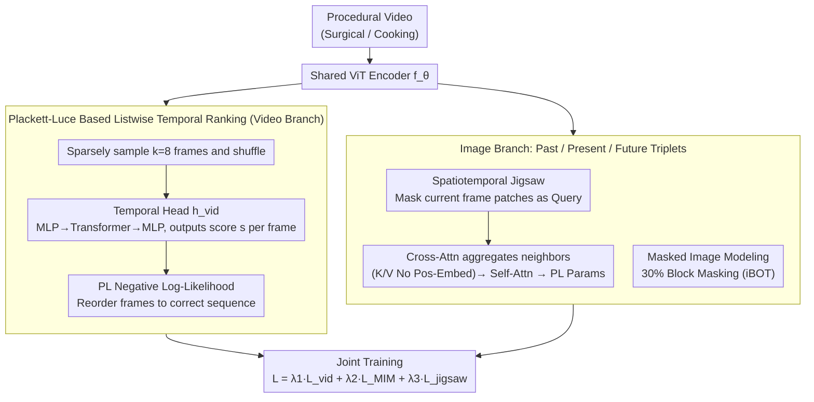

# A Stitch in Time: Learning Procedural Workflow via Self-Supervised Plackett-Luce Ranking

**Conference**: CVPR 2026  
**arXiv**: [2511.17805](https://arxiv.org/abs/2511.17805)  
**Code**: [https://github.com/visurg-ai/PL-Stitch](https://github.com/visurg-ai/PL-Stitch)  
**Area**: Video Understanding / Self-Supervised Learning  
**Keywords**: Procedural Activity Understanding, Temporal Ranking, Plackett-Luce Model, Self-Supervised Learning, Surgical Video

## TL;DR

The authors propose PL-Stitch, a self-supervised framework that utilizes the Plackett-Luce probabilistic ranking model to treat the temporal ordering of video frames as a pre-training signal. By learning "procedure-aware" video representations, it significantly outperforms existing self-supervised methods in surgical phase recognition and cooking action segmentation.

## Background & Motivation

**Background**: Procedural activities (e.g., cooking, surgery) consist of a series of steps performed in a strict temporal sequence. Understanding this temporal structure is crucial for downstream tasks such as robot-assisted surgery and action prediction.
**Limitations of Prior Work**: Current mainstream self-supervised methods (e.g., DINO, MAE, VideoMAE) primarily learn features through instance discrimination or masked reconstruction. However, they are inherently "procedure-agnostic"—learning "what is in the frame" but not "when the frame occurs."

The authors designed a **Key Challenge** verification experiment: pre-training SSL models with forward and reversed videos separately. They found that the features generated for the same frame were nearly identical (extremely low cosine distance). This directly demonstrates that existing methods are completely insensitive to temporal direction; the models cannot distinguish a surgical workflow even if played backward.

**Goal**: Existing attempts to utilize temporal information also have flaws: (1) Pairwise comparison methods require $\mathcal{O}(k^2)$ comparisons, resulting in fragmented and inefficient signals; (2) Permutation classification incorrectly casts relative ranking as absolute classification, where a nearly correct ranking (e.g., only two frames swapped) is penalized as heavily as a completely incorrect one.

**Key Insight**: Temporal ordering is essentially a listwise ranking problem. It should be modeled using a probabilistic ranking model, ensuring that penalties are proportional to the degree of error. The Plackett-Luce model naturally meets this requirement by defining a probability distribution over all possible permutations, assigning higher probabilities to rankings closer to the ground truth.

## Method

### Overall Architecture

The **Core Idea** of PL-Stitch is to enable self-supervised pre-training to achieve "procedure-awareness"—knowing both the frame content and its temporal position. The system consists of a shared ViT backbone encoder $f_\theta$ and two complementary branches. The Video branch handles global context: it sparsely samples $k=8$ frames from a video, shuffles them, and tasks the model with reordering them correctly to learn the overall workflow progress. The Image branch focuses on local details: it performs Masked Image Modeling (MIM) and spatiotemporal jigsaw tasks on "past/present/future" frame triplets to learn fine-grained frame-level semantics and cross-frame correspondences. These three objectives share the same encoder and are trained jointly, allowing global ranking signals and local reconstruction signals to complement each other.

### Key Designs

**1. Plackett-Luce Based Listwise Temporal Ranking: Modeling "Ordering" as Probabilistic Ranking instead of Hard Classification**

This is the **Core Idea** for solving SSL's temporal insensitivity. Specifically, $k=8$ frames are uniformly sampled from a video to form a clip $C_v$. Each frame passes through the encoder to extract the [CLS] feature, which is fed into a temporal head $h_{vid}$ (MLP → Transformer Encoder → MLP) to output a scalar ranking score $s_{clip}=(s_1,\dots,s_k)$, where earlier frames receive higher scores. The training utilizes the negative log-likelihood of the Plackett-Luce model as the loss:

$$\mathcal{L}_{vid} = -\log P(r^*\mid s),\qquad P(r\mid s)=\prod_{i=1}^{K}\frac{\exp(s_{r(i)})}{\sum_{j=i}^{K}\exp(s_{r(j)})}$$

PL views ranking as "sequentially selecting the next element based on score probability," thus defining a complete probability distribution over all possible permutations. This is superior to two other approaches: pairwise comparison only considers local relationships between two frames (lagging by +1.3pp linear / +3.5pp kNN relative to PL-Stitch), while permutation classification (CE) treats "relative ranking" as "absolute categories," where a nearly correct swap is penalized as much as a total shuffle (lagging by +2.6pp linear / +8.8pp kNN). PL makes the penalty proportional to the error, providing gentler gradients for "almost correct" rankings, making it more robust.

**2. Spatiotemporal Jigsaw: Using motion cues from adjacent frames to force models to recover spatial arrangements via visual content rather than positional shortcuts.**

Standard jigsaw tasks use single frames, where models often rely on texture edges as positional shortcuts. This is modified into a cross-frame version: using a triplet of frames, the middle frame is masked. Its patch features serve as the Query, while patch features from the preceding and succeeding frames serve as Key/Value. Context is aggregated from the temporal neighborhood via Cross-Attention, followed by Self-Attention to model spatial relationships. Finally, PL parameters are output to predict the original spatial arrangement $r^*_{jigsaw}=(1,2,\dots,N)$ of the middle frame patches. A critical design is **removing position embeddings** for Key/Value to block the "alignment-by-position" shortcut, forcing the model to infer patch positions based on visual motion cues (e.g., the displacement of a surgical tool between frames). Adding the jigsaw task improved kNN from 78.9% to 80.2%, proving its effectiveness as a local complementary signal.

**3. Masked Image Modeling: Providing frame-level dense semantics as the foundation for other objectives.**

Since temporal ranking and jigsaw tasks rely on "high-quality individual frame features," a standard MIM objective is retained—following iBOT by performing 30% block masking and reconstruction on the current frame. This handles pixel/semantic-level dense feature learning, complementing the structural focus of the other two objectives. Ablations show MIM is an indispensable foundation; performance drops significantly without it.

### Loss & Training

The total loss is $\mathcal{L}_{total} = \lambda_1 \mathcal{L}_{vid} + \lambda_2 \mathcal{L}_{MIM} + \lambda_3 \mathcal{L}_{jigsaw}$, with $\lambda_1=1, \lambda_2=1, \lambda_3=0.4$. The model uses a ViT-B/16 backbone, an AdamW optimizer, and a base learning rate of $4 \times 10^{-4}$. Surgical data was pre-trained on the LEMON dataset for 30 epochs, and cooking data was pre-trained on respective training sets for 100 epochs using 4 A100 GPUs.

## Key Experimental Results

### Main Results

**Surgical Phase Recognition (Linear Probing / kNN)**

| Dataset | Method | Linear Acc | kNN Acc | Prev. SOTA (Baseline) | Gain |
|--------|------|-----------|---------|---------|------|
| Cholec80 | PL-Stitch | **80.4** | **81.7** | 74.6 / 70.3 (iBOT) | +5.8 / +11.4 |
| AutoLaparo | PL-Stitch | **79.9** | **82.5** | 76.3 / 75.3 (iBOT) | +3.6 / +7.2 |
| M2CAI16 | PL-Stitch | **76.4** | **77.1** | 71.0 / 68.0 (iBOT) | +5.4 / +9.1 |

**Cooking Action Segmentation (Linear Probing Acc / kNN Acc)**

| Dataset | PL-Stitch | Prev. SOTA (Baseline) | Gain |
|--------|-----------|---------|------|
| GTEA | **54.1** / **62.4** | 52.2 / 60.0 (DINO) | +1.9 / +2.4 |
| Breakfast | **21.6** / **10.9** | 15.9 / 7.5 (DINO/iBOT) | +5.7 / +3.4 |

### Ablation Study

| Configuration | Linear Acc | kNN Acc | Description |
|------|-----------|---------|------|
| $\mathcal{L}_{MIM}$ only | 73.4 | 69.4 | iBOT baseline |
| $\mathcal{L}_{MIM}$ + $\mathcal{L}_{vid}$ | 77.1 | 78.9 | +9.5pp kNN, temporal ranking provides largest contribution |
| $\mathcal{L}_{MIM}$ + $\mathcal{L}_{jigsaw}$ | 75.3 | 71.4 | Jigsaw serves as auxiliary |
| **Full PL-Stitch** | **77.8** | **80.2** | All three are complementary |

**Comparison of Temporal Objectives (with MIM)**

| Objective Form | Linear | kNN | Description |
|---------|--------|-----|------|
| Pairwise | 75.8 | 75.4 | $\mathcal{O}(k^2)$ local signal |
| Permutation CE | 74.5 | 70.1 | Hard classification is unsuitable for ranking |
| **PL Ranking** | **77.1** | **78.9** | Probabilistic listwise ranking is optimal |

### Key Findings

- The temporal ranking objective $\mathcal{L}_{vid}$ is the primary driver of performance ( +9.5pp kNN), far exceeding the jigsaw objective (+2.0pp).
- PL ranking is significantly better than both pairwise and permutation classification, validating the theoretical advantage of probabilistic listwise ranking.
- $k=8$ frames is the optimal balance of computational efficiency and performance ($k=16$ only improves by 0.1pp but triples computation).
- t-SNE visualization shows PL-Stitch feature space has clear phase separation (ARI 0.35 vs. baseline max 0.10).
- Attention maps show PL-Stitch consistently tracks surgical instruments, whereas baseline attention is scattered and unstable.

## Highlights & Insights

- **Elegant "Forward/Reverse Invariance" Experiment**: Directly reveals the blind spots of existing SSL methods with a simple yet powerful experiment, which is more convincing than downstream performance alone.
- **PL Model for SSL Pretext Tasks**: Introduces listwise learning-to-rank methods from information retrieval into visual SSL, opening a new design space for pretext tasks. The probabilistic nature of PL ensures "near-correct" rankings are penalized gently, avoiding the excessive strictness of classification losses.
- **Spatiotemporal Jigsaw Cross-Attention Design**: Removing position encoding forces the model to reason about spatial positions via visual content (rather than shortcuts) using motion cues from temporal neighbors, representing a refined improvement over traditional jigsaw tasks.

## Limitations & Future Work

- Uses only a frame-level encoder (ViT-B/16) and does not utilize spatiotemporal attention from video-specific architectures.
- Pre-training relies on large-scale in-domain data (e.g., LEMON for surgery); transferability to domains lacking such data remains to be verified.
- Evaluations are limited to representation quality (linear probe/kNN); fully fine-tuned or downstream generative tasks (e.g., action prediction) were not tested.
- The PL model assumes independent choices between items (Luce’s Axiom), which may not perfectly apply to action sequences with strong causal dependencies.

## Related Work & Insights

- **vs. iBOT**: Both use self-distillation + MIM, but iBOT lacks temporal signals; PL-Stitch gains +11.4pp on Cholec80 kNN.
- **vs. T-CoRe**: Also utilizes temporal neighbors for cross-frame reconstruction but lacks global temporal structure learning, performing worse than the standalone MIM baseline.
- **vs. VideoMAEv2**: Spatiotemporal masked reconstruction handles space and time symmetrically, leading to temporal blindness; it is one of the worst-performing baselines.

## Rating

- Novelty: ⭐⭐⭐⭐⭐ First to introduce the PL ranking model to visual SSL; convincing motivation experiments.
- Experimental Thoroughness: ⭐⭐⭐⭐⭐ 5 benchmarks, two evaluation protocols, extensive ablations, and qualitative analyses (t-SNE/Attention/Predictions).
- Writing Quality: ⭐⭐⭐⭐⭐ Smooth storyline with a clear logical chain from motivation → definition → method → experiments.
- Value: ⭐⭐⭐⭐ Provides a new self-supervised paradigm for procedural video understanding, though its scope is limited to domains with strong temporal structures.

<!-- RELATED:START -->

## Related Papers

- [\[CVPR 2026\] Boosting Self-Supervised Tracking with Contextual Prompts and Noise Learning](boosting_self-supervised_tracking_with_contextual_prompts_and_noise_learning.md)
- [\[CVPR 2026\] TimeBridge: Self-Supervised Video Representation Learning via Start-End Joint Embedding and In-Between Frame Prediction](timebridge_self-supervised_video_representation_learning_via_start-end_joint_emb.md)
- [\[CVPR 2026\] Exploring Adaptive Masked Reconstruction for Self-Supervised Skeleton-Based Action Recognition](exploring_adaptive_masked_reconstruction_for_self-supervised_skeleton-based_acti.md)
- [\[CVPR 2026\] Hierarchical Action Learning for Weakly-Supervised Action Segmentation](hierarchical_action_learning_for_weakly-supervised_action_segmentation.md)
- [\[CVPR 2026\] Stitch-a-Demo: Creating Video Demonstrations from Multistep Descriptions](stitch-a-demo_creating_video_demonstrations_from_multistep_descriptions.md)

<!-- RELATED:END -->
