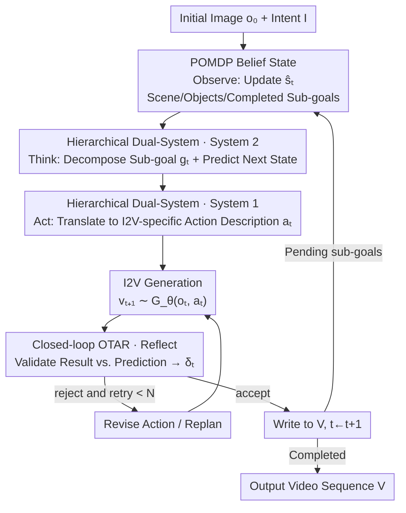

# Active Intelligence in Video Avatars via Closed-loop World Modeling

**Conference**: CVPR 2026  
**Paper**: [CVF Open Access](https://openaccess.thecvf.com/content/CVPR2026/html/He_Active_Intelligence_in_Video_Avatars_via_Closed-loop_World_Modeling_CVPR_2026_paper.html)  
**Code**: [Project Page ORCA](https://xuanhuahe.github.io/ORCA/) (Public repository not yet visible)  
**Area**: Video Understanding / Digital Humans / Agents  
**Keywords**: Video Avatars, Internal World Model, Closed-loop Planning, POMDP, Dual-system Architecture

## TL;DR
To address the issue of current video avatars "passively following speech/pose while lacking autonomous goal-driven behavior," this paper proposes the L-IVA task (modeling avatar control as a POMDP with I2V generation models as environment simulators) and the ORCA framework. ORCA utilizes an "Observe-Think-Act-Reflect" (OTAR) closed-loop to counteract generational randomness and a System 2/System 1 dual-system hierarchy for open-domain planning and precise grounding. On a benchmark of 100 tasks, it achieves an average task success rate of 71.0%, significantly exceeding open-loop, reactive, and reflection-free baselines.

## Background & Motivation

**Background**: Current mainstream controllable video avatars are "passive condition-driven"—given a reference image, they use speech, pose sequences, or text as driving signals to autoregressively generate identity-consistent videos at a chunk level. They perform well in identity preservation and alignment with driving signals.

**Limitations of Prior Work**: These methods are essentially **reactive signal processing**—actions are merely responses to audio, and identity is just feature fusion. Avatars can execute predefined actions or follow simple instructions but **cannot autonomously perform multi-step planning and environmental interaction toward a long-term goal**. For example, given a high-level intent like "making tea" or "hosting a product demo," they cannot decompose it into a coherent multi-step process like "open canister → scoop tea leaves → put into strainer → pour hot water."

**Key Challenge**: To bridge the gap from passive animation to active intelligence, an agent must achieve three things: (1) infer task progress from incomplete visual observations (only seeing the generated video segments); (2) predict how actions change future states; and (3) plan coherent action sequences toward long-term goals. This requires an **Internal World Model (IWM)** to synthesize observation history and estimate the true world state. Implementing an IWM in a generative environment presents two unique difficulties not found in robotics or embodied AI:

- **State Estimation under Generative Uncertainty**: Traditional IWMs assume a deterministic world where repeating an action yields consistent results. However, I2V generation is inherently stochastic; a single action description can produce varied visual outcomes. Avatars lack sensors and must infer states from self-generated segments. Without verifying whether "what was generated" matches "what was intended," the internal belief becomes contaminated, leading to long-range planning failure.
- **Planning in Open-Domain Action Spaces**: Robot action spaces are bounded (e.g., joint angles), but avatar actions are semantic and open-domain without predefined primitives. A command like "pick up the red cup" leaves many visual details unspecified, leading to diverse and often erroneous generation results. This necessitates **hierarchical planning**—not only deciding the next action but also translating it into detailed control signals specific to the I2V model.

**Core Idea**: Formalize avatar control as a POMDP and implement an IWM via **closed-loop OTAR + dual-systems**. Continuous reflection is used to verify generation results to maintain accurate beliefs, while System 2 performs policy reasoning and System 1 handles model-specific action grounding, enabling autonomous multi-step task completion in open domains without training.

## Method

### Overall Architecture

ORCA (Online Reasoning and Cognitive Architecture) aims to solve the following: given an initial scene image $o_0$ and a high-level intent $I$ (e.g., "transferring a plant"), the avatar **autonomously** generates a coherent video sequence $V=[v_1,\dots,v_T]$ that achieves the goal through meaningful object interactions.

The framework is a **turn-by-turn autoregressive closed-loop**. The agent cannot see the true world state $s_t$ and instead maintains an **internal belief state** $\hat{s}_t$ with historical information, executing a belief-dependent policy $\pi(a_t|\hat{s}_t)$. Each turn follows the four OTAR stages: **Observe** (update belief from the latest segment) → **Think** (System 2 decomposes sub-goals and predicts the next state) → **Act** (System 1 translates abstract sub-goals into I2V-specific action descriptions and generates video) → **Reflect** (System 2 verifies if the generation matches the prediction, accept/reject). If rejected, it retries or replans; if accepted, the segment is appended to the results, and it moves to the next turn until all sub-goals are cleared. The entire framework is driven by structured prompting of pretrained VLMs without task-specific training.

### Key Designs

**1. L-IVA Modeled as POMDP + IWM Belief State: Inferable state representation for "partially observable and uncertain" environments**

The pain point is that the avatar faces double unobservability: the true state $s_t$ is hidden behind the video (one frame contains only partial information), and the same action yields different results due to I2V stochasticity. This paper formalizes the task as a POMDP tuple $(S, A, T, R, \Omega, O)$—the true state $s_t$ is invisible, the action space $A$ is an open set of natural language descriptions, observations $o_t$ are I2V-generated video frames providing partial views via $O(o_t|s_t)$, and state transitions $T(s_{t+1}|s_t,a_t)$ are implicitly invisible, with only stochastic generations $o_{t+1}\sim G_\theta(o_t,a_t)$ observable. The reward $R$ is sparse and terminal—1 only if the trajectory's final state satisfies the intent.

Since $s_t$ is invisible, the agent maintains a **belief state** $\hat{s}_t$, initialized as $\hat{s}_0=(s_{\text{scene}}, C_{\text{plan}}, h_\varnothing)$: where $s_{\text{scene}}$ includes interactable objects and their attributes in the initial image, $C_{\text{plan}}$ is the sub-goal list decomposed from intent $I$, and $h_\varnothing$ is the empty interaction history. During each Observe stage, $\hat{s}_t=f_{\text{observe}}(o_t,\hat{s}_{t-1})$ incorporates scene changes, object state updates, and completed sub-goals into the belief. This explicit state allows judging whether sub-goals are finished and action dependencies. Removing it (w/o Belief State) causes TSR to drop from 0.77 to 0.67, the largest decrease, as the agent exhibits repetitive or out-of-order actions.

**2. Hierarchical Dual-System Architecture: Splitting "Thinking Right" and "Drawing Accurately" between two VLMs**

The challenge in open-domain control is requiring both high-level policy reasoning (semantic, open-domain actions) and low-level precise prompting (constraining stochastic I2V models with model-specific controls). A single system struggles to balance broad world knowledge for reasoning with the specific format requirements of generative models. Inspired by dual-process theory, ORCA decouples planning and execution into two specialized VLM modules.

**System 2 (Policy Planner)** maintains the high-level IWM belief $\hat{s}_t$ and performs policy reasoning, outputting $g_t, g_{\hat{s}} = \pi_{\text{Sys2}}(\hat{s}_t, I)$, where $g_t$ is the text command for the next sub-goal and $g_{\hat{s}}$ is a detailed structured description of the predicted next state. It is not constrained by generative model formats and focuses on open-domain reasoning across Observe/Think/Reflect stages. **System 1 (Action Grounder)** operates only in the Act stage, translating the multimodal intent $(g_t, g_{\hat{s}})$ into detailed action descriptions $a_t = \pi_{\text{Sys1}}(g_t, g_{\hat{s}}, o_t, \hat{s}_t)$ tailored for the I2V model $G_\theta$, ensuring high-fidelity translation through prompt engineering. This maintains long-term policy consistency (System 2) and execution precision (System 1). Ablating System 1 (feeding System 2's abstract commands directly to the I2V model) results in drops in both TSR and BWS.

**3. Closed-loop OTAR Cycle: Using Reflect to Intercept Erroneous Generations Before Belief Contamination**

Open-loop plans are prone to failure as even minor execution errors accumulate. Simple Observe-Think-Act cycles are also insufficient because I2V results can deviate significantly from intent. A failed generation produces an unrecoverable error state; incorporating it into the belief would contaminate the entire internal state. ORCA adds a **Reflect** stage after Act: System 2 uses $\delta_t, \text{analysis} = f_{\text{reflect}}(o_{t+1}, g_t, g_{\hat{s}})$ to verify if sampled frame $o_{t+1}$ matches the predicted state $g_{\hat{s}}$, yielding $\delta_t\in\{\text{accept}, \text{reject}\}$.

If accepted, it moves to the next turn; if rejected, it analyzes the failure to either revise the action $a_t^{\text{new}}=f_{\text{revise}}(a_t, o_{t+1}, \text{analysis})$ for a retry (up to $N_{\text{retry}}$ times) or adaptively replan. The key to this loop is "**validate first, update belief second**"—it keeps failed generations out of the belief, preventing error propagation. This also explains counter-intuitive video quality results: while open-loop planning might have decent TSR, it has the lowest Subject Consistency due to lack of screening; ORCA achieves the highest consistency by filtering out low-quality generations during the Reflect stage.

### A Full Example: Transfer Plant

Intent: "Transfer the plant." GT sub-goals: ① Add soil to the pot → ② Remove seedling from the nursery pot → ③ Place seedling in the large pot → ④ Fill remaining space with soil.

- **Open-Loop Planning**: Generates all I2V descriptions at once and feeds them sequentially. No intermediate verification. The first few steps look okay, but the execution deviation in step 2 ("remove seedling") goes unnoticed, and errors accumulate until step 4 is operating on entirely wrong objects.
- **Reactive Agent**: Has closed-loop error correction but lacks world state modeling; it doesn't know "add soil" is complete, so it repeatedly executes "add soil," producing physically implausible behavior.
- **VAGEN-style CoT**: Has planning + closed-loop execution but assumes a deterministic environment and lacks a reflection mechanism; I2V hallucination errors directly contaminate the final state.
- **ORCA (Ours)**: Uses the OTAR cycle to **detect early** execution errors during reflection and corrects them, successfully completing most sub-goals with stable and consistent quality.

## Key Experimental Results

Experiments were conducted on the L-IVA benchmark: 100 tasks across 5 real-world scene types (Kitchen / Livestream / Workshop / Garden / Office), each including 5 two-person collaborative tasks. Each task requires 3-8 interaction steps involving more than 3 objects, averaging 5.0 sub-goals. Scenes use fixed-perspective single rooms to avoid current I2V spatial inconsistencies. The primary metric is **Task Success Rate (TSR)**—weighted by the proportion of completed sub-goals:

$$\text{TSR} = \frac{1}{N}\sum_{i=1}^{N}\frac{k_i}{M_i}$$

where $k_i$ is sub-goals completed for task $i$ and $M_i$ is total sub-goals, verified by humans. Other metrics include: Physical Plausibility Score (PPS, 1-5), Action Fidelity Score (AFS, 0-1), video quality (Aesthetics / Subject Consistency), and Best-Worst Scaling (BWS) human preference. ORCA is training-free, using Gemini-2.5-Flash (for System 1/2) and Wanx2.2 + distilled LoRA for I2V.

### Main Results (Task Completion and Execution Quality, Average)

| Method | TSR (%) ↑ | PPS (1-5) ↑ | AFS (0-1) ↑ |
|------|-----------|-------------|-------------|
| Reactive | 50.9 | 3.11 | 0.55 |
| Open-Loop | 62.3 | 3.17 | 0.62 |
| VAGEN | 61.2 | 3.22 | 0.62 |
| **ORCA (Ours)** | **71.0** | **3.72** | **0.64** |

ORCA achieves the highest average TSR (71.0%) and PPS (3.72). Note a trade-off: in low state-dependency scenes (Livestream 58.4, Kitchen 73.8), open-loop planning is competitive because it attempts all sub-goals within a fixed budget, while ORCA's strict reflection spends budget on error correction. The advantage is decisive in **highly dependent complex scenes**: Garden 81.5 vs. Open-Loop 46.2—open-loop failures early on make subsequent actions meaningless.

### Video Quality and Human Preference (Average)

| Method | Aesthetics ↑ | Subject Consistency ↑ | BWS (%) ↑ |
|------|--------------|-----------------------|-----------|
| Reactive | 0.59 | 0.92 | −18.0 |
| Open-Loop | 0.56 | 0.90 | −7.52 |
| VAGEN | 0.57 | 0.92 | −4.12 |
| **ORCA (Ours)** | 0.58 | **0.93** | **+28.7** |

> Note: While the original table might use different polarity markers, the text confirms ORCA "ranks significantly higher" with positive BWS (+28.7) compared to negative scores for baselines. Open-loop has the lowest Subject Consistency, confirming that lack of verification leads to accumulated visual artifacts.

### Ablation Study (Workshop Scene)

| Configuration | TSR ↑ | Consistency ↑ | BWS | Description |
|------|-------|---------------|-----|------|
| ORCA (Full) | 0.77 | 0.94 | 26.7% | Full Model |
| w/o System 1 | 0.74 | 0.93 | −6.72% | No hierarchical grounding; System 2's commands lead to imprecise generation |
| w/o Reflect | 0.72 | 0.92 | −20.0% | No reflection; erroneous generations contaminate subsequent steps |
| w/o Belief State | 0.67 | 0.93 | 0.00% | No belief state; unable to track sub-goals/dependencies, leads to repetition |

### Key Findings
- **Belief State is the largest contributor**: Removing it drops TSR from 0.77 to 0.67. An explicit world state is the foundation for "knowing where you are"; without it, the system degrades to reactive repetition.
- **Reflection primarily ensures quality and preference**: Removing Reflect causes a minor TSR drop (0.72) but a massive BWS drop (+26.7% to −20.0%). It prevents hallucinations from contaminating the belief, impacting coherence rather than just raw success.
- **Task dependency determines method superiority**: In low-dependency tasks, open-loop "blind execution" can be effective. ORCA's reflection excels in high-dependency tasks where early error correction is vital.

## Highlights & Insights
- **Treating generative randomness as partial observability in a POMDP** rather than just noise—the same action yielding different visual outcomes is explicitly modeled via the observation function $O(o_t|s_t)$ and stochastic generation $o_{t+1}\sim G_\theta$. This provides a theoretical grounding for the "validate then update" loop.
- **Reflect acts as a "Video Quality Filter"**: Initially intended to prevent belief contamination, it naturally screens out low-quality generations, stabilizing identity consistency across long sequences. One mechanism serves both "task correctness" and "visual stability."
- **Decoupled System Divide-and-Conquer**: Using a strong reasoning VLM for open-domain strategy and a prompt-heavy VLM for "model-specific translation" is a versatile approach. Switching the I2V generator only requires rewriting the System 1 translation layer.

## Limitations & Future Work
- It is training-free and relies on pretrained VLM structured prompting; progress is capped by Gemini-2.5-Flash reasoning and Wanx2.2 generation fidelity. System 1 depends heavily on "model-specific prompt engineering."
- To avoid spatial inconsistencies, the benchmark is limited to **fixed perspectives and single rooms**. Most (92/100) tasks use synthetic images, leaving a gap for real-world cross-room long-range scenarios.
- In simple tasks, reflection can consume the step budget, allowing open-loop to outperform. Adaptive allocation of reflection budgets based on task dependency is needed.
- Reward is sparse and success verification depends on costly human annotation.

## Related Work & Insights
- **vs. Passive Condition-driven Avatars (InterActHuman, etc.)**: These treat generation as reactive signal processing (action = audio response); ORCA reasons from long-term goals first, achieving intentional behavior.
- **vs. Video Agent Iterative Refinement (DreamFactory, VISTA, etc.)**: Previous agents focused on refining a **single clip** to match a prompt; ORCA maintains goal-directed behavior across a long sequence where each clip is a step in an evolving interaction.
- **vs. Embodied World Models (VAGEN, etc.)**: These assume low-variance, deterministic environments; ORCA accounts for **generative stochasticity**, using Reflect to prevent I2V hallucinations from contaminating the world state.

## Rating
- Novelty: ⭐⭐⭐⭐⭐ First to introduce a closed-loop internal world model for generative video avatars and model control as a POMDP using I2V as a simulator.
- Experimental Thoroughness: ⭐⭐⭐⭐ 100 tasks across 5 scenes with multi-dimensional evaluation, though limited by fixed perspectives and synthetic data.
- Writing Quality: ⭐⭐⭐⭐⭐ Clear progression from challenges to design with logical closure between framework and ablations.
- Value: ⭐⭐⭐⭐ Significant step toward active intelligence in avatars, with potential for autonomous virtual broadcasting and hosting.

<!-- RELATED:START -->

## Related Papers

- [\[CVPR 2026\] Interactive Tracking: A Human-in-the-Loop Paradigm with Memory-Augmented Adaptation](interactive_tracking_a_human-in-the-loop_paradigm_with_memory-augmented_adaptati.md)
- [\[CVPR 2026\] InternVideo-Next: Towards World-Understanding Video Models](internvideo-next_towards_world-understanding_video_models.md)
- [\[CVPR 2026\] Rethinking Occlusion Modeling for UAV Tracking](rethinking_occlusion_modeling_for_uav_tracking.md)
- [\[CVPR 2026\] FlexiVideo: Variation-Aware Temporal Dynamics Modeling for Efficient Video Understanding](flexivideo_variation-aware_temporal_dynamics_modeling_for_efficient_video_unders.md)
- [\[CVPR 2026\] Asynchronous Temporal Modeling with Two-Agent Framework for Streaming Dense Video Captioning](asynchronous_temporal_modeling_with_two-agent_framework_for_streaming_dense_vide.md)

<!-- RELATED:END -->
