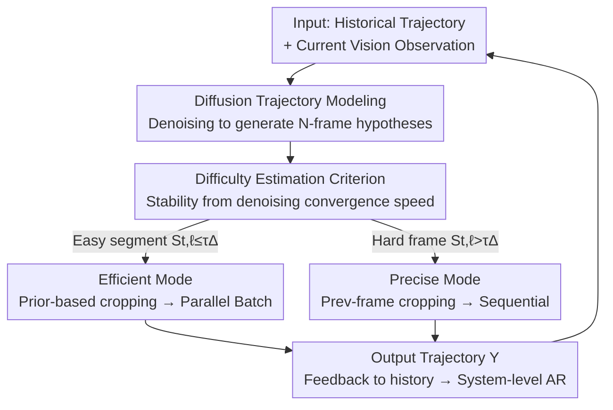

# Adaptive Capacity Autoregressive Visual Tracking

**Conference**: CVPR 2026  
**Paper**: [CVF Open Access](https://openaccess.thecvf.com/content/CVPR2026/html/Lin_Adaptive_Capacity_Autoregressive_Visual_Tracking_CVPR_2026_paper.html)  
**Code**: https://github.com/MIVXJTU/ARTrackAC  
**Area**: Video Understanding / Visual Object Tracking  
**Keywords**: Autoregressive Tracking, Adaptive Capacity, Diffusion Trajectory Prediction, Difficulty-aware Scheduling, Parallel Inference

## TL;DR
ARTrack-AC extends autoregressive tracking from "fixed-capacity per-frame prediction" to "system-level autoregression." It uses a lightweight diffusion trajectory estimator to pre-judge the stability of future video segments. A controller then switches to a low-capacity parallel mode for simple segments and a high-capacity sequential mode for difficult frames, achieving 66.7% AUC on LaSOT while being 2.9x faster than its predecessor.

## Background & Motivation
**Background**: Autoregressive (AR) tracking has recently become a strong paradigm, modeling tracking as sequence generation where each frame's prediction depends on the model's own previous output. ARTrack uses historical states to sequentially generate target coordinates for temporal consistency, while ARTrackV2 enables the joint evolution of trajectory and appearance, allowing the tracker to both "read" where the target is and "recite" what it looks like. These works prove AR modeling is a principled path for robust tracking.

**Limitations of Prior Work**: Existing AR trackers implicitly assume that **inference capacity is fixed**, meaning the computational depth and intensity are the same for every frame. However, the temporal difficulty of real videos is highly dynamic: stable segments with smooth motion require minimal reasoning, while sudden motion, severe occlusion, or cluttered backgrounds demand stronger temporal modeling. Fixed-capacity trackers either waste computation on simple segments or fail during sudden challenges due to insufficient capacity.

**Key Challenge**: Tracking faces a fundamental "accuracy vs. speed" trade-off that fluctuates violently within a single video. Existing heuristic patches (periodic template updates, frame skipping) ignore underlying temporal uncertainty and can easily break AR consistency—if a skipped frame drifts, the contaminated historical context propagates through the autoregressive chain.

**Goal**: To make the tracker autoregressive not only in "predicting target states" but also in "regulating its own inference capacity," advancing the paradigm from "what to predict" to "how to predict."

**Key Insight**: The **uncertainty** of future short-term trajectories serves as a difficulty signal. If a lightweight diffusion model's denoising process converges quickly for future $N$ frames, it indicates stable motion suitable for low-capacity parallel processing; slow convergence suggests upcoming abrupt changes requiring high-capacity sequential processing. This signal is proactive (looking forward) and does not rely on extra supervision.

**Core Idea**: Use a diffusion trajectory estimator to pre-judge future stability, driving a dual-mode (high-capacity sequential / low-capacity parallel) controller to adapt inference costs to temporal complexity while maintaining autoregressive consistency.

## Method

### Overall Architecture
ARTrack-AC addresses dynamic computational allocation within a video by organizing the tracking process as **system-level autoregression**. At each time step $t$, the tracker predicts the next target state based on history and observations while simultaneously adjusting its inference capacity based on "difficulty inferred from its own recent reasoning." Both tasks are conditioned on the same causal history, ensuring mode switching does not break temporal coherence.

The system consists of three collaborative components: **Precise Mode** (high-capacity AR tracker for sequential reasoning on difficult frames), **Efficient Mode** (low-capacity AR tracker for parallel reasoning on stable segments), and a **Difficulty-aware Controller** (lightweight diffusion estimator to pre-judge difficulty and provide trajectory priors).

The workflow is as follows: The controller uses current observations and history to generate future $N$-frame trajectory hypotheses via a diffusion model. Stability scores are derived from denoising convergence behavior to segment the future window into "easy segments" and "difficult frames." Easy segments use diffusion-predicted priors for search region cropping, allowing multiple frames to be processed **in parallel** as a batch in Efficient Mode. Difficult frames revert to sequential processing in Precise Mode using the previous frame's state. All components share the same trajectory space for seamless switching.

### Key Designs

**1. System-level Autoregression: Integrating "Capacity Choice" into the AR Chain**

Traditional AR trackers are only autoregressive regarding "what state to predict," with static capacity mismatched to fluctuating difficulty. This work formulates the inference as a conditional probability $p(Y^t \mid Y^{t-N:t-1}, (C, Z, X^t))$, where $C$ is a command token and $Y$ is the target sequence. Crucially, the precise mode, efficient mode, and controller operate in the **same trajectory space**. This ensures that capacity selection is a decision constrained by history and temporal causality, aligning training and testing objectives while preventing temporal fragmentation during mode switching.

**2. Diffusion Trajectory Modeling: Multi-modal Hypotheses as Proactive Difficulty Probes**

To judge difficulty **before** it occurs, simple regression often fails as it averages potential motion modes and lacks calibrated uncertainty for abrupt changes. This work models short-term future motion with a conditional diffusion process. Given an $N$-frame window, observations and history are projected into a condition $C_t = [\phi_v(V^t); \phi_h(H^t)]$. Starting from Gaussian noise $x_K \sim \mathcal{N}(0, I)$, the reverse denoising $p_\theta(x_{k-1} \mid x_k, C_t) = \mathcal{N}(\mu_\theta(x_k, k, C_t), \sigma_k^2 I)$ is performed. Each step decodes a trajectory hypothesis $Y_k^{t+1:t+N} = \psi(x_k, C_t)$. Diffusion is superior to regression (56.9 vs 53.9 AUC) because it captures multi-modal motion and responds to high-frequency mutations.

**3. Difficulty Estimation Criterion: Training-free Stability from Denoising Convergence**

Rather than using supervised heads or reactive appearance-only signals, this method extracts difficulty from the **convergence behavior** of diffusion denoising. For the future $\ell$-th frame ($t+\ell$), the change between adjacent denoising steps is measured as $\Delta_{t,\ell}^{(k)} = \lVert y_{t+\ell}^{(k)} - y_{t+\ell}^{(k-1)} \rVert_\infty$. The stability score $S_{t,\ell}$ is defined as the maximum change within an early window $k=1,\dots,s_{thr}$. Frames where $S_{t,\ell} \le \tau_\Delta$ are labeled "easy." The persistence of easy frames from $t+1$ defines the segment length. Slower convergence indicates lower model confidence and higher complexity. This training-free signal outperforms supervised cosine-distance signals (66.5 vs 65.9 AUC).

**4. Difficulty-aware Dual-mode Scheduling + Predicted Crop: Aligning Capacity with Difficulty**

Fixed-cycle switching (FCS) is a blind scheduling method that can lead to drift in efficient modes. This work uses Difficulty-aware Scheduling (DAS) to selectively enable Precise Mode only when stability is low. A key engineering component is **Predicted Crop**: stable segments use diffusion-predicted trajectory priors to crop future search regions. This removes the strong temporal dependency of "waiting for the previous frame's result," enabling batch parallelization in Efficient Mode to maximize GPU bandwidth. Hybrid cropping (PC@5/5) maintains high accuracy (66.7 AUC) while increasing GPU speed from 134 to 198 FPS.

### Loss & Training
During training, **only the diffusion model is optimized**. The precise tracker is frozen and used only to provide visual observations as conditions. The total loss is:

$$L = L_{\text{MSE}} + \lambda_1 L_{\text{L1}} + \lambda_2 L_{\text{SIoU}}$$

where $L_{\text{MSE}}$ is the denoising loss, and $L_{\text{L1}}$ and $L_{\text{SIoU}}$ are geometric constraints. The diffusion model uses velocity prediction and is trained for 300 epochs on GOT-10k, TrackingNet, and LaSOT using AdamW (learning rate $1\times10^{-4}$), taking approximately 15 hours on 4 A6000 GPUs.

## Key Experimental Results

### Main Results
The precise tracker uses the single-template version of ARTrackV2 (ARTrackOT), and the efficient tracker uses the 10-layer pico variant of FARTrack.

| Dataset | Metric | ARTrack-ACpara | AsymTrack-B | HiT-Base |
|--------|------|------|------|------|
| LaSOT | AUC(%) | **66.7** | 64.7 | 64.6 |
| LaSOT | GPU FPS | 191 | 135 | 116 |
| TrackingNet | AUC(%) | **81.8** | 80.0 | 80.0 |
| GOT-10k | AO(%) | **72.3** | 67.7 | 64.0 |
| LaSOText | AUC(%) | **47.5** | 44.6 | 44.1 |

`para` achieves 191 FPS with 66.7 AUC, setting a new SOTA for accuracy-speed trade-off—a 2.9x speedup over ARTrackOT (65 FPS).

### Ablation Study

| Configuration | LaSOT AUC | Description |
|------|-----------|------|
| Difficulty Signal: fixed-cycle | 65.8 | Blind periodic switching baseline |
| Difficulty Signal: cosine-distance (Supervised) | 65.9 | Supervised signal, marginal gain |
| Difficulty Signal: stability-signal (Training-free) | **66.5** | Ours, highly efficient |
| Predictor: regression | 53.9 | Lacks uncertainty calibration |
| Predictor: diffusion | **56.9** | Captures multi-modality |
| Diffusion Role: self-conditioned (Direct Output) | 38.5 | Severe drift accumulation |
| Diffusion Role: refined-conditioned | 56.9 | Per-frame refinement, still lags |
| Diffusion Role: As Prior (ARTrack-ACpara) | **66.7** | Most effective use of diffusion |

### Key Findings
- **Diffusion as Prior, Not Predictor**: Using diffusion trajectories directly as output results in only 38.5 AUC due to error accumulation. It is most effective as a trajectory prior to maintain temporal consistency for a localization-based tracker.
- **Training-free Signal is Stronger**: The stability signal derived from denoising behavior (66.5) is better than supervised cosine-distance (65.9) as it anticipates upcoming fluctuations.
- **Gains from Adaptive Coordination**: Cross-tracker experiments show that increasing precise mode capacity yields diminishing returns, whereas difficulty-aligned scheduling provides the primary benefit.
- **Window Size as a Control Knob**: A window of 5–6 favors accuracy (198 FPS / 66.7 AUC), while 9–10 favors speed (291 FPS / 63.5 AUC).

## Highlights & Insights
- **Difficulty Hidden in Denoising Convergence**: Using the change in trajectories between denoising steps as a difficulty probe is a clever, training-free proactive signal—"the more the model struggles, the harder the frame."
- **Predicted Crop Breaks Temporal Dependency**: By using diffusion priors to pre-crop search regions for future frames, the sequential chain is broken into parallel batches, maximizing GPU utilization without significant accuracy loss.
- **Paradigm Shift in AR Tracking**: Incorporating capacity scheduling into autoregression avoids the consistency issues of heuristic frame skipping, providing a clean extension to the AR tracking family.

## Limitations & Future Work
- **Failure in Low FPS + Large Windows**: On 10 FPS datasets like GOT-10k, large windows fail as trajectory priors become unreliable over large temporal gaps. Adaptive window mechanisms are lacking.
- **Backbone Dependency**: The upper bound is still constrained by the Precise Mode "backbone."
- **Manual Threshold $\tau_\Delta$**: Although a single threshold is easy to tune, optimal values vary across scenes, and there is no discussion of online adaptive thresholds.
- **Future Directions**: Online window/threshold adaptation and tighter coupling between diffusion and precise modes (e.g., differentiable cropping).

## Related Work & Insights
- **vs ARTrack / ARTrackV2**: These established joint coordinate-appearance AR tracking but used fixed capacity. Ours advances this to adaptive "how to predict."
- **vs FARTrack**: Whereas FARTrack used fixed low-capacity distillation, we reuse its pico variant as an Efficient Mode within a dynamic scheduling framework.
- **vs Early-exit/Skip Trackers (EAST, etc.)**: Most prior adaptive trackers are reactive and appearance-driven. This work introduces a proactive signal based on motion dynamics.

## Rating
- Novelty: ⭐⭐⭐⭐⭐ Integrating capacity into the AR chain and using denoising convergence as a signal is a principled innovation.
- Experimental Thoroughness: ⭐⭐⭐⭐ Extensive benchmarks and six sets of ablations, though lacking automated threshold analysis.
- Writing Quality: ⭐⭐⭐⭐⭐ Clear motivation and consistent narrative.
- Value: ⭐⭐⭐⭐⭐ New accuracy-speed SOTA with transferable insights for parallelizing sequential inference.

<!-- RELATED:START -->

## Related Papers

- [\[CVPR 2026\] Drift-Resilient Temporal Priors for Visual Tracking](drift-resilient_temporal_priors_for_visual_tracking.md)
- [\[CVPR 2026\] SpikeTrack: A Spike-driven Framework for Efficient Visual Tracking](spiketrack_a_spike-driven_framework_for_efficient_visual_tracking.md)
- [\[CVPR 2026\] An Efficient Token Compression Framework for Visual Object Tracking](an_efficient_token_compression_framework_for_visual_object_tracking.md)
- [\[CVPR 2026\] Attend Before Attention: Efficient and Scalable Video Understanding via Autoregressive Gazing](autogaze_attend_before_attention_efficient_video.md)
- [\[CVPR 2026\] Dual-Agent Reinforcement Learning for Adaptive and Cost-Aware Visual-Inertial Odometry](dual-agent_reinforcement_learning_for_adaptive_and_cost-aware_visual-inertial_od.md)

<!-- RELATED:END -->
