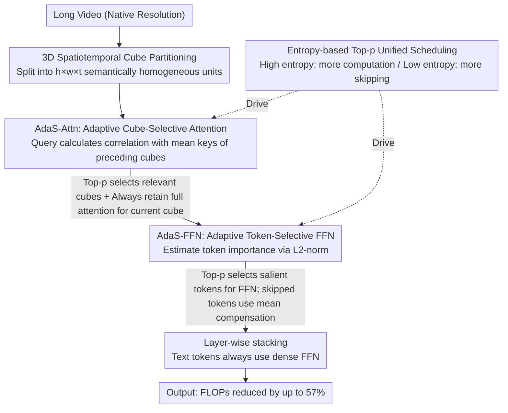

# AdaSpark: Adaptive Sparsity for Efficient Long-Video Understanding

**Conference**: CVPR 2026 Highlight  
**arXiv**: [2604.08077](https://arxiv.org/abs/2604.08077)  
**Code**: None  
**Area**: Video Understanding / Efficient Inference  
**Keywords**: long video, adaptive sparsity, Video-LLM, efficient inference, 3D cube

## TL;DR

Ours proposes AdaSpark, which reduces long-video processing FLOPs by up to 57% while maintaining performance through 3D spatiotemporal cube partitioning and two synergistic adaptive sparsity mechanisms: cube-level attention selection and token-level FFN selection.

## Background & Motivation

Long videos can generate sequences of hundreds of thousands or even millions of tokens. The quadratic attention complexity and FFN activation costs of standard Video-LLMs make processing infeasible. Current efficiency methods have two major defects: (1) irreversible information loss from frame sampling or token pruning harms fine-grained perception; (2) rigid predefined patterns like local attention limit long-range temporal modeling.

Preliminary analysis reveals two key phenomena: (1) video attention possesses high intrinsic sparsity, where a small number of tokens concentrate most of the attention probability, and the required number of tokens varies significantly across different layers; (2) FFN layers exhibit "computational laziness" toward visual tokens—text tokens undergo significant transformation (high variance) after FFN, while visual token changes remain stable.

## Method

### Overall Architecture

The starting point of AdaSpark lies in two preliminary observations: video attention is naturally highly sparse (a small number of tokens account for most attention probability, with token requirements varying greatly by layer), and FFNs exhibit "computational laziness" toward visual tokens (text tokens change drastically after FFN, while visual tokens remain stable). Consequently, it partitions video tokens into 3D spatiotemporal cubes ($h\times w\times t$) and places an entropy-based adaptive sparsity mechanism in both the attention and FFN layers to dynamically decide how much to compute or skip based on input complexity.

### Key Designs

**1. 3D Spatiotemporal Cube Partitioning: Establishing a Semantically Homogeneous Atomic Unit for Sparse Selection**

Videos exhibit strong locality in 3D space-time—adjacent tokens are highly likely to be correlated. AdaSpark first partitions video tokens fed into the LLM into cubes using $h\times w\times t$ windows, requiring each cube to be as semantically homogeneous as possible (high semantic cohesion). While this step does not save computation by itself, it serves as the foundation for the subsequent two sparsity mechanisms: the cube becomes the minimum atomic unit for attention and FFN selection. The more homogeneous the tokens within a cube, the more accurate and stable the selection of "which cube" or "which token" becomes.

**2. Adaptive Cube-Selective Attention (AdaS-Attn): Directing Each Query to Relevant Cubes**

Frame sampling or token pruning leads to irreversible information loss, while rigid patterns like local attention restrict long-range modeling. AdaS-Attn instead allows each query token to first calculate its correlation with all preceding cubes (similarity to the cube mean key $\bar{k}_j$), then uses Top-p (nucleus) to select the set of cubes to attend to:

$$P_i = \text{Softmax}([q \cdot \bar{k}_1/\sqrt{d_k}, ..., q \cdot \bar{k}_{i-1}/\sqrt{d_k}]^T),\quad \mathcal{S}_i = \{j \mid p_j \in \text{Top-p}(P_i, p)\}$$

When attention is dispersed (high entropy), more cubes are selected; when concentrated (low entropy), only a few are picked. Full attention to the token's own cube is always retained. Thus, sparsity adapts to content rather than using a fixed ratio.

**3. Adaptive Token-Selective FFN (AdaS-FFN): Bypassing "Lazy" Visual Tokens with Mean Compensation**

Since FFNs barely change the representations of most visual tokens, passing all of them through FFN is wasteful. AdaS-FFN estimates importance based on the L2-norm of tokens and uses Top-p to select tokens that actually pass through the FFN. Skipped tokens are not left unchanged; instead, they are updated using the mean FFN transformation of active tokens to maintain information flow: $y_k = x_k + \bar{m}_i$, where $\bar{m}_i = \frac{1}{|\mathcal{M}_i|}\sum_{j \in \mathcal{M}_i} FFN(x_j)$. Text tokens always pass through the FFN densely to preserve instructions and semantic content.

**4. Entropy-based Top-p Selection: A Unified Control Knob for Both Modules**

Both AdaS-Attn and AdaS-FFN share the same entropy-based Top-p selection to determine sparsity—automatically allocating more computation for high information density and skipping significantly when information is sparse. A single threshold $p$ controls the computational budget for both modules, ensuring consistency and ease of adjustment based on hardware constraints.

### Loss & Training

The sparsity strategy is applied to Qwen2.5-VL with minor fine-tuning for adaptation. The sparsity threshold $p$ provides unified control over the computational budget of both modules.

## Key Experimental Results

### Main Results

| Benchmark | AdaSpark | Dense Baseline | FLOPs Reduction |
|------|---------|---------------|-----------|
| MLVU Dev | Comparable | baseline | Up to 57% |
| VideoMME | Comparable | baseline | Up to 57% |
| VideoNIAH (Ultra-long) | Comparable | baseline | Significant |

### Key Findings

- Maintains comparable performance across multiple benchmarks while reducing FLOPs by 57%.
- Top-p selection outperforms fixed sparsity ratios—different layers and inputs require varying sparsity levels.
- Mean compensation is critical for maintaining the information flow of skipped tokens.
- The semantic homogeneity of cube partitioning is fundamental to the accuracy of sparse selection.
- In AdaS-FFN, skipped tokens are updated via $y_k = x_k + \bar{m}_i$, where $\bar{m}_i = \frac{1}{|\mathcal{M}_i|}\sum_{j \in \mathcal{M}_i} FFN(x_j)$.
- Preliminary analysis found FFNs exhibit "computational laziness" for visual tokens: the variance of L2-norm ratios is far lower than that of text tokens.
- Applied the sparsity strategy on Qwen2.5-VL with minor fine-tuning for adaptation.

## Highlights & Insights

- The Cube-Token two-level hierarchical sparsity design is systematic and comprehensive.
- The entropy-based adaptive mechanism elegantly avoids the suboptimality of fixed sparsity ratios.
- The discovery of FFN "laziness" toward visual tokens in the preliminary analysis provides a solid motivation for token-selective FFNs.
- The mean compensation strategy is simple yet effective.

## Limitations & Future Work

- The Top-p threshold still requires manual setting.
- Hardware implementation efficiency of sparse patterns depends on underlying framework support.
- Impact on fine-grained temporal reasoning (e.g., precise timestamp localization) requires further evaluation.
- Video cube partitioning uses a fixed $h \times w \times t$ window; adaptive partitioning might further improve results.
- Text tokens always pass through FFN densely, preserving their rich instruction and semantic content.
- Maintains comparable performance on benchmarks such as MLVU Dev, VideoMME, and VideoNIAH, including hour-long ultra-long videos.

## Rating

- Novelty: ⭐⭐⭐⭐ — Unified cube-token two-level sparsity framework.
- Technical Depth: ⭐⭐⭐⭐ — Rigorous logic from preliminary analysis to method design.
- Experimental Thoroughness: ⭐⭐⭐⭐ — Multi-benchmark validation including ultra-long videos.
- Value: ⭐⭐⭐⭐⭐ — High practical utility with 57% FLOPs reduction.

<!-- RELATED:START -->

## Related Papers

- [\[CVPR 2026\] Efficient Frame Selection for Long Video Understanding via Reinforcement Learning](efficient_frame_selection_for_long_video_understanding_via_reinforcement_learnin.md)
- [\[NeurIPS 2025\] AdaVideoRAG: Omni-Contextual Adaptive Retrieval-Augmented Efficient Long Video Understanding](../../NeurIPS2025/video_understanding/adavideorag_omnicontextual_adaptive_retrievalaugmented_effic.md)
- [\[ICLR 2026\] FOCUS: Efficient Keyframe Selection for Long Video Understanding](../../ICLR2026/video_understanding/focus_efficient_keyframe_selection_for_long_video_understanding.md)
- [\[CVPR 2026\] EVATok: Adaptive Length Video Tokenization for Efficient Visual Autoregressive Generation](evatok_adaptive_length_video_tokenization_for_eff.md)
- [\[CVPR 2026\] FluxMem: Adaptive Hierarchical Memory for Streaming Video Understanding](fluxmem_adaptive_hierarchical_memory_for_streaming_video_understanding.md)

<!-- RELATED:END -->
