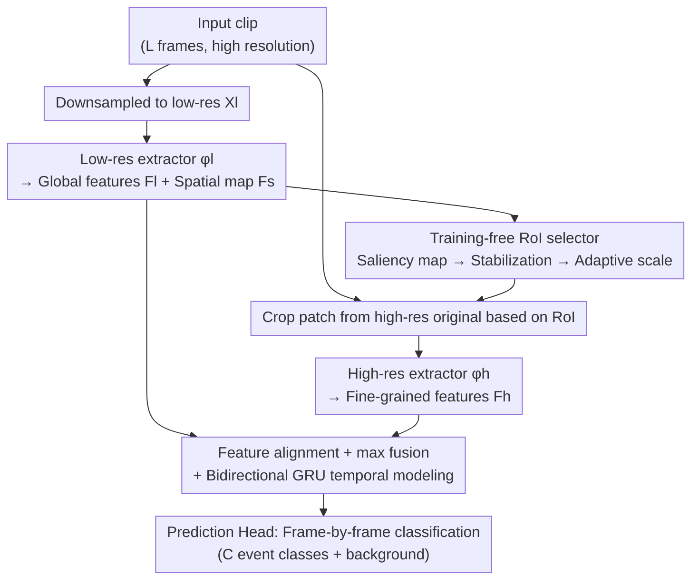

# AdaSpot: Spend Resolution Where It Matters for Precise Event Spotting

**Conference**: CVPR 2026  
**Paper**: [CVF Open Access](https://openaccess.thecvf.com/content/CVPR2026/html/Xarles_AdaSpot_Spend_Resolution_Where_It_Matters_for_Precise_Event_Spotting_CVPR_2026_paper.html)  
**Code**: https://github.com/arturxe2/AdaSpot  
**Area**: Video Understanding / Precise Event Spotting  
**Keywords**: Precise Event Spotting (PES), spatial redundancy, adaptive resolution, saliency map RoI, unsupervised cropping  

## TL;DR
AdaSpot utilizes low-resolution whole frames to capture global semantics, and leverages saliency maps to identify the most critical small region in each frame in a training-free manner, feeding it into a high-resolution branch to capture fine-grained details. Consequently, it allocates computational budget only where it matters in Precise Event Spotting (PES). It achieves state-of-the-art (SOTA) performance (+3.98 / +2.26 mAP) on the stringest mAP@0-frame metrics on Tennis and FineDiving while introducing negligible computational overhead.

## Background & Motivation
**Background**: Precise Event Spotting (PES) aims to locate "where a fast action/event occurs" in untrimmed videos almost at the frame level—such as the exact moment a tennis ball is struck or a diver hits the water. Dominant methods (e.g., E2E-Spot, T-DEED) focus on temporal modeling using lightweight 2D backbones paired with multi-scale temporal modules to capture short- and long-range dependencies.

**Limitations of Prior Work**: These methods process **all frames and the entire frame uniformly**, completely ignoring the substantial spatial-temporal redundancy in videos. This leads to a dilemma: (a) operating on high-resolution inputs wastes significant computation on task-irrelevant backgrounds, incurring prohibitive costs; (b) to remain feasible, almost all methods **downsample the input spatially** to a lower resolution. However, PES highly depends on fine-grained visual clues that are only visible at high resolutions (e.g., the exact moment a tennis ball touches the ground, or actions occupying a tiny portion of a wide shot). Downsampling blurs these details, degrading precise frame localization.

**Key Challenge**: Accuracy demands high-resolution details, whereas efficiency requires low resolution—and uniform frame processing forces a binary choice. Truly informative content is concentrated in a tiny region of each frame, yet it is treated equally.

**Goal**: To retain fine-grained visual cues without significantly increasing computational costs—namely, by allocating high resolution only "where it matters".

**Key Insight**: The action recognition field has long leveraged "dynamic computation/input-level redundancy reduction" concepts: first using a lightweight module to find the informative region, and then processing it with a high-resolution or larger model. However, these methods almost exclusively rely on **learnable cropping mechanisms** (reinforcement learning or differentiable cropping) to select regions, which suffer from unstable training even in standard action recognition. When applied to PES, because events are highly localized and supervision signals are weaker, the cropping becomes more jittery, exhibiting temporal inconsistency across frames.

**Core Idea**: Rather than training an unstable cropper, it is more effective to directly "read" where to look **without training** from the saliency maps inherent in low-resolution features. Specifically, a saliency map is used to select an RoI, which is then refined by an independent high-resolution branch and fused with global features. Replacing "learned cropping" with "reading saliency maps" is both stable and computationally efficient.

## Method

### Overall Architecture
AdaSpot processes video clips segmented into fixed length $L$ frames. For each frame, there exists both a high-resolution original image and its downsampled low-resolution counterpart. The entire pipeline follows a **dual-resolution dual-branch** architecture: the low-resolution branch is responsible for "global context and localization", while the high-resolution branch "complements fine-grained details". Finally, the features are fused in the temporal module for frame-by-frame classification.

Specifically, five components are chained together:
① **Low-resolution feature extractor** $\phi_l$: takes the low-resolution frame $X_l$ as input, outputting the global context feature $F_l$ for each frame, while retaining the feature map $F_s$ with spatial structure from the last layer.
② **RoI selector** (the training-free core of this paper): generates saliency maps from $F_s$ to identify **one** critical RoI for each frame, ensuring spatial-temporal consistency across frames.
③ These RoIs are cropped from the high-resolution original frame $X_h$ and scaled to a uniform size, then fed into the **High-resolution feature extractor** $\phi_h$ to extract fine-grained features $F_h$.
④ **Temporal modeler**: aligns and fuses $F_l$ (global) and $F_h$ (local details), subsequently capturing long-range temporal dependencies with a bidirectional GRU.
⑤ **Prediction head**: outputs the "event class / background" frame-by-frame.

### Key Designs

**1. Dual-Resolution Dual-Branch: Global Semantics & Local Details**

Applying high resolution directly to the entire frame is computationally prohibitive, while downsampling discards crucial details. AdaSpot resolves this conflict using two complementary paths. The low-resolution branch $\phi_l$ operates on the entire low-res frame $X_l \in \mathbb{R}^{L\times W_l\times H_l\times 3}$, utilizing an efficient RegNetY (embedded with a GSF module to capture local temporal information) to yield global features $F_l \in \mathbb{R}^{L\times d}$, cheaply understanding "what is happening globally". The high-resolution branch $\phi_h$ shares the **same architecture but with independent parameters**, processing only the cropped RoIs (resized uniformly to $112\times 112$) to produce fine-grained features $F_h \in \mathbb{R}^{L\times d}$. Crucially, high-resolution computation is limited to a single patch per frame, which only adds ~6 GFLOPs compared to the "pure low-res baseline" while being far more cost-effective than "uniform high-res processing". Adding the high-res branch alone boosts mAP@0 by +2.12 on Tennis and +5.04 on SN-BAS, proving that fine-grained details are indeed critical for PES.

**2. Training-free Saliency-based RoI Selection: Leveraging Inherent Low-Res Activations**

This is the most critical innovation of this work, aiming to circumvent the training instability of learnable cropping in PES. The authors leverage a known phenomenon (Zhou et al.): deep convolutional activation maps naturally respond more strongly to task-relevant regions. Thus, they compute the average of $F_s \in \mathbb{R}^{L\times W_s\times H_s\times d}$ along the channel dimension to obtain the saliency map $S \in \mathbb{R}^{L\times W_s\times H_s}$, followed by min-max normalization per frame. Since $F_s$ is extracted from deep layers and possesses a coarse spatial resolution, selecting RoIs directly on this coarse grid restricts the boxes to discrete positions (a one-grid shift translates to a massive jump in the original frame, causing jitter). Therefore, the saliency map $S_l$ is first spatially upsampled by $k$ times. This does not introduce additional information but provides a denser sampling grid, resulting in more precise localization and smoother trajectories across frames. This design choice entirely eliminates the need for learnable parameters or supervision for the cropping mechanism, bypassing the root cause of cropper instability.

**3. Saliency Map Triple Stabilization: De-biasing, De-noising, and Scale Adaptation**

Utilizing raw saliency maps directly for box selection poses three challenges, which the authors address individually. (1) **Center bias**: Zero-padding in convolutions weakens edge activations, pulling the boxes toward the frame center. To resolve this, the zero-padding in the low-res backbone $\phi_l$ is replaced with **replicate padding**, eliminating this artificial central bias. (2) **Noisy activations**: Frame-by-frame jitter in saliency maps causes inconsistent RoIs. The authors apply **spatial-temporal Gaussian smoothing** to $S$, obtaining $\tilde S$ to render RoIs coherent over space and time. Ablations show that temporal smoothing contributes the most; removing it drops mAP by -1.63 on Tennis and -3.03 on SN-BAS. (3) **Variable scale**: Different datasets, actions, and camera angles require varying box sizes, making a fixed size suboptimal. The authors normalize each frame's $\tilde S_l$ into a spatial importance probability distribution summing to 1. The RoI $R_l$ is then defined as the **smallest rectangle with a fixed aspect ratio that satisfies a cumulative patch importance of $\sum_{(x,y)\in R_l}\tilde S_l(x,y)\ge\tau$, and is no smaller than a minimum size $(W_r,H_r)$**. The threshold $\tau$ controls the box size: $\tau=0$ degenerates to the fixed minimum box size, while larger $\tau$ expands the box based on saliency highlights. This single hyperparameter unifies both fixed and adaptive behaviors (adaptive scales yield +0.49 on Tennis, while fixed boxes perform best on the wide-shot SN-BAS dataset, seamlessly switches via $\tau$).

**4. Dual-Branch Feature Fusion + Auxiliary Supervision for Stable Training**

Features from the two branches must be merged: first, each undergoes a two-layer MLP (with an intermediate ReLU) for distribution alignment, yielding $F'_l$ and $F'_h$. They are then combined using **max-pooling fusion** $F_f=\max(F'_l,F'_h)$, which is simple and efficient; the authors show that more complex fusion strategies do not yield noticeable gains. The fused feature is passed through a bidirectional GRU to capture long-range temporal dependencies before frame-by-frame classification. However, training solely using the main loss is unstable, as unreliable early RoIs can mislead the model, causing it to abandon the high-res branch and degenerate into the low-res baseline. To counter this, the authors **attach independent GRUs and linear heads for auxiliary supervision** to both the low-res and high-res branches. This forces the low-res branch to learn stable, reliable features (ensuring accurate RoI selection) and the high-res branch to capture complementary details, enabling stable single-stage, end-to-end training (auxiliary heads are discarded during inference). Simultaneously removing both auxiliary losses drops Tennis mAP@0 from 73.30 to 70.49.

### Loss & Training
PES is modeled as a frame-level classification task. The primary loss is the weighted cross-entropy $L_f=\frac{1}{L}\sum_{l=0}^{L-1}\mathrm{CE}_w(y_l,\hat y_l)$, where $w$ balances the foreground and background classes. Adding the auxiliary cross-entropy losses $L_l$ and $L_h$ for the two branches yields the total loss $L=\lambda_f L_f+\lambda_l L_l+\lambda_h L_h$. During inference, clips overlap by 50%, and Soft-NMS is applied to filter candidate events.

## Key Experimental Results

### Main Results
Tested on four PES datasets (Tennis, FineDiving, FineGym, and F3Set under strict mAP@{0,1,2}-frame metrics) and SN-BAS (under the ES setting, mAP@{0.5,1.0}s). Two variants are evaluated: AdaSpot$_s$ (RegNetY-200MF) and AdaSpot$_b$ (RegNetY-400MF). The results below focus on the most stringent mAP@0f:

| Dataset (mAP@0f) | Ours (AdaSpot$_b$) | Prev. SOTA | Gain |
|---|---|---|---|
| Tennis | 74.02 | 70.04 (E2E-Spot800MF) | +3.98 |
| FineDiving | 27.07 / 27.26($_s$) | 25.00 (E2E-Spot200MF) | +2.26 |
| FineGym | 18.21 | 18.35 (T-DEED800MF) | On par, with 6× fewer parameters and 1.5× fewer FLOPs |
| F3Set | 55.38 | — (Outperforms F3ED) | SOTA |
| SN-BAS@0.5s | 56.24 | 54.49 (E2E-Spot800MF) | +1.75, with 1.66× fewer FLOPs |

The most pronounced improvements occur on the most stringent metrics, showing that AdaSpot effectively captures the fine-grained visual clues required for precise frame-level localization, while maintaining or even improving computational efficiency, demonstrating a superior accuracy-efficiency trade-off.

### Ablation Study (Tennis / SN-BAS, AdaSpot$_s$)

| Configuration | Tennis@0f | SN-BAS@0.5s | Description |
|---|---|---|---|
| Full AdaSpot | 73.30 | 53.02 | Full model |
| Low-res branch only | 71.18 | 47.98 | Drops details |
| High-res branch only | 71.91 | 52.13 | Already beats low-res baseline but worse than dual-branch |
| Zero-padding (vs. replicate) | 72.15 | 51.01 | Center bias degrades saliency quality |
| w/o spatiotemporal smoothing | 71.67 | 49.99 | Jittery RoI, temporally inconsistent |
| Fixed RoI scale (τ=0) | 72.81 | **53.02** | Fixed is optimal for wide-shot SN-BAS |
| Adaptive scale | **73.30** | 51.71 | Adaptive is better for close-up Tennis |
| w/o $L_l$ & $L_h$ | 70.49 | 49.22 | Degenerates to low-res baseline |

### Key Findings
- **Details are crucial for PES**: Simply adding the high-resolution branch yields huge performance gains on strict metrics (+2.12 on Tennis / +5.04 on SN-BAS), proving that "lost high-resolution details" represent the bottleneck in precise event spotting.
- **Temporal smoothing matters most**: Among the three stabilization techniques, temporal smoothing contributes the most to de-jittering, indicating that PES values temporally coherent RoIs across frames rather than single-frame optimal ones.
- **A single hyperparameter $\tau$ unifies fixed and adaptive scales**: Close-up events (Tennis) benefit from boxes that expand with saliency, whereas wide-shot events (SN-BAS) are handled fine by the minimum box. This threshold mechanism allows the model to transition between behaviors based on dataset characteristics.
- **Auxiliary supervision prevents degeneration**: Without the auxiliary loss for the high-res branch, early unreliable RoIs mislead the training process, causing the model to ignore high-resolution details and retreat to the low-res baseline.
- **Outperforms learnable cropping**: Adapting learnable croppers like AdaFocus-v2 and Uni-AdaFocus to PES yields poor results; their selected RoIs often fail to cover the task-relevant areas, introducing training noise and verifying the authors' view that "learning to crop is highly unstable under sparse PES supervision."

## Highlights & Insights
- **"Reading saliency" instead of "learning to crop"**: The most elegant design is the realization that weak supervision in PES cannot reliably train a cropper. Instead, the model directly exploits the activation distributions inherent in low-resolution features. This approach is training-free, adds zero extra parameters, and is naturally smoothable in space and time, bypassing the unstable cropping issue entirely. This paradigm can be generalized to any task that requires selecting key regions under sparse supervision.
- **The elegance of cumulative importance threshold $\tau$**: Defining the RoI as the smallest rectangle enclosing a cumulative saliency value above a threshold $\tau$ unifies fixed and adaptive cropping under a single scalar. This is much cleaner than hardcoding multiple cropping heuristics and adapts automatically to different datasets.
- **Concrete realization of resource allocation**: The title "Spend Resolution Where It Matters" is concretely realized. Processing only a $112\times 112$ patch per frame at high resolution adds only +6 GFLOPs but boosts strict performance by +3.93, significantly outperforming uniform resolution scaling under similar FLOP constraints.

## Limitations & Future Work
- **Limited scope validation**: The authors admit that evaluations are currently limited to sports PES datasets; generalization to other scenarios demanding high temporal precision remains to be assessed.
- **Single-RoI assumption**: The method assumes one RoI per frame (motivated by the observation that crucial regions are heavily localized around a single point). Its applicability is questionable when multiple regions are simultaneously relevant or multiple events occur in a single frame, pointing to a need for multi-RoI extensions.
- **Reliance on saliency quality**: The mechanism relies heavily on the assumption that deep activations accurately locate the task-relevant region. In frames lacking sharp action cues (e.g., frames 2-3 in Fig. 4(d)), RoIs may drift, recovering only in subsequent frames. Protracted absence of cues might lead to persistent localization errors.
- **Potential improvements**: Generalizing the single-RoI formulation to multi-RoI based on $\tau$, or exploring parameter sharing between the dual branches to further reduce footprint (as briefly discussed in Supp. C).

## Related Work & Insights
- **vs. E2E-Spot / T-DEED (Mainstream PES)**: These methods focus heavily on temporal modeling, processing the entire frame uniformly on downsampled inputs. AdaSpot tackles **spatial redundancy**, applying high resolution only to key local regions. Consequently, it outperforms them on the most stringent metrics while being highly efficient, matching T-DEED800MF on FineGym with 6× fewer parameters.
- **vs. UGLF**: UGLF also aims to reduce spatial redundancy but relies on vision-language models (VLMs) to focus on concepts like "player/ball," requiring custom vocabulary lists per dataset. This lacks high-resolution details and carries heavy VLM overhead. AdaSpot selects regions in the input space without needing specific vocabularies, making it cheaper and more general.
- **vs. AdaFocus family / CoViFocus (Learnable Cropping)**: These methods learn cropping coordinates in the pixel or feature space, which are unstable under weak supervision. AdaSpot uses a training-free saliency map for box selection, avoiding this instability and demonstrating superior performance in PES.
- **vs. Saliency-guided frame-warping**: Warping scales up discriminative regions but introduces geometric distortions, disrupting spatial-temporal consistency. AdaSpot separates global and cropped local features via independent branches, preserving geometric structures with a better trade-off.

## Rating
- Novelty: ⭐⭐⭐⭐ Systematically bringing "training-free saliency-guided RoI selection" into PES, paired with triple stabilization to solve practical hurdles. The approach is novel and highly targeted.
- Experimental Thoroughness: ⭐⭐⭐⭐⭐ Evaluated on five datasets with two variants, comprehensive resolution trade-off curves, horizontal comparisons with multiple redundancy-reduction approaches, and extensive ablation studies. Very solid.
- Writing Quality: ⭐⭐⭐⭐ Extremely logical structure (Motivation $\rightarrow$ Limitations $\rightarrow$ Methodology), with clear alignments between text and figures.
- Value: ⭐⭐⭐⭐ Simple, effective, and boosts accuracy with almost zero overhead, providing direct practical value for sports video analytics and low-latency systems.

<!-- RELATED:START -->

## Related Papers

- [\[CVPR 2026\] Building a Precise Video Language with Human-AI Oversight](building_a_precise_video_language_with_human-ai_oversight.md)
- [\[CVPR 2026\] Hear What Matters! Text-conditioned Selective Video-to-Audio Generation](hear_what_matters_text-conditioned_selective_video-to-audio_generation.md)
- [\[CVPR 2026\] SAM2Text: Towards Prompt-Free and Multi-Resolution Video Scene Text Segmentation](sam2text_towards_prompt-free_and_multi-resolution_video_scene_text_segmentation.md)
- [\[CVPR 2026\] Color When It Counts: Grayscale-Guided Online Triggering for Always-On Streaming Video Sensing](color_when_it_counts_grayscale-guided_online_triggering_for_always-on_streaming_.md)
- [\[CVPR 2026\] Memory Matters: Boosting Training-Free Zero-Shot Temporal Action Localization with a Learnable Lookup Table](memory_matters_boosting_training-free_zero-shot_temporal_action_localization_wit.md)

<!-- RELATED:END -->
