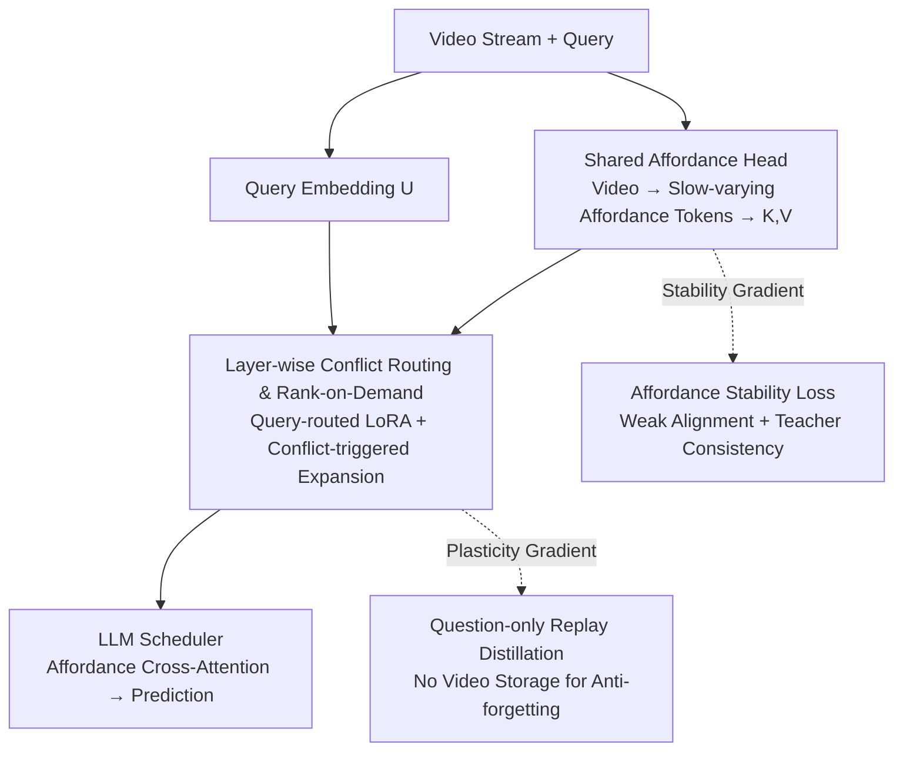

# Affordance-First Decomposition for Continual Learning in Video–Language Understanding

**Conference**: CVPR 2026  
**Paper**: [CVF Open Access](https://openaccess.thecvf.com/content/CVPR2026/html/xu_Affordance-First_Decomposition_for_Continual_Learning_in_Video-Language_Understanding_CVPR_2026_paper.html)  
**Code**: None  
**Area**: Video Understanding  
**Keywords**: Continual Learning, Video Question Answering, affordance, parameter-efficient routing, anti-forgetting  

## TL;DR
Addressing the blurred boundary of "what to stabilize and what to plasticize" in video-language continual learning, this paper proposes Affordance-First Decomposition (AFD). It maps videos to slowly-varying affordance tokens as a shared, stable "evidence foundation" across tasks, while concentrating plasticity into a LoRA scheduler that utilizes query-based routing and conflict-triggered rank expansion. Combined with question-only replay distillation (storing no videos) for anti-forgetting, AFD achieves higher accuracy and lower forgetting on ViLCo-Bench and domain/time-incremental VideoQA.

## Background & Motivation

**Background**: Video-language understanding (VideoQA, temporal localization, step reasoning) is increasingly deployed in non-stationary streaming scenarios with evolving data, domains, and questioning styles, making continual learning a necessity. Existing approaches generally fall into two categories: one attaches plastic modules (ColPro, DAM, L2P, etc.) via prompts/adapters to frozen large models, while the other uses distillation or topological constraints to preserve learned geometries for anti-forgetting.

**Limitations of Prior Work**: These methods suffer from two recurring flaws. First, **the objectives for stability vs. plasticity are not explicitly defined**—the determination of which structures should remain invariant across tasks and which should update with the stream is often ambiguous. Stability often emerges as a byproduct that is difficult to diagnose or control. Second, **plasticity is allocated arbitrarily**: capacity (number of prompts, LoRA rank) and routing are usually fixed or rigidly indexed by task, with interference mitigated only post-hoc via merging or global regularization. Few methods use online signals to decide "when and where" to adapt. Furthermore, heavy replay strategies involve storing old videos, incurring storage and privacy costs.

**Key Challenge**: The trade-off between stability (retaining old skills) and plasticity (learning new tasks) is implicitly compressed into the same set of parameters without structural division of labor, resulting in drift when modified and rigidity when stabilized.

**Goal**: Under realistic memory and privacy constraints, **explicitly specify where stability resides and where plasticity focuses**.

**Key Insight**: The authors observe that affordances (object-action regularities, e.g., "stoppable," "pourable") are quantities that change slowly across domains and tasks. If videos are first parsed into affordance evidence, this layer of evidence is naturally temporally aligned, reusable, and stable, acting as a "foundation" for higher-level task-specific reasoning. This physically separates stability from plasticity.

**Core Idea**: Replace "one-size-fits-all prompts/adapters + post-hoc stabilization" with a "slowly-varying affordance base + query-routed/conflict-driven plastic scheduler," embedding stability into a shared head and confining plasticity within a routing scheduler.

## Method

### Overall Architecture
AFD decomposes the model into two parts to manage stability and plasticity separately. Given a video $V=\{F_t\}_{t=1}^T$ and a free-text query $q$, the goal $y$ can be an open-ended answer, a time interval, or a sequence of steps. A **shared affordance head** $h_\psi$ encodes and maps the video into temporally aligned affordance tokens, which are then linearly projected into the LLM latent space as Key-Value pairs $(K,V)$. The **LLM-backbone scheduler** $g_\phi^{\text{LLM}}$ uses the same LLM to embed the query as $U$ and performs event-level reasoning on $(K,V)$ via layer-wise routed low-rank adapters:

$$f_\Theta(V,q) = g_\phi^{\text{LLM}}\big(U, K, V\big),\quad U = E_{\text{LLM}}[\text{Tok}(q)],\ (K,V)=\Pi(h_\psi(V)).$$

The key division of labor is: **stability constraints apply only to the shared head $h_\psi$, while task plasticity is entirely absorbed by the scheduler $g_\phi$**. Two small memory buffers are used only for training—$M_Q$ stores historical "questions" (no videos) for replay distillation, and $M_A$ stores affordance prototypes for diagnosis. Three separate losses are used: an affordance stability loss $\mathcal{L}_{\text{aff}}$ updates only the head, while task and replay losses update only the routing adapters.

### Key Designs

**1. Shared Affordance Head: Compressing Videos into a Slow-varying, Reusable "Evidence Foundation"**

The pain point addressed is the lack of a clear location for stability. AFD’s solution is to locate stability within a dedicated affordance space. The head first utilizes a spatiotemporal encoder to obtain frame-wise features $X_t$, then calculates an affordance distribution $P_t(a)=\text{softmax}_{a\in\mathcal{V}_A}(s_t(a)/\tau)$, where $s_t(a)=\langle w_a, z_t\rangle$ is the score for affordance category $a$ at frame $t$. To suppress noise, only the Top-$L$ categories are retained and re-normalized to obtain a sparse distribution $q_t(a)$, which is converted into continuous tokens $A_t=\sum_a q_t(a)\,E_A[a]$ via an embedding table $E_A$, and finally projected as $K_t=W_K A_t,\ V_t=W_V A_t$ for the LLM. This is effective because affordances represent object-action laws that change slowly across domains and tasks; using them as a shared foundation significantly reduces gradient conflicts. Ablations show that removing affordance tokens and feeding frame tokens directly to the LLM (Variant ❶) leads to the largest performance drop (Avg. Acc −2.9, Forgetting +1.5).

**2. Layer-wise Conflict Routing and Rank-on-Demand: Precisely Allocating Plastic Capacity to "True Conflicts"**

To address the arbitrary allocation of plasticity, AFD no longer uses fixed capacity or task-indexed routing. Instead, online signals determine when and where to adapt. At each adapter-augmented LLM layer $\ell$, a router calculates mixing weights $\alpha^{(\ell)}=\text{softmax}(W_r^{(\ell)}u)$ using the pooled query state $u$, and multiple LoRA experts are injected: $\widetilde{W}^{(\ell)}=W^{(\ell)}+\sum_{j}\alpha_j^{(\ell)}\frac{B_j^{(\ell)}A_j^{(\ell)}}{s_j^{(\ell)}}$. Capacity is not preset but grows dynamically based on "conflict," measured by clipped negative cosine similarity $c_j^{(k)}=\big[-\cos(g_j^{(k)},\bar g_j^{(1:k-1)})\big]_+$ (higher conflict when the current task gradient opposes the historical average). The rank increases discretely based on the surplus over a threshold, with a cap: $\Delta r_j^{(k)}=\min\{r_{\max}-r_j^{(k-1)},\lfloor\gamma(c_j^{(k)}-\tau_c)_+\rfloor\}$.

**3. Affordance Stability Loss: "Locking" the Foundation with Weakly Supervised Alignment and Teacher Consistency**

Structural division alone is insufficient; specific losses must stabilize the affordance head. $\mathcal{L}_{\text{aff}}$ combines two terms: **Weak Alignment**, which uses verb candidates $\mathcal{C}_\ell$ from ASR transcripts as weak labels to maximize the probability of corresponding affordance categories $-\sum_\ell\log(\sum_{t\in S_\ell}\sum_{a\in\mathcal{C}_\ell}P_t(a))$ (avoiding frame-wise manual annotation), and **Teacher Consistency**, which uses the frozen affordance distribution $\bar P_t$ from the previous task as a KL constraint $\text{KL}(\bar P_t\|P_t)$. The gradient of this loss updates only $\psi$.

**4. Question-only Replay Distillation: Anti-forgetting and Privacy without Storing Videos**

Standard replay requires storing old videos, creating storage and privacy issues. AFD only stores "diverse historical questions" in $M_Q$. During replay, these old questions are paired with **videos from the current task** for distillation: $\mathcal{L}_{\text{replay}}=\mathbb{E}_{q^{(u)},V}\,\text{KL}(\bar p_T(\cdot|V,q)\|p_T(\cdot|V,q))$, where $p_T$ is a temperature-softened distribution. A confidence threshold $\rho$ is used to filter noisy supervision. This approach requires zero historical video frames, ensuring privacy and saving memory.

### Loss & Training
On task $k$, the objective is to minimize $\mathcal{L}^{(k)}=\mathcal{L}_{\text{task}}^{(k)}+\lambda_{\text{aff}}\mathcal{L}_{\text{aff}}^{(k)}+\lambda_{\text{rep}}\mathcal{L}_{\text{replay}}^{(k)}$. $\mathcal{L}_{\text{task}}$ supports three query formats: token-wise cross-entropy for generative answers; start/end frame classification + $\lambda_u(1-\text{tIoU})$ for temporal spans; and autoregressive cross-entropy for step sequences. The key constraint is **gradient routing**: $\mathcal{L}_{\text{aff}}$ updates only the affordance head $\psi$, while $\mathcal{L}_{\text{task}}$ and $\mathcal{L}_{\text{replay}}$ update only the scheduler $\phi$ containing the routed adapters, implementing physical isolation at the optimization level.

## Key Experimental Results

### Main Results

Domain-Incremental VideoQA (sequential training on 6 datasets, top-1 accuracy %):

| Method | Avg.↑ | Forget↓ |
|------|-------|---------|
| Seq-FT | 39.8 | – |
| ColPro | 45.5 | −3.9 |
| Bisecle | 49.4 | −2.7 |
| DAM (Prev. SOTA) | 50.2 | −2.3 |
| **AFD (Ours)** | **51.6** | **−1.8** |

ViLCo-Bench (Ego4D, query-incremental):

| Method | MQ R@1@0.5↑ | NLQ R@1@0.5↑ | VQ stAP@0.25↑ |
|------|-------------|--------------|---------------|
| ViLCo | 21.2 | 12.6 | 13.4 |
| DAM | 27.1 | 16.9 | 16.5 |
| Bisecle | 26.8 | 18.2 | 16.1 |
| **AFD (Ours)** | **29.6** | **20.7** | **18.4** |

### Ablation Study

| Configuration | Domain Avg.↑ | Forget↓ | Description |
|------|--------------|---------|------|
| Full AFD | 51.6 | −1.8 | Full model |
| ❶ w/o affordance token | 48.7 (−2.9) | −3.3 (+1.5) | Direct frame tokens |
| ❷ w/o router (uniform) | 49.8 (−1.8) | −2.6 (+0.8) | Removes instance routing |
| ❸ Fixed LoRA rank=8 | 50.5 (−1.1) | −2.3 (+0.5) | Removes conflict expansion |
| ❹ w/o Question-only Replay | 50.2 (−1.4) | −2.8 (+1.0) | $\lambda_{\text{rep}}=0$ |

### Key Findings
- **Affordance base is the primary contributor**: Removing it (❶) drops performance by 2.9 points and worsens forgetting by 1.5, verifying that stability is primarily derived from the affordance space.
- **Routing and rank expansion are complementary**: Removing instance-level routing (❷) or fixing rank (❸) leads to performance degradation, showing that "where to adapt" (query routing) and "how much to adapt" (conflict-triggered expansion) are independent levers.
- **The foundation is truly stable**: Prototype drift is small, and CKA values between adjacent tasks are high, confirming the affordance foundation’s stability.

## Highlights & Insights
- **Affordance as a "Stability Anchor"**: Using affordance patterns as an explicit shared foundation provides a semantic and diagnosable carrier for stability, rather than relying on implicit regularization.
- **Conflict-Triggered Discrete Rank Growth**: Quantifying conflict using the negative cosine similarity between current and historical gradients facilitates online, bounded, and interpretable decisions on "when to expand."
- **Question-only Replay**: Replacing "videos" with "questions + current videos" is a practical trick for privacy and storage-sensitive scenarios, adaptable to various VLM continual learning pipelines.

## Limitations & Future Work
- Affordance vocabulary $\mathcal{V}_A$ and weak alignment rely on verbs from ASR transcripts. For videos with **no or poor-quality audio**, weak alignment may fail, degrading affordance calibration.
- Multiple hyperparameters (conflict threshold $\tau_c$, gain $\gamma$, $\beta$, $\rho$) exist, with limited analysis on their robustness across datasets.
- Question-only replay assumes "old questions + new videos" can approximate the old distribution; its validity may be questionable when domain shifts between new and old videos are extreme.

## Related Work & Insights
- **vs. ColPro / DAM**: These methods use prompts/adapters for plasticity but lack explicit structural separation for stability and use fixed capacities. AFD anchors stability in the affordance head and uses dynamic rank growth, leading to lower forgetting (−1.8 vs. DAM −2.3).
- **vs. Bisecle**: Bisecle uses binding and separation to implicitly reduce interference; AFD physically separates the stable base and plastic scheduler, offering better interpretability.

## Rating
- Novelty: ⭐⭐⭐⭐ Using affordance as a stability anchor and conflict-triggered rank growth provides distinct structural separation.
- Experimental Thoroughness: ⭐⭐⭐⭐ Covers various incremental protocols and complex reasoning; ablation studies are detailed.
- Writing Quality: ⭐⭐⭐⭐ The division of stability/plasticity is clear; formulas are complete.
- Value: ⭐⭐⭐⭐ Question-only replay and conflict-triggered expansion are practical and transferable for privacy-sensitive video CL.

<!-- RELATED:START -->

## Related Papers

- [\[ICCV 2025\] RainbowPrompt: Diversity-Enhanced Prompt-Evolving for Continual Learning](../../ICCV2025/video_understanding/rainbowprompt_diversity-enhanced_prompt-evolving_for_continual_learning.md)
- [\[CVPR 2026\] First Frame Is the Place to Go for Video Content Customization](first_frame_is_the_place_to_go_for_video_content_customization.md)
- [\[CVPR 2026\] SkillSight: Efficient First-Person Skill Assessment with Gaze](skillsight_efficient_first-person_skill_assessment_with_gaze.md)
- [\[CVPR 2026\] Efficient Frame Selection for Long Video Understanding via Reinforcement Learning](efficient_frame_selection_for_long_video_understanding_via_reinforcement_learnin.md)
- [\[CVPR 2026\] PyraTok: Language-Aligned Pyramidal Tokenizer for Video Understanding and Generation](pyratok_language-aligned_pyramidal_tokenizer_for_video_understanding_and_generat.md)

<!-- RELATED:END -->
