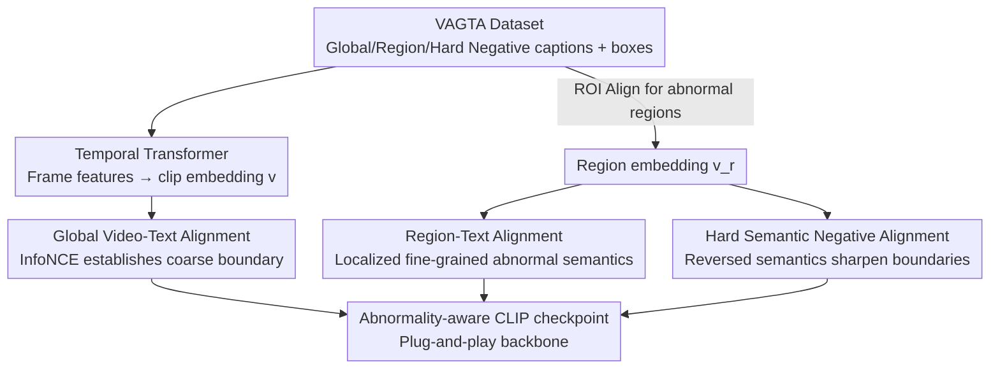

# Alert-CLIP: Abnormality-aware Latent-Enhanced Representation Tuning of CLIP for Video Anomaly Detection

**Conference**: CVPR 2026  
**Area**: Video Understanding / Multimodal VLM  
**Keywords**: Video Anomaly Detection, CLIP Fine-tuning, Cross-modal Alignment, Hard Negative Samples, Abnormality-aware  
**Code**: https://github.com/ClarkZhu216/Alert-CLIP_dataset (Dataset VAGTA included)

## TL;DR
To address the issue where CLIP's text space highly entangles "normal" and "abnormal" descriptions—causing near-identical similarity scores for both types of prompts—this paper reshapes CLIP's embedding geometry via three-level (Global/Regional/Hard Negative) cross-modal contrastive training using a self-built dataset (VAGTA). This transforms CLIP into a more abnormality-aware backbone, consistently outperforming original CLIP in weakly supervised, zero-shot, and open-vocabulary VAD settings.

## Background & Motivation

**Background**: The goal of Video Anomaly Detection (VAD) is to automatically identify events that deviate from normal patterns. Due to the scarcity of abnormal samples, mainstream approaches use semi-supervised (learning only normal patterns) or weakly supervised learning (video-level labels + Multi-Instance Learning, MIL). Recently, leveraging Vision-Language Models (VLMs) like CLIP to provide semantic guidance for visual modeling (e.g., VadCLIP, AnomalyCLIP, STPrompt, OVVAD) has become a new trend.

**Limitations of Prior Work**: Most CLIP-based methods **freeze the CLIP backbone** and only add task-specific modules on extracted features. The issue is that they inherit CLIP's inherent "abnormality-weak" representation. This paper provides direct evidence through text-space probes and video-text similarity experiments: the gap in cosine similarity calculated by CLIP between normal and abnormal prompts for the same abnormal video is extremely small (Figure 1 shows $\Delta < 0.16$ or even $< 0.04$), sometimes even favoring incorrect normal descriptions.

**Key Challenge**: The essence of an anomaly is a "deviation from the norm" rather than an independent semantic category or object attribute. Identification requires **understanding contextual semantics and fine-grained changes**. However, CLIP's pre-training involves aligning whole images with coarse-grained prompts ("a photo of [category]"), making it naturally poor at capturing context and local details. Consequently, normal/abnormal descriptions are highly entangled in the text space (Figure 2 shows cosine similarities for "Normal" vs. multiple abnormal descriptions all around 0.7). This entanglement propagates to video-text alignment, leading to unreliable discrimination in real videos.

**Quantitative Diagnosis (MeanSignScore, MSS)**: To quantify this entanglement, the authors define a diagnostic metric, MSS. Let $P_N$ and $P_A$ be sets of normal and abnormal prompts, respectively. For a video $x$, the average similarities to these sets are $S_N(x)$ and $S_A(x)$. The signed score is defined as $SS(x)=S_A(x)-S_N(x)$ (if $x$ is abnormal) or $S_N(x)-S_A(x)$ (if $x$ is normal). MSS is the average over the dataset: $\text{MSS}=\frac{1}{|D|}\sum_x SS(x)$. A larger MSS indicates the model consistently favors the semantically correct prompt; values near 0 suggest no discriminative power, while negative values indicate frequent wrong choices. In Table 1, the MSS for CLIP/LongCLIP/SigLIP/BLIP are **all negative** (CLIP average -0.0564), quantitatively confirming the entanglement.

**Goal / Core Idea**: Rather than patching frozen features, the model directly performs "abnormality-aware" representation tuning on CLIP. While preserving CLIP's semantic priors, it reshapes the decision geometry using three complementary alignment signals: global scene semantics, spatially localized abnormal semantics, and fine-grained semantic contrast. The tuned checkpoint is fully compatible with standard CLIP inference, serving as a plug-and-play backbone, and requires **no localization annotations during testing**.

## Method

### Overall Architecture
Alert-CLIP keeps the CLIP visual and text encoder structures unchanged and adds a lightweight **temporal transformer** to aggregate frame-level visual features from $T$ frames into an $\ell_2$-normalized clip-level embedding $v\in\mathbb{R}^D$. For abnormal regions with bounding boxes, **ROI Align** extracts region features from frame-level features, which are then aggregated into a region embedding $v_r$ using the same temporal transformer. Training reshapes the shared space geometry via three signals: global video descriptions, region descriptions tied to boxes, and hard negative samples (semantically similar but with inverted normal/abnormal meanings). This is based on the **VAGTA** dataset (global captions, region captions, hard negative captions, and bounding boxes). A **two-stage** curriculum is used: first, global alignment establishes a stable normal/abnormal boundary, followed by joint training with all three signals.

### Key Designs

**1. VAGTA: An Anomaly Dataset with Boxes + Multi-level Captions**

Three-level alignment requires "global description + regional localization + semantic negative samples." Existing VAD datasets vary in quality and lack regional annotations. The authors re-annotated UCF-Crime and MSAD to build VAGTA via a three-step process: ① Screening using ChatGPT + manual review to remove low-quality videos (category mismatch, weak semantics, repetition, corrupted frames), assigning a global caption to each; ② Precise bounding box annotation for abnormal regions with corresponding region-level captions; for normal clips, the entire frame is treated as one region with a distinct caption; ③ Using Qwen-VL to generate **3 hard negative captions** for each region caption—visually similar but with inverted normal/abnormal semantics. The result is 4,212 high-quality clips (3,726 training: 2,585 normal + 1,141 abnormal; 486 testing), following official splits.

**2. Global Video-Text Alignment: Establishing Coarse Normal/Abnormal Boundaries**

Addressing the fundamental entanglement in CLIP’s text space, the first level uses global descriptions to pull semantic spaces apart. Given a batch of $B$ videos and descriptions $\{(v_i,t_i)\}$, similarity $s_{ij}=\langle v_i,t_j\rangle$ is calculated to optimize InfoNCE:

$$\mathcal{L}_{\text{global}}=-\frac{1}{B}\sum_{i=1}^{B}\log\frac{\exp(s_{ii}/\tau)}{\sum_{j=1}^{B}\exp(s_{ij}/\tau)}$$

This establishes global semantic separation between normal and abnormal at the description level. Experiments show that this stage alone flips the MSS to positive (0.1733 on UCF-Crime) and outperforms frozen CLIP in weakly supervised AUC.

**3. Region-Text Alignment: Injecting Spatially Localized Fine-grained Semantics**

Global alignment only provides coarse semantics. The second level uses region features $v_r^n$ and descriptions $t_r^n$ for $R$ positive pairs to optimize region-level InfoNCE:

$$\mathcal{L}_{\text{region}}=-\frac{1}{R}\sum_{n=1}^{R}\log\frac{\exp(s_{nn}^{r}/\tau)}{\sum_{m=1}^{R}\exp(s_{nm}^{r}/\tau)}$$

Where $s_{nm}^{r}=\langle v_r^n,t_r^m\rangle$. This injects localized abnormal semantics into the shared space, creating accurate mappings between local visual changes and context. Bounding boxes are **only used as supervision during training**.

**4. Hard Semantic Negative Alignment: Sharpening the Decision Boundary**

While region alignment matches visual regions to descriptions, boundaries remain blurred when normal and abnormal scenes are **visually similar but semantically opposite** (e.g., "carefully reversing" vs. "crashing into cars"). This level uses $K$ hard negative captions $\{t_{n,k}^{r,-}\}$ for each ground-truth region description $t_n^{r,+}$. Let $s_n^{+}=\langle v_r^n,t_n^{r,+}\rangle$ and $s_{n,k}^{-}=\langle v_r^n,t_{n,k}^{r,-}\rangle$:

$$\mathcal{L}_{\text{hard}}=-\frac{1}{R}\sum_{n=1}^{R}\log\frac{\exp(s_n^{+}/\tau_h)}{\exp(s_n^{+}/\tau_h)+\sum_{k=1}^{K}\exp(s_{n,k}^{-}/\tau_h)}$$

Hard negatives force the model to distinguish confounding pairs that "look alike but mean the opposite," improving robustness.

### Loss & Training
A two-stage curriculum is applied. **Stage I (Global Pre-alignment)**: Optimizes only $\mathcal{L}_{\text{global}}$. **Stage II (Joint Fine-tuning)**: Starting from Stage I weights, jointly optimizes:

$$\mathcal{L}_{\text{total}}=\mathcal{L}_{\text{global}}+\lambda\,\mathcal{L}_{\text{region}}+\gamma\,\mathcal{L}_{\text{hard}}$$

The backbone uses OpenCLIP ViT-L/32, optimized via AdamW with mixed precision on an A800 (80GB). Two-stage training (89.32) outperforms joint training from scratch (88.61).

## Key Experimental Results

### Main Results
Weakly supervised setting (replacing the backbone in the VadCLIP framework):

| Dataset | Metric | CLIP | Alert-CLIP(Stage1) | Alert-CLIP(Full) |
|--------|------|------|--------------------|------------------|
| UCF-Crime | AUC | 88.02 | 88.67 | **89.32** |
| UCF-Crime | AP | 32.72 | 32.16 | **33.57** |
| MSAD | AUC | 87.45 | 88.59 | **89.63** |
| MSAD | AP | 71.09 | 75.10 | **78.24** |

Zero-shot setting (anomaly scores derived directly from prompt similarity margins):

| Backbone | UCF-AUC | XD-AP | UB-AUC | UB-AP |
|----------|---------|-------|--------|-------|
| CLIP | 61.91 | 34.35 | 72.08 | 57.43 |
| VideoCLIP | 72.13 | 54.36 | 72.34 | 55.07 |
| LLaVA-1.5-7B | 72.84 | 50.26 | – | – |
| Alert-CLIP(Full) | **75.75** | **55.18** | **75.39** | **60.11** |

### Ablation Study

| Config | Loss Enabled | UCF AUC |
|------|---------|---------|
| CLIP baseline | – | 88.02 |
| Global only | $\mathcal{L}_{\text{global}}$ | 88.53 |
| Global+Region | $+\mathcal{L}_{\text{region}}$ | 88.85 |
| Global+Region+Hard | $+\mathcal{L}_{\text{hard}}$ | **89.32** |

### Key Findings
- **Three-level signals are complementary**: Each adds positive Gain, proving they are not redundant.
- **Hard negatives drive zero-shot performance**: Zero-shot UCF AUC improved from 72.71 (standard negatives) to 75.75 with hard negatives.
- **General capabilities preserved**: Alert-CLIP shows no regression (and even some gains) on ImageNet and COCO retrieval tasks, demonstrating that abnormality training does not damage original transferability.

## Highlights & Insights
- **Diagnosing "CLIP's ignorance" as a measurable problem**: Using MSS flips "normal/abnormal entanglement" from a qualitative observation to a quantitative metric.
- **Anomaly = Deviation, not a Category**: By focusing on "semantically inverted hard negatives," the model learns the boundary between normal and abnormal behavior rather than just identifying object classes.
- **Plug-and-play without test-time overhead**: Training uses spatial boxes, but inference remains standard CLIP-style, making it easy to integrate into existing pipelines.

## Limitations & Future Work
- **Dependency on LLM/Human annotation**: VAGTA relies heavily on manual boxes and LLM-generated captions; the quality of semantic inversion is not quantitatively verified.
- **Scale**: The dataset remains relatively small (4,212 clips) compared to massive pre-training sets.
- **Future Work**: Online generation of hard negatives or expanding the alignment to the temporal evolution of anomalies.

## Related Work & Insights
- **Vs. VadCLIP / AnomalyCLIP**: These use frozen backbones and add task modules; Ours tunes the representation directly, which can be applied back to these frameworks for further gains.
- **Vs. LongCLIP / Grounding methods**: These focus on long tokens or object attributes; Ours handles the abstract concept of "anomaly" which these methods still fail to distinguish (negative MSS).
- **Vs. OVVAD**: Ours achieves better novel-class AP, indicating superior generalization.

## Rating
- Novelty: ⭐⭐⭐⭐ 
- Experimental Thoroughness: ⭐⭐⭐⭐ 
- Writing Quality: ⭐⭐⭐⭐ 
- Value: ⭐⭐⭐⭐ 

<!-- RELATED:START -->

## Related Papers

- [\[ICLR 2026\] Steering and Rectifying Latent Representation Manifolds in Frozen Multi-Modal LLMs for Video Anomaly Detection](../../ICLR2026/video_understanding/steering_and_rectifying_latent_representation_manifolds_in_frozen_multi-modal_ll.md)
- [\[CVPR 2026\] No Need For Real Anomaly: MLLM Empowered Zero-Shot Video Anomaly Detection](no_need_for_real_anomaly_mllm_empowered_zero-shot_video_anomaly_detection.md)
- [\[AAAI 2026\] HeadHunt-VAD: Hunting Robust Anomaly-Sensitive Heads in MLLM for Tuning-Free Video Anomaly Detection](../../AAAI2026/video_understanding/headhunt-vad_hunting_robust_anomaly-sensitive_heads_in_mllm_.md)
- [\[ICML 2026\] Privacy-Aware Video Anomaly Detection through Orthogonal Subspace Projection](../../ICML2026/video_understanding/privacy-aware_video_anomaly_detection_through_orthogonal_subspace_projection.md)
- [\[CVPR 2026\] Weakly Supervised Video Anomaly Detection with Anomaly-Connected Components and Intention Reasoning](weakly_supervised_video_anomaly_detection_with_anomaly-connected_components_and_.md)

<!-- RELATED:END -->
