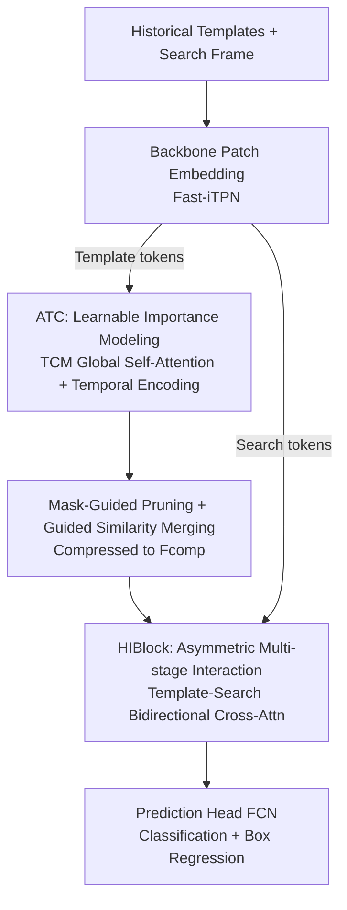

# An Efficient Token Compression Framework for Visual Object Tracking

**Conference**: CVPR 2026  
**Paper**: [CVF Open Access](https://openaccess.thecvf.com/content/CVPR2026/html/Wu_An_Efficient_Token_Compression_Framework_for_Visual_Object_Tracking_CVPR_2026_paper.html)  
**Code**: https://github.com/PJD-WJ/ETCTrack  
**Area**: Video Understanding  
**Keywords**: Visual Object Tracking, Token Compression, Multi-frame Template, Spatiotemporal Redundancy, Attention Interaction  

## TL;DR
To address the visual token explosion and redundancy in multi-frame template tracking, ETCTrack utilizes a learnable Adaptive Token Compressor (ATC) to compress historical template frames into a refined subset. This is followed by a Hierarchical Interaction Block (HIBlock) for deep interaction with the search region. It sets new state-of-the-art accuracy across 7 benchmarks while reducing computation (template tokens reduced by 60%, MACs reduced by 21.4%, with only a 0.4% drop in accuracy).

## Background & Motivation
**Background**: To handle dramatic appearance changes and long-term tracking, modern Transformer-based trackers generally adopt a "multi-frame template" approach—feeding multiple historical template frames into the network to build more robust target representations using richer spatiotemporal cues (e.g., ODTrack, HIPTrack).

**Limitations of Prior Work**: The direct consequence of using multiple frames is a surge in the number of input visual tokens. Since Transformer self-attention has quadratic complexity relative to the number of tokens, computation skyrockets. Furthermore, the authors' preliminary experiments (using OSTrack + a new backbone) found that accuracy degrades after increasing the number of template frames beyond 5—the additional frames introduce significant **visual redundancy**, which contaminates the target representation. Essentially, "adding frames" is both expensive and potentially detrimental to performance.

**Key Challenge**: In multi-frame templates, "information content" is coupled with "redundancy/computational cost." Existing token compression methods mostly rely on **manual rules** (e.g., scoring based on attention maps, retaining central tokens via fixed spatial rules). These non-learnable criteria may not align with the final tracking objective, risking the loss of critical discriminative tokens.

**Goal**: To eliminate visual redundancy in multi-frame template tracking using a learnable, end-to-end approach, **simultaneously** reducing computation and improving accuracy, rather than choosing between the two.

**Key Insight**: The authors draw inspiration from Multi-modal Large Language Models (MLLM), where "compressing visual tokens is fundamental to balancing capability and computation" when processing long videos. They argue this applies to multi-frame tracking—the key is to let the compressor be supervised directly by the final tracking loss to learn the contextual importance of each token, instead of following predefined rules.

**Core Idea**: A "compress-then-interact" framework is proposed. First, a learnable module compresses historical template tokens into a compact and discriminative subset. Then, this refined template undergoes hierarchical deep interaction with search features.

## Method

### Overall Architecture
ETCTrack receives several historical template frames $Z \in \mathbb{R}^{T\times 3\times H_z\times W_z}$ and the current search frame $X$. They first pass through a backbone (Fast-iTPN) for patch embedding to obtain template tokens $F_z\in\mathbb{R}^{N_z\times C}$ and search tokens $F_x\in\mathbb{R}^{N_x\times C}$. The pipeline follows two steps: **(1) Compression**—template tokens are sent to the Adaptive Token Compressor (ATC) to dynamically filter redundant tokens and construct a compact representation $F_{comp}$; **(2) Interaction**—$F_{comp}$ and search tokens are sent to a Hierarchical Interaction Encoder stacked with multiple HIBlocks for asymmetric, multi-stage feature interaction. Finally, the enhanced search features enter the prediction head to estimate the bounding box. Fast-iTPN is chosen as the backbone because fine-grained tasks like tracking require multi-scale hierarchical features, whereas standard plain ViT only produces single-scale features, which is weaker for localizing targets of varying sizes.

### Key Designs

**1. Adaptive Token Compressor (ATC): Replacing manual rules with learnable global attention for importance assessment**

The ATC is the core for eliminating visual redundancy. Input template features $F_z\in\mathbb{R}^{(T\cdot L)\times C}$ are first reshaped back to an explicit spatiotemporal structure $Z_p\in\mathbb{R}^{T\times L\times C}$ ($T$ frames, $L$ tokens per frame). A **learnable temporal positional encoding** $E_{temp}\in\mathbb{R}^{T\times 1\times C}$ is added to distinguish tokens from different frames, then flattened into $Z_{temp}$. This is fed into the Token Correlation Module (TCM)—composed of $N_{atc}$ stacked self-attention layers. Through global self-attention, all template tokens interact to model cross-frame spatiotemporal correlations and identify the most discriminative parts:

$$Z_{context} = \mathrm{TCM}(Z_{temp}) \in \mathbb{R}^{(T\cdot L)\times C}$$

The key value lies not in the size of the network but in "learning directly from the final tracking objective" which tokens to keep or discard. This is superior to manual compression based on attention maps or spatial rules, which often misalign with the tracking task and may delete critical tokens. Ablations show using the first 8 layers of Fast-iTPN for TCM (without extra parameters) outperforms ViT-B or 8-layer Transformers trained from scratch, suggesting that "refined and task-specific" architecture is more important than "larger" architecture.

**2. Mask-Guided Pruning + Guided Similarity Merging: Pruning redundancy without losing semantics**

After obtaining $Z_{context}$, the token count must be reduced. The authors use a **fixed random projection** to generate token importance scores $S$ (a randomized token selection mechanism that forces the model to learn efficient merging based on similarity). Tokens are partitioned into a "Target Set" $A=\{a_j\}_{j=1}^{K_{target}}$ (high scores) and a "Source Set" $B=\{b_i\}_{i=1}^{K_{merge}}$ (low scores) based on $S$ in descending order. The quantity to keep is determined by the keep rate $r\in(0,1)$:

$$K_{target} = \lfloor r\cdot(T\cdot L)\rfloor,\quad K_{merge} = (T\cdot L) - K_{target}$$

To avoid losing semantics from discarding $B$, the authors use **Guided Similarity Merging** instead of simple pruning. Each source token $b_i$ is absorbed into its most similar target token $a_j$ based on greedy cosine similarity:

$$a'_j = a_j + \sum_{i\in\Omega_j} b_i,\quad \Omega_j = \Big\{ i \mid j = \arg\max_k \frac{b_i\cdot a_k}{\|b_i\|_2\|a_k\|_2} \Big\}$$

The final compressed set $F_{comp}=\{a'_j\}_{j=1}^{K_{target}}$ is an efficient, context-aware template representation that removes redundancy while preserving semantic information. ⚠️ Note on compression ratio: The ablation table shows $r=0.9$ (retaining 90%) achieves optimal accuracy (LaSOT +0.5), while the abstract's claim of "reducing tokens by 60% with only 0.4% drop" refers to more aggressive settings. Refer to the original text for specific metrics.

**3. Hierarchical Interaction Block (HIBlock): Asymmetric, multi-stage bidirectional interaction**

After compression, the template must interact thoroughly with the search area. Existing one-stream trackers rely on joint self-attention for implicit correlation, which the authors deem insufficient. HIBlock is designed for structured, multi-stage interaction. Given compressed template $F_{comp}\in\mathbb{R}^{K\times C}$ and search tokens $F_x\in\mathbb{R}^{N_x\times C}$, a single block follows: first, the template perceives the search context (cross-attention with template as Q, search as K/V); then, the updated template and search are concatenated and passed through $M$ standard backbone blocks for joint deep modeling; finally, the search queries the deeply encoded template to explicitly guide the search process, followed by a Convolutional Feed-Forward Network (ConvFFN) for refinement:

$$F'_{comp} = F_{comp} + \mathrm{CrossAttention}(F_{comp}, F_x, F_x)$$
$$F_{block} = \mathrm{BackboneBlocks}(\mathrm{Concat}(F'_{comp}, F_x))$$
$$F''_x = F'_x + \mathrm{CrossAttention}(F'_x, F''_{comp}, F''_{comp})$$
$$F_{out} = \mathrm{ConvFFN}(F''_x)$$

This asymmetric design, where "template absorbs search context → joint encoding → search is guided by template," allows the template to actively guide the search while the search context refines the template, leading to more thorough information exchange than simple joint self-attention.

### Loss & Training
The prediction head is a Fully Convolutional Network (FCN with Conv-BN-ReLU stacks per branch), outputting a classification score map, an offset map (to compensate for discretization errors), and normalized box sizes. Training involves joint optimization of classification and regression: Weighted Focal Loss for classification, and L1 + Generalized IoU Loss for regression:

$$L = L_{cls} + \lambda_{iou}L_{iou} + \lambda_{L1}L_1$$

Parameters used: $\lambda_{L1}=5$, $\lambda_{iou}=2$. Training is conducted on LaSOT/GOT-10k/TrackingNet/COCO/VastTrack using AdamW (backbone lr $2\times10^{-5}$, others $2\times10^{-4}$) for 300 epochs on 4×A800, with each batch containing 2 search and 5 template frames. During inference, $r=0.9$ and 5 template frames are used with a **dynamic memory bank**—new frames are added only if their maximum classification score exceeds threshold $\tau$, mitigating error accumulation.

## Key Experimental Results

### Main Results
Comparing with SOTA on 7 benchmarks including GOT-10k / LaSOT / LaSOText / TrackingNet / TNL2K / NfS / OTB100, ETCTrack leads across the board (selected AUC / AO below):

| Benchmark (Metric) | ETCTrack-B384 | ETCTrack-B224 | Prev. SOTA | Note |
|--------------------|---------------|---------------|------------|------|
| GOT-10k (AO)       | —             | **79.2**      | MCITrack-B224 77.9 | B224 exceeds all high-res models |
| LaSOT (AUC)        | **75.9**      | 74.9          | DreamTrack-B384 75.0 | B384 is +0.9 AUC / +2.1 P over DreamTrack |
| LaSOText (AUC)     | **55.1**      | 54.6          | DreamTrack-B384 54.5 | #1 across all metrics for long-term tracking |
| TrackingNet (AUC)  | **87.3**      | 86.0          | DreamTrack-B384 86.5 | Robust in complex wild scenes |
| TNL2K (AUC)        | **63.0**      | 61.3          | SPMTrack-B384 62.0   | +1.0 AUC |
| NfS (AUC)          | **71.2**      | 71.3          | ARTrackV2-L384 68.4  | B224 significantly outperforms larger models |
| OTB100 (AUC)       | **73.6**      | 73.3          | SPMTrack-B384 72.7   | — |

Regarding efficiency, ETCTrack-B224 reduces template tokens by 60% and MACs by 21.4% while maintaining high accuracy (only 0.4% drop in specific aggressive settings).

### Ablation Study
Breakdown of the two core modules (based on ETCTrack-B224, LaSOT):

| Config       | ATC | HIBlock | LaSOT AUC | TNL2K AUC | FLOPs(G) |
|--------------|-----|---------|-----------|-----------|----------|
| Baseline     | ✗   | ✗       | 73.7      | 59.9      | 33       |
| ATC only     | ✓   | ✗       | 74.4      | 60.6      | 32       |
| HIBlock only | ✗   | ✓       | 74.4      | 60.5      | 36       |
| Full Model   | ✓   | ✓       | **74.9**  | **61.3**  | 34       |

Impact of Keep Ratio $r$ (ETCTrack-B224):

| Keep Ratio $r$ | LaSOT | LaSOText | TNL2K | MACs(G) |
|----------------|-------|----------|-------|---------|
| 1.0 (w/o ATC)  | 74.4  | 53.5     | 60.5  | 35.9    |
| **0.9**        | **74.9 (+0.5)** | **54.6 (+1.1)** | **61.3 (+0.8)** | 34.1 |
| 0.7            | 74.5  | 53.8     | 60.8  | 31.7    |
| 0.5            | 74.3  | 54.0     | 60.6  | 28.2    |

### Key Findings
- **ATC and HIBlock are complementary**: Adding either provides a +0.7 AUC gain; adding ATC to a HIBlock-equipped baseline yields another +0.5 AUC. ATC effectively reduces FLOPs while increasing accuracy, achieving "efficiency and performance."
- **Benefit-Redundancy tipping point**: Without ATC, accuracy drops after 5 frames due to redundancy. With ATC, accuracy continues to improve up to 6 frames (75.2 AUC), proving redundancy is the bottleneck for multi-frame tracking.
- **Aggressive compression remains robust**: Even at $r=0.5$ (cutting half the tokens, MACs down to 28.2), LaSOT remains at 74.3, close to the non-compressed 74.4, indicating compression acts as a "denoiser."
- **TCM efficiency**: Using the first 8 layers of Fast-iTPN outperforms ViT-B or Transformers trained from scratch in both speed and accuracy (48 vs 44 fps).
- **Backbone Generality**: The method provides LaSOT +3.5 and TNL2K +2.2 gains when using ViT-B, showing it is backbone-agnostic.

## Highlights & Insights
- **Migration of MLLM token compression to tracking**: The authors cleverly analogize "long video token redundancy" to "multi-frame template redundancy," treating compression as a denoising tool rather than just a cost-saving measure.
- **Pruning + Merging vs. Pure Pruning**: Using random projection for selection and similarity merging ensures semantic retention. The effectiveness of random projection is counter-intuitive but empirically supported.
- **Asymmetric Bidirectional Interaction**: The three-stage HIBlock formalizes implicit correlation into structured guidance, a strategy transferable to any retrieval-style task requiring "query <-> candidate" interaction.
- **Efficiency Paradox**: ATC demonstrates that adding a module can decrease FLOPs while improving performance, breaking the "extra module = extra cost" intuition.

## Limitations & Future Work
- The keep ratio is a predefined hyperparameter (fixed at 0.9 during inference) rather than an adaptive ratio per frame/content; different sequences may require different compression levels.
- ⚠️ Discrepancy between the abstract (60% reduction, 0.4% drop) and the ablation table ($r=0.9$ showing a gain) requires clarification; the specific configuration for the 60% figure isn't explicitly detailed.
- While random projection works, the underlying mechanism for why it supports effective similarity merging lacks deep theoretical analysis.
- The dynamic memory bank's reliance on threshold $\tau$ could be sensitive to occlusion or sudden appearance changes, which wasn't separately ablated.

## Related Work & Insights
- **vs. Manual Rule Compression**: Manual rules use non-learnable criteria (e.g., attention scores) that may misalign with tracking goals. ATC is end-to-end supervised, ensuring alignment and preserving semantics via merging.
- **vs. Multi-frame Trackers (ODTrack, etc.)**: These increase frames for spatiotemporal cues but suffer quadratic cost and performance drops after 5 frames. ETCTrack eliminates redundancy to allow "net gain" from extra frames.
- **vs. One-stream Trackers (OSTrack, etc.)**: These rely on joint self-attention for implicit interaction. HIBlock uses explicit multi-stage cross-attention for structured information exchange.

## Rating
- Novelty: ⭐⭐⭐⭐ Migrating MLLM compression concepts to tracking is systematic; the combination of pruning+merging+asymmetric interaction is solid.
- Experimental Thoroughness: ⭐⭐⭐⭐⭐ SOTA on 7 benchmarks with full ablations on modules, ratios, frame counts, and TCM architecture.
- Writing Quality: ⭐⭐⭐⭐ Clear structure and motivation; however, the discrepancy in compression figures slightly affects readability.
- Value: ⭐⭐⭐⭐ Significant gains in both accuracy and efficiency; modules are plug-and-play with high industrial potential.

<!-- RELATED:START -->

## Related Papers

- [\[CVPR 2026\] StreamingTOM: Streaming Token Compression for Efficient Video Understanding](streamingtom_streaming_token_compression_for_efficient_video_understanding.md)
- [\[CVPR 2026\] SpikeTrack: A Spike-driven Framework for Efficient Visual Tracking](spiketrack_a_spike-driven_framework_for_efficient_visual_tracking.md)
- [\[CVPR 2026\] UETrack: A Unified and Efficient Framework for Single Object Tracking](uetrack_a_unified_and_efficient_framework_for_single_object_tracking.md)
- [\[ICLR 2026\] FLoC: Facility Location-Based Efficient Visual Token Compression for Long Video Understanding](../../ICLR2026/video_understanding/floc_facility_location-based_efficient_visual_token_compression_for_long_video_u.md)
- [\[CVPR 2026\] Beyond Explicit Language: Plug-and-Play Visual-to-Linguistic Modeling Toward General Object Tracking](beyond_explicit_language_plug-and-play_visual-to-linguistic_modeling_toward_gene.md)

<!-- RELATED:END -->
