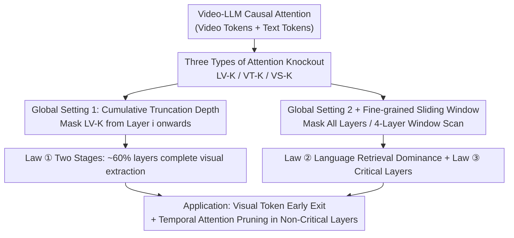

# An Empirical Study on How Video-LLMs Answer Video Questions

**Conference**: CVPR 2026  
**Paper**: [CVF Open Access](https://openaccess.thecvf.com/content/CVPR2026/html/Gou_An_Empirical_Study_on_How_Video-LLMs_Answer_Video_Questions_CVPR_2026_paper.html)  
**Code**: To be confirmed  
**Area**: Video Understanding  
**Keywords**: Video-LLM, Interpretability, Attention Knockout, Two-stage processing, VideoQA  

## TL;DR
This paper systematically dissects the internal mechanisms of how Video-LLMs answer video questions using "attention knockout." It identifies a clear "early-layer perception, late-layer reasoning" two-stage pattern and finds that spatiotemporal modeling relies primarily on language-to-video retrieval rather than intra/inter-frame video self-attention. Furthermore, only a few intermediate layers are critical. Based on these insights, the authors design a simple strategy involving early exit for visual tokens and temporal attention pruning, which significantly reduces computational cost with almost no performance degradation.

## Background & Motivation

**Background**: Video-LLMs (e.g., LongVA, InternVideo2.5, LLaVA-Video, LLaVA-OneVision) demonstrate strong performance in Video Question Answering (VideoQA). Mainstream research focuses on "scaling performance" by expanding video instruction data, increasing input frame counts, and improving positional encoding for video tokens. The architectures are highly converged: a frozen visual encoder extracts video tokens, a projection layer maps them to the language space, and a decoder-only LLM autoregressively generates the answer.

**Limitations of Prior Work**: There is a lack of research on **how these models internally process video**. They are treated as black boxes, which leads to three issues: poor interpretability, aimless efficiency optimization (due to unknown computational redundancies), and a lack of mechanism-level guidance for future model design.

**Key Challenge**: While interpretability research for MLLMs in the image domain is abundant (covering information flow, two-stage patterns, safety mechanism localization, and visual token reduction), the **high-dimensional video domain remains largely unexplored**. Existing work on the video side has mostly analyzed external behavior (e.g., strong VideoQA but weak temporal localization, sensitivity to language perturbations versus video perturbations) without opening the internal black box.

**Goal**: To answer three questions regarding internal mechanisms: (1) Do Video-LLMs exhibit a clear "early-layer perception, late-layer reasoning" two-stage pattern like image VLMs? (2) Globally, how much do the three types of attention contribute to VideoQA? (3) At a fine-grained level, what is the impact of each attention type in every layer?

**Key Insight**: The internal causal attention of an LLM toward video can be **decomposed into three types of information flow**: inter-frame temporal attention, intra-frame spatial attention, and text-to-video language retrieval attention. By using "knockout" (selective masking of a specific attention type) as a "causal ablation," the contribution of each information flow can be attributed based on the resulting performance drop.

**Core Idea**: Transfer the mature "attention knockout" technique from LLM interpretability to the video domain. By precisely controlling the two degrees of freedom—"which layers to mask" and "which attention type to mask"—this work systematically reveals the internal laws governing how Video-LLMs process video for the first time.

## Method

As an empirical study, the "method" refers to the analytical tools and experimental protocols used to decompose causal attention, perform causal ablation via knockout, and read out the three laws through "layer range × attention type" comparisons.

### Overall Architecture

The input sequence of a Video-LLM is ordered: it starts with $N$ frames of video tokens $V=[F_i]_{i=1}^{N}$ (where each frame $F_i=\mathrm{Proj}(\mathrm{Enc}_v(x_i))$ is encoded by CLIP-L-14 and projected into the language space, with >100 tokens per frame), followed by text tokens $T$. These are concatenated as $\mathrm{MMs}=[F_1,\dots,F_N,T]$ and processed through $L$ Transformer layers. The final token of the last layer decodes the answer. Each layer utilizes standard causal attention $\mathrm{CausalAttention}(Q,K,V)=\mathrm{softmax}\!\left(\frac{QK^\top}{\sqrt{d_k}}+M\right)V$, where $M$ is the causal mask.

The authors decompose this causal attention into **three types of information flow based on the modality of the query/key**, design a knockout for each (masking the corresponding positions), and employ two sets of protocols to activate these knockouts.

### Key Designs

**1. Three Types of Attention Knockout: Decomposing "What happened in the video"**

To distinguish whether "inter-frame temporal," "intra-frame spatial," or "language-based video retrieval" is at work, the authors decouple causal attention into three types and design specific knockouts:

- **Language-to-Video Knockout (LV-K)**: Masks the attention of text tokens to all video tokens, cutting the "language → video" retrieval path.
- **Video Temporal Knockout (VT-K)**: Masks attention between video tokens of different frames while keeping intra-frame spatial and language retrieval intact, cutting inter-frame temporal interaction.
- **Video Spatial Knockout (VS-K)**: Masks attention between video tokens within the same frame, cutting intra-frame spatial interaction.

This causal ablation is more reliable than merely observing attention weights, as it directly measures "how much performance is lost without it."

**2. Global Settings: Identifying the "Two-Stage" Pattern and "Dominant Flow"**

The study uses two sub-protocols:

- **Global Setting 1 (Cumulative Truncation Depth)**: LV-K is applied to all layers from layer $i$ to the end ($L_j^{KT}=\text{LV-K}$ if $j>i$). The **layer ratio** is the proportion of layers retaining language-to-video attention. The **performance ratio** measures performance relative to the original model. A plateau in the curve suggests visual information extraction is completed in the preceding layers—providing evidence for the "two-stage" pattern.
- **Global Setting 2 (Full-layer Single Knockout)**: A single type of knockout is applied to **all layers**. Comparing the degradation across the three types reveals which attention type contributes most to VideoQA.

**3. Fine-grained Sliding Window: Locating "Critical Layers"**

A sliding window of length 4, $\{x{-}3,x{-}2,x{-}1,x\}$, is used to apply knockouts. This allows for (a) the identification of **critical layers** (e.g., layers 12–16 in a 28nd-layer model) where masking causes significant drops, and (b) a local comparison of the three knockout types.

### Loss & Training
This study does not train new models or introduce loss functions. All experiments are conducted via inference-time knockouts on frozen open-source Video-LLMs. Models are evaluated using 32 frames by default.

## Key Experimental Results

**Models**: LongVA-7B, InternVideo2.5-8B, LLaVA-Video-7B, LLaVA-OneVision-7B (main), and LLaVA-NeXT-Video-32B for generalization.
**Datasets**: Video-MME, MVBench, and EgoSchema.

### Main Results: Three Laws

| Protocol | Operation | Observed Phenomenon | Derived Law |
|------|------|-------------|-----------|
| Global Setting 1 | Mask LV-K from layer $i$ onwards, scan layer ratio | Performance recovers between 0–60% layer ratio; masking after 60% of layers has almost no impact | ① **Two Stages**: Visual information is primarily extracted in the first ~60% of layers; later layers handle high-level reasoning |
| Global Setting 2 | Apply knockouts to all layers | VT-K and VS-K cause minimal drops; LV-K causes significant drops | ② **Language Retrieval Dominance**: Spatiotemporal modeling relies on language-to-video retrieval rather than expensive video self-attention |
| Fine-grained Window | 4-layer window scan | A few intermediate layers show large drops when masked; LV-K impact > VT-K/VS-K in most windows | ③ **Critical Layers**: A few layers are "influence outliers" for VideoQA and reside within the first stage |

### Application: Efficiency Strategy (Tab. 1)

Based on the laws, visual tokens **early exit** after the first stage (from layer 18) and **temporal attention is pruned** in non-critical early layers (first 8 layers).

| Model | Config | Attention FLOPs | MME | MVBench | EgoSchema |
|------|------|-------------|-----|---------|-----------|
| LLaVA-Video | Baseline | 100% | 62.4 | 61.1 | 58.4 |
| LLaVA-Video | Exit + window | 37.6% | 60.0 | 60.8 | 58.2 |
| LLaVA-OneVision | Baseline | 100% | 59.1 | 58.3 | 65.2 |
| LLaVA-OneVision | Exit + window | 37.5% | 58.0 | 57.6 | 65.2 |

When attention FLOPs are reduced to ~37.5%, performance drops are generally <2 points.

### Key Findings
- **Visual information is not used throughout the entire process**: Masking language-to-video attention in the later 40% of layers does not affect performance, proving that後半 model layers reason using already extracted visual summaries.
- **The most expensive attention is often the least useful**: Inter-frame and intra-frame self-attention have high computational costs but contribute little compared to the cheaper language-to-video retrieval.
- **Critical layers are outliers**: The identification of specific layers that carry the most weight is useful for pruning and quantization strategies.
- **Performance without visual access**: Models retain 48–70% performance even with full visual masking due to LLM world knowledge, but visual information provides the critical 30–50% gain.

## Highlights & Insights
- **From Correlation to Causation**: By using knockout instead of attention weights, the study directly addresses "how much it matters" rather than "how much it is looked at."
- **Orthogonal Design**: The two degrees of freedom (layer range × attention type) provide clean, cross-validated conclusions.
- **Practical Efficiency**: Translating mechanistic insights (two-stage, language dominance) into a 2.6× reduction in attention FLOPs without retraining makes interpretability highly actionable.

## Limitations & Future Work
- The fixed configuration for early exit and pruning is not optimal; **task-adaptive dynamic selection** of layers would be more effective.
- The experiments are restricted to VideoQA. The mechanisms for tasks like temporal localization or video captioning may differ.
- Knockout is a "hard" mask, which might differ from natural model behavior.

## Related Work & Insights
- **Comparison with Image MLLMs**: While video also follows a two-stage pattern, this work reveals video-specific laws like language-retrieval dominance.
- **Comparison with Behavioral Analysis**: This work complements studies on external behavior (like sensitivity to language) by providing an internal mechanistic explanation.
- **Comparison with Token Pruning**: Unlike heuristic pruning, this method provides a theoretical basis for "where" and "what" to prune without additional training.

## Rating
- Novelty: ⭐⭐⭐⭐⭐ 
- Experimental Thoroughness: ⭐⭐⭐⭐ 
- Writing Quality: ⭐⭐⭐⭐ 
- Value: ⭐⭐⭐⭐⭐ 

<!-- RELATED:START -->

## Related Papers

- [\[ICCV 2025\] An Empirical Study of Autoregressive Pre-training from Videos](../../ICCV2025/video_understanding/an_empirical_study_of_autoregressive_pre-training_from_videos.md)
- [\[CVPR 2026\] LensWalk: Agentic Video Understanding by Planning How You See in Videos](lenswalk_agentic_video_understanding_by_planning_how_you_see_in_videos.md)
- [\[CVPR 2026\] StreamReady: Learning What to Answer and When in Long Streaming Videos](streamready_learning_what_to_answer_and_when_in_long_streaming_videos.md)
- [\[CVPR 2026\] Unified Spatiotemporal Token Compression for Video-LLMs at Ultra-Low Retention](unified_spatiotemporal_token_compression_for_video-llms_at_ultra-low_retention.md)
- [\[CVPR 2026\] VideoITG: Multimodal Video Understanding with Instructed Temporal Grounding](videoitg_multimodal_video_understanding_with_instructed_temporal_grounding.md)

<!-- RELATED:END -->
