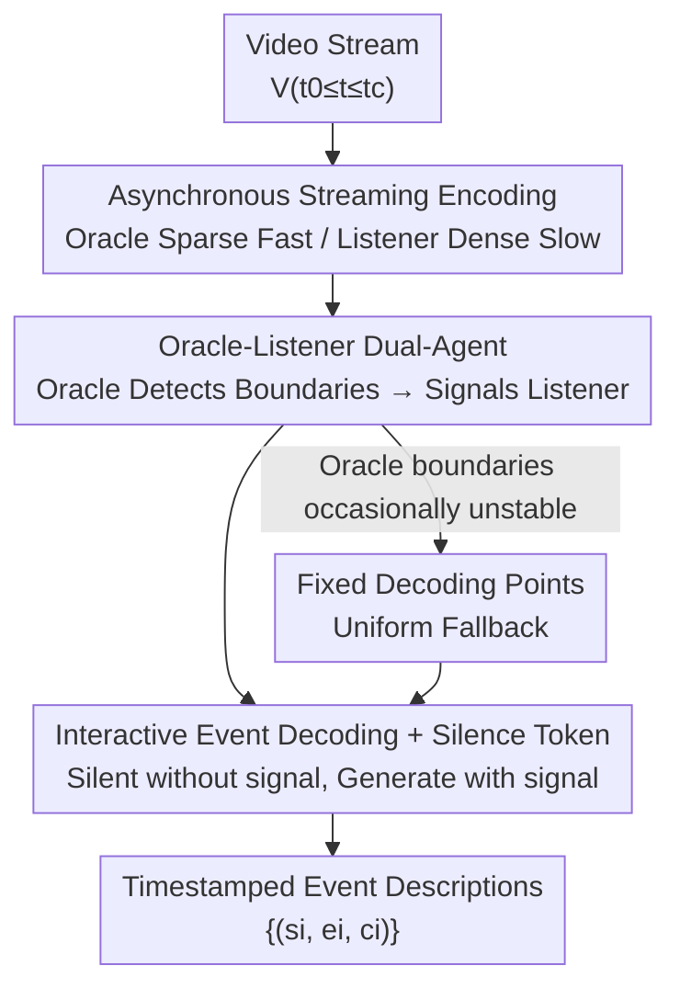

# Asynchronous Temporal Modeling with Two-Agent Framework for Streaming Dense Video Captioning

**Conference**: CVPR 2026  
**Paper**: [CVF Open Access](https://openaccess.thecvf.com/content/CVPR2026/html/Tang_Asynchronous_Temporal_Modeling_with_Two-Agent_Framework_for_Streaming_Dense_Video_CVPR_2026_paper.html)  
**Code**: To be confirmed  
**Area**: Video Understanding / Agent / Multimodal VLM  
**Keywords**: Streaming Dense Video Captioning, Dual-Agent, Event Boundary Detection, Threshold-Gated Discrepancy, Silence Token  

## TL;DR
Addressing the "when to speak" challenge in streaming dense video captioning, which is difficult to control via thresholds, this paper proposes Takusen. It is an asynchronous dual-agent framework using a small model as an "Oracle" to detect event boundaries ahead of time and a large model as a "Listener" to generate descriptions only upon receiving signals. This mechanism eliminates thresholds and achieves streaming SOTA on ActivityNet Captions and YouCook2.

## Background & Motivation

**Background**: Dense video captioning requires simultaneous temporal localization $(s_i, e_i)$ and description generation $c_i$ for each event in a video. The streaming version is more difficult—videos are processed as real-time streams where the model only sees frames before the current time $t_c$, requiring it to maintain long-term memory while deciding whether to "output subtitles" in real-time.

**Limitations of Prior Work**: Current streaming methods follow two suboptimal paths. First, they stack complex external memory mechanisms to maintain cross-frame context, failing to utilize the long-context memory inherent in Large Multimodal Models (LMMs). Second, they frequently and repeatedly call the LLM for decoding, which is inefficient for streaming inputs.

**Key Challenge**: The core difficulty for an LMM to complete streaming captioning in a single inference pass is determining "when to stay silent and when to generate." The authors name this difficulty **Threshold-Gated Discrepancy (TGD)**. In streaming tasks, the vast majority of frames should be silent. This severe data imbalance causes the model to learn a bias toward predicting silence tokens for every frame. Consequently, a manual threshold must be set during inference to flip this bias—but no such threshold exists during training, causing a training-inference mismatch. Even worse (see Figure 2 in the paper), the optimal threshold varies significantly across videos and has a very narrow effective range; slight deviations cause the model to either remain entirely silent or generate captions for every frame. Training another network to predict thresholds dynamically is also unrealistic.

**Key Insight**: Since "gating silence/generation for the same model with a threshold" is the root cause, the tasks of "judging when to speak" and "what to say" should be **decoupled into two agents**, completely bypassing the threshold switch.

**Core Idea**: A lightweight Small Multimodal Model (SMM) acts as the Oracle, running faster via sparse sampling to "see the future" and detect event boundaries. A Large Multimodal Model (LMM) acts as the Listener, remaining silent normally and only generating descriptions upon receiving signals from the Oracle. Using "signal-triggering" instead of "threshold-gating" fundamentally eradicates TGD.

## Method

### Overall Architecture

Takusen is an asynchronous dual-agent framework. Given a continuous video stream $V^{t_0 \le t \le t_c}$, it outputs a set of timestamped event descriptions $\{(s_i, e_i, c_i)\}$. Its core lies in the **speed differential** and **signal collaboration** between two roles:

- **Oracle (SMM)**: Performs sparse sampling and fast encoding of the video stream. Because it samples sparsely and runs quickly, it can "lead" the Listener to see later frames, thereby detecting event start/end boundaries $(s_i, e_i)$ in advance and sending these as prompt messages to the Listener.
- **Listener (LMM)**: Performs dense sampling and streaming encoding of the video stream, ingesting significantly more visual tokens than the Oracle to ensure description quality. It processes frames autoregressively in a single continuous inference pass, predicting a special **Silence Token $\varnothing$** most of the time. Only when it reaches a boundary timestamp marked by the Oracle does it incorporate the Oracle's message into its context to confirm an event start or generate a full description.

Since the Listener's decision to "speak or not" is entirely determined by the Oracle's signal, thresholds are no longer needed during training or inference, and TGD is rooted out. All frames, prompts, and responses are handled within a single round of video LMM inference without complex external memory. To handle occasional unstable boundary predictions from the Oracle, the framework overlays a set of uniformly distributed **Fixed Decoding Points (FDP)** as a fallback.

### Key Designs

**1. Oracle-Listener Dual-Agent Asynchronous Architecture: Eliminating Threshold Dependence via Task Division**

This is the core of the paper, directly targeting TGD. Conventional methods require the same model to judge "whether to speak" and "what to say," forcing the use of a threshold to gate the probability of silence tokens—a threshold that does not exist during training and varies by video during inference. Takusen splits these: Oracle handles "when" (detecting boundaries $(s_i, e_i)$), and Listener handles "what" (generating $c_i$). The Listener's silence is no longer a passive result of "probability below a threshold" but an active state of "remaining silent unless signaled." Because the decision logic shifts from "threshold gating" to "signal triggering," training objectives and inference processes are naturally aligned, and TGD is eliminated by design rather than hyperparameter tuning. The strengths of both agents are maximized: the small model handles computation-sensitive localization, while the large model handles descriptions requiring long context and linguistic ability.

**2. Asynchronous Streaming Encoding: Sparse Fast Sampling vs. Dense Slow Sampling to Create a "Time Gap"**

The Oracle "sees the future" due to the asymmetry in sampling rates and processing speeds. Given the same stream $V^{t_0\le t\le t_c}$, the Oracle samples sparsely at a fixed low frame rate at $t_{c(O)} \le t_c$ to extract visual features $F_O^{t_0\le t\le t_{c(O)}}$ quickly. The Listener receives dense frames starting from $t_0$, encoding $F_L^{t_{c(L)}}$ at the current $t_{c(L)}$, which is projected into the LLM input space. The temporal relationship satisfies $t_{c(L)} \le t_{c(O)} \le t_c$—meaning the Oracle's processing position always leads the Listener's, allowing it to predict boundaries before the Listener reaches the end of an event. Sparse sampling suffices for temporal localization while saving computation for speed, while dense sampling ensures the Listener has enough tokens for detailed descriptions.

**3. Interactive Event Decoding + Silence Token: Injecting Signals into Context with Silence as Default**

After the Oracle detects a boundary pair $(s_i, e_i)$, it constructs two prompt messages $(M_{O}^{s_i}, M_{O}^{e_i})$ following a predefined template, instructing the Listener to "start tracking event $i$ at $s_i$" and "event $i$ has ended, please describe it." The Listener predicts the next token autoregressively:

$$\max\ P(w_j \mid w_{0:j-1},\ F_L^{t \le t_{c(L)}})$$

Each step $w_j$ is either a text token or a special Silence Token $\varnothing$. When the Listener reaches a timestamp matching an Oracle boundary ($t_{c(L)} = s_i$ or $t_{c(L)} = e_i$), it appends the message to its context:

$$w_{0:j-1} := w_{0:j-1} \cup M_O^{t_{c(L)}}$$

Subsequently: it confirms tracking at the start point (e.g., "Sure, I will track Event i"), generates the description $c_i=[w_j,\dots,w_{j+k-1}]$ at the end point, and finishes with $w_{j+k}=\varnothing$. At all other times, it predicts $\varnothing$ to continue. Thus, "silence" becomes the default behavior in the absence of signals, ensuring consistency between training and inference.

**4. Fixed Decoding Points (FDP): Uniform Fallback to Capture Missed Events**

Oracle boundary predictions can occasionally be unstable—boundary pairs might be excessive, insufficient, or incomplete. To address this, a set of uniformly distributed fixed decoding points $\{d_i\}$ is overlaid during inference. Prompts $(M^{s=d_{i-1}}, M^{e=d_i})$ are constructed at regular intervals. When $t_c=d_i$, a signal is sent to the Listener to generate supplementary descriptions for areas not covered by the Oracle. The number of FDPs acts as a precision-recall trade-off: too few might miss key events, while too many create redundant descriptions that lower precision (10 points was optimal for YouCook2). FDP and Oracle are complementary—either alone is suboptimal, but together they achieve the best results.

### Loss & Training

Training utilizes a hybrid loss to manage both "text generation at boundaries" and "silence between events":

$$L = \frac{1}{N}\sum_{j=0}^{N}\left(-\mathbb{I}^{[w_j\neq\varnothing]}\log P_j^{w_j} - \mathbb{I}^{[w_j=\varnothing]}\log P_j^{\varnothing}\right)$$

where $\mathbb{I}$ is the indicator function and $P_j$ is the probability of the $j$-th token. The first term is the **text loss** (encouraging accurate text at boundary frames), and the second is the **silence loss** (encouraging $\varnothing$ at non-event frames). Crucially, while prior methods introduce thresholds only at inference, this objective aligns training with the inference process, eliminating TGD from the source. Parameter-efficient fine-tuning is used: the pre-trained visual encoder and LLM are frozen, while the projectors and LoRA adapters for the LLM are updated.

## Key Experimental Results

### Main Results

Comparison with SOTA on ActivityNet Captions and YouCook2 (vision-only input):

| Dataset | Metric | Takusen | Streaming Vid2Seq | Streaming GIT |
|--------|------|---------|-------------------|---------------|
| ActivityNet | CIDEr | **43.7** | 37.8 (+5.9) | 41.2 (+2.5) |
| ActivityNet | SODAc | **7.5** | 6.2 | 6.6 |
| ActivityNet | F1 | **54.0** | 52.9 | 50.9 |
| YouCook2 | CIDEr | **40.7** | 32.9 (+7.8) | 15.4 |
| YouCook2 | SODAc | **8.4** | 6.0 | 3.2 |
| YouCook2 | F1 | **37.0** | 24.1 | 16.6 |

Comparison with 7B/8B Video-LLMs (Takusen is streaming; others are non-streaming, ActivityNet):

| Model | CIDEr | SODAc | METEOR | F1 |
|------|-------|-------|--------|------|
| VTG-LLM | 20.7 | 5.1 | 5.9 | 34.8 |
| TRACE | 25.9 | 6.0 | 6.4 | 39.3 |
| VideoLLaMA3 | 26.8 | 6.1 | 6.9 | 39.2 |
| TRACE-uni | 29.2 | 6.4 | 6.9 | 40.4 |
| **Takusen (Streaming)** | **43.7** | **7.5** | **9.7** | **54.0** |

Even under the stricter real-time streaming constraints, Takusen's CIDEr significantly outperforms these non-streaming Video-LLMs.

### Ablation Study

Component breakdown on ActivityNet (selected):

| Configuration | CIDEr | F1 | Description |
|------|-------|------|------|
| Takusen (Oracle=CM2) | **43.7** | 54.0 | Full Model |
| w/o Oracle (Best FDP) | 30.4 | 47.0 | No Oracle, best FDP only; CIDEr drops 13.3 |
| w/o Oracle (Avg. FDP) | 18.3 | 33.2 | Average FDP only; significant drop |
| w/o FDP (Oracle=CM2) | 12.3 | 53.5 | No FDP fallback; CIDEr collapses to 12.3 |
| w/o Listener (CM2 only) | 33.1 | 54.2 | No large model Listener for generation |
| Boundary-aware | 107.5 | – | Upper bound with perfect boundaries |

### Key Findings
- **Synergy between Oracle and Listener is essential**: Relying solely on the Oracle or FDP is suboptimal. Higher Oracle boundary F1 directly improves Listener description quality.
- **FDP is indispensable**: Removing FDP collapses CIDEr from 43.7 to 12.3, indicating its critical role in compensating for Oracle instability.
- **FDP quantity involves a trade-off** (YouCook2, without Oracle): Increasing points from 2 to 16 increases recall from 5.3 to 35.9 but decreases precision from 21.5 to 18.9; 10 points was optimal.
- **High potential ceiling**: With "boundary-aware" settings, CIDEr reaches 107.5, suggesting significant room for improvement if Oracle boundary detection is further refined.

## Highlights & Insights
- **Defining "Training-Inference Mismatch" before solving it**: The authors first characterize the pathology of threshold-triggering as TGD (imbalance → silence bias → required threshold → training without threshold). This narrative makes the dual-agent solution feel logically inevitable.
- **Using speed differentials to "look ahead"**: The Oracle utilizes sparse sampling to run faster than the Listener, providing boundary signals "ahead of time" even under causal constraints—a clever engineering approach for any streaming task needing forward-looking decisions.
- **Silence Token + Signal Triggering**: Converting "silence" from a thresholded low probability to a default state in the absence of signals is the masterstroke in eliminating TGD, offering lessons for other sparse-trigger sequence generation tasks (e.g., streaming speech, event detection).

## Limitations & Future Work
- The Oracle's boundary predictions remain somewhat unstable (too many/few/incomplete), currently requiring FDP for compensation. The gap between boundary-aware (107.5) and actual (43.7) indicates the main bottleneck is Oracle detection accuracy.
- ⚠️ The optimal number of FDPs depends on the dataset and requires manual tuning (e.g., 10 for YouCook2), lacking an adaptive mechanism for new datasets.
- Evaluation is limited to ActivityNet Captions and YouCook2; performance in longer, more open-domain streaming scenarios remains unknown.
- Future Work: Improve Oracle accuracy to approach the boundary-aware upper bound or make the number of FDPs adaptive to video content.

## Related Work & Insights
- **vs. Streaming Vid2Seq / Streaming GIT**: These still use fixed decoding points + complex memory and face threshold-triggering issues. Takusen bypasses thresholds via dual-agent signaling, improving ActivityNet CIDEr by +5.9 / +2.5.
- **vs. Complex External Memory Methods**: While previous works rely on external memory for long context, this paper leverages the LMM's inherent long-context capability, processing everything in a single inference pass for a simpler, more efficient architecture.
- **vs. Non-streaming Video-LLMs (VideoLLaMA3, TRACE-uni, etc.)**: These 7B/8B models working on full videos are outperformed by Takusen in a streaming setting, indicating that explicit event-awareness + Silence Tokens align better temporally than simply increasing model size.

## Rating
- Novelty: ⭐⭐⭐⭐⭐ Clear definition and systematic elimination of TGD via an asynchronous dual-agent framework.
- Experimental Thoroughness: ⭐⭐⭐⭐ SOTA on two datasets with detailed component and FDP ablations, though benchmarks are somewhat limited.
- Writing Quality: ⭐⭐⭐⭐⭐ Problems are clearly defined, and the methodology narrative is smooth.
- Value: ⭐⭐⭐⭐ Provides a reusable "signal-trigger instead of threshold" paradigm for streaming dense captioning.

<!-- RELATED:START -->

## Related Papers

- [\[AAAI 2026\] Explicit Temporal-Semantic Modeling for Dense Video Captioning via Context-Aware Cross-Modal Interaction](../../AAAI2026/video_understanding/explicit_temporal-semantic_modeling_for_dense_video_captioning_via_context-aware.md)
- [\[CVPR 2026\] Stay in your Lane: Role Specific Queries with Overlap Suppression Loss for Dense Video Captioning](stay_in_your_lane_role_specific_queries_with_overlap_suppression_loss_for_dense_.md)
- [\[CVPR 2026\] SAIL: Similarity-Aware Guidance and Inter-Caption Augmentation-based Learning for Weakly-Supervised Dense Video Captioning](sail_similarity-aware_guidance_and_inter-caption_augmentation-based_learning_for.md)
- [\[CVPR 2026\] CaptionFormer: Unified Segmentation, Tracking, and Captioning for Spatio-Temporal Objects](captionformer_unified_segmentation_tracking_and_captioning_for_spatio-temporal_o.md)
- [\[CVPR 2026\] FlexiVideo: Variation-Aware Temporal Dynamics Modeling for Efficient Video Understanding](flexivideo_variation-aware_temporal_dynamics_modeling_for_efficient_video_unders.md)

<!-- RELATED:END -->
