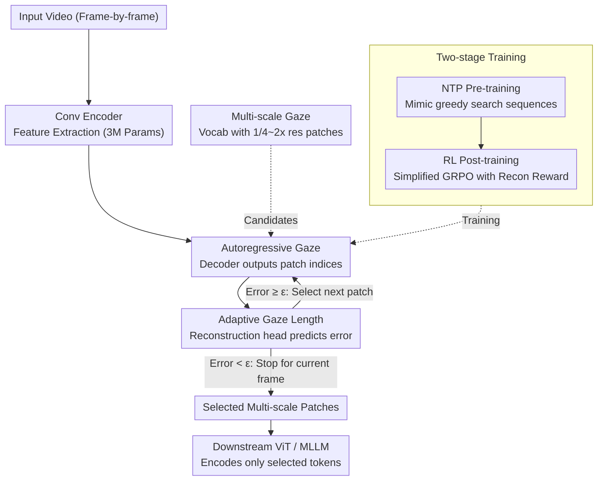

# Attend Before Attention: Efficient and Scalable Video Understanding via Autoregressive Gazing

**Conference**: CVPR 2026  
**arXiv**: [2603.12254](https://arxiv.org/abs/2603.12254)  
**Code**: [https://autogaze.github.io/](https://autogaze.github.io/)  
**Area**: Video Understanding / Efficient Inference  
**Keywords**: AutoGaze, Autoregressive Gazing, Multi-scale patch selection, token compression, long video high resolution

## TL;DR

AutoGaze is proposed as a lightweight module with only 3M parameters that autoregressively selects a minimal set of multi-scale patches to reconstruct video before the ViT. It removes $4\times-100\times$ spatio-temporal redundancy, achieving up to $19\times$ acceleration for ViT and $10\times$ for MLLMs. It enables MLLMs to scale to 1K-frame 4K-resolution videos for the first time, reaching 67.0% on VideoMME.

## Background & Motivation

**Background**: Multimodal Large Language Models (MLLMs) such as Qwen2.5-VL and NVILA have advanced general video understanding. However, they are limited by the equal processing of every pixel by ViT and LLM, despite massive spatio-temporal redundancy (static backgrounds, low-change regions) in videos.

**Limitations of Prior Work**: (1) Existing token reduction methods (FastV, ToMe, VisionZip, etc.) prune tokens only inside ViT or between ViT-LLM; ViT still needs to process all pixels, which remains the primary efficiency bottleneck. (2) Heuristic methods based on attention scores are less effective than learned methods. (3) Methods involving search and reasoning introduce extra overhead, further limiting scalability. (4) Current benchmarks focus on long videos but neglect high resolution.

**Key Challenge**: Humans process video streams efficiently by selectively attending to informative regions via saccades, whereas models treat every pixel equally. How can a model decide "where to look" before "looking"?

**Goal**: Remove spatio-temporal redundant patches before ViT to fundamentally reduce visual encoding costs, enabling MLLM scalability for long-duration, high-resolution videos.

**Key Insight**: Simulate human gazing behavior by autoregressively predicting which multi-scale patches can reconstruct the current frame with minimal count (within a given error threshold).

**Core Idea**: "Gaze" before attention. Use an autoregressive model to select the minimum patches, so that the ViT only needs to process this subset.

## Method

### Overall Architecture

AutoGaze addresses a direct issue: large areas of background and low-change regions in videos are redundant, yet ViT encodes every patch indiscriminately, wasting computation on uninformative pixels. The approach inserts a lightweight module of only 3M parameters (a convolutional encoder + an autoregressive Transformer decoder) before ViT. This module "scans" the video first to pick the minimal patches needed to reconstruct the frame before feeding only these patches to the ViT/MLLM.

The pipeline resembles the human eye reading a video: after frame-by-frame encoding, the decoder autoregressively outputs patch indices one by one, referring to current frame features and historical gaze records. For each output, it predicts the reconstruction error of the current frame using the selected patches. Once the error falls below a user-defined threshold, it stops and moves to the next frame. Consequently, only selected multi-scale patches enter the downstream network—for the same video, the tokens seen by ViT may be reduced to a small percentage.

### Key Designs

**1. Autoregressive Gazing: Modeling "Where to Look" as Sequence Generation**

Processing every pixel equally is the root cause of ViT inefficiency. AutoGaze frames patch selection as an autoregressive sequence prediction problem. Given $T$ video frames $\bm{X}^{1:T}$, the model outputs patch index sequences $p_{1:N^1}^1, \ldots, p_{1:N^T}^T$ (where each $p_k^t \in \{1, \ldots, V\}$ points to a candidate patch in the vocabulary). The objective is to minimize reconstruction error with the fewest patches:

$$\min_{p_1^1, \ldots, p_{N^T}^T} L\big(\bm{X}^{1:T}, \text{Recon}(\bm{X}^1[p_1^1], \ldots, \bm{X}^T[p_{N^T}^T])\big)$$

Here, $\text{Recon}$ is a VideoMAE with block-causal attention, and $L$ is a weighted sum of pixel reconstruction loss and perceptual loss. Autoregression is preferred over one-shot top-k scoring because the selection of the next patch naturally depends on previous selections and historical gazes. This conditional dependence allows the model to avoid redundant selections of static regions across frames.

**2. Automatic Gaze Length: Content-Adaptive Budgets**

Redundancy varies across frames; a static background requires fewer patches than an action sequence. AutoGaze attaches an additional prediction head to the decoder to estimate the reconstruction loss for the current frame given the selected patches. Once the predicted loss $< \epsilon$ (a user-specified threshold), gazing for the current frame stops. Thus, the token count per frame is no longer a hyperparameter but a variable determined by the content.

**3. Multi-scale Gazing: Allocating Resolution Based on Detail**

Using a single patch size is suboptimal: fine-scale patches are wasteful for solid colors, while coarse-scale patches miss fine textures. AutoGaze expands the decoder vocabulary to multiple scales (e.g., $1/4, 1/2, 1, 2\times$ of $224\times224$). The model can choose a coarse, low-resolution patch to cover smooth areas and fine, high-resolution patches for dense textures. The downstream ViT performs patch embedding for different scales separately and interpolates positional encodings to handle this mixed-resolution input.

**4. Two-stage Training: From Greedy Imitation to RL Optimization**

Since gaze sequences lack ground truth labels, training follows two steps. First, NTP (Next-Token Prediction) Pre-training: greedy search is performed on videos (iteratively picking the patch that reduces reconstruction loss most) to collect approximately optimal sequences. The model mimics these via cross-entropy:

$$L_{NTP} = -\sum_t \sum_k \log \pi_\theta(\tilde{p}_k^t \mid \bm{X}^{1:t}, \ldots)$$

Simultaneously, the reconstruction loss prediction head is supervised via $\ell_2$ loss. Second, RL Post-training: using a simplified GRPO, the negative reconstruction loss is used directly as a reward:

$$L_{GRPO} = -\sum_t \sum_k \frac{\pi_\theta(p_k^t)}{\pi_{\theta_{detached}}(p_k^t)} A_k^t$$

This allows the model to explore on-policy and find gaze strategies that are more efficient than the greedy "textbook."

### Loss & Training

- **Pre-training Data**: 800K videos (egocentric, exocentric, natural, text-rich), sampled at 16 frames with 224 resolution.
- **Greedy Search Collection**: Exhaustive search for patches minimizing reconstruction loss, recording step-wise loss as supervision for NTP and the reconstruction head.
- **RL Post-training**: Negative reconstruction loss as reward; advantage function uses discounted future frame reconstruction loss.
- **Multi-token Prediction**: Multiple heads output multiple patch indices simultaneously to accelerate inference.
- **Arbitrary Resolution/Duration Inference**: Video is split into $16 \times 224 \times 224$ spatio-temporal tiles. AutoGaze runs on each tile independently before merging, allowing a model trained on 16-frame/224-res to handle 1K-frame/4K videos.

## Key Experimental Results

### Main Results

| Model | Max Frames | Max Res | VideoMME(w/o sub) | VideoMME(w/ sub) | MVBench | L-VidBench | HLVid |
|------|---------|-----------|-------------------|------------------|---------|------------|-------|
| GPT-4o | - | - | 71.9 | 77.2 | 64.6 | 66.7 | 49.3 |
| Qwen2.5-VL-7B | 48 | 896 | 65.1 | 71.6 | 69.6 | 56.0 | 48.1 |
| VideoChat-Flash | 10000 | 448 | 65.3 | 69.7 | 74.0 | 64.7 | 46.6 |
| NVILA-8B-Video | 256 | 448 | 64.2 | 70.0 | 68.1 | 57.7 | 42.5 |
| **NVILA + AutoGaze** | **1024** | **3584** | **67.0** | **71.8** | 69.7 | **61.0** | **52.6** |
| vs NVILA Baseline | $\times4$ | $\times8$ | +2.8 | +1.8 | +1.6 | +3.3 | **+10.1** |

> AutoGaze enables NVILA-8B to scale 4x in frame count and 8x in resolution, reaching 67.0% on VideoMME. The 10.1% gain on HLVid surpasses GPT-4o (+3.3%).

### Ablation Study

| Type | Method | ViT Latency | LLM Latency | V-MME | L-Vid |
|------|------|---------|---------|-------|-------|
| - | No Reduction | 2.20s | 1.42s | 53.4 | 51.1 |
| S-PA | Spatial Pooling | 2.20s | 0.18s | 51.5 | 47.2 |
| S-PA | ToMe | 2.23s | 0.11s | 51.5 | 49.3 |
| S-PD | FastV | 2.23s | 0.38s | 53.0 | 46.3 |
| T-PA | Temporal Pooling | 2.20s | 0.13s | 52.2 | 50.0 |
| **AutoGaze** | Learned | **Reduced** | **Reduced** | **Higher/Eq.** | **Higher/Eq.** |

> Existing methods only reduce LLM latency while ViT remains a bottleneck. AutoGaze reduces both. At a 6.25% token selection rate, it outperforms heuristic methods.

### Key Findings

- **Adaptive Gazing Behavior**: AutoGaze automatically focuses on motion (patches with high optical flow are selected more frequently), uses fine scales for textures, and coarse scales for smooth regions.
- **Optimal Threshold 0.7**: Leads to downstream performance drops of <0.5%.
- **Scaling Redundancy**: Redundancy increases with FPS/resolution; 30-FPS 4K video requires only ~1% of patches.
- **OOD Generalization**: Robustly tracks changing regions in CCTV, robotics, and style-transferred videos outside the training distribution.
- **HLVid Benchmark**: A new long-duration high-resolution video QA benchmark (268 QAs, 5-minute 4K videos) validating the necessity of high-resolution understanding.

## Highlights & Insights

- **Attend Before Attention**: An elegant concept that moves patch selection before the model, solving the ViT computation bottleneck at the source rather than cropping post-ViT.
- **Minimal Overhead**: Only 3M parameters compared to hundreds of millions in ViT; the marginal cost of adding AutoGaze is negligible.
- **NTP + RL Paradigm**: Pre-training with greedy "textbooks" followed by RL exploration to surpass them—consistent with the LLM training philosophy.
- **Flexible Scaling**: Spatio-temporal tiling allows models trained on small chunks to generalize to 1K-frame 4K videos.
- **HLVid Contribution**: Fills the gap in benchmarks for high-resolution long video QA.

## Limitations & Future Work

- Scaling to extreme resolutions/lengths can be counterproductive for certain benchmarks; adaptive selection of optimal frames/resolution is needed.
- Training was limited to 16-frame/224-res; larger-scale training might improve performance.
- The gaze decision is prompt-agnostic; a prompt-dependent version could improve task-specific focus.
- The trade-off between speed and accuracy in multi-token prediction requires further investigation.
- Synergy with hardware-level optimizations like Flash Attention remains unexplored.

## Related Work & Insights

- **VideoMAE**: Provides the foundation for reconstruction from minimal patches.
- **ToMe / FastV / VisionZip**: Perform token reduction inside or after ViT; AutoGaze shifts this to pre-ViT.
- **NVILA**: Served as the downstream MLLM to verify the universality of the method.
- **Insights**: (1) The "screening before processing" concept can be extended to 3D point clouds or audio. (2) Autoregressive patch selection is fundamentally a form of "compression coding," linking to Rate-Distortion Theory in information science.

## Rating

- Novelty: ⭐⭐⭐⭐⭐ 
- Technical Depth: ⭐⭐⭐⭐ 
- Experimental Thoroughness: ⭐⭐⭐⭐⭐ 
- Writing Quality: ⭐⭐⭐⭐⭐ 
- Value: ⭐⭐⭐⭐⭐ 

<!-- RELATED:START -->

## Related Papers

- [\[CVPR 2026\] EVATok: Adaptive Length Video Tokenization for Efficient Visual Autoregressive Generation](evatok_adaptive_length_video_tokenization_for_eff.md)
- [\[CVPR 2026\] StreamingTOM: Streaming Token Compression for Efficient Video Understanding](streamingtom_streaming_token_compression_for_efficient_video_understanding.md)
- [\[CVPR 2026\] Adaptive Capacity Autoregressive Visual Tracking](adaptive_capacity_autoregressive_visual_tracking.md)
- [\[CVPR 2026\] Understanding Temporal Logic Consistency in Video-Language Models through Cross-Modal Attention Discriminability](understanding_temporal_logic_consistency_in_video-language_models_through_cross-.md)
- [\[CVPR 2026\] GIFT: Global Irreplaceability Frame Targeting for Efficient Video Understanding](gift_global_irreplaceability_frame_targeting_for_efficient_video_understanding.md)

<!-- RELATED:END -->
