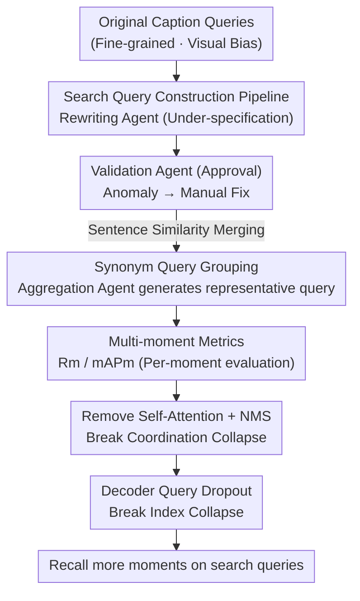

# Beyond Caption-Based Queries in Video Moment Retrieval

**Conference**: CVPR 2026  
**Paper**: [CVF Open Access](https://openaccess.thecvf.com/content/CVPR2026/html/Pujol-Perich_Beyond_Caption_Based_Queries_in_Video_Moment_Retrieval_CVPR_2026_paper.html)  
**Code**: Project Page (The paper states that code/models/data are released, but no specific repository link is provided)  
**Area**: Video Understanding  
**Keywords**: Video Moment Retrieval, Search Queries, DETR, Query Collapse, Multi-Moment Retrieval  

## TL;DR
This paper points out that existing Video Moment Retrieval (VMR) models collapse on "real-world search queries" despite being trained on "descriptive caption queries." The root cause is identified as DETR decoder query collapse, where only approximately 4 queries remain active. By constructing three search query benchmarks and implementing two architectural changes—removing decoder self-attention and introducing query dropout—the proposed method improves mAPm by up to 14.82% on search queries and 21.83% on multi-moment queries.

## Background & Motivation
**Background**: The task of Video Moment Retrieval (VMR) is to localize temporal segments in a video given a text query. Current mainstream methods are predominantly based on DETR, utilizing $K$ learnable decoder queries where each query predicts a candidate segment and its confidence. These involve proposal-free single-stage architectures (e.g., CG-DETR, LD-DETR) and achieve high performance on benchmarks like HD-EPIC, YouCook2, and ActivityNet-Captions.

**Limitations of Prior Work**: Existing benchmarks rely entirely on **captions**, which are fine-grained descriptions written by annotators *after* watching the video. These caption-based queries possess a natural "visual bias," being overly detailed and corresponding one-to-one with the visual frames (averaging 16.47 words/query in HD-EPIC). In contrast, real users haven't seen the video and input shorter, abstract, and under-specified search queries (e.g., simplifying "a man in a yellow jersey intercepts a pass and volleys a goal" to "when was the goal?"). There is a massive distribution shift between the two.

**Key Challenge**: Under-specified search queries often correspond to **multiple** ground-truth moments in a video (e.g., "someone cooking" could match both "frying onions" and "stirring soup"), while caption queries correspond to a **single** moment. Models trained under a "single-moment prior" fail to retrieve all segments during "multi-moment" evaluation. The authors decompose this degradation into two gaps: the **linguistic gap** (distribution drift from concrete to abstract wording) and the **multi-moment gap** (mismatch between single-moment training and multi-moment evaluation). Empirical tests show that CG-DETR/LD-DETR suffer relative degradation in Rm@0.3 of up to 71.75%/77.40% on search queries.

**Goal**: (1) Create VMR benchmarks closer to real-world search scenarios; (2) Mitigate the multi-moment gap from an architectural perspective without re-labeling or changing the training paradigm. The linguistic gap is left for future, stronger VLMs to solve.

**Key Insight / Core Idea**: The authors discovered that the key mechanism of degradation is **active decoder-query collapse**. Regardless of how many ground-truth moments exist for a search query, the model only activates about 4 decoder queries. This effectively "locks" the computational budget, meaning instances with 4+ moments can achieve at most 50% recall. The core idea is to **avoid re-labeling data and instead structurally break the two mechanisms that force the model to activate only a few queries (coordination collapse via self-attention and index collapse)**, allowing the number of active queries to grow naturally with the number of moments.

## Method

### Overall Architecture
This work is organized into three phases: "Diagnosis + Benchmark + Fix." **The first line (Data)** automatically rewrites existing densely annotated caption datasets into search query benchmarks. Each caption is first under-specified by a "rewriting agent," then checked by a "validation agent." Semantically similar queries are then **grouped and merged** into a representative search query, expanding single-moment datasets into multi-moment versions (HD-EPIC-S1/S2/S3, YC2-S, ANC-S). **The second line (Model)** quantifies degradation using new metrics Rm / mAPm, identifies active decoder-query collapse, and applies two fine-tuning adjustments to the DETR decoder (removing self-attention and query dropout) to liberate active queries.

The figure below illustrates the search query construction pipeline on the data side:

### Key Designs

**1. Search Query Benchmark Pipeline: Automatically Rewriting Single-Moment Datasets into Multi-Moment Benchmarks**

Collecting new search query datasets is difficult because it is hard to decouple "text labeling" from "watching the video." The authors instead **reuse existing densely annotated datasets**. The pipeline has two stages: ① **Per-query Under-specification**: Two agents based on Gemma-12B are used; a **rewriting agent** converts fine-grained captions into vague versions omitting subjects/objects/intent (e.g., "a person tying running shoes preparing for a marathon" → "a person preparing for exercise"), and a **validation agent** flags inconsistencies for manual correction. ② **Query Grouping**: Since an under-specified query may correspond to multiple valid moments, pretrained sentence embeddings are used to calculate similarity and merge high-similarity queries into **multi-moment instances**. An aggregation agent then summarizes each group into one representative search query. **Dense annotation** is crucial here because coarsening queries reveals previously unlabeled moments; only dense annotations allow for automatic discovery of these mappings. This results in three "-S" benchmarks where multi-moment queries account for up to 47.47%, and average query length is reduced by up to 82%.

**2. Multi-Moment Metrics Rm / mAPm: Scoring "Per Moment" Rather Than "Per Query"**

Traditional R1 and mAP metrics are distorted in multi-moment scenarios. R1 only considers top-1 results; in a 2-moment query, hitting one counts as success without penalizing the omission of the other. mAP aggregates all GT moments of a query into one score, allowing a single difficult moment to be "hidden" by other easy ones. The authors propose **per-moment** versions. Multi-moment recall $R_m$ judges each GT moment $g_i$ individually: under an IoU threshold $\tau$, if its predicted confidence is the highest **or** if all higher-confidence predictions correctly hit other GT moments, then $R_m(g_i,\tau)=1$. Results are averaged across all moments:

$$R_m(\tau) = \frac{1}{|G|}\sum_{g_i\in G} R_m(g_i,\tau)$$

Multi-moment $\text{mAP}_m$ similarly calculates PR curves for each $g_i$ independently: predictions with IoU $\ge \tau$ with $g_i$ are TPs, those matching no GT are FPs, and predictions matching **other** GT moments are **ignored** (to prevent a correct detection of a different moment from dragging down the score for $g_i$).

**3. Removing Decoder Self-Attention + NMS: Breaking Coordination Collapse**

The first identified structural cause is Self-Attention (SA) in the decoder. A standard DETR decoder layer is $\hat{Q}^{l+1} = \text{FFN}(\text{CA}(\text{SA}(\hat{Q}^l), M))$, where SA is intended to "push queries apart to avoid redundancy." However, this forces queries to "negotiate" which one handles the single moment while others deactivate, reinforcing the single-moment prior. The authors **remove SA entirely**, resulting in $Q^{l+1} = \text{FFN}(\text{CA}(Q^l, M))$. Without inter-query communication, each query acts independently. To handle the redundancy previously managed by SA, **NMS** is added during post-processing.

**4. Decoder Query Dropout: Breaking Index Collapse**

Models can still overfit the single-moment prior via **index collapse**, where a fixed subset of query indices (e.g., 1–4) consistently dominates the output while others "sleep." This is countered by a **targeted query dropout**: during each training iteration, $k\%$ of learnable queries are randomly zeroed out:

$$\hat{Q} = Q \odot M,\quad M \sim \mathcal{B}(1-k)$$

where $\mathcal{B}$ is a Bernoulli distribution. This lightweight regularization forces the supervision signal to be distributed across more queries. These two modifications are collectively called **-SA+QD**. Coordination and index collapse **must be solved together**; either change alone only slightly increases active queries. Together, they nearly double the active query count (from ~3.6 to ~6.4). Importantly, -SA+QD **retains DETR’s 1-to-1 matching**, which ensures diversity among newly activated queries.

## Key Experimental Results

### Main Results
On HD-EPIC-S{1,2,3}, -SA+QD yields stable improvements for both representative models (metrics averaged over IoU∈{0.1,0.3,0.5}, selected from Table 2):

| Model / Benchmark | Variant | Rm@0.1 | Rm Avg | mAPm@0.1 | mAPm Avg |
|------|------|------|------|------|------|
| CG-DETR / S2 | base | 24.71 | 16.04 | 32.15 | 20.84 |
| CG-DETR / S2 | **-SA+QD** | **26.17** | **17.52** | **35.38** | **23.93** |
| CG-DETR / S3 | base | 9.50 | 5.39 | 16.20 | 9.26 |
| CG-DETR / S3 | **-SA+QD** | **10.57** | **6.84** | **17.27** | **11.15** |
| LD-DETR / S1 | base | 29.42 | 19.89 | 36.55 | 24.74 |
| LD-DETR / S1 | **-SA+QD** | **30.18** | **20.42** | **40.50** | **27.66** |

Overall, search query mAPm improves by up to 14.82%, and **multi-moment** search query performance improves by up to 21.83%. Compared to an oracle trained directly on under-specified queries, -SA+QD recovers about **70%** of the oracle gap.

### Ablation Study
Both modifications are essential (CG-DETR / HD-EPIC-S2, Table 7):

| -SA | +QD | Rm | mAPm | # Active Queries |
|:---:|:---:|------|------|------|
| | | 16.04 | 20.84 | 3.64±1.18 |
| ✓ | | 15.31 | 21.02 | 3.72±1.16 |
| | ✓ | 16.50 | 21.43 | 3.77±1.28 |
| ✓ | ✓ | **17.52** | **23.93** | **6.43±2.16** |

### Key Findings
- **Active query count is the causal core**: The base model locks active queries at ~4 regardless of the number of moments; -SA+QD allows this count to grow with the actual moments.
- **Individual changes are ineffective**: Removing SA alone or adding QD alone barely changes the number of active queries or mAPm.
- **Gains primarily from multi-moment instances**: Breaking down by single/multi-moment shows modest gains for the former and up to 34.3% mAPm@0.3 improvement for the latter.
- **Diversity is as important as count**: While 1-to-k matching can increase active queries to 20, it produces highly redundant predictions and lower generalization. The 1-to-1 matching competition ensures independent and effective retrieval.

## Highlights & Insights
- **Translating data problems into architectural pathologies**: Rather than re-labeling, the authors attributed poor generalization to "active decoder-query collapse," a quantifiable mechanism.
- **Value in negative findings**: The ablation study systematically dismissed common tactics (1-to-k matching, group matching) as ineffective against query collapse, emphasizing the necessity of the proposed -SA+QD.
- **Transferable tricks**: Removing self-attention to break query coordination and using query dropout to break index dependence could be applicable to other DETR-based tasks like object detection or 3D detection.

## Limitations & Future Work
- **Unresolved Linguistic Gap**: This work focuses on the multi-moment gap. Under-specification at the linguistic level (abstract nouns, vague references) remains a challenge, reflected in the low absolute scores on S3 benchmarks.
- **LLM-based Benchmarks**: Search queries are generated by LLMs (Gemma-12B). While validated, there is a potential gap between "LLM-rewritten" and "real human" search distributions.
- **Reliance on Dense Annotations**: The pipeline is limited to densely annotated datasets. Sparse datasets would require significant manual labeling to find all corresponding moments for coarse queries.

## Related Work & Insights
- **vs. Re-labeled Multi-moment Datasets (e.g., QVHighlights)**: Those rely on expensive re-labeling or discarding data; this work modifies the architecture to reuse existing training sets.
- **vs. DETR Acceleration Strategies (1-to-k / hybrid matching)**: Those increase signals to speed up convergence; this work proves they fail to suppress the single-moment prior and often sacrifice diversity.
- **vs. Vision-centric VMR Generalization**: Previous work focused on visual biases (length, temporal priors). This work rotates to **linguistic-side bias**—revealing that caption-based training itself is a bottleneck.

## Rating
- Novelty: ⭐⭐⭐⭐⭐ 
- Experimental Thoroughness: ⭐⭐⭐⭐ 
- Writing Quality: ⭐⭐⭐⭐ 
- Value: ⭐⭐⭐⭐ 

<!-- RELATED:START -->

## Related Papers

- [\[NeurIPS 2025\] When One Moment Isn't Enough: Multi-Moment Retrieval with Cross-Moment Interactions](../../NeurIPS2025/video_understanding/when_one_moment_isnt_enough_multi-moment_retrieval_with_cross-moment_interaction.md)
- [\[CVPR 2026\] SAIL: Similarity-Aware Guidance and Inter-Caption Augmentation-based Learning for Weakly-Supervised Dense Video Captioning](sail_similarity-aware_guidance_and_inter-caption_augmentation-based_learning_for.md)
- [\[CVPR 2026\] Compositional Transformation Reasoning for Composed Video Retrieval](compositional_transformation_reasoning_for_composed_video_retrieval.md)
- [\[CVPR 2026\] StreamRAG: Enhancing Real-Time Video Understanding with Retrieval Augmentation](streamrag_enhancing_real-time_video_understanding_with_retrieval_augmentation.md)
- [\[CVPR 2026\] Stay in your Lane: Role Specific Queries with Overlap Suppression Loss for Dense Video Captioning](stay_in_your_lane_role_specific_queries_with_overlap_suppression_loss_for_dense_.md)

<!-- RELATED:END -->
