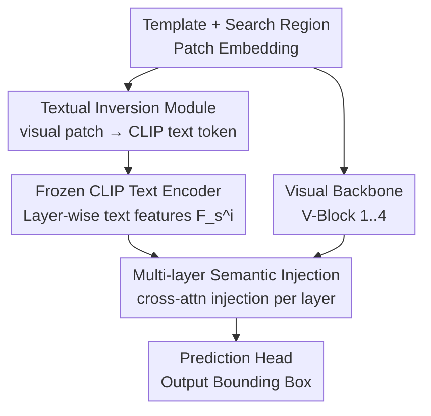

# Beyond Explicit Language: Plug-and-Play Visual-to-Linguistic Modeling Toward General Object Tracking

**Conference**: CVPR 2026  
**Paper**: [CVF Open Access](https://openaccess.thecvf.com/content/CVPR2026/html/Lan_Beyond_Explicit_Language_Plug-and-Play_Visual-to-Linguistic_Modeling_Toward_General_Object_Tracking_CVPR_2026_paper.html)  
**Code**: None (Original text states "Code will be made publicly available", pending open source)  
**Area**: Video Understanding / Visual Object Tracking  
**Keywords**: Visual Object Tracking, Textual Inversion, Vision-Language, Plug-and-Play, CLIP Semantic Injection

## TL;DR
Addressing the issues where vision-language tracking relies on static text and fails when text is missing, this paper proposes TIMI, a plug-and-play module. Using a "Textual Inversion Module," visual patches from templates and search regions are inversely mapped into "pseudo-descriptions" within the CLIP text embedding space. These implicit linguistic cues are then injected back into the visual backbone layer-by-layer via a "Multi-layer Semantic Injection mechanism." This provides dynamic, adaptive semantic guidance without any explicit text input, achieving stable performance gains across multiple trackers like MCITrack, DUTrack, and SeqTrack with minimal overhead.

## Background & Motivation
**Background**: Visual Object Tracking (VOT) involves predicting the target position frame-by-frame given an initial bounding box. Pure visual trackers (e.g., OSTrack, SeqTrack, MCITrack) rely solely on appearance matching between templates and search regions. Vision-Language Trackers (VLT, such as JointNLT, DUTrack, UVLTrack) introduce natural language descriptions to help disambiguate using high-level semantics (attributes, appearance, context).

**Limitations of Prior Work**: The authors identify two fatal flaws in existing VLT paradigms. First, they rely on **pre-defined, static** language descriptions—a description like "bear in a pool" becomes invalid once the bear climbs onto a rock. This failure to follow dynamic target changes leads to **semantic drift**, potentially providing misleading cues (Fig. 1(b)). Second, there is a **strong dependence** on text input—without text, models either degrade to pure vision or fail entirely. While online generation of frame-by-frame descriptions can mitigate inconsistency, manual annotation is not scalable, and calling LLM/BLIP during inference (e.g., DUTrack using BLIP for online captioning) severely slows down speed and introduces stylistic inconsistencies with training data.

**Key Challenge**: For linguistic cues to be effective, they must **track the target state in real-time**; however, generating explicit text in real-time is both **expensive and inconsistent**. The explicit language pathway inherently couples "semantic guidance" with "text input."

**Goal**: To allow trackers to enjoy language-level semantic guidance without any explicit text input, while ensuring the mechanism is plug-and-play for existing trackers with low training costs.

**Key Insight**: Since CLIP has already aligned vision and text into the same embedding space, "language" does not necessarily need to appear as words—visual features can be **inverted** directly into tokens in the CLIP text space to serve as "pseudo-text." Thus, semantic guidance naturally follows the current visual state and is always available.

**Core Idea**: Replace "external explicit language" with "implicit pseudo-descriptions inverted from visual features," and inject them back into the visual backbone layer-by-layer to achieve implicit linguistic guidance.

## Method

### Overall Architecture
The method is named **TIMI** (Textual Inversion + Multi-layer Injection). It treats a standard one-stream visual tracker as three segments: patch embedding → visual Transformer backbone → prediction head (decoder). Without modifying the tracker's input/output, TIMI performs two tasks: (1) The **Textual Inversion Module** inverts visual embeddings of the template and search region at the patch level into pseudo-descriptions in the CLIP text space, which are fed into a **frozen CLIP text encoder** to obtain layer-wise text features. (2) The **Multi-layer Semantic Injection mechanism** splits both the visual and text backbones into 4 blocks (V-Block / T-Block). For each pair of blocks at the same level, cross-attention is used to inject text semantics back into visual features, providing hierarchical guidance from shallow to deep layers.

The training is highly efficient: both the visual backbone and CLIP text encoder remain **frozen** throughout. Only the textual inversion module, semantic injection modules, and decoder are trained. Essentially, the model learns an "adapter" that maps visual features to a frozen text space, leveraging CLIP's vision-language priors.

### Key Designs

**1. Textual Inversion Module: Inverting visual patches into pseudo-descriptions in the CLIP text space**

This step directly addresses the issue where "explicit text is either static/drifting or missing." Since linguistic guidance is desired without explicit text, **language is synthesized from visual features**. Specifically, patch embeddings from the template and search region are concatenated along the spatial dimension and fed into a pseudo-description generator. Through Projection → MLP → Alignment, they are mapped into the input space of the CLIP text encoder to produce a set of vectors—the "pseudo-descriptions." The authors draw an analogy to CLIP's Tokenizer + Embedding Lookup process; the textual inversion module effectively performs both "token creation + embedding lookup" in one step (Fig. 3).

Two key design choices ensure effectiveness: First, **patch-level** inversion—each visual patch corresponds to a text token, preserving local details and ensuring pseudo-descriptions accurately reflect the target's current state (achieving the "dynamic adaptation" static text fails at). Second, modeling **global contextual interaction** between the template and search region during concatenation injects potential context from the template into the search region's semantic representation, enhancing discriminative power. These pseudo-embeddings pass through the **frozen** CLIP text encoder to extract high-level linguistic features as frame-varying, context-aware implicit semantic cues. This process requires no manual annotation or external captioning models, ensuring consistency and efficiency.

**2. Multi-layer Semantic Injection: Layer-wise cross-attention injection of linguistic semantics**

Extracting pseudo-text features is insufficient; they must actively alter the feature distribution of the visual backbone across both low-level and high-level semantics. The visual backbone's Transformer layers are split into 4 V-Blocks, and the CLIP text encoder is similarly split into 4 T-Blocks, paired one-to-one with identical shapes. For the $i$-th pair, the process is:

$$F^i_{vx} = \text{V-Block}_i(F^{i-1'}_{vx}),\quad F^i_s = \text{T-Block}_i(F^{i-1}_s),\quad F^{i'}_s = \text{Alignment}_i(F^i_s),\quad F^{i'}_{vx} = \text{Injection}_i(F^{i'}_s, F^i_{vx})$$

Alignment consists of MLPs that align text features to the visual space. The injection module utilizes **Multi-Head Cross-Attention (MHCA)**, where visual features serve as the Query and aligned text features serve as Key/Value (after respective LayerNorm). The cross-attention result is multiplied by a **learnable scaling factor** $\alpha_i$ and added residually to the visual features:

$$Q_i = \text{Norm}_i(F^i_{vx}),\ K_i,V_i = \text{Norm}_i(F^{i'}_s),\ \text{Attn}_i = \text{MHCA}_i(Q_i,K_i,V_i),\ F^{i'}_{vx} = F^i_{vx} + \alpha_i \cdot \text{Attn}_i$$

The learnable $\alpha_i$ allows each layer to adaptively determine semantic injection intensity, while the residual structure prevents disruption of original visual features. Layer-wise injection allows shallow visual features to be progressively enriched by deep semantic information, improving cross-modal representation completeness and semantic alignment. Ablations show that more layers are not necessarily better; approximately 4 layers represent the "sweet spot" for performance and speed.

### Loss & Training
A two-stage training strategy is used: The first stage follows the original tracker's settings to ensure the visual backbone extracts high-quality features. In the second stage, visual and text backbones are frozen, and **only the textual inversion module, semantic injection modules, and decoder are trained**. Models are trained for 10 epochs, with learning rate decay after the 6th epoch. This strategy focuses learning on the "visual feature → frozen text space" mapping, maximizing the utility of CLIP's pre-trained vision-language priors.

## Key Experimental Results

### Main Results
TIMI (denoted by `*`) was integrated into pure visual trackers (SeqTrack/MCITrack) and a vision-language tracker (DUTrack) across four large-scale benchmarks (LaSOT, GOT-10K, TrackingNet, TNL2K), showing consistent gains:

| Tracker | Benchmark | Metric | Baseline | +TIMI(`*`) | Gain |
|--------|------|------|------|-----------|------|
| SeqTrack-B256 | LaSOT | AUC | 69.9 | 71.0 | +1.5* |
| SeqTrack-B256 | GOT-10K | AO / SR0.75 | 74.7 / 71.8 | 76.6 / 74.5 | +2.5 / +3.8 |
| SeqTrack-B256 | TNL2K | AUC | 54.9 | 56.5 | +1.6 |
| MCITrack-B224 | LaSOT | AUC | 75.3 | 76.1 | +1.1* |
| MCITrack-B224 | GOT-10K | AO / SR0.75 | 77.9 / 76.8 | 79.4 / 80.0 | +2.0 / +4.2 |
| DUTrack-B256 | LaSOT | AUC | 73.0 | 73.6 | +0.9* |
| DUTrack-B256 | TNL2K | AUC / PNorm / P | 64.9 / 82.9 / 70.6 | 67.2 / 85.6 / 73.0 | +3.5 / +3.2 / +3.3 |

Overhead is minimal (Tab. 1): Taking SeqTrack-B256 as an example, parameters increased from 89M to 129M, FLOPs from 66G to 98G, and speed decreased from 40 to 29 fps. Of the 11 FPS drop, 7 are attributed to the CLIP text encoder itself, while TIMI's own modules contribute minimally.

### Ablation Study
**1. Role of Pseudo-descriptions** (Baseline: DUTrack-B256, LaSOT):

| Configuration | AUC | PNorm | P | Δ |
|------|-----|-------|---|---|
| Baseline: Real text only | 73.0 | 83.8 | 81.1 | - |
| Remove description (Pure visual) | 72.3 | 83.4 | 80.3 | -0.7 |
| Pseudo-description only | 73.4 | 84.2 | 81.4 | +0.4 |
| Real text + Pseudo-description | 73.6 | 84.3 | 81.6 | +0.6 |

"Pseudo-description only" is 1.1% higher than "Pure visual" and outperforms the "Real text only" baseline by 0.4%, proving that **pseudo-descriptions can replace or even improve upon real text**. Combining real and pseudo-text adds another +0.6%, showing the module complements VLT trackers.

**2. Text Backbone Selection** (Baseline: SeqTrack-B256*, LaSOT):

| Configuration | AUC | Δ | Description |
|------|-----|---|------|
| Using CLIP Text Encoder | 71.0 | - | Complete TIMI |
| None (No text backbone) | 70.5 | -0.5 | Pseudo-desc fed directly to injection |
| Replace with BERT | 70.4 | -0.6 | Similar to "None" |

Replacing CLIP with BERT yields results similar to having no text backbone because CLIP's text encoder was aligned with the visual backbone during pre-training, making the pair most effective.

**3. Number of Injection Layers** (SeqTrack-B256*, LaSOT):

| Layers | AUC | fps |
|------|-----|-----|
| 1 layer | 70.4 | 36 |
| 2 layers | 70.6 | 34 |
| 3 layers | 70.7 | 31 |
| 6 layers | 70.6 | 26 |

3-4 layers represent the sweet spot for performance vs. speed.

### Key Findings
- **Pseudo-descriptions can independently replace real text**: Pure visual +1.1% (72.3→73.4 AUC) demonstrates that semantic guidance can be entirely "inverted" from vision.
- **Text backbones must be pre-aligned with visual backbones**: CLIP is effective while BERT is not; the gain comes from modal alignment priors rather than model capacity.
- **Gains are more significant on clean datasets**: LaSOT/GOT-10K show large improvements, while TrackingNet (in-the-wild, noise, occlusion) shows nearly zero gain for MCITrack—high-level semantics are less reliable in noisy scenes.
- **Improved handling of distractors and occlusion**: Fig. 4 shows TIMI helps the tracker maintain or recover targets when original trackers lock onto similar distractors or fail after full occlusion.

## Highlights & Insights
- **"Textual Inversion" makes language a byproduct of vision**: By inverting CLIP tokens from visual patches, the paper decouples "semantic guidance" from "text input"—a brilliant conceptual shift applicable to other vision tasks (detection, segmentation).
- **Zero-annotation semantic guidance via frozen CLIP**: This avoids the scalability issues of manual annotation and the speed/style inconsistency issues of online captioners like BLIP.
- **Truly Plug-and-Play + Efficient Training**: Freezing the backbone and training only adapters for 10 epochs provides immediate gains for heterogeneous trackers.
- **Learnable scaling $\alpha_i$ + Residual Injection**: This provides a practical trick for adaptively determining modal injection intensity without destroying original visual features.

## Limitations & Future Work
- **Diminishing returns in noisy real-world scenes**: Weak gains on TrackingNet suggest high-level semantics have a reliability ceiling in in-the-wild noise.
- **Speed loss of ~10 FPS**: Mostly due to the frozen CLIP text encoder (~85M parameters); distilling the text backbone or using lighter alignment models is a potential future direction.
- **Pseudo-descriptions are not interpretable**: Since vectors are inverted rather than words, it is difficult to verify what the "description" actually captures.
- **Coarse layer splitting**: The 4-block split is empirical; adaptive split points or injection location searches could optimize performance.

## Related Work & Insights
- **vs. DUTrack (CVPR2025)**: DUTrack uses online BLIP for dynamic captions, which is slow and inconsistent; TIMI uses implicit inversion, which is faster, consistent, and can be stacked on DUTrack.
- **vs. QueryNLT (CVPR2024)**: QueryNLT filters inconsistent text; TIMI instead regenerates implicit language that follows the target state.
- **vs. Textual Inversion (Diffusion)**: Shares the idea of inverting visual concepts into text embedding space but applies it to frame-by-frame dynamic semantic guidance in tracking.

## Rating
- Novelty: ⭐⭐⭐⭐⭐ Decoupling semantic guidance from text input via inversion is a clean and novel paradigm in tracking.
- Experimental Thoroughness: ⭐⭐⭐⭐ Validated across 4 benchmarks and 3 trackers; however, lacks interpretability analysis for pseudo-descriptions and deeper analysis of poor TrackingNet performance.
- Writing Quality: ⭐⭐⭐⭐ Clear logic and complete formulas.
- Value: ⭐⭐⭐⭐ Plug-and-play with high engineering utility, though speed loss and noise sensitivity limit its ceiling.

<!-- RELATED:START -->

## Related Papers

- [\[CVPR 2026\] An Efficient Token Compression Framework for Visual Object Tracking](an_efficient_token_compression_framework_for_visual_object_tracking.md)
- [\[CVPR 2026\] CineSRD: Leveraging Visual, Acoustic, and Linguistic Cues for Open-World Visual Media Speaker Diarization](cinesrd_leveraging_visual_acoustic_and_linguistic_cues_for_open-world_visual_med.md)
- [\[CVPR 2026\] Drift-Resilient Temporal Priors for Visual Tracking](drift-resilient_temporal_priors_for_visual_tracking.md)
- [\[CVPR 2026\] Rethinking Occlusion Modeling for UAV Tracking](rethinking_occlusion_modeling_for_uav_tracking.md)
- [\[CVPR 2026\] Occlusion-Aware SORT: Observing Occlusion for Robust Multi-Object Tracking](occlusion-aware_sort_observing_occlusion_for_robust_multi-object_tracking.md)

<!-- RELATED:END -->
