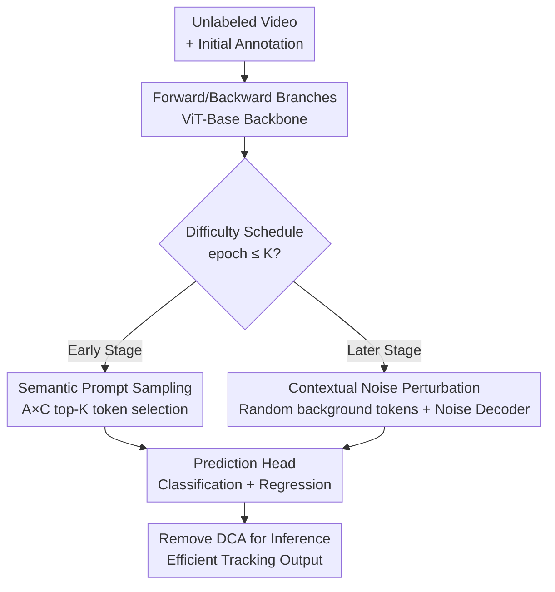

# Boosting Self-Supervised Tracking with Contextual Prompts and Noise Learning

**Conference**: CVPR 2026  
**arXiv**: [2605.06092](https://arxiv.org/abs/2605.06092)  
**Code**: None  
**Area**: Video Understanding / Self-Supervised Learning / Visual Object Tracking  
**Keywords**: Self-Supervised Tracking, Contextual Association, Semantic Prompts, Feature Perturbation, Curriculum Learning

## TL;DR
PNTrack equips self-supervised trackers with a Dual-mode Contextual Association (DCA) mechanism. In early training stages, semantic patch tokens are fed as prompts to forward/backward tracking branches to accelerate convergence. In later stages, random background tokens are injected as noise to perturb the feature space, forcing the model to learn robust representations. This entire mechanism is enabled only during training and completely removed during inference, achieving a new self-supervised SOTA across 8 tracking benchmarks.

## Background & Motivation

**Background**: Visual object tracking has produced a series of powerful fully-supervised trackers powered by large-scale annotated datasets like LaSOT, GOT10K, and TrackingNet. However, manual frame-by-frame bounding box annotation is extremely costly and poorly scalable. Self-supervised tracking has emerged as an alternative, with the mainstream approach being the "cycle consistency" framework: a forward tracking branch processes unlabeled frames, followed by a backward tracking branch that maps the target back to its initial position, using consistency constraints for training with minimal annotations.

**Limitations of Prior Work**: Both existing approaches have flaws. First, standard self-supervised trackers (e.g., TADS, SSTrack) lack explicit contextual modeling, failing to learn cross-frame contextual cues to guide tracking. Second, directly adopting the mature "query association" paradigm from fully-supervised tracking is ineffective, as those queries are randomly initialized, non-semantic vectors that cannot extract reliable contextual cues in unsupervised scenarios, leading to poor generalization in long-term or complex scenes.

**Key Challenge**: The fundamental goal of self-supervised tracking is to maximize the mutual information between input video sequences and target states $\max_{\theta} I(f_\theta(\mathcal{D}); y_0^l)$. However, limited by sparse annotation subsets $\mathcal{D}^l$ and non-semantic token association methods, the mutual information between learned features $\mathcal{F}$ and target signals $y_0^l$ is suppressed, failing to fully exploit the target information within massive unlabeled data $\mathcal{D}^u$.

**Goal**: To construct a flexible contextual information flow within the self-supervised framework that assists the model in rapidly acquiring tracking knowledge early on, while pushing it toward harder feature distributions for robust representations later, all without slowing down inference.

**Key Insight**: The authors observe that ViT attention maps implicitly contain spatial information about the target. Given this "free" signal, one can sample "semantic" tokens from real video frames for cross-frame association instead of relying on non-semantic random queries. Furthermore, "background tokens" are treated as a form of context: target tokens tell the model what to focus on, while background tokens tell it what to suppress, making them complementary.

**Core Idea**: Following an "easy-to-hard" curriculum schedule, semantic prompt tokens are injected early to reduce difficulty, while background noise tokens are injected later to increase difficulty. This dual-mode mechanism dynamically regulates the learning difficulty of both forward and backward branches.

## Method

### Overall Architecture
PNTrack follows the standard forward-backward dual-branch cycle consistency self-supervised tracking skeleton, using a ViT-Base backbone (12 layers, initialized with DropMAE pre-training). Its innovation is concentrated in the **Dual-mode Contextual Association (DCA)** mechanism. DCA determines which type of contextual tokens—"semantic prompts" to accelerate learning early on, or "background noise" to perturb features later—are passed to the tracking branches based on the current training epoch. Crucially, this mechanism **runs only during the training phase and is entirely removed during inference**, thus adding no online inference overhead (PNTrack-384 runs at 59 FPS on an A100).

The pipeline is as follows: Unlabeled video + sparse initial frame annotation → ViT dual-branch backbone extracts features → DCA samples contextual tokens based on the epoch → Prediction heads output classification/regression → DCA is removed at inference for efficient tracking output.

### Key Designs

**1. Semantic Prompt Sampling: Selecting high-confidence target tokens via Attention × Classification maps to accelerate early learning**

The limitation is the lack of supervision in unlabeled frames; relying solely on network outputs (e.g., the box with the highest classification score) makes it difficult to locate the target accurately, leading to optimization drift in early training. The DCA early-stage approach (epoch $\le K$) is to cache the spatial attention map $\mathcal{A}$ of the last backbone layer (cross-attention between reference and search frames, characterizing the target's state distribution) and perform cross-correlation with the classification response map $\mathcal{C}$. This yields a token-level "target vs. background" scoring function, and the top-K tokens are selected from search features $\mathcal{F}_x$ as instance prompts:

$$T = \text{topk}\left(\mathcal{F}_x,\ \frac{1}{n}\sum_{j=1}^{n}\mathcal{A}\times\mathcal{C}\right)$$

where $n$ is the number of attention heads. Before cross-correlation, multi-head attention $\mathcal{A}$ is averaged across the head dimension. These high-confidence target tokens serve as contextual prompts for the next frame's forward/backward branches. This is effective because it provides richer, semantic target cues before the model has learned reliable tracking patterns, stabilizing early optimization far better than non-semantic random queries.

**2. Contextual Noise Perturbation: Escalating difficulty with random background tokens to force robust representations**

Relying solely on prompts keeps training in "easy mode," preventing the model from learning robustness against hard samples. In the later stage (epoch $> K$), DCA switches strategies: instead of precise selection, random background tokens are sampled from each frame as noise $T = \text{random}(\mathcal{F}_x)$. A **noise decoder** (a single transformer layer + classification/regression head) is introduced to perform cross-attention between search features and background tokens from other sequences. The effectiveness is two-fold: first, after the early phase, the tracker has accumulated sufficient instance tracking knowledge to avoid being derailed by noise; second, injecting background noise disturbs the semantic embedding space of search features, artificially simulating a harder tracking environment that forces the model to learn more robust target localization capabilities.

**3. Easy-to-hard Temporal Difficulty Scheduling: Dual-mode switching within one mechanism, existing only during training**

The first two designs are integrated via a scheduler. DCA follows a temporal scheduling principle using a single hyperparameter $K$ (epoch threshold) as a switch: prompt mode for $\le K$ and noise mode for $> K$. Both forward and backward branches follow this rule (see Algorithm 1). This curriculum arrangement—"reducing difficulty for a fast start, then increasing difficulty to polish robustness"—allows the model to adapt from simple to complex scenarios, avoiding non-convergence caused by tackling hard samples immediately. Most importantly, the DCA is designed as **training-exclusive**—the prompt sampling and noise decoder are removed during inference, reverting the tracker to a clean, efficient ViT tracker. Thus, robustness gains do not come at the cost of inference speed.

### Loss & Training
Focal loss $\mathcal{L}_{cls}$ is used for classification, and a combination of GIoU loss and $\mathcal{L}_1$ loss is used for regression. The total loss is:

$$\mathcal{L} = \mathcal{L}_{cls} + \lambda_1 \mathcal{L}_1 + \lambda_2 \mathcal{L}_{GIoU}$$

The training set includes LaSOT + GOT10K + TrackingNet + COCO. The AdamW optimizer is used with 2 A100 GPUs and a batch size of 8. Training lasts 150 epochs (randomly sampling 10,000 image pairs per epoch), with the learning rate decaying by 10x after 120 epochs. The backbone learning rate is $2.5\times10^{-5}$, while other components are $2.5\times10^{-4}$, with a weight decay of $10^{-4}$.

## Key Experimental Results

### Main Results
PNTrack sets new self-supervised SOTA results across 8 benchmarks (GOT10K, LaSOT, LaSOText, TrackingNet, VOT2020, TNL2K, UAV123, OTB100). The following table compares it with the strongest self-supervised baseline, SSTrack (also using only Init.BBox supervision):

| Benchmark | Metric | SSTrack-384 | PNTrack-384 | Gain |
|------|------|-------------|-------------|------|
| GOT10K | AO / SR0.5 / SR0.75 | 72.4 / 83.6 / 66.2 | 72.7 / 83.4 / 69.9 | AO +0.3, SR0.75 +3.7 |
| LaSOT | AUC | 65.9 | 67.1 | +1.2 |
| LaSOext | AUC | 48.5 | 49.1 | +0.6 |
| TrackingNet | AUC / PNorm / P | 80.4 / 86.3 / 77.9 | 81.8 / 87.4 / 79.7 | AUC +1.4, P +1.8 |

> At 256 resolution, compared to SSTrack-256, GOT10K AO / SR0.5 / SR0.75 improved by +1.9 / +2.5 / +3.6 respectively. PNTrack-384 narrows the AUC gap with fully-supervised methods to 8.2% / 5.5% on LaSOT / LaSOext.

Other benchmarks (AUC / EAO): TNL2K 55.3 (vs. 52.1 for SSTrack-256), OTB100 71.2, UAV123 66.4, VOT2020 EAO 0.522 (matching the fully-supervised SeqTrack's 0.522). OTB100 and UAV123 are 0.7 and 0.3 higher than SSTrack, respectively.

### Ablation Study
Contribution of components verified on LaSOT (Metrics: AUC / PNorm / P):

| # | Configuration | AUC | PNorm | P | Description |
|---|------|-----|-------|---|------|
| 1 | PNTrack (Full) | 65.9 | 76.3 | 70.2 | Complete model |
| 2 | Replace with non-semantic Query | 64.6 | 74.1 | 68.3 | AUC −1.3, proves semantic tokens are superior |
| 3 | − Contextual Noise | 65.1 | 75.5 | 68.9 | AUC −0.8, feature perturbation is effective |
| 4 | − Contextual Prompt | 64.1 | 74.9 | 68.6 | AUC −1.8, largest drop |
| 5 | − Attention Map (Sampling via Class Map) | 64.8 | 75.6 | 69.5 | AUC −1.1, weaker spatial awareness |

Sensitivity to contextual token length: Length 4 → AUC 65.4, length 8 → 65.9 (+0.5). Increasing length further leads to a decline, as too many tokens introduce background noise, harming early training stability.

### Key Findings
- **Contextual prompts contribute most**: Removing prompts causes an AUC drop of 1.8%, while removing noise drops it by 0.8%, indicating that early semantic prompts are critical for establishing spatio-temporal consistency.
- **Semantic tokens > Non-semantic queries**: Association using patch tokens sampled from real frames outperforms randomly initialized queries across all three metrics (AUC +1.3), verifying the motivation.
- **Attention maps are more accurate for sampling**: Using $\mathcal{A}\times\mathcal{C}$ instead of just classification response for sampling improves AUC by 1.1%, as attention maps provide stronger spatial localization awareness.

## Highlights & Insights
- **Dual perspective of "target prompt + background noise" is clever**: Background information, usually discarded in tracking, is utilized—target tokens define "what to attend to," while background tokens define "what to suppress." Two complementary contextual regulations are achieved within the same sampling framework (one top-K, one random).
- **Curriculum learning implemented via token sampling**: Without changing the network architecture or loss, switching token types based simply on an epoch threshold $K$ achieves an easy-to-hard schedule, making it extremely lightweight from an engineering perspective.
- **Training enhancement with zero inference cost**: DCA is purely a training scaffold that is removed at inference. This idea of injecting auxiliary signals only during training has transfer value for any representation learning task where online overhead must be avoided.
- **Reusing attention maps as weak localization signals**: Cross-correlating the ViT's inherent attention map $\mathcal{A}$ with the classification map $\mathcal{C}$ as a token-level objectness score is a practical unsupervised localization trick for label-scarce scenarios.

## Limitations & Future Work
- Code is not provided, and whether key hyperparameters like $K$ and token length need retuning for different datasets is not fully discussed, raising concerns about reproduction cost and universality.
- A significant 8.2% gap remains compared to fully-supervised SOTA (e.g., MCITrack LaSOT AUC 75.3). The performance ceiling for self-supervised tracking has not yet been reached; improvements primarily come from robustness rather than localization precision caps.
- Noise sampling involves "randomly taking background tokens from other sequences," which is highly stochastic. The paper does not analyze the impact of noise token quality/distribution on variance, which may pose risks to training stability.
- The difficulty schedule is currently a hard switch (epoch $\le K$ / $> K$). Future work could explore soft scheduling where the ratio of prompts to noise transitions smoothly, or sample-adaptive scheduling rather than global epoch-based scheduling.

## Related Work & Insights
- **vs. SSTrack [59]**: Both use cycle consistency and Init.BBox supervision. SSTrack relies on decoupled spatio-temporal consistency and instance-level contrastive loss. PNTrack builds on this by adding DCA's dual-mode contextual association, further extracting information from unlabeled frames via semantic prompts and background noise, outperforming it across 8 benchmarks (e.g., GOT10K SR0.75 +3.7).
- **vs. Fully-supervised Contextual Trackers (ODTrack [60], AQATrack [44])**: These use randomly initialized non-semantic queries or temporal tokens for cross-frame association, relying on large-scale labels. PNTrack points out these are unreliable in unsupervised settings (Ablation #2 proves −1.3 AUC) and uses semantic patch tokens instead.
- **vs. TADS [19]**: TADS makes self-supervised tracking plug-and-play via data augmentation; PNTrack focuses on contextual token association and difficulty scheduling rather than augmentation, while maintaining zero inference overhead.

## Rating
- Novelty: ⭐⭐⭐⭐ First to introduce dual-mode contextual association of semantic prompts and background noise to self-supervised tracking; the "target/background duality + curriculum scheduling" combination is innovative.
- Experimental Thoroughness: ⭐⭐⭐⭐ Covers 8 benchmarks with comprehensive ablations (association methods/components/signals/token length), although it lacks code and deep analysis of variance/hyperparameter sensitivity.
- Writing Quality: ⭐⭐⭐⭐ Motivations are clearly explained from an information-theory perspective with Fig.1 comparisons; Method includes Algorithm 1; logic is clear.
- Value: ⭐⭐⭐⭐ Narrows the gap between self-supervised and fully-supervised tracking; the "train-in, test-out" lightweight enhancement paradigm has significant transfer value.

<!-- RELATED:START -->

## Related Papers

- [\[CVPR 2026\] A Stitch in Time: Learning Procedural Workflow via Self-Supervised Plackett-Luce Ranking](a_stitch_in_time_learning_procedural_workflow_via_self_supervised_plackett_luce_r.md)
- [\[CVPR 2026\] TimeBridge: Self-Supervised Video Representation Learning via Start-End Joint Embedding and In-Between Frame Prediction](timebridge_self-supervised_video_representation_learning_via_start-end_joint_emb.md)
- [\[CVPR 2026\] Exploring Adaptive Masked Reconstruction for Self-Supervised Skeleton-Based Action Recognition](exploring_adaptive_masked_reconstruction_for_self-supervised_skeleton-based_acti.md)
- [\[CVPR 2026\] Learning from Noisy Supervision: A Denoising-Debiasing Framework for Weakly Supervised Video Anomaly Detection](learning_from_noisy_supervision_a_denoising-debiasing_framework_for_weakly_super.md)
- [\[CVPR 2026\] Hierarchical Action Learning for Weakly-Supervised Action Segmentation](hierarchical_action_learning_for_weakly-supervised_action_segmentation.md)

<!-- RELATED:END -->
