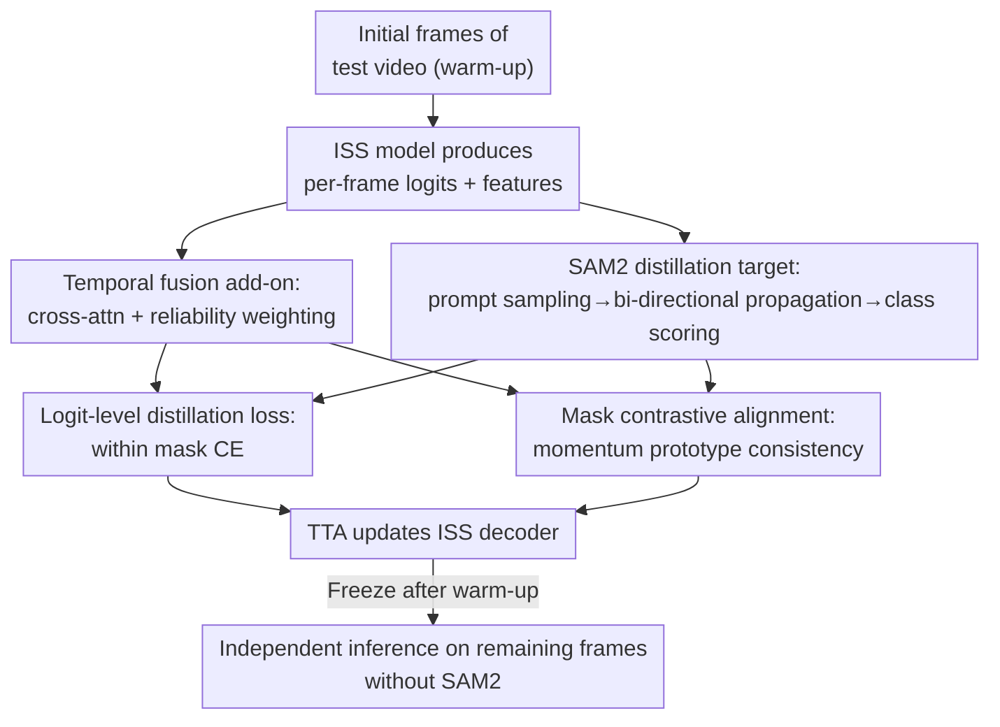

# Bootstrapping Video Semantic Segmentation Model via Distillation-assisted Test-Time Adaptation

**Conference**: CVPR 2026  
**arXiv**: [2604.10950](https://arxiv.org/abs/2604.10950)  
**Code**: https://github.com/jihun1998/DiTTA (Available)  
**Area**: Video Understanding / Semantic Segmentation / Test-Time Adaptation  
**Keywords**: Video Semantic Segmentation, Test-Time Adaptation, SAM2 Distillation, Temporal Consistency, Unlabeled

## TL;DR
DiTTA utilizes a lightweight temporal add-on to perform test-time adaptation (TTA) on the initial frames of a test video for an image semantic segmentation (ISS) model. By distilling the temporal propagation capabilities of SAM2, it "bootstraps" the model into a video-specific VSS model. The model is subsequently frozen for high-speed inference on the remaining frames without requiring video labels, outperforming fully supervised VSS methods on VSPW.

## Background & Motivation

**Background**: Video Semantic Segmentation (VSS) aims to classify every pixel in every frame of a video. Prevalent approaches involve fully supervised training on video datasets like VSPW with dense per-frame annotations. however, the cost of 15fps per-frame pixel annotation is extremely high, and available video datasets are scarce. An easier alternative is direct per-frame inference using Image Semantic Segmentation (ISS) models (Fig.1A), bypassing video annotations. However, this treats each frame in isolation, losing temporal continuity and leading to prediction flickering and inconsistency under occlusion or motion blur.

**Limitations of Prior Work**: The recently introduced SAM2 can perform high-quality promptable video mask propagation. An intuitive approach is to use it for zero-shot post-processing refinement of ISS outputs (Fig.1B)—converting first-frame ISS results into object-level prompts and propagating them through time. However, this has two major drawbacks: (1) Calling SAM2 for tracking multiple objects in every frame incurs massive computational/memory overhead (measured at only 1.41 FPS) and requires handling complex logic for adding new targets or discarding old ones; (2) It relies entirely on the first-frame ISS result, propagating errors if the initial prediction is incorrect with little correction capability.

**Key Challenge**: To achieve temporal consistency, one must either spend heavily on video data annotation or pay a massive computational price for repeated SAM2 calls during inference—neither of which is practical. Is it possible to "absorb" the temporal knowledge of SAM2 into the ISS model once during a "short initial segment" and then discard SAM2?

**Goal**: Transform an off-the-shelf ISS model into a temporally-aware VSS model for the current test video without video annotations and without reliance on SAM2 during inference.

**Key Insight**: The authors frame this as a Test-Time Adaptation (TTA) problem. However, traditional TTA (entropy minimization, self-pseudo-labeling) relies solely on the model's own predictions, yielding limited gains. The core observation is that ISS models excel at "semantic classification" while SAM2 excels at "spatiotemporally consistent mask propagation." These are complementary, allowing SAM2 to serve as a "teaching assistant" to distill temporal supervision signals into the ISS model during test time.

**Core Idea**: Use SAM2 for one-time "temporal knowledge distillation" on the first few frames of the test video to bootstrap the ISS model into a video-specific VSS model, then freeze and discard SAM2 for independent inference.

## Method

### Overall Architecture

DiTTA addresses the challenge of "bootstrapping a per-frame ISS model into a temporally-aware VSS model on a test video." Three components work in synergy: a **lightweight temporal fusion add-on** to enable cross-frame information aggregation; **SAM2 distillation targets** to provide temporal supervision signals via logit-level distillation on warm-up frames; and **mask contrastive alignment** to reinforce consistency of the same object across frames in the feature space. These components jointly drive TTA. Once the warm-up concludes, the model is frozen for independent, high-speed inference on remaining frames—this is the proposed **Warm-Up then Freeze (W2F)** evaluation protocol (e.g., adapt on the first 10% of frames, infer on the remaining 90%). The adaptation process requires only a single pass of SAM2, which is completely bypassed during the inference phase.

### Key Designs

**1. Temporal fusion add-on: Adding a "Temporal Bridge" to per-frame ISS models**

ISS models are inherently single-frame focused and lack cross-frame aggregation, causing temporal loss during per-frame inference. The authors attach a lightweight cross-attention add-on as a temporal bridge between adjacent frames: given consecutive frames $(I_{t-1}, I_t)$, the ISS model produces features $(F_{t-1}, F_t)$ and logits $(S_{t-1}, S_t)$. The current frame features are projected as queries, previous frame features as keys, and previous logits $S_{t-1}$ as values to compute the temporal attention output $S^{\text{add-on}}_{t-1}=\mathrm{softmax}(Q_t K_{t-1}^T)\,S_{t-1}$. Since the previous frame may be unreliable (occlusion, blur), fusion is weighted by pixel reliability: $R_t(x,y)=1-E_t(x,y)/\max E_t$, where $E_t$ is the normalized entropy of the class distribution. If $R_t$ exceeds a threshold $\tau$, the current frame $S_t$ is used; otherwise, a convex combination of current and aligned previous frames is taken based on their relative $R_t$ and $R^{\text{add-on}}_{t-1}$. This introduces temporal context without being compromised by low-quality historical frames—fine-tuning the decoder during TTA enables this capability.

**2. SAM2 distillation target: Using SAM2 as a TA to create temporal supervision**

The fundamental hurdle of TTA is the lack of labels; pure entropy minimization or self-pseudo-labeling relies only on the model's own predictions, which have a low performance ceiling. DiTTA’s core innovation is "creating supervision" using the complementary strengths of ISS and SAM2: first, highly reliable pixels are sampled as prompt points from first-frame ISS predictions (filtered by class and entropy thresholds to ensure semantic and spatial diversity). These are passed to SAM2 for **bi-directional propagation** to generate a set of spatiotemporally consistent object masks $\{M^i_t\}$. These masks do not need to cover the whole frame; they only cover regions where both ISS and SAM2 are confident, acting as reliable "object-level temporal anchors." Each spatiotemporal mask $M^i$ is assigned a class label using soft scoring that aggregates per-frame ISS predictions: $\sigma^c=\sigma^c_{\text{rel}}\cdot(\sigma^c_{\text{area}})^{\gamma_{\text{area}}}\cdot(\sigma^c_{\text{freq}})^{\gamma_{\text{freq}}}$, where $\sigma^c_{\text{rel}}$ is mean reliability within the mask, $\sigma^c_{\text{area}}$ is the area ratio (suppressing noise), and $\sigma^c_{\text{freq}}$ compensates for long-tail classes. Logit-level cross-entropy $L^{\text{Distill}}_t=\sum_i\sum_{(x,y)\in m^i_t}\big[\mathrm{CE}(S_t,c^i)+\mathrm{CE}(S^{\text{add-on}}_{t-1},c^i)\big]$ is then applied only within mask regions to supervise both original and add-on logits. SAM2 determines "where from the space" and ISS determines "what the semantics are," combining the strengths of both.

**3. Mask contrastive alignment: Forcing consistent representations in feature space**

Logit-level distillation constrains semantic alignment but does not guarantee feature-level temporal coherence. The authors add a mask-based contrastive loss: a momentum encoder (EMA updated) computes object prototypes from the momentum branch for each spatiotemporal mask $M^i$ as $P^i_t=\frac{1}{|m^i_{1:t}|}\sum_{u\le t}\sum_{(x,y)\in m^i_u}F^{mo}_u\cdot R^{mo}_u$ (reliability-weighted aggregation up to frame $t$). The main model's current features are pulled toward their corresponding prototype and pushed away from others: $L^{\text{Contra}}_t=-\sum_i\sum_{(x,y)\in m^i_t}\log\frac{\exp(F_t\cdot P^i_t)}{\sum_j \exp(F_t\cdot P^j_t)}$. Momentum prototypes provide stable targets, clustering representations of the same object across different frames in the embedding space, complementing the logit-level loss to reinforce temporal consistency from the feature side. Total loss: $L^{\text{DiTTA}}_t=L^{\text{Distill}}_t+L^{\text{Contra}}_t$.

### Loss & Training
The default ISS model used is SegFormer (MiT-B5 backbone, pre-trained per-frame on the VSPW training set). During TTA, **only decoder parameters are updated** with a learning rate of 0.001 and 5 iterations per frame. Hyperparameters are set to $\tau=0.8$, $\gamma_{\text{area}}=0.3$, and $\gamma_{\text{freq}}=0.8$, with fixed random seeds. All experiments are conducted under the W2F protocol unless specified otherwise.

## Key Experimental Results

### Main Results
Comparison with various baselines on the VSPW dataset under the W2F protocol (using the same SegFormer backbone; mVC measures cross-frame smoothness, FPS measured on a single RTX 3090):

| Warm-up | Method | FPS | mIoU | wIoU | mVC8 | mVC16 |
|---------|------|-----|------|------|------|-------|
| 10% | SegFormer (ISS) | 18.58 | 49.0 | 66.3 | 88.3 | 84.3 |
| 10% | CFFM++ (Supervised VSS) | 5.85 | 49.6 | 66.1 | 90.4 | 86.8 |
| 10% | CoTTA (ISS+TTA) | 18.48 | 49.6 | 66.7 | 89.7 | 86.4 |
| 10% | Zero-shot Refine. (ISS+SAM2) | 1.41 | 49.7 | 66.5 | 94.7 | 92.9 |
| 10% | **DiTTA (Ours)** | 13.45 | **51.1 (+2.1)** | 66.5 | 94.1 | 92.2 |
| 50% | SegFormer (ISS) | 18.58 | 48.7 | 66.4 | 88.3 | 84.2 |
| 50% | Zero-shot Refine. | 1.41 | 50.1 | 67.3 | 95.0 | 93.3 |
| 50% | **DiTTA (Ours)** | 13.45 | **52.3 (+3.6)** | 67.1 | 94.9 | 93.0 |

With only 10% warm-up, DiTTA's mIoU is +2.1%p higher than the ISS baseline and +1.5%p higher than the fully supervised VSS method CFFM++. Meanwhile, its speed (13.45 FPS) is nearly 10x faster than zero-shot refinement (1.41 FPS). The advantage increases with larger warm-up ratios (+3.6%p at 50%).

### Ablation Study (50% W2F Protocol)
| Configuration | Add-on | Distill. | Contrast. | mIoU |
|------|:------:|:--------:|:---------:|------|
| ISS Baseline | | | | 48.7 |
| A | ✔ | | | 49.9 |
| B | | ✔ | | 50.8 |
| C | | | ✔ | 50.2 |
| DiTTA (Full) | ✔ | ✔ | ✔ | **52.3** |

All three components provide individual gains. The SAM2 distillation target (B, +2.1) is the primary contributor, and the combination of the three achieves 52.3 mIoU, demonstrating complementarity. (Note: Variants without the distillation target revert to using the ISS model's own predictions as self-supervision targets).

### Key Findings
- **SAM2 distillation is the main driver**: Adding the distillation target alone (B) raises mIoU from 48.7 to 50.8, a larger contribution than the add-on (A, 49.9) or contrastive alignment (C, 50.2). This confirms that distilling structured temporal knowledge from SAM2 is more effective than pure unsupervised TTA objectives.
- **Improvement is more than just "using SAM2"**: Compared directly with zero-shot refinement using SAM2, DiTTA achieves higher mIoU across all warm-up ratios while being nearly 10x faster, proving that distilling temporal knowledge *into* the model is superior to repeated SAM2 calls during inference.
- **Cross-domain generalization**: In VSPW→Cityscapes cross-dataset experiments, DiTTA achieved 46.9 mIoU (+2.7 over ISS) and 77.9 wIoU (+3.7), also surpassing fully supervised CFFM.
- **Independence from video priors**: When the ISS model is replaced with a version trained on the static ADE20K dataset and transferred to VSPW, DiTTA still increases mIoU by +1.1 and mVC16 by +17.7, refuting concerns about "hidden video priors" in VSPW.

## Highlights & Insights
- **The "One-time Distillation + Frozen Inference" paradigm is clever**: By using the expensive foundation model (SAM2) only once during the warm-up phase, knowledge is transferred to a lightweight model which then runs independently. This achieves temporal consistency while maintaining near real-time inference—this "warm-up then freeze" logic can be transferred to any online task where foundation models are too costly but can provide supervision early on.
- **Multi-purpose reliability map (normalized entropy)**: The same $R_t$ is utilized for weighted fusion in the add-on, prompt sampling for distillation, and weighted aggregation of contrastive prototypes, serving as a concise yet effective trick.
- **Division-of-labor supervision construction**: Letting ISS handle semantics and SAM2 handle spatiotemporal propagation, then assigning classes via soft scoring, is a valuable way of "combining the strengths of two complementary models" that can inspire other TTA/distillation scenarios lacking supervision.
- **The W2F protocol is a contribution itself**: Formalizing "adaptation on the first few frames and frozen inference on the rest" is more realistic for resource-constrained deployments like robotics or surveillance compared to per-frame adaptation.

## Limitations & Future Work
- **Reliance on warm-up frame representativeness**: If the initial 10% of frames differ significantly from the rest (e.g., drastic scene cuts, new classes appearing later), the frozen model may struggle—this is an inherent assumption of "extrapolating knowledge from the start to the whole clip."
- **Sensitivity to initial ISS quality**: Although distillation is more robust than refinement, prompt sampling and class scoring still rely on ISS predictions. Systemic misclassifications by the ISS model in the warm-up phase can still bias the distillation target.
- **Hyperparameter sensitivity**: Factors like $\gamma_{\text{area}}$ and $\gamma_{\text{freq}}$ in the $\sigma^c$ calculation require tuning. While the paper provides values for VSPW, robustness across datasets and sensitivity to long-tail distributions require more validation.
- **Limited wIoU gains**: DiTTA's wIoU is mostly on par with ISS (+0.2~+0.7) in the main results, with gains concentrated in mIoU and temporal consistency (mVC), suggesting it is better at fixing "temporal jitter/fragmentation" than improving overall weighted accuracy.

## Related Work & Insights
- **Vs Supervised VSS (CFFM / CFFM++ / TV3S)**: These train optical flow or attention-based temporal modules directly on VSPW videos, requiring expensive labels and slow inference (~5-6 FPS). DiTTA requires no video labels and bootstraps via test-time distillation, achieving higher mIoU and faster speeds (13.45 FPS).
- **Vs ISS+TTA (TENT / AuxAdapt / CoTTA)**: These perform per-frame unsupervised adaptation (entropy/pseudo-labels) without explicit temporal modeling. DiTTA introduces structured temporal knowledge from SAM2 and explicit cross-frame fusion via the add-on, outperforming the strong CoTTA baseline by +1.5%p under 10% warm-up. AuxAdapt is the most related but ignores cross-frame temporal modeling.
- **Vs Zero-shot SAM2 refinement**: These use SAM2 as a post-processor for every frame, which is slow (1.41 FPS) and propagates first-frame errors. DiTTA distills the knowledge into the model during warm-up and is faster and more accurate without SAM2 at inference.

## Rating
- Novelty: ⭐⭐⭐⭐⭐ "Test-time distillation of SAM2 + warm-up then freeze" novelly weaves together TTA, foundation model distillation, and VSS.
- Experimental Thoroughness: ⭐⭐⭐⭐ Covers three types of baselines, cross-domain, non-video sources, and full-video; clear ablation. However, limited to VSPW/Cityscapes and single backbone.
- Writing Quality: ⭐⭐⭐⭐ Clear motivation and division of labor; intuitive figures. Some coordination of symbols (e.g., $\sigma$ terms) requires careful reading.
- Value: ⭐⭐⭐⭐⭐ Provides a practical, scalable solution for real-world deployment where video labels are missing and SAM2 cannot be called repeatedly, with convincing performance over supervised methods.

<!-- RELATED:START -->

## Related Papers

- [\[CVPR 2026\] Dual-level Adaptation for Multi-Object Tracking: Building Test-Time Calibration from Experience and Intuition](tcei_test_time_calibration_experience_intuition_mot.md)
- [\[CVPR 2026\] Scene-Centric Unsupervised Video Panoptic Segmentation](scene-centric_unsupervised_video_panoptic_segmentation.md)
- [\[CVPR 2026\] Polyphony: Diffusion-based Dual-Hand Action Segmentation with Alternating Vision Transformer and Semantic Conditioning](polyphony_diffusion-based_dual-hand_action_segmentation_with_alternating_vision_.md)
- [\[CVPR 2026\] Robust Promptable Video Object Segmentation](robust_promptable_video_object_segmentation.md)
- [\[CVPR 2026\] Self-Critical Distillation Network for Video-based Commonsense Captioning](self-critical_distillation_network_for_video-based_commonsense_captioning.md)

<!-- RELATED:END -->
