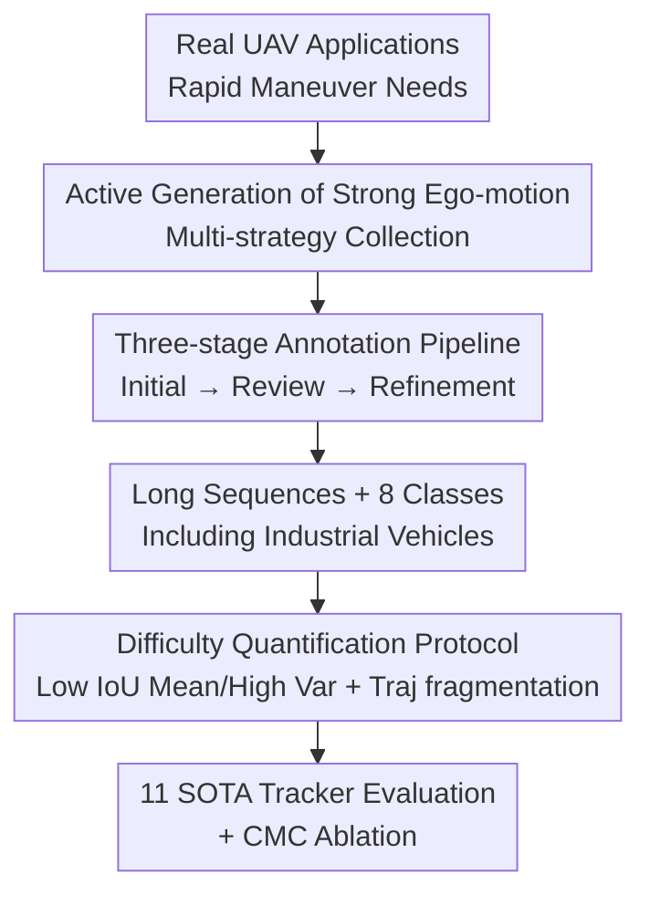

# Breaking Smooth-Motion Assumptions: A UAV Benchmark for Multi-Object Tracking in Complex and Adverse Conditions

**Conference**: CVPR 2026  
**Paper**: [CVF Open Access](https://openaccess.thecvf.com/content/CVPR2026/html/Ye_Breaking_Smooth-Motion_Assumptions_A_UAV_Benchmark_for_Multi-Object_Tracking_in_CVPR_2026_paper.html)  
**Code**: https://github.com/kxzhang-lab/DynUAV  
**Area**: Video Understanding / UAV Perception / Multi-Object Tracking  
**Keywords**: UAV-MOT, ego-motion, tracking benchmark, motion blur, trajectory fragmentation

## TL;DR
The authors propose DynUAV—a multi-object tracking benchmark (42 videos, 1.7M+ bounding boxes, 8 categories) that intentionally creates intense ego-motion through aggressive UAV maneuvers. It breaks the implicit "smooth near-linear motion" assumption of existing UAV-MOT datasets. Experiments with 11 SOTA trackers demonstrate that existing methods' detection and association simultaneously collapse under drastic viewpoint and scale mutations.

## Background & Motivation
**Background**: Multi-Object Tracking (MOT) is well-established in surveillance and autonomous driving. UAV-based MOT (UAV-MOT) also has benchmarks like VisDrone, UAVDT, and MDMT. However, most of these datasets are collected during high-altitude hovering or constant-speed cruising, featuring smooth camera trajectories where object image-plane trajectories are approximately linear.

**Limitations of Prior Work**: In reality, UAVs often perform non-linear, rapid maneuvers—obstacle avoidance, variable-speed tracking, orbital flight, and push-pull zooming. These actions introduce drastic viewpoint shifts, scale mutations, and motion blur. Existing benchmarks rarely cover these high-dynamic conditions; target trajectories within single clips are usually "straight," and scenes/targets are often restricted to common urban intersections and vehicles. In other words, the "difficulty" in current UAV-MOT evaluations stems mainly from occlusion and small objects rather than the sensor's own violent motion.

**Key Challenge**: Modern MOT algorithms (Kalman filters, constant velocity priors, appearance-based ReID) all rely on a "smooth motion assumption"—small target displacement and stable appearance between adjacent frames. Once the camera performs aggressive maneuvers, this assumption is shattered: targets undergo massive displacement and appearance drift due to blur and viewpoint changes, dragging down both detection and association. While benchmarks like DanceTrack or SportsMOT also "anti-smoothness," their difficulty arises from the **targets' own** complex behavior rather than **sensor ego-motion**. BioDrone captures UAV jitter but is limited to Single Object Tracking (SOT), lacking multi-object data association challenges.

**Goal**: To construct a MOT benchmark specifically designed to expose "observation instability induced by camera ego-motion" and systematically quantify how much more difficult it is compared to existing benchmarks.

**Core Idea**: Instead of passively recording dynamic objects, the authors **actively leverage the UAV's maneuverability to generate strong ego-motion**. By using controlled variable speeds and flexible camera poses, they deliberately generate complex apparent trajectories and frequent rapid-motion events, breaking the "smooth motion assumption" and forcing trackers to perform genuine temporal reasoning.

## Method
As a benchmark paper, no new tracking algorithm is proposed. The "method" consists of the **dataset construction pipeline + difficulty characterization protocol + evaluation scheme**. The process follows four steps: designing flight strategies for strong ego-motion, multi-scenario collection using consumer UAVs, a three-stage annotation pipeline for reliable IDs, and quantifying the difficulty against other benchmarks using statistical metrics before evaluating 11 SOTA trackers.

### Overall Architecture

### Key Designs

**1. Active Generation of Strong Ego-motion: Integrating "Anti-smoothness" into Data**

To address the lack of camera trajectory complexity, the authors **deliberately manufacture difficulty during the collection phase**. Using a DJI Mini 4 Pro (1/1.3-inch CMOS, 1080p) at altitudes of 80–120 meters, they combine various flight strategies—hovering, cruising, variable speed motion, rotation, and zooming—specifically including orbital maneuvers and fly-in/pull-away motions to induce viewpoint/scale mutations and blur. Two research-oriented features were embedded: **long-term robustness**, with the longest average sequence duration among similar benchmarks to test drift and fragmentation over time; and **ego-motion decoupling**, featuring sequences where the camera moves violently while objects remain stationary, isolating the difficulty caused purely by the camera.

**2. Three-stage Annotation Pipeline: Maintaining Temporal Consistency under Violent Motion**

Intense ego-motion causes targets to frequently exit and re-enter the frame with drastically different scales and viewpoints, making manual ID labeling error-prone. The authors used the CVAT platform and a three-stage pipeline (Initial → Review → Refinement). During refinement, a custom visualization script automatically detects errors via **frame-level** and **ID-level** sampling, ensuring boundary box precision and temporal ID consistency. The protocol specifies that targets are labeled from their **first frame of full visibility** and continue to be labeled during occlusions if the position can be reliably inferred—preserving tracklet continuity and ensuring "trajectory fragmentation" stats reflect tracking difficulty rather than missing labels.

**3. Long Sequences + 8 Categories (Including Industrial Vehicles): Diversifying Scenes and Classes**

DynUAV defines 8 categories across vehicles and pedestrians. Beyond standard cars and trucks, it introduces industrial vehicles like excavators, cranes, and bulldozers. For consistency, all two-wheelers are "cycle," riders are "cycler," and pedestrians are "person." Scenarios cover campuses (dense crowds), urban roads (high-speed flow), and nighttime (changing lighting). Coupled with long average sequence durations, this triple diversity in category, scene, and time raises the bar for generalization and temporal modeling.

**4. Difficulty Quantification Protocol: Quantifying the Complexity of DynUAV**

The authors provide quantifiable evidence of increased difficulty. First, **IoU mean and variance** of the same target between adjacent frames: DynUAV occupies a unique "low mean, high variance" zone, indicating large frame-to-frame displacement and diverse motion patterns, contrasting with the "stable and predictable" distribution of MOT20. Second, the **average target area to frame area ratio** confirms DynUAV as an extreme small-object benchmark (approx. $1.17\times10^{-3}$, second only to MDMT). Third, **trajectory fragmentation distribution**: in DynUAV, targets are often cut into multiple segments due to occlusions or being thrown out of view by camera maneuvers, whereas VisDrone/UAVDT consist largely of single continuous trajectories.

### Evaluation Scheme
Unified Detector: All trackers use YOLOv11 as the detection backbone (1280×1280 input, 100 epochs on RTX 4090) to isolate detection differences and fairly compare association capabilities. Reported results are from models **fine-tuned on DynUAV**. Eleven representative trackers were evaluated across five categories: Unsupervised (Path-Consistency), Motion-enhanced (OC-SORT, DiffMOT), One-stage (BoostTrack, TrackTrack), Uncertainty-aware (U2MOT), and Adaptive Memory/Fusion (AdapTrack, StrongSORT). Metrics include MOTA, IDF1, HOTA, and decomposed DetA (Detection) / AssA (Association).

## Key Experimental Results

### Dataset Statistical Comparison

| Dataset | Task | Seq | BBox | Avg Frame | Avg Area Ratio |
|--------|------|--------|------|----------|----------------|
| VisDrone | UAV | 92 | 1621k | 417 | $2.58\times10^{-3}$ |
| UAVDT | UAV | 50 | 799k | 815 | $2.59\times10^{-3}$ |
| MDMT | UAV | 88 | 2212k | 451 | $9.72\times10^{-4}$ |
| DanceTrack | General | 100 | 574k | 1059 | $3.19\times10^{-2}$ |
| **DynUAV** | UAV | 42 | 1720k | **1828** | $1.17\times10^{-3}$ |

While DynUAV has fewer sequences, its **average (1828) and minimum (1076) frame counts are the highest**, emphasizing long-term continuity. The target area ratio is extremely small, making it a typical small-object benchmark.

### Tracker Performance on DynUAV (After Fine-tuning)

| Tracker | MOTA↑ | IDF1↑ | HOTA↑ | AssA↑ | IDSW↓ |
|--------|-------|-------|-------|-------|-------|
| TrackTrack | 66.95 | **74.81** | **62.74** | **68.89** | **256** |
| AdapTrack | 67.96 | 73.26 | 62.33 | 66.71 | 583 |
| Deep OC-SORT | 66.44 | 72.25 | 61.09 | 65.49 | 567 |
| DiffMOT | 67.32 | 71.72 | 61.21 | 65.73 | 430 |
| StrongSORT | **68.18** | 71.21 | 60.87 | 63.15 | 1394 |
| U2MOT | 55.16 | 58.92 | 51.47 | 53.90 | 6452 |
| BoostTrack | 56.72 | 63.77 | 53.71 | 58.98 | 609 |

One-stage TrackTrack wins in most association metrics via unified matching across confidence levels. StrongSORT shows high DetA/MOTA but lags in AssA/IDF1, indicating its over-reliance on appearance features which degrade under DynUAV's motion blur. BoostTrack's aggressive strategy of generating pseudo-boxes backfires in dynamic scenes, causing high FP and fragmentation, while U2MOT's uncertainty modeling fails under extreme variations (IDSW 6452).

### Performance Drop (DynUAV relative to other benchmarks)

| Tracker | vs MOT17 MOTA | vs MOT17 IDF1 | vs MOT20 MOTA | vs DanceTrack MOTA |
|--------|---------------|----------------|----------------|---------------------|
| BoostTrack | -23.98 | -18.43 | -20.98 | — |
| U2MOT | -24.54 | -19.28 | -21.94 | — |
| OC-SORT | -17.31 | -19.38 | -14.82 | -31.51 |
| Deep OC-SORT | -12.96 | -8.35 | -9.16 | -25.86 |
| StrongSORT | -11.42 | -8.29 | -5.62 | -22.92 |

DynUAV shows the largest MOTA and IDF1 drops compared to MOT17/20. The MOTA drop is mainly due to detection failures caused by ego-motion and scale mutations; the IDF1 drop stems from trajectory fragmentation. Compared to DanceTrack, the MOTA drop is shocking (-31.51 for OC-SORT): while DanceTrack difficulties are association-centric, DynUAV's ego-motion systematically breaks the entire pipeline.

### CMC Ablation

| Tracker | Configuration | MOTA↑ | IDF1↑ | AssA↑ | IDSW↓ |
|--------|------|-------|-------|-------|-------|
| AdapTrack | w/o CMC | 63.57 | 65.53 | 58.97 | 1123 |
| AdapTrack | **w/ CMC** | 67.96 | 73.26 | 66.71 | 583 |
| TrackTrack | w/o CMC | 65.31 | 71.04 | 65.95 | 439 |
| TrackTrack | **w/ CMC** | 66.95 | 74.81 | 68.89 | 256 |

Camera Motion Compensation (CMC) significantly improves **association** metrics (assA increase, IDSW nearly halved) but provides almost no benefit to DetA, confirming that ego-motion primarily pollutes association.

### Key Findings
- **CMC Gain = Ego-motion Intensity Proxy**: Sequences with more extreme camera movement show larger IDSW reductions with CMC; CMC is useless in stable sequences. This transforms the claim "DynUAV is hard due to ego-motion" into measurable causal evidence.
- **CMC Trade-offs**: Image warping can introduce artifacts, occasionally increasing FPs—simply applying CMC is not always ideal for detection.
- **Root Causes of Failure**: Re-identification failure after long-term occlusion and identity fragmentation due to viewpoint changes.
- The best performers are those with "robust motion models + lightweight appearance cues" or methods built for uncertain scenarios.

## Highlights & Insights
- **The "Active Difficulty" Philosophy**: Instead of filtering for hard samples post-hoc, the authors manufacture ego-motion at the flight strategy level. This approach can be transferred to any benchmark aiming to expose specific robustness weaknesses.
- **Quantifiable Difficulty Protocol**: Using three complementary statistics (IoU distribution, area ratio, fragmentation tail) to prove "hardness" across motion, scale, and continuity dimensions, rather than relying on qualitative claims.
- **CMC as a "Diagnostic Probe"**: Treating the gain from camera motion compensation as a proxy for ego-motion intensity to pinpoint the most difficult sequences.
- **Decoupled Ego-motion Sequences**: Sequences with moving cameras but stationary objects allow researchers to cleanly attribute apparent trajectory complexity to the camera rather than target behavior.

## Limitations & Future Work
- **Ours**: As a benchmark, the scale is relatively limited (42 sequences) due to annotation costs. Extreme weather conditions are missing due to flight safety regulations.
- **External Observations**: 1) Results are coupled with the YOLOv11 detector; conclusions on "detection vs. association" may shift with different backbones. 2) Data was collected with a single consumer UAV model (DJI Mini 4 Pro); transferability to industrial or fixed-wing platforms is unverified ⚠️. 3) Cross-dataset zero-shot generalization was not fully explored.
- **Future Directions**: Jointly optimizing detection and CMC; expanding to extreme weather and multi-platform data; introducing explicit ego-motion cues (IMU/pose) as baseline trackers.

## Related Work & Insights
- **vs DanceTrack / SportsMOT**: They break smoothness via **target** motion; DynUAV breaks it via **sensor** ego-motion. They are complementary.
- **vs BioDrone**: Both focus on UAV dynamics, but BioDrone is for SOT; DynUAV provides a full MOT challenge.
- **vs VisDrone / UAVDT / MDMT**: These benchmarks use smooth camera trajectories; DynUAV fills the gap in evaluating robustness against camera-induced dynamics.
- **vs MOT17 / MOT20**: These focus on crowd density and occlusion; DynUAV shifts the core difficulty to "motion-induced instability," an orthogonal dimension of complexity.

## Rating
- Novelty: ⭐⭐⭐⭐ First benchmark to systematically "actively manufacture" strong ego-motion for MOT. Precise problem positioning.
- Experimental Thoroughness: ⭐⭐⭐⭐⭐ 11 SOTA trackers compared across 4 benchmarks + CMC ablation + fine-grained sequence analysis.
- Writing Quality: ⭐⭐⭐⭐ Clear motivation, solid quantification, and insightful qualitative analysis.
- Value: ⭐⭐⭐⭐ Effectively exposes current MOT weaknesses under intense ego-motion; a vital testbed for practical UAV-MOT applications.

<!-- RELATED:START -->

## Related Papers

- [\[CVPR 2026\] Rethinking Occlusion Modeling for UAV Tracking](rethinking_occlusion_modeling_for_uav_tracking.md)
- [\[CVPR 2026\] Hypergraph-State Collaborative Reasoning for Multi-Object Tracking](hypergraph-state_collaborative_reasoning_for_multi-object_tracking.md)
- [\[ICCV 2025\] UMDATrack: Unified Multi-Domain Adaptive Tracking Under Adverse Weather Conditions](../../ICCV2025/video_understanding/umdatrack_unified_multi-domain_adaptive_tracking_under_adverse_weather_condition.md)
- [\[CVPR 2026\] OmniGround: A Comprehensive Spatio-Temporal Grounding Benchmark for Real-World Complex Scenarios](omniground_a_comprehensive_spatio-temporal_grounding_benchmark_for_real-world_co.md)
- [\[CVPR 2026\] ProgTrack: A Multi-Object Tracking Algorithm with Progressive Matching Strategy](progtrack_a_multi-object_tracking_algorithm_with_progressive_matching_strategy.md)

<!-- RELATED:END -->
