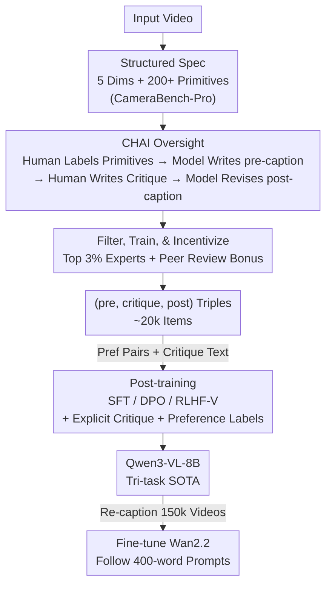

# Building a Precise Video Language with Human-AI Oversight

**Conference**: CVPR 2026 (Highlight)  
**arXiv**: [2604.21718](https://arxiv.org/abs/2604.21718)  
**Code**: https://linzhiqiu.github.io/papers/chai/ (Project page, including data and models)  
**Area**: Video Understanding / Multimodal VLM  
**Keywords**: Video Captioning, Scalable Oversight, Human-AI Collaborative Annotation, Critique Feedback, Post-training

## TL;DR
Addressing the long-standing issues of video captioning—"lack of specifications, lack of oversight, and model hallucinations"—this work defines "what should be described" via a **structured specification (5 dimensions + 200+ visual primitives)**. It introduces **CHAI (Critique-based Human-AI Oversight)**, where the model generates a pre-caption, humans provide only "critiques" to pinpoint errors, and the model revises the text into a post-caption, naturally producing (pre-caption, critique, post-caption) triples. By using these preference and critique signals for SFT/DPO post-training, the open-source Qwen3-VL-8B outperforms Gemini-3.1-Pro across captioning, reward modeling, and critique generation. It further enhances Wan2.2 text-to-video generation in following 400-word long prompts.

## Background & Motivation
**Background**: Video-Language Models (VLMs) learn the "dynamics" of the visual world—what objects exist, where they are, and how they change over time—through language supervision. Existing video-text datasets (MSR-VTT, ActivityNet, ShareGPT4Video, UltraVideo, Dream1K, PerceptionLM, etc.) rely either on human writing or model generation, offering scale but inconsistent quality.

**Limitations of Prior Work**: Through professional audits of 8 mainstream datasets, the authors identified two categories of systemic issues. First, **Limitations of specification**: Annotators often do not know "what to describe or at what granularity," leading to ① imprecise terminology (e.g., calling "translation" a "zoom"), ② missing information (e.g., omitting camera shake or focus changes), and ③ subjective descriptions (e.g., emotional terms like "powerful"). Second, **Limitations of oversight**: ④ poor writing quality (typos, disjointed event sequences), ⑤ visual hallucinations (models confidently inventing non-existent objects), and ⑥ detail errors (difficulty distinguishing "screen left/right" from "subject left/right").

**Key Challenge**: Writing a professional-grade long caption (200–400 words) imposes a high cognitive load—a 5-second clip may involve multiple subjects, actions, and camera movements. Human annotation from scratch is slow and error-prone (Points ④⑥), while model-generated captions are fluent but prone to hallucination (Point ⑤). Neither approach alone is sufficient, and existing datasets **fail to combine their respective strengths**.

**Goal**: To treat "precise video language" as something to be **built rather than simply collected**. This requires: (1) a clear **specification** of what to describe; (2) a scalable **oversight framework** to ensure quality; and (3) a **post-training strategy** to amplify model capabilities using limited expert supervision.

**Key Insight**: Borrow the concept of "scalable oversight" from NLP—when models surpass humans in certain skills (e.g., writing fluency), the model performs what it is good at (generating text), while humans focus on what they are good at (verifying visual facts).

**Core Idea**: Replace "human writing from scratch" or "model generation from scratch" with **"Model Writes + Human Critiques + Model Revises."** This shifts human attention from "text generation" to "fact-checking" and produces preference pairs and natural language critiques for post-training.

## Method

### Overall Architecture
The work follows a pipeline from specification to data, model, and application: **(A) Specification Setting**—Collaborating with 100+ professional creators for a year to formalize a shared visual vocabulary (CameraBench-Pro) covering *subject / scene / motion / spatial / camera* across 200+ primitives. **(B) Data Collection via CHAI**—Under specification guidance, humans label "easy-to-miss but critical" primitives, the model drafts a pre-caption, humans **write only critiques**, and the model produces a post-caption, supported by strict selection and training. **(C) Post-training & Application**—Using (pre, critique, post) triples for SFT/DPO to surpass closed-source models and re-caption 150k professional videos to fine-tune Wan2.2.

### Key Designs

**1. Structured Specification: Making "What to Describe" Teachable**

To address Points ①②③ (terminology, missing info, subjectivity), the authors formalize a shared language with 100+ professional film/game creators. They use a **bottom-up** approach to categorize descriptions into five dimensions: *subject* (type/attributes), *scene* (viewpoint/overlays/time), *motion* (actions/interactions), *spatial* (shot scale/depth/movement), and *camera* (speed/angle/lens/focus). Over 200 primitives are defined, focusing on **objective, observable** visual facts and explicitly excluding subjective emotions.

**2. CHAI (Critique-based Human-AI Oversight): Writing "Critiques" instead of "Captions"**

Targeting Points ④⑤⑥, the process involves: (1) Humans label visual/motion primitives; (2) VLMs draft a high-recall **pre-caption** based on labels; (3) Humans review and write a **correctional critique**; (4) The model generates a refined **post-caption**; (5) Optional human revision until accurate. This shifts the human role from "generation" to "verification," resulting in captions that are ① more accurate, ② more comprehensive, and ③ more fluent.

**3. Selection-Training-Incentive: Ensuring Professional Critiques**

To ensure quality, the authors recruited only creators with film/gaming experience. Applicants underwent **six rounds** of primitive-based testing, with only the **top 3%** accepted. After a **one-month paid training** and shadow learning with golden critiques, they were assigned roles. A **reviewer role** and **accuracy bonuses** were introduced: reviewers verify critiques, and both annotators and reviewers receive bonuses for accuracy and identified errors, respectively.

**4. Post-training with Explicit Preference + Critique Signals**

The CHAI triples support multiple training objectives: **SFT** targets the post-caption; **DPO** uses pre/post pairs for preference learning; **RLHF-V** emphasizes edited segments. Additionally, the model is trained on: (1) **Critique Generation**—learning to generate critiques for (video, caption) pairs; (2) **Preference Labels**—binary classification of captions as {Yes, No}. During inference, the probability of the "Yes" token serves as a reward score (modeled after VQAScore).

### Loss & Training
- **SFT**: Supervised learning of post-captions, critique text, and Yes/No preference labels.
- **DPO**: Preference contrastive objective with KL regularization on pre/post pairs.
- **RLHF-V**: Weighted gradient updates on edited segments between pre and post.
- **Reward Score**: Using "Yes" token probability as a scalar reward for best-of-N inference.
- Backbone: Qwen3-VL-8B-Instruct (highest SFT performance).

## Key Experimental Results

Data scale: CHAI collected **~20k triples** (across 4k videos). **5k were reserved for the benchmark**. This is the first benchmark unifying **Captioning / Reward Modeling / Critique Generation** across five dimensions per video.

### Main Results
Sub-task metrics: BLEU-4 for captioning/critique, Accuracy for reward modeling.

| Method | Captioning (BLEU-4) | Reward Modeling (Acc) | Critique Gen (BLEU-4) |
|------|------|------|------|
| Qwen3-VL-8B-Instruct (Base) | 3.7 | 38.4 | 1.3 |
| GPT-5 (Closed) | 5.7 | 59.5 | 2.8 |
| Gemini-2.5-Pro (Closed) | 6.2 | 62.0 | 3.0 |
| Gemini-3.1-Pro (Closed) | 5.1 | 49.9* | 3.3 |
| SFT (Caption-only) | 12.0 | 50.9 | 5.5 |
| **SFT (Full data)** | **18.2** | **89.8** | **41.7** |
| RLHF-V (Full data) | 15.7 | 81.0 | 25.7 |
| DPO (Full data) | 15.8 | 80.8 | 25.5 |

Key Findings: (1) Models struggle significantly with *motion/camera* dimensions; (2) With **minimal expert supervision**, Full-data SFT allows an 8B model to outperform Gemini-3.1-Pro; (3) Explicit signals dramatically improve reward modeling and critique generation.

### Ablation Study
**Critique quality determines post-training success** (introducing controlled errors via Gemini-2.5):

| Critique Type | Precision | Recall | Constructive | Caption | Reward | Critique |
|----------|-----------|--------|--------------|------|------|------|
| Blind Gemini-2.5 | — | — | — | 10.9 | 44.5 | 21.1 |
| Gemini-2.5 (Video + pre-cap) | — | — | — | 12.7 | 62.0 | 26.2 |
| Imprecise (Wrong points) | ✗ | ✓ | ✓ | 12.1 | 47.1 | 21.9 |
| Incomplete (Missing info) | ✓ | ✗ | ✓ | 12.5 | 56.6 | 28.7 |
| Un-constructive (No fix) | ✓ | ✓ | ✗ | 13.4 | 67.2 | 32.9 |
| Ours (No QA) | — | — | — | 14.8 | 73.1 | 35.7 |
| **Ours (Full QA)** | ✓ | ✓ | ✓ | **18.2** | **89.8** | **41.7** |

### Key Findings
- **Constructive critiques are essential**: Lacking precision, recall, or constructiveness significantly hurts performance; lack of precision (hallucinating errors) causes the most damage.
- **Quality Assurance is vital**: The gain from "No QA" to "Full QA" proves that expert selection and review are non-negotiable for high-quality data.
- **Models cannot yet write critiques well**: Even advanced models like Gemini-2.5 produce suboptimal critiques, emphasizing the necessity of human experts.
- **Downstream Application**: Fine-tuning Wan2.2 with these high-quality captions enables control over nuanced cinematography (dolly zoom, rack focus, etc.) and better prompt following.

## Highlights & Insights
- **Scalable Oversight for Video**: The core insight is task division—models for fluency, humans for verification—reducing cognitive load while increasing data precision.
- **Multi-purpose Data**: CHAI naturally integrates captioning targets, preference signals, and critiques into a single annotation pass.
- **"Quality > Quantity"**: The ablation proves that un-constructive or imprecise critiques significantly degrade post-training, establishing a practical quality standard.
- **Efficient Capability Gain**: Achieving SOTA performance on an 8B open-source model through highly refined expert supervision.

## Limitations & Future Work
- **Domain Focus**: Currently focuses on "understanding"; a specialized "generation" benchmark is still needed.
- **Expert Dependency**: High reliance on professional creators and a lengthy training process limits scalability.
- **Cross-dataset Comparability**: Metrics like BLEU-4 vary significantly across domains; standardizing evaluations remains challenging.

## Related Work & Insights
- **vs. Model-only Datasets**: Those lack verification; CHAI suppresses hallucinations via human oversight.
- **vs. Human-only Datasets**: Those suffer from inconsistent terminology and poor writing; CHAI leverages model fluency while enforcing specifications.
- **vs. Direct Editing (RLHF-V)**: CHAI uses natural language critiques, which are lower-effort for humans and provide higher-order supervision signals.
- **Insight**: As models approach human-level fluency, the human role should shift from "doing the work" to "designing the specification and verifying the output."

## Rating
- Novelty: ⭐⭐⭐⭐⭐ 
- Experimental Thoroughness: ⭐⭐⭐⭐⭐ 
- Writing Quality: ⭐⭐⭐⭐⭐ 
- Value: ⭐⭐⭐⭐⭐ 

<!-- RELATED:START -->

## Related Papers

- [\[CVPR 2026\] Your One-Stop Solution for AI-Generated Video Detection](your_one-stop_solution_for_ai-generated_video_detection.md)
- [\[CVPR 2026\] Learning to Assist: Physics-Grounded Human-Human Control via Multi-Agent Reinforcement Learning](learning_to_assist_physics-grounded_human-human_control_via_multi-agent_reinforc.md)
- [\[CVPR 2026\] CoCoVideo: The High-Quality Commercial-Model-Based Contrastive Benchmark for AI-Generated Video Detection](cocovideo_the_high-quality_commercial-model-based_contrastive_benchmark_for_ai-g.md)
- [\[CVPR 2026\] Dual-level Adaptation for Multi-Object Tracking: Building Test-Time Calibration from Experience and Intuition](tcei_test_time_calibration_experience_intuition_mot.md)
- [\[ICML 2026\] ProAct-VL: A Proactive VideoLLM for Real-Time AI Companions](../../ICML2026/video_understanding/proact-vl_a_proactive_videollm_for_real-time_ai_companions.md)

<!-- RELATED:END -->
