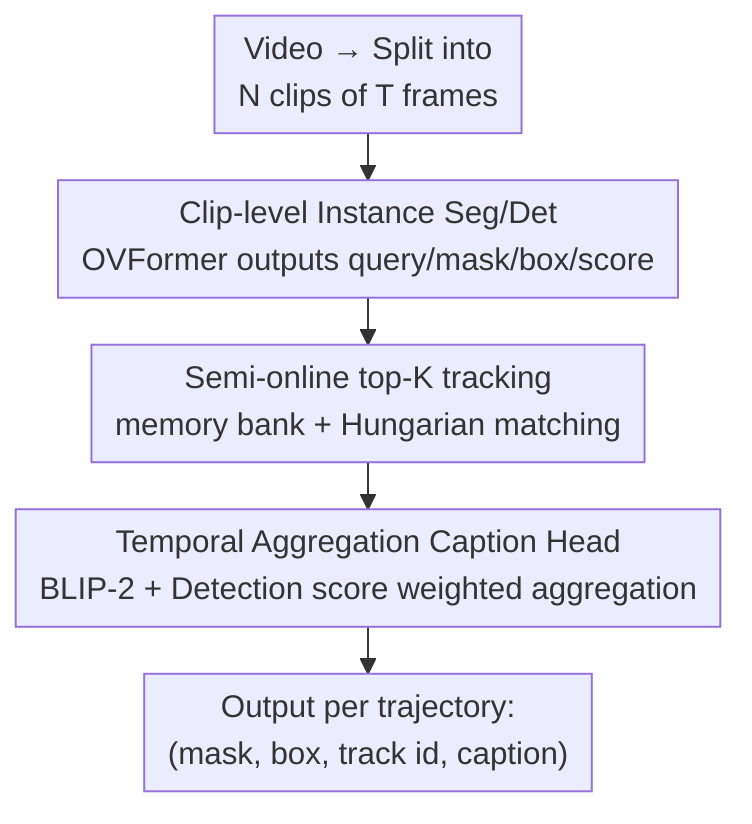

# CaptionFormer: Unified Segmentation, Tracking, and Captioning for Spatio-Temporal Objects

**Conference**: CVPR 2026  
**Paper**: [CVF Open Access](https://openaccess.thecvf.com/content/CVPR2026/html/Fiastre_CaptionFormer_Unified_Segmentation_Tracking_and_Captioning_for_Spatio-Temporal_Objects_CVPR_2026_paper.html)  
**Code**: https://www.gabriel.fiastre.fr/captionformer/  
**Area**: Video Understanding  
**Keywords**: Dense Video Object Captioning, Video Instance Segmentation, Multi-Object Tracking, VLM Synthetic Data, End-to-End  

## TL;DR
To address the lack of object-level annotation data in Dense Video Object Captioning (DVOC), this paper employs a VLM (Gemini 2.0 Flash) to automatically generate object-level captions for videos with drawn bounding boxes. By augmenting LVIS/LV-VIS into the first DVOC training sets (LVISCap / LV-VISCap) containing (mask, box, category, caption) quadruplets, the authors train CaptionFormer—the first end-to-end model to jointly segment, detect, track, and caption every object trajectory—achieving new SOTA results on VidSTG, VLN, and BenSMOT benchmarks.

## Background & Motivation
**Background**: Dense Video Object Captioning (DVOC) requires models to simultaneously detect, track, and describe the trajectories of **all** objects in a video using natural language. It serves as a critical benchmark connecting spatio-temporal localization with vision-language understanding. DVOC is more challenging than referring segmentation or grounded VQA, as the latter only locate one or two entities, whereas DVOC must manage trajectories and descriptions for all objects in the scene.

**Limitations of Prior Work**: Such fine-grained annotation is extremely expensive. Existing training sets (e.g., VidSTG, modified for DVOC evaluation) only label a few objects in a few frames per video. To bypass annotation costs, previous works took two suboptimal paths: DVOC-DS **split the task into sub-tasks** (detection, image captioning, video captioning, tracking) and **trained sequentially in stages** on respective datasets; OW-VISCaptor concatenated multiple **specialized pre-trained models**. Both suffered performance limitations due to the lack of "end-to-end, object-level, dense supervision"—specifically, OW-VISCaptor attempted to extend DVOC to segmentation but was forced to perform segmentation and captioning separately using two independent models due to the absence of paired (mask, caption) annotations.

**Key Challenge**: DVOC requires joint end-to-end optimization, but end-to-end training necessitates dense (trajectory, caption) annotations at the object level, which do not exist and are prohibitively expensive for humans to label.

**Goal**: (1) Create the first DVOC training set with object-level captions; (2) Train the first truly end-to-end DVOC model capable of outputting segmentation masks.

**Key Insight**: The authors bet that VLMs have become powerful enough to synthesize object-level annotations themselves—provided the VLM is given an **explicitly marked** target object (a box drawn on the video) plus a text prompt carrying localization and semantic cues, it can generate accurate object-focused captions.

**Core Idea**: Use VLM "box drawing + multi-channel prompting" to automatically synthesize object-level captions, upgrading existing video instance segmentation datasets (LV-VIS) into DVOC training sets, and then train a unified query-based architecture to learn "mask + box + track + caption" end-to-end.

## Method

### Overall Architecture
The method consists of two major components. **Data side**: Starting from LV-VIS (which has masks and categories), the trajectory boxes for each object $j$ are drawn onto the video to create a visual prompt. This is paired with a text prompt containing coordinates, area, and category, and fed into Gemini 2.0 Flash to generate object-level captions. This results in LV-VISCap (video) and LVISCap (images, used for pre-training) containing (mask, box, category, caption). **Model side**: CaptionFormer partitions the video into $N_{clip}$ clips of length $T$. At the clip level, OVFormer (Mask2Former + classification head) produces object queries, masks, boxes, and scores. At the video level, top-K query matching performs semi-online tracking to link clip queries into trajectories. Finally, a BLIP-2 captioning head with temporal aggregation generates a **single** video-level caption for each trajectory.

The following diagram illustrates the **model-side** (CaptionFormer inference) pipeline:

The "VLM Synthetic Captioning" on the data side is an offline, one-time step, described separately in Key Design 1.

### Key Designs

**1. VLM "Box Drawing + Multi-channel Prompting" for Object-level Captions: Repurposing Segmentation Datasets for DVOC**

The bottleneck of DVOC is the lack of object-level (trajectory, caption) labels. Ours breaks this by leveraging existing LV-VIS masks and categories; since only the "caption" is missing, the VLM fills it. For each object $j$ in video $x \in \mathbb{R}^{N \times H \times W \times 3}$, a box $B_j$ is extracted from its mask and drawn onto a copy of the video to create a visual prompt:

$$\hat{x}^i_j = x^i \uparrow B_j, \quad i=1,\dots,N$$

where $\uparrow$ denotes "drawing a box on the frame." In practice, sampling 4 uniform frames is sufficiently representative. Drawing boxes alone is insufficient; the authors found that **multi-channel** cues are critical. In addition to the visual prompt, they include a static system prompt $p_s$ (general instructions, rules like "do not mention the box," formats, and examples) and a **dynamically constructed user prompt** $p_u(j)$ for each object, which includes the object's **textualized box coordinates, area, category name, and category names of other objects in the frame**. Feeding information through both visual and textual channels helps the model lock onto the target and perform reasoning (e.g., "elephant category but small area" $\rightarrow$ likely a small object in the background). Ablations (Table 1) show these text cues are a massive source of gain: starting from 29.5 points with "single frame + detailed instructions," the score jumps to 80.7 after adding **category labels**, and to 85.1 with box coordinates, area, and few-shot fine-tuning. Interestingly, using mask boundaries as visual prompts performed worse (77.1 vs 84.3), which authors hypothesize is due to misalignment between the mask and the textual box localization cues. Ultimately, 19.5k captions were generated for LV-VIS, covering 3.9k videos and 1020 classes with an average of 13.9 words; LVIS was processed similarly as $N=1$ videos to create LVISCap.

**2. Clip-level Instance Segmentation & Detection: OVFormer with Detection Head + Class-agnostic Confidence**

To ingest DVOC data with masks end-to-end, the clip-level backbone reuses the SOTA OV-VIS model—OVFormer (Mask2Former with an added classification head). Each clip $x^i_{clip} \in \mathbb{R}^{T \times 3 \times H \times W}$ processed by OVFormer yields clip-level object queries $q^i_{obj} \in \mathbb{R}^{N_{obj} \times D}$, masks $M^i$, classification scores $S^i_{cls}$, and objectness scores $S^i_{obj}$. On top of this, two modifications were made. First, a **detection head** (4-layer MLP) was added to the query to output boxes: $B^i = \text{BoxHead}(q^i_{obj})$, enabling the model to support both box and mask DVOC evaluations. Second, since OVFormer originally calculated class-aware confidence for the whole video, it was inaccurate for objects appearing in few frames. To avoid redundant queries describing the same trajectory, a **class-agnostic, per-clip** confidence score was added, taking the maximum across all categories for each query/clip:

$$S^i_{cls\uparrow} = \max_{c} S^i_{cls}(c)$$

Then, $S^i = \sqrt{S^i_{cls\uparrow} \cdot S^i_{obj}}$ is used as the filtering score for each clip. During inference, low-score predictions are pruned at each timestep using a threshold $t_{thresh}$, ensuring that the subsequent tracking receives clean, non-redundant clip-level candidates.

**3. Semi-online Top-K Query Tracking: Handling Occlusions and Object Re-appearance**

To link clip-level predictions into video-level trajectories, the query from clip $i$ must be matched with clip $i+1$. Ours uses the top-K enhanced query matching module: a memory bank is maintained for each trajectory, storing queries from the last $T_{match}$ clips. The $K_{match}$ **most similar** clips are selected, and Hungarian bipartite matching is used for optimal assignment. Compared to OVFormer’s original adjacent-frame tracking, using multiple historical clips **suppresses error propagation** and, crucially, tracks objects that **disappear and reappear**. This "semi-online" approach—where objects are represented at the clip level and associated online—degenerates to fully online when $T=1$. Longer clips allow for a flexible trade-off between utilizing multi-frame info and long-video memory constraints.

**4. BLIP-2 Caption Head + Temporal Aggregation: Merging Trajectories into a Video-level Description**

After tracking, a caption is generated for each trajectory. Ours follows the BLIP-2 based captioning head: the BLIP-2 decoder processes object queries using masked attention conditioned on predicted masks, then projects them into the LLM (OPT-2.7B) space. Unlike previous "per-clip captioning," this work produces **one** video-level caption per trajectory for **consistency and efficiency**. This is achieved by adding **temporal aggregation** to BLIP-2: $T_{agg}$ clips are sampled uniformly to form a set $I_{agg}$. Their queries are processed by the BLIP-2 query transformer and summed using **detection score weighting** to form a single video query:

$$q^*_{obj}(j) = \sum_{i \in I_{agg}} S^i(j) \cdot \mathcal{QT}_{\text{BLIP2}}\!\left(q^i_{obj}(j),\, M^i_j\right)$$

The LLM decoder then generates the caption from this aggregated query: $Cap(j) = \mathcal{LLM}_{\text{BLIP2}}(q^*_{obj}(j))$. Weighting by detection scores (rather than simple averaging) is key—high-confidence clips contribute more, stabilizing the fusion of trajectory information across multiple clips to describe "temporally extended actions." Ablations (Table 7) show CapA monotonically increases from 51.0 to 55.4 as the number of aggregated clips increases from 1 to 32.

### Loss & Training
The clip-level training objective is the sum of segmentation, detection, classification/objectness, and captioning losses:

$$\mathcal{L}_{\text{clip-level}} = \mathcal{L}_{seg} + \mathcal{L}_{det} + \mathcal{L}_{s} + \mathcal{L}_{cap}$$

Where $\mathcal{L}_{seg} = \lambda_{dice}\mathcal{L}_{dice} + \lambda_{ce}\mathcal{L}_{ce}$ (VIS mask loss), $\mathcal{L}_s = \lambda_{cls}\mathcal{L}_{cls} + \lambda_{obj}\mathcal{L}_{obj}$ (classification + objectness), $\mathcal{L}_{det} = \lambda_{l1}\mathcal{L}_{l1} + \lambda_{giou}\mathcal{L}_{giou}$ (box regression), and $\mathcal{L}_{cap} = \lambda_{\text{clip-lm}}\mathcal{L}_{lm}$ (language modeling cross-entropy). When temporal aggregation is enabled, captioning is trained at the video level: $\mathcal{L}_{\text{video-level}} = \lambda_{\text{vid-lm}}\mathcal{L}_{lm}$. While the model **can be trained fully end-to-end**, in practice a **two-stage** approach is used to save memory: segmentation/detection/classification are trained first, then frozen while the caption head is tuned. Weights are set to $\lambda_{dice,ce,l1}=5$, $\lambda_{giou,cls,obj}=2$, and $\lambda_{lm}=1$.

The evaluation metric CHOTA decomposes DVOC into detection accuracy (DetA), association accuracy (AssA), and captioning accuracy (CapA): $\text{CHOTA} = \sqrt[3]{\text{DetA} \cdot \text{AssA} \cdot \text{CapA}}$. For segmentation, box-IoU is replaced with mask-IoU.

## Key Experimental Results

### Main Results
Comparison on the VidSTG DVOC validation set (Table 3). CaptionFormer outperforms previous works given the same pre-training data and achieves another significant boost when using the custom LVISCap/LV-VISCap datasets, while being nearly 10x faster to train (208 vs 2032 GPU hours):

| Method | Pre-train Set | CapA | DetA | AssA | CHOTA |
|------|----------|------|------|------|-------|
| Gemini-2.5-flash | - | 6.4 | 0.9 | 47.2 | 6.6 |
| OVFormer | LVIS+LV-VIS | 12.8 | 64.3 | 50.1 | 34.6 |
| OW-VISCaptor | COCO | 43.9 | 60.1 | 54.0 | 53.0 |
| **CaptionFormer** | COCO | 44.3 | 65.1 | 70.2 | 58.7 |
| DVOC-DS | COCO+VG+SMIT+AugCOCO | 39.7 | 65.8 | 70.4 | 56.9 |
| **CaptionFormer** | Same as above | 50.1 | 65.0 | 69.2 | 60.9 |
| **CaptionFormer** | COCO+LVISCap+LV-VISCap | 51.0 | 66.8 | 71.0 | 62.3 |
| **+ temp agg** | COCO+LVISCap+LV-VISCap | **55.4** | 66.8 | 71.0 | **64.0** |

On VLN, CapA increased by 5.2; on BenSMOT, CIDEr increased by 14.7 (39.9 vs DVOC-DS 25.4), and only this work can output segmentation masks. Two failed baselines are telling: prompting Gemini-2.5-flash directly resulted in incorrect formatting for 13.6% of videos and near-static boxes, leading to DetA/CapA close to 0; OVFormer localized well but used category names as captions, missing actions and context—confirming the gap between "understanding" and "localization" that unified DVOC aims to bridge.

### Ablation Study

| Experiment | Configuration | Key Metric | Description |
|------|------|---------|------|
| Synthetic Data (Table 2) | LV-VISCap Only | CHOTA 45.8 | Single dataset is viable |
| | LVISCap Only | CHOTA 54.7 | Image pre-training is also strong |
| | LVISCap + LV-VISCap | **CHOTA 59.5 / CapA 43.6** | Combination is best |
| Temp. Aggregation (Table 7) | 1 clip (best score) | CapA 51.0 | No aggregation |
| | 4 clip arithmetic mean | CapA 49.1 | Simple mean is worse |
| | 32 clip det-score weight | **CapA 55.4** | Weighted aggregation is optimal |
| Caption Loss (Table 8) | Disable caption loss | mAP 31.7 | — |
| | Enable caption loss | **mAP 34.2** | Caption supervision aids segmentation (+2.5 mAP) |

### Key Findings
- **Synthetic data is the core gain**: Removing either LVISCap or LV-VISCap leads to a performance drop; their combination is optimal. CapA grows **logarithmically** with the volume of training captions (Fig. 4), suggesting further gains with more data.
- **Weighted Aggregation > Arithmetic Mean**: Arithmetic mean of 4 clips (49.1) is worse than the best single clip (51.0), but weighted by detection score, 4 clips rise to 51.6 and 32 clips to 55.4—proving that "letting high-confidence clips speak more" is the key to effective aggregation.
- **Captioning aids segmentation**: Enabling caption loss improves VIS mAP from 31.7 to 34.2, indicating that descriptive supervision injects richer signals into object queries, benefiting large-vocabulary segmentation.
- **Synthetic evaluation bias is minimal**: On a human-annotated subset of 100 videos/476 trajectories (Table 6), the CapA/CHOTA gains from LVISCap training were consistent across "synthetic evaluation" and "human evaluation," indicating negligible bias in synthetic evaluation.

## Highlights & Insights
- **"Box drawing + Multi-channel prompting" is a simple but effective trick**: Drawing the target object directly on the frame (visual channel) and inserting coordinates/area/category into the text (textual channel) locks the VLM onto the target—adding category labels alone increased the score from 29.5 to 80.7. This is the "lifeblood" of the data pipeline and is transferable to any task requiring VLM focus on specific regions.
- **Insight on "Captioning" aiding "Segmentation"**: Usually, captions are seen as downstream outputs, but this work proves that caption loss serves as a "free" regularizer for visual queries, improving VIS mAP.
- **Unified training delivers 10x speedup**: Compared to DVOC-DS's 4-stage sequential training (2032 GPU hours), end-to-end unified training takes only 208 hours and is more accurate—sub-task decomposition "to avoid annotation" becomes a burden once synthetic data is available.
- **Adjustable $T$ in semi-online tracking**: Clip length $T=1$ degenerates to fully online, while larger $T$ captures more multi-frame information, offering a "precision vs memory" knob for long videos.

## Limitations & Future Work
- **Reliance on a single closed-source VLM**: Caption quality is tied to Gemini 2.0 Flash; its biases/hallucinations are inherited by the training set. Authors only verified bias on a small subset manually.
- **Simple benchmark actions**: The authors note that "single clip best-score" achieves good results, implying that current datasets like VidSTG have limited action complexity, meaning temporal aggregation's full potential is not yet exploited.
- **Two-stage training as a compromise**: Despite being end-to-end capable, limited VRAM meant most experiments involved freezing backbones and stage-wise training; the upper bound of joint optimization remains unproven.
- **Future directions**: Switch to open-source/multi-VLM voting to reduce bias; create complex DVOC benchmarks with longer videos/actions; explore true end-to-end joint training of segmentation and captioning.

## Related Work & Insights
- **vs DVOC-DS**: DVOC-DS splits DVOC into four sub-tasks and **trains sequentially** to avoid labeling. Ours **creates** dense object-level labels and trains a unified model, which is more accurate (VidSTG CHOTA 64.0 vs 56.9), 10x faster, and outputs masks (DVOC-DS only outputs boxes).
- **vs OW-VISCaptor**: OW-VISCaptor attempts to extend DVOC to segmentation but must **separate** segmentation and captioning into two models due to a lack of (mask, caption) pairs. LV-VISCap provides (mask, box, category, caption) quadruplets, allowing a single model to produce joint results.
- **vs OVFormer (OV-VIS)**: The clip-level backbone is built on OVFormer, but OVFormer uses CLIP feature matching for **classification** and uses category names as "descriptions," losing action and context. Ours adds detection heads, class-agnostic confidence, semi-online tracking, and BLIP-2 heads to upgrade "classification" to "natural language description."
- **vs GROVE / GLaMM etc.**: These typically generate grounded descriptions at the scene level and do not produce object-level video descriptions. Ours is the first to generate object-level, temporally consistent trajectory captions for DVOC without requiring text prompts (unlike referring segmentation).

## Rating
- Novelty: ⭐⭐⭐⭐ First synthetic object-level caption dataset for DVOC + first end-to-end "segmentation+tracking+captioning" model. Clear logic, though components are mature.
- Experimental Thoroughness: ⭐⭐⭐⭐ Three benchmarks + multi-angle ablations on data/aggregation/loss/bias. Human verification of synthetic bias included.
- Writing Quality: ⭐⭐⭐⭐ Logical progression through task definition, data pipeline, architecture, and loss. Figures 2 and 3 clearly illustrate the pipelines.
- Value: ⭐⭐⭐⭐ Findings on synthetic supervision and captioning aiding segmentation are transferable. 10x speedup is practical. Limited by current benchmark action simplicity.

<!-- RELATED:START -->

## Related Papers

- [\[CVPR 2026\] TGTrack: Temporal Generative Learning for Unified Single Object Tracking](tgtrack_temporal_generative_learning_for_unified_single_object_tracking.md)
- [\[CVPR 2026\] Spatio-Temporal Conditional Denoising Transformer for Modality-Missing RGBT Tracking](spatio-temporal_conditional_denoising_transformer_for_modality-missing_rgbt_trac.md)
- [\[CVPR 2026\] UETrack: A Unified and Efficient Framework for Single Object Tracking](uetrack_a_unified_and_efficient_framework_for_single_object_tracking.md)
- [\[CVPR 2026\] Cluster-Wise Spatio-Temporal Masking for Efficient Video-Language Pretraining](cluster-wise_spatio-temporal_masking_for_efficient_video-language_pretraining.md)
- [\[CVPR 2026\] Asynchronous Temporal Modeling with Two-Agent Framework for Streaming Dense Video Captioning](asynchronous_temporal_modeling_with_two-agent_framework_for_streaming_dense_vide.md)

<!-- RELATED:END -->
