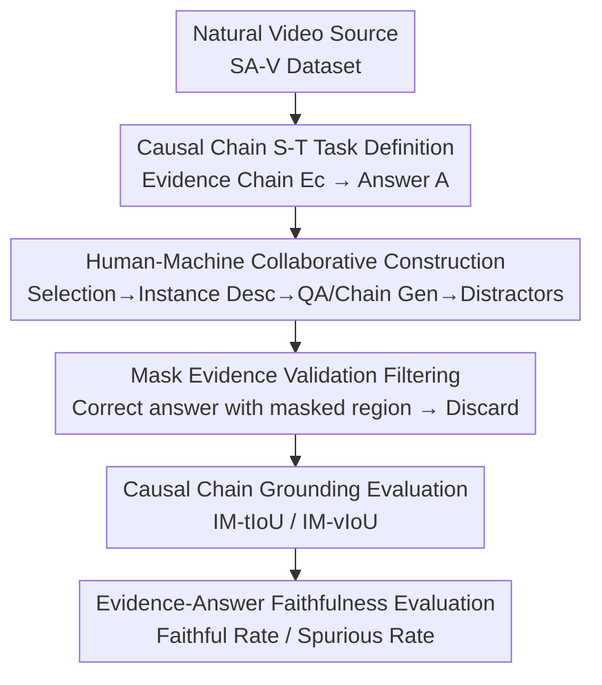

# CaST-Bench: Benchmarking Causal Chain-Grounded Spatio-Temporal Reasoning for Video Question Answering

**Conference**: CVPR 2026  
**arXiv**: [2605.23216](https://arxiv.org/abs/2605.23216)  
**Code**: None  
**Area**: Video Understanding / Multimodal VLM / Video QA / Causal Reasoning / Benchmark  
**Keywords**: Causal Chain, Spatio-Temporal Grounding, Video Question Answering, VLM Evaluation, Faithfulness

## TL;DR
CaST-Bench introduces a new task—"Causal Chain-Grounded Spatio-Temporal Video Question Answering"—where models must not only provide correct answers but also ground them in a causal evidence chain consisting of time segments and bounding boxes. Through a human-machine collaborative pipeline, a high-quality dataset of 1,015 videos and 2,066 questions was constructed. Evaluation metrics were designed to assess both answer accuracy and evidence grounding. Testing on 15 mainstream VLMs showed performance significantly lower than humans (best 50.34% vs. human 91.89%).

## Background & Motivation

**Background**: VLMs have progressed rapidly in video understanding, but most video QA benchmarks (MVBench, Video-MME, etc.) focus on "descriptive" questions (e.g., "What color is the woman's bag?"). Models only need to locate and describe objects/actions, which is essentially surface-level perception.

**Limitations of Prior Work**: Genuine causal reasoning requires answering "Why" (e.g., "Why did the woman stop?"), necessitating an active search for a causal chain in the video. The model must find both causal evidence ("child bending down") and effect evidence ("woman waiting"), where key evidence often does not appear in the question text. Existing benchmarks have three flaws: ① Most do not require visual grounding for the reasoning process; ② Some (like NExT-GQA) only perform temporal localization, failing to resolve spatial ambiguity in cluttered scenes; ③ Others only provide grounding for "objects mentioned in the question," ignoring hidden causal evidence.

**Key Challenge**: The correctness of causal reasoning depends heavily on locating "true causal spatio-temporal evidence." However, current benchmarks lack such fine-grained chain-style evidence annotations and evaluation metrics to distinguish if an answer is based on "true evidence" or "spurious correlations (confounders)," making it impossible to rigorously measure causal capabilities.

**Goal**: Build a video causal reasoning benchmark that jointly evaluates "answer accuracy" and "evidence chain precision," covering both fine-grained temporal segments and spatial bounding boxes.

**Key Insight**: Video causal QA is formalized as a causal graph—given video $V$ and question $Q$, the model must discover and ground causal evidence $V_c$ and effect evidence $V_e$ into a causal chain to derive answer $A$, while resisting confounders $C$ that introduce spurious correlations.

**Core Idea**: Treat "Causal Chain = Multiple pieces of evidence with timestamps and bbox trajectories" as the central object for annotation and evaluation, making grounding accuracy a quantifiable, diagnostic first-class citizen.

## Method

### Overall Architecture
CaST-Bench consists of a task definition, a data construction pipeline, and an evaluation suite. The task inputs are video $V$ and question $Q$; the model must first output a variable-length evidence chain $E_C=[E_1,\dots,E_K]$ before providing answer $A$. Each piece of evidence $E_i$ contains intervals $[t_{start,i}, t_{end,i}]$, a textual rationale $R_i$, and a set of bounding boxes $B_i=\{s_j:b_j\}$ indexed by 1-FPS timestamps. Data is generated via a multi-stage human-machine collaborative pipeline: selecting complex video material, generating fine-grained spatio-temporal descriptions for tracked instances, generating QA with causal chains using "causal-thinking VLMs," synthesizing distractors, and applying three-step filtering (including a novel mask validation) to ensure difficulty.

### Key Designs

**1. Causal Chain S-T Task Definition: Binding "Correct Answer" with "Correct Evidence"**

To address the issue where existing benchmarks ignore whether reasoning falls on true evidence, CaST-Bench redefines the task output. Models must produce a structured causal chain where each piece of evidence includes explicit time segments $[t_{start,i}, t_{end,i}]$, textual rationales $R_i$, and per-frame bbox mappings $B_i=\{s_j:b_j\}_{j=1}^{P_i}$ ($s_j$ is the 1-FPS timestamp, $b_j=[x_{min},y_{min},x_{max},y_{max}]$). This forces the model to act based on real causal cues rather than linguistic/visual shortcuts.

**2. Human-Machine Collaborative Pipeline: VLMs as Labor, Humans as Quality Control**

To handle the cost and reliability issues of annotating causal chains, a multi-stage pipeline was designed. Videos were sourced from the SA-V dataset (natural videos with expert instance tracking) rather than films to ensure spatial complexity. Detailed instance descriptions were generated using VLMs via prompts combining "full static frames + cropped video segments" of targets, then reviewed by humans. A "causal-thinking VLM" (Gemini-2.5-Pro) used these descriptions and videos to generate QA across four categories: Causal Explanation (CE), Counterfactual Reasoning (CR), Predictive Anticipation (PA), and Inference Description (ID).

**3. Distractor + Mask Evidence Validation Filtering: Ensuring Answer Requires Video Perception**

To prevent models from relying on language priors or dataset biases: distractors were categorized into textual types (LLM-generated plausible but wrong options) and video types (causally irrelevant video instances). Filtering involved three steps: ① Linguistic filtering—removing questions solvable without video. ② Novel video mask filtering—masking the causal evidence region; if the VLM still answers correctly, the question is discarded as biased. ③ Human final review. Only 40% of initial QA passed, ensuring high difficulty.

**4. Decoupled Evaluation Suite: Quantifying Grounding Quality and Faithfulness**

A greedy matching algorithm pairs predicted instances with GT instances based on spatio-temporal overlap. Two metrics are used: IM-tIoU (Instance-Matched Temporal IoU):

$$\text{IM-tIoU}=\frac{1}{|G|}\sum_{(p,g)\in M}\frac{|\text{span}(p)\cap\text{span}(g)|}{|\text{span}(p)\cup\text{span}(g)|}$$

And IM-vIoU (multiplying temporal IoU by average per-frame spatial IoU). Crucially, faithfulness metrics were introduced: Faithful Rate $\mathcal{F}=\mathbb{E}[\mathbb{I}(\text{Acc}=1)\cdot\mathbb{I}(\text{IM-vIoU}\geq\tau_{st})]$ and Spurious Rate $\mathcal{S}=\mathbb{E}[\mathbb{I}(\text{Acc}=1)\cdot\mathbb{I}(\forall p,\text{vIoU}_p<\tau_{st})]$ (where $\tau_{st}=0.1$).

## Key Experimental Results

### Main Results
Evaluation of 4 closed-source and multiple open-source VLM variants (15 total).

| Model | MCQ Acc | IM-tIoU (Temporal) | IM-vIoU (S-T) | Faithful Rate ℱ | Spurious Rate 𝒮 |
|------|------|------|------|------|------|
| Random | 16.67 | – | – | – | – |
| Gemini-2.5-Pro (Text-only) | 23.14 | – | – | – | – |
| **Human** | **91.89** | – | – | – | – |
| Gemini-2.5-Pro | 50.34 | 21.53 | 2.46 | 7.60 | 42.26 |
| Gemini-2.5-Flash | 45.60 | 27.63 | 3.52 | 9.97 | 33.35 |
| GPT-5 | 46.32 | 26.61 | 4.31 | 12.68 | 32.91 |
| Qwen3-VL-4B-Instruct | 45.30 | 11.21 | 0.93 | 2.76 | 42.30 |
| InternVL-3.5-30B-A3B | 44.53 | 8.33 | 0.25 | 0.48 | 44.00 |
| Qwen2.5-VL-7B-Instruct | 41.09 | 3.72 | 0.09 | 0.29 | 40.80 |

The best closed-source model (Gemini-2.5-Pro) reached only 50.34%, far below the human 91.89%. S-T grounding (IM-vIoU) for all models was extremely low (2–4% for closed, <1% for open), while Spurious Rates were high (30–44%), indicating "correct" answers were often based on wrong evidence.

### Ablation Study
| Config | Gemini-2.5-Pro | GPT-5 | GLM-4.1V-9B | Qwen2.5-VL-7B |
|------|------|------|------|------|
| w/o Causal Chain (Direct) | 45.98 | 43.90 | 38.09 | 40.90 |
| w/ Self-Gen Causal Chain | 50.34 | 46.32 | 39.55 | 41.09 |
| Given GT Causal Chain | 75.61 | 71.88 | 65.25 | 59.68 |

### Key Findings
- **Causal chain is the core bottleneck**: Accuracy jumps by ~20–25 points when the GT causal chain is provided (Gemini 50.34→75.61), even after removing answer-leaking sentences from the GT.
- **Correct Answer $\neq$ Correct Perception**: High Spurious Rates and near-zero IM-vIoU suggest models rely on spurious correlations.
- **Thinking variants are not always better**: Qwen3-VL-8B-Instruct outperformed its Thinking version; excessive "thinking" might interfere with visual-language alignment.
- **Scale does not guarantee grounding**: Larger variants like InternVL-3.5-30B improved MCQ Acc but failed to significantly improve grounding or faithfulness.

## Highlights & Insights
- **Quantifying Faithfulness**: The $\mathcal{F}$/$\mathcal{S}$ metrics provide diagnostic value by identifying whether an answer was derived through reasoning or guessing.
- **Masking for De-biasing**: The mask-based filtering method effectively removes questions solvable through bias, ensuring the benchmark truly requires causal chain grounding.
- **Pinpointing the Bottleneck**: Comparison between self-generated and GT-provided chains clearly shows the gap lies more in "finding the evidence" than "performing the reasoning."

## Limitations & Future Work
- **Lack of Baseline Methods**: The paper identifies the bottleneck but does not propose a specific architectural solution to improve grounding.
- **Scale and Diversity**: The dataset size (2,066 questions) is relatively small due to strict filtering. It primarily covers short videos (avg. 13.68s), missing long-range causal chains.
- **VLM-Judge Bias**: Dependence on Gemini-2.5-Pro for generation and evaluation may introduce inherent biases favoring similar model architectures.

## Related Work & Insights
- **vs. MVBench/Video-MME**: These lack visual grounding and focus on descriptive tasks.
- **vs. NExT-GQA/V-STaR**: These only ground objects explicitly mentioned in the question, whereas CaST-Bench requires discovering hidden causal evidence.
- **vs. Causal-VidQA**: CaST-Bench fills the gap by providing fine-grained spatio-temporal annotations and specific grounding-accuracy metrics.

## Rating
- Novelty: ⭐⭐⭐⭐⭐ 
- Experimental Thoroughness: ⭐⭐⭐⭐ 
- Writing Quality: ⭐⭐⭐⭐ 
- Value: ⭐⭐⭐⭐⭐ 

<!-- RELATED:START -->

- **NExT-GQA**: Temporal grounding for causal/temporal video QA.
- **Video-Holmes**: Analyzing video reasoning via visual grounding.
- **SA-V**: The source dataset used for fine-grained instance tracking.

<!-- RELATED:END -->

## Related Papers

- [\[CVPR 2026\] Streaming Video Crime Anticipation with Spatio-Temporal Causal Reasoning](streaming_video_crime_anticipation_with_spatio-temporal_causal_reasoning.md)
- [\[CVPR 2026\] MovieRecapsQA: A Multimodal Open-Ended Video Question-Answering Benchmark](movierecapsqa_a_multimodal_open-ended_video_question-answering_benchmark.md)
- [\[ECCV 2024\] TimeCraft: Navigate Weakly-Supervised Temporal Grounded Video Question Answering via Bi-directional Reasoning](../../ECCV2024/video_understanding/timecraft_navigate_weakly-supervised_temporal_grounded_video_question_answering_.md)
- [\[CVPR 2026\] HERBench: A Benchmark for Multi-Evidence Integration in Video Question Answering](herbench_a_benchmark_for_multi-evidence_integration_in_video_question_answering.md)
- [\[CVPR 2026\] Ego-Grounding for Personalized Question-Answering in Egocentric Videos](ego-grounding_for_personalized_question-answering_in_egocentric_videos.md)

<!-- RELATED:END -->
