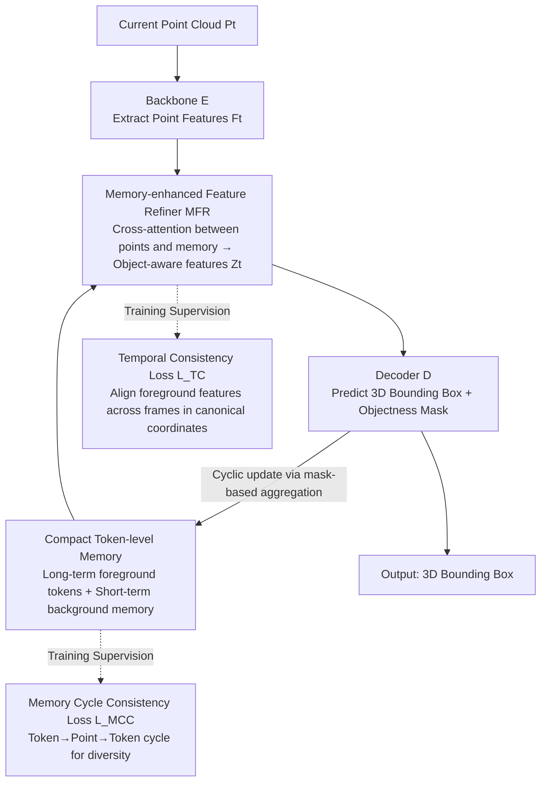

# Temporally Consistent Long-Term Memory for 3D Single Object Tracking

**Conference**: CVPR 2026 Findings  
**arXiv**: [2604.13789](https://arxiv.org/abs/2604.13789)  
**Code**: [github.com/ujaejoon/ChronoTrack](https://github.com/ujaejoon/ChronoTrack)  
**Area**: Video Understanding  
**Keywords**: 3D single object tracking, long-term memory, temporal consistency, point cloud, memory tokens

## TL;DR

Ours proposes ChronoTrack, a robust long-term 3D single object tracking framework constructed via compact learnable memory tokens and two complementary objectives (temporal consistency loss + memory cycle consistency loss), achieving SOTA performance on multiple benchmarks while running in real-time at 42 FPS.

## Background & Motivation

Memory-based methods in 3D single object tracking (3D-SOT) utilize point-level feature representations from historical frames but are largely limited to short-term contexts of 2-3 frames. Extending the memory length faces two fundamental challenges: (1) temporal consistency of object features decreases sharply as the time gap increases, leading to ineffective utilization of distant frames or even performance degradation; (2) storage and computational costs of point-level memory grow linearly with memory length. The authors reveal that temporal feature inconsistency is the core bottleneck limiting the effectiveness of long-term memory.

## Method

### Overall Architecture

Given the current point cloud, the backbone extracts point features, which are fed into a Memory-enhanced Feature Refiner (MFR). This module interacts with long-term foreground memory and short-term background memory to generate object-aware features. Decoders then predict the 3D bounding box and objectness mask, which are used to update the memory in a frame-by-frame rolling cycle (foreground tokens aggregate current object points via the mask, and background memory is replaced by recent background points). During training, two complementary losses ensure memory "reliability" and "diversity"—the two aspects most prone to failure when extending memory to the long term.

### Key Designs

**1. Compact Token-level Memory: Replacing linearly expanding point-level memory with fixed-size tokens**

The first obstacle for long-term memory is the overhead increasing linearly with the number of frames. ChronoTrack avoids caching historical features point-by-point, instead defining $K$ learnable memory tokens that are updated cyclically through cross-attention at each timestep—integrating current predicted foreground features into the accumulated historical context. Since the number of tokens is fixed, the storage and computation of long-term memory do not expand over time. Short-term background memory only retains the background point features of the most recent frame to handle immediate distractors. This design makes long-term modeling efficiency one to two orders of magnitude higher than point-level memory.

**2. Temporal Consistency Loss $\mathcal{L}_{TC}$: Aligning distant frame features in a unified coordinate system**

The second obstacle is that temporal consistency of object features drops sharply as frame distance increases. $\mathcal{L}_{TC}$ uses the center and orientation of ground truth (GT) bounding boxes to transform foreground points from different frames into a canonical coordinate system. It then establishes cross-frame point correspondences via nearest neighbors, enforcing high cosine similarity between corresponding point features. Because alignment occurs in canonical coordinates rather than relying on optical flow, it directly offsets feature drift caused by appearance changes, making distant frames usable—the fundamental reason long-term memory can provide continuous benefits.

**3. Memory Cycle Consistency Loss $\mathcal{L}_{MCC}$: Encouraging semantic specialization to avoid redundancy**

Capacity would be wasted if a fixed number of tokens encoded the same information. $\mathcal{L}_{MCC}$ forces each memory token through a two-step cycle (Memory $\rightarrow$ Point $\rightarrow$ Memory). The optimization objective is to maximize the probability of a token returning to itself and the probability of passing through foreground points. This encourages different tokens to cover different semantic parts of the object, resulting in more diverse memory. Coupled with $\mathcal{L}_{TC}$, it ensures that compact memory is both stable and comprehensive.

### Loss & Training

The total loss includes tracking loss (bounding box regression + objectness classification), temporal consistency loss $\mathcal{L}_{TC}$, and memory cycle consistency loss $\mathcal{L}_{MCC}$. Temporal consistency correspondences are established in canonical coordinates and do not depend on optical flow.

## Key Experimental Results

### Main Results

Ours achieves new SOTA results on 3D-SOT benchmarks including KITTI, NuScenes, and Waymo:

| Benchmark | Metric | MBPTrack | ChronoTrack | Gain |
|-----------|-----------|----------|-------------|------|
| Multiple  | Success   | Prev. SOTA | **New SOTA** | Significant |
| Multiple  | Precision | Prev. SOTA | **New SOTA** | Significant |

Ours runs in real-time at 42 FPS on a single RTX 4090 GPU.

### Ablation Study

- Temporal consistency loss maintains high feature similarity for distant frames, whereas MBPTrack decays rapidly.
- ChronoTrack benefits continuously as memory length increases, while MBPTrack performance decreases.
- Visualization clearly demonstrates the improvement in token diversity provided by memory cycle consistency.

### Key Findings

- Temporal feature consistency is highly correlated with tracking performance.
- Compact token-level memory is one to two orders of magnitude more efficient than point-level memory for long-term modeling.
- The two loss functions act synergistically: consistency ensures feature quality, while cycle consistency ensures feature diversity.

## Highlights & Insights

- Clearly reveals the overlooked core issue of temporal feature inconsistency.
- The establishment of point correspondences in canonical coordinates cleverly avoids dependency on optical flow.
- A cyclic-walking mechanism is successfully adapted from graph networks/NLP for memory design in 3D tracking.

## Limitations & Future Work

- Relies on GT bounding boxes to construct canonical coordinates for temporal consistency supervision.
- Lacks an adaptive mechanism for choosing the number of memory tokens $K$.
- Performance under extreme occlusion and long-term disappearance-reappearance scenarios has not been analyzed in depth.

## Related Work & Insights

- The idea of replacing point-level memory with token-level memory is generalizable to fields like video understanding.
- The design of the temporal consistency loss serves as a reference for other sequence modeling tasks.
- Cycle consistency is a universal regularization strategy for promoting representation diversity.

## Rating

8/10 — Deep insights into the problem, elegant method design, and thorough experiments. This is a high-quality work in the 3D tracking field.

<!-- RELATED:START -->

## Related Papers

- [\[CVPR 2026\] Question-guided Visual Compression with Memory Feedback for Long-Term Video Understanding](question-guided_visual_compression_with_memory_feedback_for_long-term_video_unde.md)
- [\[CVPR 2025\] Temporally Consistent Object-Centric Learning by Contrasting Slots](../../CVPR2025/video_understanding/temporally_consistent_object-centric_learning_by_contrasting_slots.md)
- [\[CVPR 2026\] TGTrack: Temporal Generative Learning for Unified Single Object Tracking](tgtrack_temporal_generative_learning_for_unified_single_object_tracking.md)
- [\[ECCV 2024\] Boosting 3D Single Object Tracking with 2D Matching Distillation and 3D Pre-training](../../ECCV2024/video_understanding/boosting_3d_single_object_tracking_with_2d_matching_distillation_and_3d_pre-trai.md)
- [\[CVPR 2026\] UETrack: A Unified and Efficient Framework for Single Object Tracking](uetrack_a_unified_and_efficient_framework_for_single_object_tracking.md)

<!-- RELATED:END -->
