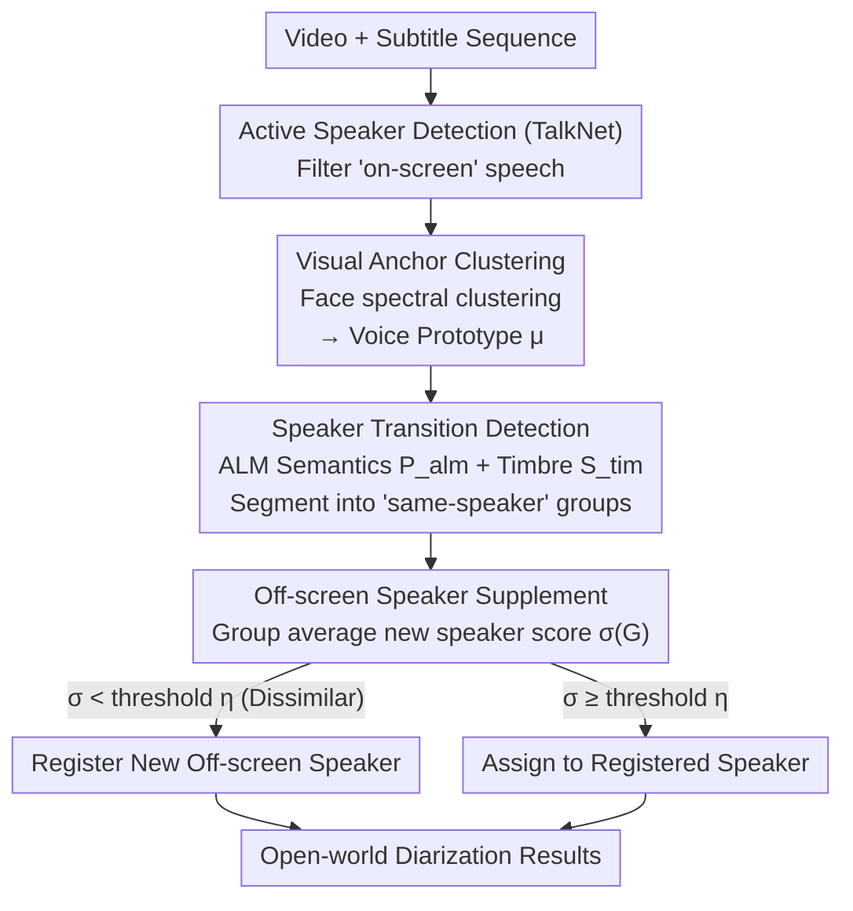

# CineSRD: Leveraging Visual, Acoustic, and Linguistic Cues for Open-World Visual Media Speaker Diarization

**Conference**: CVPR 2026  
**arXiv**: [2603.16966](https://arxiv.org/abs/2603.16966)  
**Code**: [Available](https://github.com/BSTLL/CineSRD)  
**Area**: Video Understanding  
**Keywords**: Speaker Diarization, Multi-modal Fusion, Visual Anchor Clustering, Audio Language Model, Open-world

## TL;DR

CineSRD is proposed as a training-free multi-modal speaker diarization framework. It performs speaker registration via visual anchor clustering and speaker transition detection using an audio language model, addressing open-world challenges in cinematic works such as long-duration videos, large character counts, and audio-visual asynchrony.

## Background & Motivation

Traditional speaker diarization focuses primarily on constrained scenarios like meetings and interviews with few speakers and simple acoustic conditions. Extending this to visual media like films and TV shows presents four major challenges:

**Long Video Understanding**: Movies typically last 2 hours, while TV series can accumulate dozens of hours.

**Massive Speaker Count**: A single production may contain dozens or even hundreds of characters.

**Audio-Visual Asynchrony**: Characters may speak when their faces are not on screen (voiceovers, off-screen speech).

**In-the-wild Variability**: Acoustic conditions and visual dynamics in real filming environments are complex and highly variable.

Existing methods have evolved from unimodal (audio) to bimodal (audio-visual) and trimodal (audio-visual-text), but remain limited to simple scenarios.

## Method

### Overall Architecture

CineSRD addresses the open-world complexities of moving speaker diarization from meeting rooms to cinematic media: long videos, hundreds of characters, and off-screen speakers. The Mechanism is to **avoid training any specific model and instead orchestrate existing pre-trained models into a three-stage pipeline**. It first registers reliable speakers based on "on-screen" speech as anchors, then uses an Audio Language Model (ALM) to determine speaker transitions between turns, and finally supplements those off-screen speakers who never appeared visually. The three stages proceed incrementally: Visual Anchor Clustering provides high-confidence speaker prototypes; Transition Detection segments turns into continuous "same-speaker" groups; and Off-screen Supplementation recovers characters outside the visual modality.

### Key Designs

**1. Visual Anchor Clustering: Using highly discriminative face features as "stability points"**

Pure audio clustering is fragile in cinematic scenes—characters with similar timbres and noisy recordings can lead to cluster errors. CineSRD's Key Insight is: for each subtitle $s$, use Active Speaker Detection (TalkNet) to determine if a speaker is visible. For these "on-screen" subtitles, CurricularFace extracts face embeddings $f_v(s)$ for spectral clustering to get visual labels $c_v(s)$, while ERes2NetV2 extracts timbre embeddings $f_a(s)$. Crucially, face features are more discriminative than voice, so the method **anchors on visual clusters**. Inside each visual cluster $\mathcal{S}_i$, it performs majority voting on audio labels to pick the dominant voice cluster:

$$\hat{c}_a(i) = \underset{k}{\arg\max}\, |\{s \in \mathcal{S}_i \mid c_a(s) = k\}|$$

The average timbre embedding in that voice cluster is taken as the **audio prototype $\mu_i$** for that speaker. These prototypes bridge a stable face with a clean voiceprint, serving as a reference for subsequent stages to prevent error propagation.

**2. Speaker Transition Detection: Leveraging ALM for semantic "same-speaker" judgment**

Timbre similarity alone cannot distinguish speakers with similar voices, especially during rapid dialogue. CineSRD delegates this judgment to the audio language model Qwen2-Audio-7B. It processes 10 consecutive turns and their audio, outputting a probability $P_{alm}$ of "same speaker" based on semantic coherence and logic. Simultaneously, normalized timbre cosine similarity $S_{tim}$ is kept as acoustic evidence. They are weighted for the final detection score:

$$P_{std} = w \cdot P_{alm} + (1-w) \cdot S_{tim}$$

where $w=0.45$. The ALM provides semantic signals (e.g., distinguishing between a question and an answer) to resolve boundaries that acoustics cannot, which is why the text modality further reduces DER in difficult scenarios like Chinese dialects.

**3. Off-screen Speaker Supplement: Giving "invisible" characters a chance to be registered**

Narrators and off-screen characters never appear in the visual frame and aren't covered by visual anchors. CineSRD first segments subtitles into groups $G$ of continuous speakers based on transition detection. It then calculates a new speaker score for each subtitle $s$:

$$\sigma(s) = \mathbb{I}(s) + (1 - \mathbb{I}(s)) \max_{1 \leq i \leq n_v} \text{sim}(f_a(s), \mu_i)$$

where $\mathbb{I}(s)$ indicates if an active speaker was detected. If $\mathbb{I}(s)=1$, $\sigma(s)=1$ (reliable). If not, it takes the maximum similarity between its timbre and all registered prototypes $\mu_i$. If the group average $\sigma(G)$ is below threshold $\eta=0.45$, the group is registered as a new off-screen speaker.

### A Complete Example

Consider a TV scene: in the first 8 turns, characters A and B converse on screen; turns 9-10 feature a narrator with no faces. **Visual Anchor Clustering** processes the first 8—TalkNet confirms active speakers, face clustering identifies A and B, and their voice prototypes $\mu_1, \mu_2$ are extracted. **Transition Detection** scans adjacent pairs, finds a drop in $P_{std}$ between turns 3 and 4, and segments the turns. **Off-screen Supplement** handles turns 9-10: since no active speaker is detected ($\mathbb{I}=0$) and the timbre similarity to $\mu_1, \mu_2$ is low ($\sigma(G) < 0.45$), a new narrator speaker C is registered. The segment is correctly labeled with A, B, and C.

### Loss & Training

CineSRD is a **training-free** framework. It orchestrates pre-trained models: TalkNet for Active Speaker Detection, RetinaFace + CurricularFace for face embeddings, ERes2NetV2 for timber, and Qwen2-Audio-7B (temperature=1.2, top_k=50, top_p=0.95) for semantic judgment. Hyperparameters include the fusion weight $w=0.45$ and supplementation threshold $\eta=0.45$.

## Key Experimental Results

### Main Results

**Table 5: Speaker Diarization on SubtitleSD Benchmark (DER↓ / JER↓)**

| Method | Modality | Chinese DER | Chinese JER | English DER | English JER |
|------|------|------------|------------|------------|------------|
| AHC | A | 0.1398 | 0.4522 | 0.1248 | 0.4102 |
| EC2P | AVT | 0.1345 | 0.3801 | 0.1180 | 0.3557 |
| **CineSRD** | AV | 0.0833 | 0.4144 | 0.1027 | 0.3133 |
| **Ours** | **AVT** | **0.0756** | **0.3197** | **0.0893** | **0.2909** |

Ours using only AV already outperforms EC2P's trimodal (AVT) results.

**Table 6: AVA-AVD Traditional Benchmark**

| Method | Modality | DER↓ | SPKE↓ |
|------|------|------|-------|
| EC2P | AV | 0.2032 | 0.1740 |
| **Ours (SC)** | **AV** | **0.1969** | **0.1677** |

### Ablation Study

Gain from text modality:
- Chinese: DER reduced from 0.0833 to 0.0756 (-9.2%)
- Chinese-Hard (Dialects): DER reduced from 0.1018 to 0.0947 (-7.0%)
Text modality provides semantic coherence through the ALM, effectively distinguishing characters with similar timbres.

### Key Findings

1.  **Visual Anchor Strategy is Critical**: Face features are far more discriminative than timbre; anchoring on vision significantly reduces clustering errors.
2.  **Training-Free Robustness**: Ours achieves SOTA on both the custom SubtitleSD and traditional AVA-AVD benchmarks.
3.  **Robustness to Dialects**: In Chinese-Hard (317 speakers, multiple dialects), DER remains low at 0.0947.

## Highlights & Insights

1.  **Novel Problem Definition**: The first systematic study to extend speaker diarization to open-world cinematic media with a dedicated benchmark.
2.  **Pragmatic Training-Free Design**: Orchestrating pre-trained models avoids high domain-specific training costs.
3.  **Hierarchical Strategy**: Visual anchor registration → semantic transition detection → off-screen supplement allows for progressive refinement.
4.  **SubtitleSD Benchmark Contribution**: 92.5 hours of video covering English/Chinese/Dialects with an average of 21.2 speakers per video.

## Limitations & Future Work

1.  Sensitivity to Active Speaker Detection accuracy; if face detection fails, it degrades to audio-only.
2.  Supplementation strategy might miss off-screen speakers if voice cues are extremely weak.
3.  High inference cost of ALM (Qwen2-Audio-7B) impacts efficiency for long videos.
4.  Currently assumes one speaker per subtitle, not handling overlapping speech.

## Related Work & Insights

-   **AVR-Net**: Uses learnable masks to dynamically adjust audio-visual weights.
-   **EC2P**: Trimodal constrained propagation for similarity matrix optimization.
-   The training-free orchestration route is valuable: individual components (face/timbre/ALM) can be upgraded independently as stronger base models emerge.

## Rating

-   **Novelty**: ★★★★☆
-   **Technical Depth**: ★★★☆☆
-   **Experimental Thoroughness**: ★★★★☆
-   **Writing Quality**: ★★★★☆

<!-- RELATED:START -->

## Related Papers

- [\[CVPR 2026\] Beyond Explicit Language: Plug-and-Play Visual-to-Linguistic Modeling Toward General Object Tracking](beyond_explicit_language_plug-and-play_visual-to-linguistic_modeling_toward_gene.md)
- [\[CVPR 2026\] OmniVTG: A Large-Scale Dataset and Training Paradigm for Open-World Video Temporal Grounding](omnivtg_a_large-scale_dataset_and_training_paradigm_for_open-world_video_tempora.md)
- [\[CVPR 2026\] Adaptive Capacity Autoregressive Visual Tracking](adaptive_capacity_autoregressive_visual_tracking.md)
- [\[CVPR 2026\] Drift-Resilient Temporal Priors for Visual Tracking](drift-resilient_temporal_priors_for_visual_tracking.md)
- [\[CVPR 2026\] SpikeTrack: A Spike-driven Framework for Efficient Visual Tracking](spiketrack_a_spike-driven_framework_for_efficient_visual_tracking.md)

<!-- RELATED:END -->
