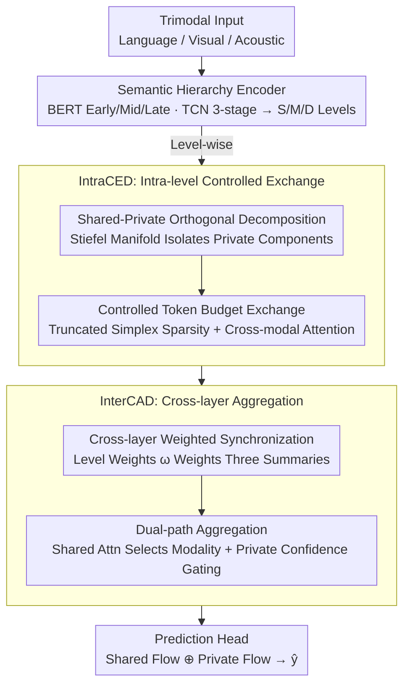

# CLCR: Cross-Level Semantic Collaborative Representation for Multimodal Learning

**Conference**: CVPR 2026  
**arXiv**: [2602.19605](https://arxiv.org/abs/2602.19605)  
**Code**: None  
**Area**: Video Understanding  
**Keywords**: Cross-level semantic alignment, shared-private decoupling, multimodal fusion, sentiment analysis, event localization

## TL;DR

The CLCR framework is proposed to organize each modal feature into three semantic levels (shallow/middle/deep). It utilizes an Intra-level Controlled Exchange Domain (IntraCED) to restrict cross-modal interaction within a shared subspace and an Inter-layer Collaborative Aggregation Domain (InterCAD) for adaptive cross-layer fusion, addressing the cross-level semantic asynchrony problem in multimodal learning.

## Background & Motivation

Multimodal learning aims to capture shared and private information across multiple modalities (language, visual, acoustic). Existing mainstream directions exhibit shared limitations:

**Feature Decoupling Methods** (MISA, DMD, etc.): These learn modality-invariant/modality-specific subspaces but assume cross-modal interactions occur at a single semantic level.

**Dynamic Calibration Methods** (MLA, ARL, etc.): These adjust contribution weights at the sample/modality level but similarly overlook the hierarchical structure.

**Core Problem: Cross-Level Semantic Asynchrony**
- Shallow levels capture lexical/frame-level cues, middle levels encode phrase/prosodic structures, and deep levels reflect discourse intent/event context.
- Mixing tokens from different levels leads to semantic confusion, error propagation, and private information leakage.
- From an information bottleneck perspective, unstructured mixing tends to increase $I(Z;N)$ rather than $I(Z;Y)$.

## Method

### Overall Architecture

CLCR aims to address the fact that features for language, vision, and acoustics are distributed across different semantic levels—lexical vs. intent in text, appearance vs. event in video. Traditional multimodal fusion often flattens all tokens into the same level, causing contamination between shallow details and deep semantics. CLCR explicitly preserves these "levels": each modality is expanded into shallow/middle/deep levels (Semantic Hierarchy Encoder). Then, **within each level**, only cross-modal shared information is allowed a controlled exchange while isolating private information (IntraCED). Finally, the results of the three levels are weighted by importance, synchronized, and aggregated into a task representation (InterCAD). The pipeline consists of: Three-level Encoding → Level-wise Controlled Interaction → Cross-layer Weighted Aggregation → Output Prediction.

### Key Designs

**1. Semantic Hierarchy Encoder: Expanding each modality into shallow/mid/deep levels rather than compressing into a single vector.**

The root of cross-level semantic asynchrony is that "intra-modal hierarchies exist but are flattened during fusion." CLCR explicitly builds this hierarchy: for each modality $m \in \{L, V, A\}$, it constructs three levels of features $H_\ell^{(m)} = \text{LN}(Z_\ell^{(m)} W_\ell^{(m)} + P_\ell^{(m)})$ with a uniform width $d$, where $\ell \in \{1,2,3\}$. For language, it takes the early/mid/late layers of a pre-trained BERT. For visual and acoustic modalities, it uses a three-stage TCN with increasing receptive fields to approximate the same shallow-to-deep structure—local appearance, component structure, and long-range scene context. This ensures all subsequent exchange and aggregation occur on "aligned hierarchical semantics."

**2. IntraCED: Restricting intra-level interaction to the shared subspace and exchanging only high-value tokens.**

Even with levels, fusing entire features via cross-modal attention allows private information leakage and noise interference. IntraCED employs two gates. The first is **Shared-Private Orthogonal Decomposition**: through Stiefel manifold parameterization, each token is projected into a shared component $h_{\ell,t,sh}^{(m)} = h_{\ell,t}^{(m)} P_\ell^{sh}$ and a private component $h_{\ell,t,pr}^{(m)} = h_{\ell,t}^{(m)} P_{\ell,m}^{pr}$. Orthogonality ensures no structural overlap, allowing only shared components to be exchanged. The second is a **Controlled Token Budget**: a shared evidence score $e_{\ell,t}^{(m)} = \|h_{\ell,t,sh}^{(m)}\|_2$ is calculated for each token, mapped via learnable scales and thresholds, and projected onto a truncated simplex with a budget cap to enforce sparsity:

$$\boldsymbol{\alpha}_\ell^{(m)} = \text{Proj}_{\Delta(B_\ell)}(\tilde{\boldsymbol{\alpha}}_\ell^{(m)})$$

where $B_\ell$ is a learnable budget controlling how many tokens enter the exchange pool. The actual exchange involves each modality querying the shared token pools of others: $\tilde{h}_{\ell,t,sh}^{(m)} = \alpha_{\ell,t}^{(m)} \text{Attn}(Q_{\ell,t}^{(m)}, K_\ell^{(-m)}, V_\ell^{(-m)})$.

**3. InterCAD: Weighted synchronization of levels and modality-aware aggregation.**

After level-wise exchange, the framework determines which level and modality are more important for the sample. InterCAD performs **Cross-layer Synchronization**: for each level and modality, the shared and private flows are mean-pooled to obtain summaries $s_\ell^{(m)}$ and $p_\ell^{(m)}$. A set of level weights $\omega = [\omega_1, \omega_2, \omega_3]$ is computed via MLP + softmax, yielding modality-level summaries $\bar{s}^{(m)} = \sum_{\ell} \omega_\ell s_\ell^{(m)}$ and $\bar{p}^{(m)} = \sum_{\ell} \omega_\ell p_\ell^{(m)}$. Aggregation follows two paths: the Shared Path uses global context $\bar{g}$ to attend to informative modalities, while the Private Path uses confidence gating $\eta_m = \sigma(w_p^\top \text{LN}(W_p \bar{p}^{(m)}))$ to retain modality-specific cues. The concatenated result is fed to the prediction head: $\hat{y} = f_\theta(z_{sh} \oplus u_{pr})$.

### Loss & Training

$$\mathcal{L}_{all} = \mathcal{L}_{task} + \lambda_{inter} \mathcal{L}_{Inter} + \lambda_{intra} \mathcal{L}_{Intra}$$

**Intra-level Regularization $\mathcal{L}_{Intra}$**: Identifiability regularization based on whitened cross-correlation, penalizing correlation between private flows of different modalities and between private/shared flows of the same modality.

**Inter-layer Regularization $\mathcal{L}_{Inter}$**: Three constraints—
- $\mathcal{L}_{pr}$: Reduces cross-layer private redundancy.
- $\mathcal{L}_{sp}$: Inhibits cross-layer shared-private leakage.
- $\mathcal{L}_{mix}$: Penalizes simultaneous activation of semantically incompatible level pairs.

Training Config: SGD (momentum 0.9), lr 1e-3, weight decay 1e-4, batch 64, 100 epochs, A100 GPU.

## Key Experimental Results

### Main Results

**Table 1: Audio-Visual Benchmarks (Acc% / F1%)**

| Method | CREMA-D Acc | KS Acc | AVE Acc | UCF101 Acc |
|------|-----------|--------|---------|-----------|
| ARL | 76.46 | 74.09 | 72.61 | 83.06 |
| D&R | 73.52 | 69.10 | 69.62 | 82.11 |
| **CLCR** | **77.92** | **75.41** | **73.82** | **83.64** |

**Table 2: Multimodal Sentiment Analysis (CMU-MOSI / CMU-MOSEI)**

| Method | MOSI MAE↓ | MOSI Acc-2 | MOSEI MAE↓ | MOSEI Acc-2 |
|------|----------|-----------|-----------|-----------|
| DLF | 0.731 | 85.06 | 0.536 | 85.42 |
| EMOE | 0.710 | 85.4 | 0.536 | 85.3 |
| **CLCR** | **0.678** | **88.05** | **0.511** | **87.96** |

### Ablation Study

**Table 3: Key Component Ablation (MOSI MAE↓ / KS Acc)**

| Variant | MOSI MAE | KS Acc |
|------|---------|--------|
| w/o Hierarchy | 0.720 | 71.9 |
| w/o IntraCED | 0.703 | 73.0 |
| w/o InterCAD | 0.699 | 73.4 |
| Full Mix (Shuffled) | 0.743 | 70.3 |
| w/o Regularization | 0.725 | 71.2 |
| **CLCR (Full)** | **0.678** | **75.41** |

### Key Findings

1. **Hierarchy is Core**: Removing the hierarchical structure causes the largest performance drop; Full Mix performs the worst.
2. **IntraCED vs. InterCAD**: Removing IntraCED typically results in a larger drop, highlighting the importance of level-wise shared/private separation.
3. **Optimal Token Sparsity**: Performance peaks at a participation rate $r \approx 0.68$ ($\gamma \approx 1.0$); fully dense exchange is suboptimal.
4. **Noise Robustness**: CLCR shows the smallest performance degradation under Gaussian noise injection.
5. **Adaptive Modality Importance**: Language dominates in MOSI, while visual weights are highest in KS; CLCR adapts automatically.

## Highlights & Insights

1. **Definition of Cross-Level Semantic Asynchrony**: Explains why mixed-level fusion degrades representation quality via an information bottleneck perspective.
2. **Controlled Token Budget**: Achieves differentiable sparse token selection via truncated simplex projection, avoiding dense noise fusion.
3. **Dual Shared-Private Protection**: Combines orthogonal projection (structural constraint) with whitened cross-correlation regularization (statistical constraint).
4. **Comprehensive Validation**: Covers sentiment recognition, event localization, sentiment analysis, and action recognition across six benchmarks.

## Limitations & Future Work

1. The three-level hierarchy is a hard-coded design; different tasks might require a variable number of levels.
2. Insufficient computational overhead analysis—actual training time for whitening and Stiefel parameterization is not reported.
3. Validated only on classification/regression; not yet extended to generative multimodal tasks.
4. Handling of missing modality scenarios (beyond ablation analysis) is not yet a systematic solution.

## Related Work & Insights

- **MISA**: A classic method for invariant/specific subspace decomposition; CLCR introduces a hierarchical structure.
- **DMD**: Graph-based distillation; CLCR replaces distillation with controlled attention.
- **ARL**: Dual-path calibration; CLCR achieves similar functions via InterCAD's modality selection.
- The token budget mechanism could be transferred to Vision-Language Pre-training (VLP) to control interaction granularity.

## Rating

- **Novelty**: ★★★★☆ — Innovative problem definition and controlled exchange design.
- **Technical Depth**: ★★★★★ — Solid theoretical foundation with orthogonal decomposition, truncated simplex, and whitening.
- **Experimental Thoroughness**: ★★★★★ — Six benchmarks, detailed ablations, t-SNE, noise robustness, and sensitivity analysis.
- **Writing Quality**: ★★★★☆ — Clear framework diagrams, though high formula density increases reading difficulty.

<!-- RELATED:START -->

## Related Papers

- [\[CVPR 2026\] VideoChat-M1: Collaborative Policy Planning for Video Understanding via Multi-Agent Reinforcement Learning](videochatm1_collaborative_policy_planning_for_vide.md)
- [\[CVPR 2025\] SEAL: SEmantic Attention Learning for Long Video Representation](../../CVPR2025/video_understanding/seal_semantic_attention_learning_for_long_video_representation.md)
- [\[CVPR 2026\] MTLLFM: Multimodal-Temporal Laughter Localization](mtllfm_multimodal-temporal_laughter_localization_ur-funny-temporal_and_smile-tem.md)
- [\[CVPR 2026\] Fine-VAD: Towards Fine-Grained Video Anomaly Detection via Progressive Cross-Granularity Learning](fine-vad_towards_fine-grained_video_anomaly_detection_via_progressive_cross-gran.md)
- [\[CVPR 2026\] Hypergraph-State Collaborative Reasoning for Multi-Object Tracking](hypergraph-state_collaborative_reasoning_for_multi-object_tracking.md)

<!-- RELATED:END -->
