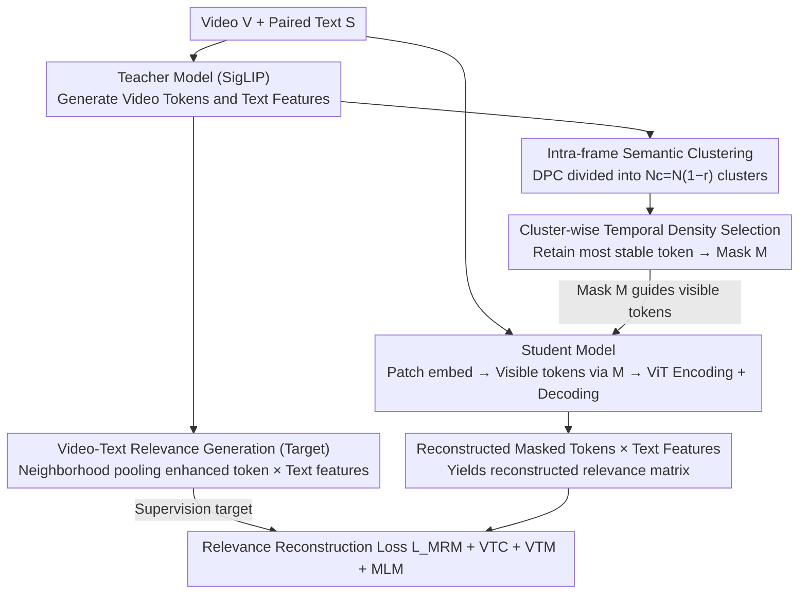

# Cluster-Wise Spatio-Temporal Masking for Efficient Video-Language Pretraining

**Conference**: CVPR 2026  
**arXiv**: [2603.22953](https://arxiv.org/abs/2603.22953)  
**Code**: None  
**Area**: Video Understanding  
**Keywords**: Video-Language Pretraining, Masked Visual Modeling, Spatio-Temporal Clustering, Efficient Pretraining, Video-Text Alignment

## TL;DR

Ours proposes ClusterSTM, which retains semantically complete visual tokens under high masking rates through intra-frame semantic clustering and cluster-wise spatio-temporal masking strategies. By introducing a video-text relevance reconstruction objective, it achieves efficient video-language pretraining at extremely low computational cost, reaching a new SOTA for efficient models on tasks such as retrieval, VQA, and captioning.

## Background & Motivation

**Background**: Large-scale Video-Language Pretraining (VLP) has become the mainstream paradigm for multimodal tasks. By jointly training encoders on massive video-text pairs, models gain strong generalization capabilities for downstream tasks like video retrieval, video question answering, and video captioning. However, the computational overhead is massive—the spatio-temporal dimensions of video are much higher than those of images, making GPU time and memory consumption for pretraining a critical bottleneck.

**Limitations of Prior Work**: Recently, Masked Visual Modeling has been introduced to alleviate computational pressure. Its core idea is to randomly mask most visual tokens during training, sending only a few to the encoder. However, this random masking strategy has two fundamental flaws:
1.  **Serious loss of visual information**: When masking rates reach 75% to 90%, randomly retained tokens often fail to cover key semantic regions of the video, leading the model to learn fragmented visual representations.
2.  **Temporal information leakage**: Strong visual correlation exists between adjacent video frames (many pixels remain unchanged). Simple intra-frame random masking cannot prevent the model from "cheating" via redundant information from neighboring frames, thereby weakening the learning of true temporal dynamics.

**Key Challenge**: High efficiency requires high masking rates (fewer inputs), but high masking rates lead to the loss of semantic completeness and temporal information leakage. A fundamental trade-off exists between the two.

**Goal**: Design a structured masking strategy that simultaneously ensures: (1) retained tokens cover global semantics under high masking rates; (2) retained tokens possess strong temporal dynamics to avoid information leakage.

**Key Insight**: Visual tokens within a video frame can be naturally clustered into independent groups based on semantic similarity. If only the token with the highest "temporal density" (the one appearing repeatedly and most stably across other frames) is retained in each semantic cluster, the requirements for both semantic coverage and suppression of temporal leakage can be met.

**Core Idea**: Group tokens using intra-frame clustering, retain the most temporally stable token (highest temporal density) in each group, and replace simple pixel-level reconstruction with a video-text relevance reconstruction objective to achieve semantically complete and efficient video-language pretraining.

## Method

### Overall Architecture

ClusterSTM addresses the unavoidable contradiction in efficient VLP: saving computation requires high masking rates (sending few tokens to the encoder), but at 10%~15% token retention, random selection fails to cover semantics and contains redundant information from adjacent frames. The framework employs a **teacher-student structure**: a pretrained vision-language foundation model (SigLIP) acts as the **teacher**, outputting visual tokens and text features for each frame to perform two tasks: (1) it executes a structured two-step masking process—first clustering tokens within each frame into semantic groups, then retaining only the most temporally stable token per cluster to generate a spatio-temporal mask $\hat{M}$; (2) it generates a "video-text relevance matrix" as the reconstruction target. The **student** model (ViT video encoder + BERT text encoder, following the UMT setup) sends only visible tokens to the video encoder under mask guidance, reconstructs the full token sequence via a spatio-temporal decoder, and computes a reconstructed relevance matrix by multiplying masked tokens with text features. During training, the teacher's relevance matrix supervises the student's reconstruction (masked relevance modeling), alongside standard objectives like video-text contrastive, matching, and masked language modeling. Retained tokens thus span all semantic regions and are temporally consistent, blocking both semantic loss and temporal leakage.

### Key Designs

**1. Intra-frame Semantic Clustering: Ensuring every semantic region has surviving tokens**

Random masking is semantically blind—it may accidentally mask all tokens of a foreground object, forcing the model to learn fragmented representations from background textures. Conversely, methods like UMT that retain only "high-semantic foreground tokens" lose the background, though text descriptions often involve both ("a child flying a kite on a beach"). ClusterSTM's first step is to perform Density Peaks Clustering (DPC) on visual tokens within each frame, dividing $N$ tokens into $N_c = N \times (1-r)$ clusters ($r$ is masking rate). Each cluster roughly corresponds to a semantically independent region. Crucially, the masking is modified to **retain exactly one token per cluster**. Thus, regardless of how high the masking rate is, every semantic region is represented by one token, ensuring global semantic coverage by design rather than chance.

**2. Temporal Density-based Cluster Selection: Blocking "cheating paths"**

Semantic coverage alone is insufficient. Due to high similarity between adjacent frames, models under random masking can "copy" masked content from visible tokens at the same position in neighboring frames without learning dynamics (temporal leakage). Tube masking uses the same mask for all frames, but this fails during complex motion. ClusterSTM uses an adaptive criterion: "temporal density." For each token, the similarity (negative exponential of cosine distance $\exp(-d/d_c)$) with all tokens in all other frames is accumulated. Higher density indicates the token appears stably throughout the video. The token with the **highest temporal density** is retained in each cluster. By consistently retaining temporally correlated tokens even if their spatial positions drift, this acts as a "soft tube mask." Masked content consists of non-recurring, transient details with no neighbor to copy from, forcing the model to learn spatio-temporal dynamics for reconstruction.

**3. Video-Text Relevance Reconstruction Objective: Aligning reconstruction with multimodal tasks**

Traditional masked modeling reconstructs low-level signals (pixels or features), which has limited utility for high-level tasks like retrieval or VQA and ignores text supervision. ClusterSTM replaces this with "video-text relevance." The target matrix is generated by the teacher (SigLIP): for each target token, it is pooled with its neighborhood to create an enhanced token before multiplying with text features to obtain a relevance score. The student multiplies its decoded masked tokens with text features to fit this target via L2 distance (masked relevance modeling). This links masked pretraining directly to downstream cross-modal semantics, yielding the most significant gains in retrieval and VQA.

### Loss & Training

The overall objective of ClusterSTM is $\mathcal{L} = \mathcal{L}_{MRM} + \mathcal{L}_{VTC} + \mathcal{L}_{VTM} + \mathcal{L}_{MLM}$, consisting of: (1) **Masked Relevance Modeling loss** $\mathcal{L}_{MRM}$, the L2 loss supervising the student's reconstruction with the teacher's relevance matrix; (2) **Video-Text Contrastive loss** $\mathcal{L}_{VTC}$ and (3) **Video-Text Matching loss** $\mathcal{L}_{VTM}$ for multimodal alignment; (4) **Masked Language Modeling loss** $\mathcal{L}_{MLM}$ for text reconstruction. This follows mainstream VLP paradigms (e.g., UMT/STM), with clustering and selection performed dynamically by the teacher for each batch.

## Key Experimental Results

### Main Results

| Task/Dataset | Metric | ClusterSTM | Prev. SOTA | Gain |
| :--- | :--- | :--- | :--- | :--- |
| MSRVTT Retrieval | R@1 | SOTA | - | Significantly outperforms efficient baselines |
| DiDeMo Retrieval | R@1 | SOTA | - | Leads under equivalent computation budgets |
| MSRVTT QA | Top-1 Acc | SOTA | - | Surpasses models with similar parameters |
| MSVD Caption | CIDEr | SOTA | - | Ranked first |

### Ablation Study

| Configuration | Key Metric | Description |
| :--- | :--- | :--- |
| Full ClusterSTM | Best | Complete model |
| w/o Intra-frame Clustering (Random) | Significant Drop | Proves importance of clustering for semantic coverage |
| w/o Temporal Density (Random Selection) | Decrease | Proves the role of stable tokens in suppressing leakage |
| w/o Video-Text Relevance Recon | Decrease | Proves necessity of high-level semantic alignment targets |
| Masking Rate (75%/85%/90%) | 85% Best | Excessively high masking rates still cause info loss |

### Key Findings

- Intra-frame clustering is the most critical module; its removal leads to the largest performance drop in retrieval, indicating semantic completeness is the core challenge for high-masking pretraining.
- Temporal density selection provides 1-2% consistency gain over random selection, with more pronounced improvements in motion-heavy videos.
- Video-text relevance reconstruction primarily benefits retrieval and VQA, with less impact on captioning.
- Using only 15% of tokens (85% masking), ClusterSTM matches or exceeds the performance of full-token training on retrieval tasks.

## Highlights & Insights

- **Semantic-Aware Structured Masking**: Upgrades random masking to semantic-aware structured operations, elegantly solving information loss at high masking rates. This "group-then-sample" strategy is transferable to other domains like image MAE or point cloud pretraining.
- **Temporal Density as Importance Metric**: Utilizing feature similarity across frames to measure temporal stability is a simple yet effective design for token selection without extra learning.
- **Introduction of Multimodal Reconstruction Targets**: Incorporating text semantic constraints into visual mask reconstruction aligns pretraining more closely with downstream multimodal tasks.

## Limitations & Future Work

- Intra-frame clustering introduces additional computation (DPC), which, while small compared to the Transformer, may require optimization for ultra-large-scale pretraining.
- The method assumes semantic regions can be effectively separated via embedding clustering; quality may degrade in highly occluded or semantically cluttered scenes.
- Temporal density relies on explicit correspondence; it may be less robust for videos with extreme motion or frequent scene cuts.
- Future work could explore adaptive cluster counts and masking rates based on video content.

## Related Work & Insights

- **vs VideoMAE/MAE Series**: VideoMAE uses random tube masking, ignoring semantic structures; ClusterSTM achieves smarter token selection via clustering and density.
- **vs All-in-One/VIOLET**: These methods use full tokens and achieve good results at high cost; ClusterSTM significantly reduces training overhead while maintaining performance.
- **vs ST-MAE**: ST-MAE masks across space and time dimensions separately but remains random; ClusterSTM implements dual semantic and temporal structured awareness.

## Rating

- Novelty: ⭐⭐⭐⭐ The combination of clustering and temporal density is a reasonable and effective innovation, though individual components are not entirely unprecedented.
- Experimental Thoroughness: ⭐⭐⭐⭐ Covers retrieval, VQA, and captioning with detailed ablation studies.
- Writing Quality: ⭐⭐⭐⭐ Clear motivation and well-defined problem statements.
- Value: ⭐⭐⭐⭐ High practical value for efficient VLP, though its scope is relatively specific to the VLP field.

<!-- RELATED:START -->

## Related Papers

- [\[CVPR 2026\] EthoCLIP: Ontology-Enhanced Video-Language Pretraining for Animal Behavior Understanding](ethoclip_ontology-enhanced_video-language_pretraining_for_animal_behavior_unders.md)
- [\[CVPR 2026\] VISTA: Video Interaction Spatio-Temporal Analysis Benchmark](vista_video_interaction_spatio-temporal_analysis_benchmark.md)
- [\[CVPR 2026\] Streaming Video Crime Anticipation with Spatio-Temporal Causal Reasoning](streaming_video_crime_anticipation_with_spatio-temporal_causal_reasoning.md)
- [\[CVPR 2026\] Towards Spatio-Temporal World Scene Graph Generation from Monocular Videos](towards_spatio-temporal_world_scene_graph_generation_from_monocular_videos.md)
- [\[CVPR 2026\] DETACH: Decomposed Spatio-Temporal Alignment for Exocentric Video and Ambient Sensors with Staged Learning](detach_decomposed_spatio-temporal_alignment_for_exocentric_video_and_ambient_sen.md)

<!-- RELATED:END -->
