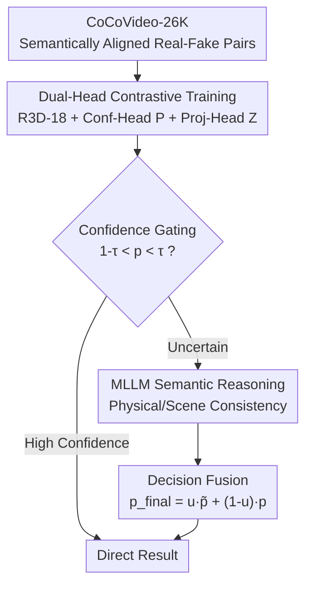

# CoCoVideo: The High-Quality Commercial-Model-Based Contrastive Benchmark for AI-Generated Video Detection

**Conference**: CVPR 2026  
**arXiv**: [2606.00101](https://arxiv.org/abs/2606.00101)  
**Code**: https://github.com/DonoToT/CoCoVideo (Yes)  
**Area**: Video Understanding / AIGC Detection / Benchmark  
**Keywords**: AIGC Video Detection, Commercial Generative Models, Contrastive Learning, Paired Real-Fake Data, Confidence-Gated MLLM

## TL;DR
Addressing the issue where existing AIGC video detection datasets rely on low-quality open-source models and fail to generalize to high-fidelity commercial models, this research constructs the CoCoVideo-26K benchmark covering 13 commercial models with 26,000 "semantically aligned real-fake paired" segments. It proposes the CoCoDetect framework, which captures texture-level differences using dual-head contrastive training with R3D-18 and routes uncertain samples via confidence gating to an MLLM for physical/semantic reasoning, achieving an average Acc of 90.69% and AUC of 95.93%.

## Background & Motivation

**Background**: With the explosion of diffusion-based text-to-video and image-to-video systems (e.g., Sora, Kling, Veo), AIGC forged videos are increasingly realistic. The focus of deepfake detection research is shifting from early face-swapping to general AIGC video authenticity discrimination.

**Limitations of Prior Work**: Existing AIGC video detection datasets (GenVideo, GenVidBench, GenBuster, etc.) almost exclusively use **open-source generative models**, which are inferior to commercial models in texture fidelity and scene consistency. Detectors trained on low-quality data overfit to low-level artifacts of open-source models and fail when facing high-fidelity commercial videos.

**Key Challenge**: Detectors learn "low-level artifacts unique to open-source models" rather than the essential differences between real and fake videos. Furthermore, traditional detection methods struggle to utilize high-level semantic cues like physical logic, while pure MLLM methods fail to capture fine texture artifacts.

**Goal**: (1) Build a high-quality, commercial-grade AIGC video benchmark close to real deployment scenarios; (2) Design a detection framework utilizing both "texture-level" and "semantic-level" cues.

**Key Insight**: If real and fake videos **share the same first frame and text prompt** (strictly semantically aligned pairs), the detector can learn fine-grained appearance differences under consistent content conditions rather than memorizing a specific generative style.

**Core Idea**: Utilize commercial models and semantically aligned real-fake pairs for contrastive data, combined with a two-layer detection mechanism of "low-level contrastive learning + confidence-gated MLLM semantic reasoning."

## Method

The research contributes the **CoCoVideo-26K benchmark** and the **CoCoDetect framework**. The former provides aligned real-fake paired supervision, while the latter uses dual-head training for texture differences and MLLM reasoning for uncertain samples.

### Overall Architecture

CoCoDetect uses "paired videos" during training: an R3D-18 backbone extracts features $\mathbf{F}$ for two parallel heads—a confidence head outputting authenticity $\mathbf{P}$ and a projection head outputting contrastive embeddings $\mathbf{Z}$. These are supervised by BCE and paired contrastive losses. Inference uses a threshold $\tau$ for confidence gating: high-confidence samples yield results directly, while uncertain samples ($1-\tau<p<\tau$) are routed to an MLLM for reasoning on physical plausibility and scene coherence, fused into a final decision $p_{\text{final}}$.

### Key Designs

**1. CoCoVideo-26K: Extraction of Essential Differences via Commercial Models and Aligned Pairs**

To address the limitation of detectors learning only low-level artifacts, the authors selected 13,000 high-fidelity videos from OpenVid-1M and reused their text descriptions as prompts. 13 top-tier commercial models (Jimeng 3.0, Kling 2.5, Veo3, Sora v1, Runway Gen4, etc.) each contributed 1,000 fake videos. Each real video and its synthetic counterpart **share the same first frame and text prompt**, forming a one-to-one real–fake pair. This ensures that the generation process is the sole variable, allowing contrastive learning to identify fine-grained appearance differences in a controlled manner. CoCoVideo is the first commercial-source benchmark with aligned pairs and text modality.

**2. Mechanism: Dual-Head Paired Contrastive Training**

Standard supervised contrastive learning may be harmful here because real and fake videos exhibit **extremely high intra-class semantic variance**. This design applies separation constraints only between **semantically aligned real-fake pairs**. For each pair $(i,j)$ where $\pi_i=\pi_j$ and $y_i\neq y_j$, cosine similarity $s_{ij}=\mathbf{z}_i\cdot\mathbf{z}_j$ is calculated. A hinge penalty is applied when similarity exceeds a threshold:

$$\mathcal{L}_{\text{pair}}=\frac{1}{N_{\text{pairs}}}\sum_{\pi_i=\pi_j,\,y_i\neq y_j}\max(0,\,s_{ij}-(1-m))$$

The margin $m\in[0.5,1.5]$ controls the target separation. Combined with the R3D-18 backbone and projection heads, the model learns fine-grained appearance differences under identical content.

**3. Confidence-Gated MLLM Reasoning + Decision Fusion**

High-fidelity commercial video textures can be deceptive, but synthetic videos often violate physical or semantic logic. This design routes only **uncertain samples** ($1-\tau<p<\tau$, $\tau=0.9$) to an MLLM (LLaVA-NeXT-Video-7B). The MLLM analyzes physical plausibility and temporal consistency, outputting structured JSON with a prediction $\hat{y}$ and certainty $\hat{p}$. After alignment to $\tilde{p}$, adaptive weighted fusion is performed: $p_{\text{final}}=u\tilde{p}+(1-u)p$, where $u=\sqrt{2|\tilde{p}-0.5|}$ gives higher weight to more certain MLLM outputs.

### Loss & Training

Total loss $\mathcal{L}_{\text{total}}=\alpha\mathcal{L}_{\text{conf}}+(1-\alpha)\mathcal{L}_{\text{pair}}$, with $\alpha=0.65$, $m=1.0$, and gating threshold $\tau=0.9$. Training is performed using AdamW (initial lr $10^{-4}$) for 30 epochs on a single A6000.

## Key Experimental Results

### Main Results (CoCoVideo Test Set, Avg. 13 Commercial Models, %)

| Method | Acc | F1 | Recall | AUC |
|------|------|------|--------|------|
| 3D ResNet | 78.69 | 78.57 | 78.10 | 86.51 |
| 3D ResNeXt | 80.49 | 80.65 | 81.33 | 88.16 |
| VideoMAE | 79.64 | 77.98 | 72.10 | 89.26 |
| TALL | 70.97 | 67.36 | 59.90 | 80.51 |
| D3 (Training-free) | 48.95 | 11.47 | 6.62 | 48.40 |
| DeMamba | 82.59 | 83.49 | 88.05 | 91.03 |
| **CoCoDetect (Ours)** | **90.69** | **90.62** | 89.95 | **95.93** |

### Ablation Study (CoCoVideo, %)

| Config | Acc | F1 | AUC | Note |
|------|------|------|------|------|
| Backbone only | 78.69 | 78.57 | 86.51 | Based on 3D ResNet |
| w/o Projection Head | 81.05 | 83.17 | 91.39 | - |
| w/o MLLM | 88.92 | 88.79 | 95.46 | - |
| **CoCoDetect (Full)** | **90.69** | **90.62** | **95.93** | - |

### Key Findings
- **Complementarity**: Integrating the projection head (+2.36% Acc) and MLLM (+1.77% Acc) cumulatively optimizes performance by combining texture and semantic cues.
- **Robustness**: The confidence gate minimizes false positives by invoking the MLLM only for uncertain cases.
- **Generalization**: Ours significantly outperforms baselines on most open-source benchmarks, though it struggled on GenVideo due to near-static frames breaking temporal logic.

## Highlights & Insights
- **Novelty**: The "shared first frame + same prompt" design isolates the generation variable, allowing the model to focus on essential differences rather than irrelevant styles.
- **Value**: Confidence gating provides a cost-effective paradigm for cascading large models with smaller base models.
- **Ours** demonstrates that avoiding learnable fusion weights $u$ in favor of a fixed formula improves cross-dataset stability.

## Limitations & Future Work
- **Dependency**: Performance relies on strict semantic alignment; deviations (e.g., mismatched resolutions) lead to performance degradation.
- **Scene Complexity**: Subtle artifacts in simple natural scenes without semantic flaws remain difficult to detect.
- **Scale**: Future work will expand the 26K dataset to include more multi-modal data and larger volumes.

## Related Work & Insights
- **Comparison with GenBuster/GenVideo**: Existing sets rely on mixed open-source models; CoCoVideo provides higher quality and strict alignment.
- **Comparison with CNN/Frequency detection**: Traditional methods like D3 fail on commercial high-fidelity video (Acc 48.95%), whereas ours utilizes dual-layer complementary signals.

## Rating
- Novelty: ⭐⭐⭐⭐ 
- Experimental Thoroughness: ⭐⭐⭐⭐ 
- Writing Quality: ⭐⭐⭐⭐ 
- Value: ⭐⭐⭐⭐ 

<!-- RELATED:START -->

<!-- RELATED:END -->

## Related Papers

- [\[CVPR 2026\] Your One-Stop Solution for AI-Generated Video Detection](your_one-stop_solution_for_ai-generated_video_detection.md)
- [\[CVPR 2026\] MDS-VQA: Model-Informed Data Selection for Video Quality Assessment](mds-vqa_model-informed_data_selection_for_video_quality_assessment.md)
- [\[CVPR 2026\] VISTA: Video Interaction Spatio-Temporal Analysis Benchmark](vista_video_interaction_spatio-temporal_analysis_benchmark.md)
- [\[CVPR 2025\] Q-Bench-Video: Benchmark the Video Quality Understanding of LMMs](../../CVPR2025/video_understanding/q-bench-video_benchmark_the_video_quality_understanding_of_lmms.md)
- [\[CVPR 2026\] Spk2VidNet: A Hierarchical Recurrent Architecture for High-Fidelity Video Reconstruction from Long Spike-Camera Streams](spk2vidnet_a_hierarchical_recurrent_architecture_for_high-fidelity_video_reconstr.md)

<!-- RELATED:END -->
