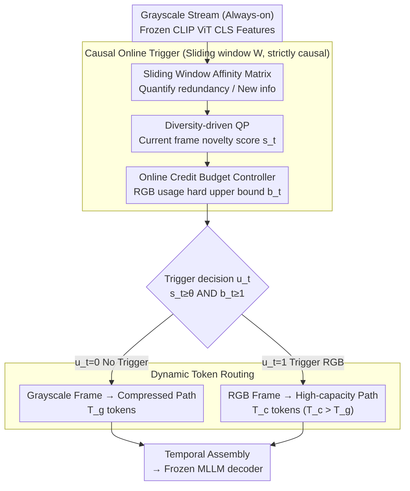

# Color When It Counts: Grayscale-Guided Online Triggering for Always-On Streaming Video Sensing

**Conference**: CVPR 2026  
**arXiv**: [2603.22466](https://arxiv.org/abs/2603.22466)  
**Code**: [lvgd.github.io/ColorTrigger](https://lvgd.github.io/ColorTrigger/)  
**Area**: Video Understanding  
**Keywords**: Streaming Video Understanding, Edge Devices, Grayscale-Guided Triggering, Energy-Aware, Dynamic Token Routing

## TL;DR

Ours proposes a new paradigm of "Grayscale Always-on, RGB On-demand." Through ColorTrigger, color redundancy is detected online using lightweight quadratic programming on the grayscale stream. By using only 8.1% of RGB frames, it maintains 91.6% of the full-color baseline performance, enabling always-on video perception for resource-constrained devices.

## Background & Motivation

Always-on perception is a core requirement for next-generation wearable/edge AI systems, but continuous high-fidelity RGB video capture is extremely costly on resource-constrained platforms:

**Energy Bottleneck**: Devices like smart glasses can only sustain continuous RGB recording for approximately 30-60 minutes, falling far short of the requirements for all-day assistants. Even if inference is offloaded to the cloud, the end-to-end energy bottleneck remains dominated by continuous camera exposure and wireless transmission.

**Limitations of Prior Work**: Methods such as EgoTrigger use audio cues to trigger the RGB camera, but a failure to trigger results in a complete loss of visual information for extended periods, making critical contexts unrecoverable.

**Key Insight — Color is Not Always Necessary**: Through pilot experiments on Qwen2.5-VL-7B, the authors found that replacing most frames with grayscale while keeping few RGB frames (maintaining temporal structure) only slightly degrades video understanding performance. This indicates significant **color redundancy** in natural videos—semantic tasks like action recognition, layout reasoning, and counting mostly do not rely on color, requiring color details only at a few critical moments.

Based on this insight, ColorTrigger proposes: the grayscale stream runs continuously to maintain temporal continuity, while RGB capture is triggered only when necessary, fundamentally reducing perception costs.

## Method

### Overall Architecture

The goal of ColorTrigger is to enable "Grayscale Always-on, RGB On-demand": the grayscale stream runs continuously to preserve temporal continuity, and expensive RGB capture is triggered only at critical moments. It consists of two components: a causal online trigger that detects whether "this frame brings new information and the budget allows it" within a sliding window of grayscale features, and a dynamic token router that allocates computational power based on frame type. Grayscale frames follow a high-compression path with fewer tokens, while RGB frames follow a high-capacity path with more tokens. These are concatenated temporally and fed into a frozen MLLM decoder. The entire pipeline is training-free, strictly causal, and does not modify any MLLM parameters.

### Key Designs

**1. Sliding Window Grayscale Affinity Matrix: Determining New Information via Similarity**

To decide whether to trigger RGB without seeing color, inter-frame redundancy must be quantified. At each time step $t$, ColorTrigger maintains a causal sliding window $\mathcal{W}_t$ of size $W$. Using a frozen CLIP visual encoder, it extracts $\ell_2$-normalized features $\mathbf{f}_i$ from the CLS tokens to construct an affinity matrix $\tilde{\mathbf{A}}_t = \frac{1}{2}(\mathbf{F}_t \mathbf{F}_t^\top + \mathbf{I}_{n_t}) \in [0,1]^{n_t \times n_t}$. High values of $\tilde{A}_{ij}$ indicate redundancy (similarity) between frames $i$ and $j$, while low values indicate new changes. The matrix is symmetric and positive semi-definite. Using only frames within the current window ensures strict causality, a hard constraint for always-on online scenarios.

**2. Diversity-Driven Quadratic Programming: Formulation Frame Selection as Optimization**

Similarity scores alone are insufficient; they must be converted into a score for the current frame. ColorTrigger reformulates frame selection as a continuous QP: $\mathbf{w}_t = \arg\min_{\mathbf{w}} \lambda \mathbf{w}^\top \tilde{\mathbf{A}}_t \mathbf{w}$, subject to $\mathbf{1}^\top \mathbf{w} = m_t$, assigning weights $\mathbf{w}_t \in [0,1]^{n_t}$ to frames in the window. The quadratic term $\mathbf{w}^\top \tilde{\mathbf{A}}_t \mathbf{w}$ penalizes assigning high weights to mutually similar frames, naturally spreading the budget across temporally diverse frames. A higher weight $s_t = (\mathbf{w}_t)_{n_t}$ for the current frame indicates it contributes new information not covered by recent history, making it a candidate for RGB triggering.

**3. Online Credit Budget Controller: Hard Upper Bound on Long-term RGB Usage**

Only considering geometric novelty would lead to excessive triggering during rapid scene changes, defeating the purpose of power saving. The controller maintains a scalar credit balance $b_t \in [0, C]$, accumulating at a target rate $r$ per frame and consuming one unit per trigger: $b_{t+1} = \text{clip}(b_t - u_t + r,\; 0, C)$. The final trigger must satisfy both the geometric threshold $s_t \geq \theta$ and the budget constraint $b_t \geq 1$: $u_t = \mathbb{I}[s_t \geq \theta \wedge b_t \geq 1]$. This fixes the long-term RGB usage at $\sum_{t=1}^T u_t \leq rT + C$, preventing over-budgeting regardless of scene dynamics.

**4. Dynamic Token Routing: Allocating Computation Based on Information Density**

The trigger decision determines which frames are RGB, and the router then allocates token budgets. Grayscale frames use low-resolution input to produce $T_g$ tokens, while RGB frames use high-resolution to produce $T_c > T_g$ tokens, assembled according to the trigger bit: $\mathbf{Z}_t = (1 - u_t)\psi_g(g_t) \oplus u_t \psi_c(c_t)$. When RGB is sparse, the total cost $\sum_t [(1-u_t)T_g + u_t T_c]$ is significantly lower than the full-color cost $T \cdot T_c$, concentrating computation on the few moments with high information density.

### Loss & Training

This method is entirely training-free and requires no additional supervision or fine-tuning. All triggering and routing decisions are derived from the geometric relationships in the grayscale stream, allowing direct deployment with frozen MLLMs.

## Key Experimental Results

### Main Results

Performance on the StreamingBench real-time visual understanding task:

| Method | #Frames | RGB(%) | All (Acc) | Description |
|------|---------|--------|-----------|------|
| Qwen2.5-VL-7B (Full Color) | 1fps | 100% | 73.68 | Full-color Baseline |
| Human | - | - | 91.46 | Human Performance |
| TimeChat-Online-7B | 1fps | 100% | 75.36 | Streaming MLLM SOTA |
| InternVL-3.5-8B | 128 | 100% | - | Strong Open-source Model |
| **ColorTrigger** | 1fps | **8.1%** | **67.49** | Only 8.1% RGB frames |

ColorTrigger achieves 91.6% of the full-color baseline performance (67.49/73.68) using only 8.1% RGB frames, showing balanced performance across sub-tasks (object perception, causal reasoning, action perception, etc.).

### Ablation Study

| Configuration | RGB(%) | All (Acc) | Description |
|------|--------|-----------|------|
| Full Grayscale | 0% | ~60 | Grayscale only, significant degradation |
| Uniform Sample 5% RGB | 5% | ~63 | Randomly inserted low-rate RGB |
| Uniform Sample 10% RGB | 10% | ~66 | Uniform sampling |
| ColorTrigger 8.1% | 8.1% | 67.49 | Intelligent trigger outperforms uniform |
| ColorTrigger + Token Route | 8.1% | 67.49 | Token routing further reduces inference cost |
| Full Color 100% RGB | 100% | 73.68 | Upper bound |

### Key Findings

- There is significant color redundancy in natural videos: 5-10% RGB frames are sufficient to recover most performance.
- Intelligent triggering is superior to uniform sampling: at the same RGB ratio, ColorTrigger achieves higher accuracy.
- Dynamic Token Routing further reduces inference cost without sacrificing performance.
- This paradigm can be directly applied to existing frozen MLLMs without any training.

## Highlights & Insights

- **"Color is not always necessary" is a profound observation**: It fundamentally challenges the implicit assumption that "more RGB = better performance."
- **The "Grayscale Always-on + RGB On-demand" paradigm** is highly significant for real-world edge AI deployment—extending battery life for smart glasses and security cameras.
- **The QP + Credit Budget design** elegantly balances local triggering flexibility with global budget constraints.
- Fully training-free and plug-and-play, compatible with any frozen MLLM.

## Limitations & Future Work

- Grayscale cameras often have lower resolution and quality than RGB cameras; handling hardware heterogeneity in real-world deployments remains to be verified.
- The current use of CLIP CLS tokens for affinity analysis might miss local detailed changes.
- Although QP solving is lightweight, it still incurs computational overhead; real-time performance on ultra-low-power chips requires further evaluation.
- Validated only on streaming video understanding benchmarks; lacks power consumption and latency evaluations on actual edge devices.
- Tasks highly dependent on color (e.g., color recognition) may be significantly affected.

## Related Work & Insights

- Similar to event camera priors (activity-driven sampling) but without requiring specialized hardware.
- Complementary to EgoTrigger (audio-triggered RGB): ColorTrigger maintains grayscale visual continuity, avoiding complete visual information gaps.
- While Token Pruning/Merging (ToMe, ATP-LLaVA) compresses post-capture, ColorTrigger reduces costs **pre-capture**.

## Rating

- **Novelty**: ⭐⭐⭐⭐⭐ The "Grayscale Always-on + RGB On-demand" is a brand new paradigm with profound practical significance.
- **Experimental Thoroughness**: ⭐⭐⭐⭐ Thoroughly validated on StreamingBench, though lacks hardware-level power evaluation.
- **Writing Quality**: ⭐⭐⭐⭐⭐ The narrative from pilot study to insight to method is very fluid.
- **Value**: ⭐⭐⭐⭐⭐ Direct engineering value for always-on perception in edge AI with strong heuristic potential.

<!-- RELATED:START -->

## Related Papers

- [\[CVPR 2026\] StreamReady: Learning What to Answer and When in Long Streaming Videos](streamready_learning_what_to_answer_and_when_in_long_streaming_videos.md)
- [\[CVPR 2026\] Enhancing Video Vision Language Model with Hippocampal Sensing](enhancing_video_vision_language_model_with_hippocampal_sensing.md)
- [\[CVPR 2026\] StreamingTOM: Streaming Token Compression for Efficient Video Understanding](streamingtom_streaming_token_compression_for_efficient_video_understanding.md)
- [\[CVPR 2026\] FluxMem: Adaptive Hierarchical Memory for Streaming Video Understanding](fluxmem_adaptive_hierarchical_memory_for_streaming_video_understanding.md)
- [\[CVPR 2026\] AdaSpot: Spend Resolution Where It Matters for Precise Event Spotting](adaspot_spend_resolution_where_it_matters_for_precise_event_spotting.md)

<!-- RELATED:END -->
